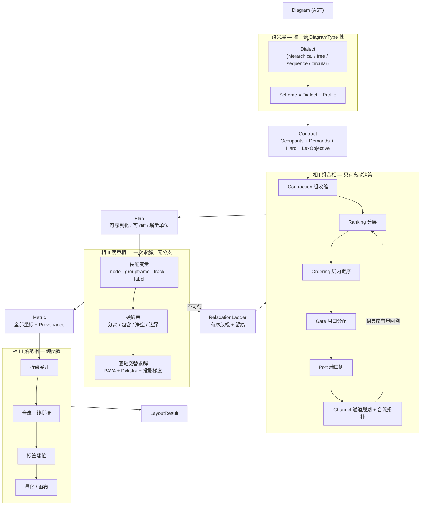

# 22 - Atlas：下一代布局与路由架构总纲

> 日期：2026-07-26（Stage 7 收口后）  
> 状态：**设计主文档**（门禁豁免 [`AGENTS.md`](../../AGENTS.md) §10 **已失效**；`GATES_DEFAULT=on`）  
> 上游：[`21-Hierarchical统一内核与泳道语义`](21-Hierarchical统一内核与泳道语义-可行性与演进建议-2026-07.md)（愿景与立场）  
> 下游：[`23-Atlas分阶段推进方案`](23-Atlas分阶段推进方案-2026-07.md)（Stage / 交付 / 验收）  
> 实证：[`25-相I可行率探针报告`](25-Atlas-相I可行率探针报告-2026-07.md)（粒度与性能）· [`27-channel审查与改造需求`](27-Atlas-channel模块审查与改造需求-2026-07.md)（合法性缺口与修订依据）  
> 现状快照：[`layout-routing-architecture.html`](../architecture/layout-routing-architecture.html)  
> 经验红线：[`布局与路由核心手册`](../总结经验/布局与路由核心手册-2026-07.md)

---

## 0. 一句话

> **今天的架构把「节点坐标」和「边几何」放在两个宇宙里求解，中间用 `FrozenNodeProduct` 一刀切开；边发现挤不下时已经无法回头，只能靠 20+ 阶段的事后补救（repair / sanitize / repulse / degraded）把结果拉回可看。**  
> **Atlas 的答案：把节点、组框、边通道、标签统一成「占位体」，先做完全部离散决策（组合相），再一次性求解全部坐标（度量相），最后无决策地落笔（落笔相）。**

三相之后，今天的绝大多数补救阶段**不是被优化，而是被删除**——它们存在的唯一理由是决策顺序错了。

---

## 1. 为什么必须换架构：五个结构性病灶

以下都不是「某个函数写得不好」，而是**当前分层的必然产物**。

### 1.1 病灶 A：空间需求是单向预告，无法回流

`demand/` 计算 `SpaceBudget` / `CorridorModel` / band demand，在布局阶段抬 rank 缝。但路由跑起来后发现缝不够时：

```12:24:crates/plotgram-core/src/layout/demand/space_budget_guard.rs
/// R11b：推节点逻辑已删除——coordinator 的 FrozenNodeProduct 保证 route 后不推节点；
/// budget 违规由 coordinator repair round 处理。
pub fn resolve_budget_violations(...) -> LayoutResult {
    result.hints.space_budget = Some(budget);
    result
}
```

**只刷新 hint，不能改几何。** 于是「边挤不下」只能靠 reroute 绕远、或直接 `degraded`。这是**架构性死路**：预算是猜的，猜错了没有第二次机会。

> 根因：**边通道不是空间变量**。节点占空间，边只占「剩下的」。

### 1.2 病灶 B：组几何有三套并存机制

| 机制 | 位置 | 性质 |
|------|------|------|
| 后验包围盒 | `kernel/group/bounds.rs::compute_group_bounds` | 算完节点再包 |
| Group IR 变量 | `kernel/coordinate/group_ir.rs` + `GroupVariable` | 真变量，但 `GroupContainment` **首期不投影，仅审计** |
| architecture EGB | `two_phase/phase_d.rs` | 组框 + side gutters 特化 |

`CoordinateProblem` 里 `GroupVariable` 的四边 `VarId` 已经预留，但生产路径仍以后验包围盒为主。**组是「算完再画的框」，不是变量**——这与 doc 21 立下的「group 一等公民」立场直接矛盾。

### 1.3 病灶 C：坐标编译有三个入口

- `LayoutContract` → `CoordinateProblem::from_contract`（**只有 mindmap 在用**）
- `engines/coordinate/builder::build_with_mapping`（Sugiyama 路径）
- architecture 自有 coordinate 装配

同一个求解器（PAVA + Dykstra + 投影梯度），三套喂法。`LayoutContract` 这个正确抽象存在了，却没人用。

### 1.4 病灶 D：正交路由是补救阶段的堆叠

从 `OrthogonalDraft::compile` 到最终 freeze，实际阶段超过 20 个：port_slot → layer_order → route_edges → path_solver(rip-up 3 轮) → lane → trunk_merge → sanitize → refine → snap → repulse → canonicalize → **repair loop(3 轮)** → freeze → label。

其中 **sanitize / repulse / repair loop / canonicalize 全是补救**：因为前面的决策在没有全局坐标信息时做出，做完才发现违规。`RoutingCoordinator` 的 repair loop 甚至要保留「hard 违规最少的快照」再回滚：

```315:372:crates/plotgram-core/src/layout/routing/coordinator.rs
for round in 0..=max_rounds {
    let intents = audit_once(&result);
    if hard_count == 0 || round == max_rounds { break; }
    let stalled = prev_hard.map_or(false, |p| hard_count >= p);
    // 穿组 → aggressive；其余 → normal
```

**「跑一遍、审计、发现违规、重跑、还是不行就取最好的那次」——这是搜索失败后的兜底，不是算法。**

### 1.5 病灶 E：正确的内核已经写好了，但没接线

`kernel/route/` 里已有 `RouteProblem` IR、`ResourceGraph`（`BTreeMap`，确定性）、`lex_astar`（`LexCost` Q1–Q6 词典序）、H0–H6 可行性判定。模块头明写：

```1:3:crates/plotgram-core/src/layout/kernel/route/mod.rs
//! 路由内核 IR（Phase 1）：与 [`super::coordinate`] 同构的路由问题模型。
//! **本阶段不接线生产**。
```

它只在 `path_kernel::select_best_path_lex_astar` 被**局部**调用，与 OVG、Legacy scorer 三轨并存。

> **这五个病灶合起来说明一件事**：正确的零件（Contract、GroupVariable、RouteProblem、LexCost、typestate materialize）都已经造出来了，但它们被塞在一条**顺序错误的流水线**里。Atlas 不是重造零件，是**重排流水线**。

---

## 2. Atlas 的六条设计公理（B1–B6）

接续手册 §1.0 的 A1–A6（那六条仍然成立，是卫生；下面六条是**结构**）。

| # | 公理 | 反面（今天） |
|---|------|--------------|
| **B1** | **空间统一**：节点、组框、边通道、标签都是 `Occupant`，声明 `Demand`，参与同一次装箱 | 节点占空间，边捡剩下的；SpaceBudget 单向预告 |
| **B2** | **组合先于度量**：全部离散决策（rank / order / gate / port / channel / merge）在相 I 完成；相 II 无搜索、无分支 | 端口在 compile、车道在 solve、合流在 solve 末、修复在 coordinator |
| **B3** | **一次度量**：全部坐标（节点、组框四边、通道、标签）在同一次求解中确定 | 三套组几何、坐标写者分散在 6+ 处 |
| **B4** | **词典序全局化**：`LexCost` 从路由扩展为布局+路由统一的 Q1–Q6 | 布局用 P1/P2/P3 二次型，路由用 LexCost，另有 8 项标量罚项表 |
| **B5** | **溯源代替计数**：每个几何量携带 `Provenance`（是哪条约束/目标决定的），"谁最后写的" 是可查询数据 | `write_counter` 数写入次数 + 手册第一法则「先追写权」靠人肉追 |
| **B6** | **落笔无决策**：相 III 是纯函数，可缓存、可并行、可增量；不允许在此改拓扑 | sanitize / repulse / canonicalize 都在最后改几何 |

**B5 值得单独说**：手册第 1 条★法则是「改字段前先回答谁最后写入」。这条法则之所以必要，是因为**架构没有把它变成数据**。Atlas 里 `Provenance` 让这个问题变成一次查询，法则退化成工具。

---

## 3. 核心概念与术语表

> 中文为准，英文为代码标识符。

### 3.1 空间模型

| 术语 | 标识符 | 定义 |
|------|--------|------|
| **基底** | `Substrate` | 由 **主轴（rank）× 交叉轴（order）** 张成的广义网格。不是像素网格，是**离散槽位骨架**：主轴上是层与层间缝，交叉轴上是位序与位序间隙 |
| **占位体** | `Occupant` | 一切占据基底空间的东西的统一抽象。四类：`Node`、`GroupFrame`、`Channel`、`LabelBox` |
| **空间需求** | `Demand` | 占位体对空间的声明：`{ min, preferred, grow }`（grow = 弹性权重）。**这是 B1 的载体** |
| **通道** | `Channel` | 边的空间载体。占据一条 **track** 上的一个 **lane**。层间缝、层内走廊、组间走廊都是 track |
| **轨道 / 车道** | `Track` / `Lane` | track = 基底上一条可容纳边的带；lane = track 内的序号位（`lane_index`）。**lane 坐标不是自由变量**，由 `track.coord + lane_index × pitch` 导出 |
| **段** | `Segment` | **一条 track 不是一条贯通全图的线，而是被组边界切开的若干段。** 段是通道图的顶点单位，`scope` = 覆盖该段的最深组。同一条线上的相邻段之间**不直接相连**，转移必须经该边界的 `Gate` |
| **闸口** | `Gate` | 组边界上边的合法进出点，**绑定到一条具体的边界线**（组框四边之一）。跨组边在相 I 就选定 gate 序列，不再事后检测穿组 |
| **裙边** | `Skirt` | 组框外圈的保留带（现 `GROUP_BORDER_SHELL_PAD` / side gutter 的正式化），本身是一个 `Demand` |

> **「段」为什么单列成术语**：channel 原型省掉这一维，直接把 track 建成贯通全图的线，结果是 —— 根 scope 的轨道几何上从组体正中穿过却完全合法，H2「穿组不可表达」当场失效；gate 也因为两端顶点没有位置信息而无法确定跨的是哪条边界，四个门退化成两个池。实测三集 1152 边有 ≥2.3% 走了穿组路径，且穿组在词典序下是**严格最优解**（0 折点 vs 绕行 ≥2 折点）。详见 [27 号文](27-Atlas-channel模块审查与改造需求-2026-07.md) §2–§3。
>
> 对照：**lane 维可以延后**（lane 分配本质是度量相的事），**段维不可以**——它是 H2、gate 语义、Q4 长度三者共同的前提。

### 3.2 求解三相

| 术语 | 标识符 | 产物 | 性质 |
|------|--------|------|------|
| **组合相** | `CombinatorialPhase` | `Plan` | 全部离散决策。**可序列化、可哈希、可 diff** |
| **度量相** | `MetricPhase` | `Metric` | 全部坐标。单次求解，无分支 |
| **落笔相** | `InkPhase` | `Ink` → `LayoutResult` | 纯函数，无决策 |

### 3.3 语义层

| 术语 | 标识符 | 定义 |
|------|--------|------|
| **方言** | `Dialect` | 图种语义编译器。输入 `Diagram`，输出 `Contract`。**唯一允许读 `DiagramType` 的地方** |
| **场景** | `Scheme` | `Dialect + Profile` 的具名组合（承接 doc18 DiagramScheme） |
| **契约** | `Contract` | 方言产物：Occupant 集合 + Demand + 硬约束 + 词典序目标。**内核只认它** |
| **画像** | `Profile` | 参数集：方向、间距、group policy、sizing、密度 |

### 3.4 质量与可解释

| 术语 | 标识符 | 定义 |
|------|--------|------|
| **溯源** | `Provenance` | 每个几何量的决定链：`(相, 约束/目标 id, 来源方言规则)` |
| **松弛阶梯** | `RelaxationLadder` | 不可行时的**有序**放松序列，每级留痕。替代今天的静默 degraded |
| **词典序代价** | `LexCost` | Q1 硬残差 > Q2 交叉 > Q3 折点 > Q4 长度 > Q5 对齐 > Q6 对称（沿用 `kernel/route/model.rs`，扩展到布局） |

---

## 4. 目标架构



### 4.1 与今天的对照

| 今天 | Atlas | 变化 |
|------|-------|------|
| `recipes/*` 各自 compile（3 个坐标入口） | `Dialect` → `Contract`（唯一入口） | 收敛 |
| `LayeredKernel` → `LayeredDraft` | 相 I 的 Ranking + Ordering | 保留，扩组连续性 |
| `two_phase` A/B/C/D + `group_divide` | 相 I 的 `Contraction` 递归 | **合并删双轨** |
| `phase_port_slot` / `phase_layer_order` | 相 I 的 Port / Gate | 前移并正式化 |
| `phase_route_edges` + `path_solver`(OVG/LexA*/Legacy 三轨) | 相 I 的 `Channel` 规划（抽象通道图 LexA*） | **粒度从像素路径变为 track 序列** |
| `lane_assignment` + `semantic_trunk_merge` | 相 I 的 Channel 拓扑 | 前移 |
| `CoordinateProblem` + PAVA optimizer | 相 II（变量域扩至组框 + track） | **保留求解器，扩变量** |
| `compute_group_bounds` 后验包围 | 相 II 的 `GroupContainment` 真投影 | **删后验** |
| `SpaceBudget` 单向预告 + guard | Channel 的 `Demand` 直接进相 II | **删回环** |
| `sanitize` / `repulse` / `canonicalize` / repair loop | — | **删除**（按构造合法） |
| `degraded` 静默兜底 | `RelaxationLadder` 有序留痕 | 显式化 |
| `write_counter` 数写次数 | `Provenance` 查询 | 数据化 |

---

## 5. 算法设计

### 5.1 相 I：组合相

#### I.1 Contraction（组收缩）—— 统一 two_phase 与 group_divide

今天 architecture 的 `two_phase` 与 flowchart 的 `group_divide` 是同一个想法的两份实现：组内先排，组当超节点再排。Atlas 把它形式化为**递归收缩**：

```text
contract(scope):
    for each child_group g in scope:        # 后序遍历 group 树
        contract(g)                          # 递归
        replace g's members with SuperNode(g) # 收缩为超节点
    rank_and_order(scope)                    # 同一套 I.2 + I.3
    expand SuperNodes back with intra offsets
```

- **同一套 rank/order 在每层复用**，profile 不同（arch 强 group policy，flow 弱）。
- 超节点的 `Demand` = 其内部布局的包络 + 裙边。**组框尺寸从这里进入相 II，不再后验。**
- DSL 当前限 group 嵌套 2 层（`dsl/parser/stmt.rs:301`），递归天然支持更深；解开限制只是 parser 改动。

#### I.2 Ranking（分层）

沿用现有 greedy FAS + network-simplex-style，**新增两条约束**：

- **组连续性**：`rank(v) ∈ [g.rank_lo, g.rank_hi]` for `v ∈ g`（组不横跨不相干层）
- **闸口可达性**：跨组边的 rank 跨度必须允许存在 gate 序列

#### I.3 Ordering（层内定序）

沿用 weighted median + transpose sweep，**新增**：

- **组成员层内连续**：同组成员在同层必须相邻（否则组框会包住外人——今天靠 `detect_group_layout_warnings` 事后报警）
- transpose 的接受判据换成 **`LexCost` 比较**，而不是标量交叉数

#### I.4 Gate 分配（新）

跨组边不再「先画路径、再检测穿组」，而是**先选门**：

- 组框四条边（上/下/左/右）各是**一条边界线**，每条线上一个 `Gate`
- gate 的转移是**跨越该线的段对** `(组内段, 组外段)` 的一一配对，**不是**「区域内全部同向轨道 × 祖先全部同向轨道」的笛卡尔积
  - `MainLow`/`MainHigh`（顶/底边界）配对的是 **Main**（纵向走廊）段；`CrossLow`/`CrossHigh`（左/右边界）配对的是 **Cross**（层间缝）段。**轴向搞反会让四个门语义全废**
  - 配对只遍历**真正被该组切开的那些线**（组自身的边界线不被切开，其上没有组内段可配）；跨度退化的组在该轴上没有配对，其 crossing 数为 0 是正确答案（27 号文 L2 / B7）
- 跨组边 `e` 需要一条 gate 序列：`src_group → LCA → dst_group`（复用 `hierarchy.rs` 的 `lowest_common_ancestor`）
- 分配问题 = **带容量的二分匹配 / 最小费用流**；费用 = 该 gate 与边两端的方向一致性
- **穿组从「检测项」变成「不可表达」，但需要两条机制、缺一不可**：
  - **静态**：段被组边界打断（§3.1），根段不再几何贯穿组体。可证——在 `Substrate` 上做 O(段数 × 组数) 的检查「任一段的槽位区间不与非自身 scope 的组矩形内部相交」（23 号文 Stage 1 交付 1.7）
  - **动态**：搜索期按边的作用域链过滤可用段（I.6）。**只做静态那条，「同线直穿」的借道仍然存在且是词典序最优**（27 号文 §3.1）
  - 两条都到位，`H2GroupInterior` 才真正由构造保证；只写一条就是半句话

> **gate 容量是输出，不是输入。** 「容量 = 边长 / 最小间距」是**几何量**，相 I 拿不到——组框边长要到相 II 才确定。channel 原型用「容量 = 该组的跨界边数」绕过，但那等于把容量设成需求，约束自动失效（27 号文 §2 F3）。正确处理与 lane 数完全同构：
>
> | 相 | gate |
> |---|---|
> | 相 I | 无硬容量，累计 `crossing_demand`（穿越边数） |
> | 相 II | 约束 `边界段长 ≥ crossing_demand × min_gate_pitch`，与「track 两侧撑开」同型，PAVA 可直接处理 |
> | 撑不开 | `RelaxationLadder`（§5.2）：压 pitch → 改走别的边界 → 放宽裙边 → 显式 Degraded |
>
> 这是 **B1 公理在 gate 上的推论**——原稿只把「需求→撑开」推到了 lane，漏了 gate。固定容量仅保留为诊断扫描通道。

#### I.5 Port 侧决策

保留今天 `phase_port_slot` 的逻辑（本就在 compile 阶段），但输出进 `Plan` 而非隐式 map。端口容量（`PORT_SIDE_CAPACITY`）作为硬约束进相 II。

#### I.6 Channel 规划（核心创新）

> **在没有坐标的抽象通道图上选路。**

今天的 `path_solver` 在**像素级**的 OVG 上搜索：顶点是障碍角点投影，边是轴向可见段。问题是——**坐标还没最终定，可见性是基于临时坐标算的**，所以后面坐标一动（snap / repulse / 组框变化）路径就可能失效，于是需要 repair loop。

Atlas 的通道图是**拓扑级**的：

```text
顶点：
  PortSlot(node, side, slot)          # 相 I.5 已定
  Segment(track_line, span, scope)    # 一条线被组边界切出的一段（§3.1）
  Gate(group, side)                   # 相 I.4 已定，绑定一条边界线
边：
  同 scope 内几何相交的异向段之间（= 折点）
  跨边界线的段对之间（经 Gate）
容量：
  段的 lane 数（可增长——lane 数是 Demand，不是上限）
  gate 的 crossing 数（同样是 Demand，见 I.4）
```

> 顶点粒度取**段**而非 `TrackSlot(track, lane_index)`：lane 分配本质是度量相的事，相 I 不需要区分同一段上的第几条车道。但**段维不可省**——省掉它，H2 立即失效（§3.1 的注）。

规模对比：OVG 顶点数 ~ O(节点数²)（代码里 `ovg_enabled` 限节点 ≤50）；通道图顶点数 ~ O(层数 × 每层通道数 × 分段数)，**通常小两个数量级**，可以对全部边做完整搜索而非贪心 + rip-up。

**实测**（`atlas_perf`，release，三集 77 图 / 1152 边，25 号文 §7）：substrate 推导 + 图构建 + 全边选路合计 ≈ **35 ms**；单边选路 4–42 µs，最重单图（165 track / 32 gate / 12078 转移）全部边路完 7.0 ms。94–98% 的端到端时间在上游的分层求解（`LayeredKernel::compute`），**通道图本身不是瓶颈**。这给「全边完整搜索 + 词典序有界回溯」留足了预算。

- **单边选路**：`lex_astar`（已存在）在通道图上跑，`LexCost` 语义不变
- **作用域可达性是硬过滤，不是罚项**：边 `e = (u, v)` 只能使用 `scope ∈ {None} ∪ chain(scope(u)) ∪ chain(scope(v))` 的段（`chain` = 该组及其全部祖先）；等价地，组 `G` 的 gate 只对「至少一端落在 `G` 子树内」的边开放。**这才是 H2「借道也不可表达」的完整版本**——仅靠段被组边界切开（§3.1）只能消灭「凭空跨线跳跃」，消灭不了「沿同一条线从左根段直穿到右根段」：后者 gate 同向、0 折点、几何最短，在 Q3/Q4 上双双最优，词典序必选它。推演与验收见 [27 号文](27-Atlas-channel模块审查与改造需求-2026-07.md) §3.1 / L8。副作用是少数边会真正 `Infeasible`，由松弛阶梯与逐条解释接住，**不得**用兜底路径掩盖
- **代价必须编码真实跨度**：段的长度权重取其覆盖的槽位数（Cross 段取 order-gap 数，Main 段取 rank-gap 数），**不得填常数**。原型里恒填 1.0，导致 Q4 退化成「跳数」、绕远免费、所有边被平局键赶到同一条最外侧走廊（27 号文 §2 F4）——这既制造了虚假的通道拥塞，又掩盖了穿组违规
- **全局协调**：边按难度序（复用 `demand::score_edges`）依次选路；冲突时**词典序有界回溯**（泛化今天的 rip-up/reroute，但对象是段占用而非像素）
- **合流（trunk merge）**：同段同向且共享后缀的边自动成束——今天 `semantic_trunk_merge` 要在几何上找共线段，Atlas 里「共享段序列后缀」就是合流的定义，**是拓扑事实不是几何巧合**

**关键收益**：段的 lane 数是**输出**不是输入。5 条边挤一段，该段就声明 `Demand{min: 5×pitch}`，相 II 自然把两侧撑开。**这就是 B1 消灭 SpaceBudget 的机制**，且同一机制原样适用于 gate（I.4）。

#### I.7 一致性求解

I.2–I.6 互相耦合（order 影响 channel 可行性，channel 影响 gate 选择）。求解方式：**有界块坐标下降**

```text
plan = initial_plan()
for round in 0..MAX_ROUNDS:            # 建议 3
    for block in [Ordering, Gate, Channel]:
        candidate = reoptimize(plan, block)
        if lex_cost(candidate) < lex_cost(plan):  # 词典序严格改善
            plan = candidate
    if converged: break
```

- 接受判据是**词典序严格改善**，天然满足手册「候选破约即回滚」
- `MAX_ROUNDS` 有界 → 确定性、可预测耗时
- 与今天 repair loop 的区别：**这是搜索，不是补救**——没有几何被写坏后再修

### 5.2 相 II：度量相

#### 变量

| 变量 | 数量级 | 说明 |
|------|--------|------|
| 节点中心 `x, y` | O(V) | 沿用 `NodeVariable` |
| 组框四边 | 4 × O(G) | 沿用 `GroupVariable.{left,right,top,bottom}`——**槽位已存在** |
| track 坐标 | O(层数 × 通道数) | **新增**；lane 由 `track.coord + i×pitch` 导出，不是自由变量 |
| 标签锚点 | O(E) | 沿用现有 label 变量 |

#### 硬约束（全部为分离型 / 边界型，都能投影）

| 约束 | 今天 | Atlas |
|------|------|-------|
| 层内相邻分离 | `MinSeparation` ✅ | 不变 |
| 层间 rank 分离 | `MinSeparation` + SpaceBudget 抬缝 | 由 track demand 决定 |
| **组包含** | `GroupContainment`「**首期不投影，仅审计**」 | **真投影**：`g.left ≤ min(member.left) − pad` |
| **组兄弟分离** | `GroupSiblingSeparation`「槽位」 | **启用** |
| **通道净空** | 无（靠事后 repulse） | **新增**：`track.coord` 与两侧 Occupant 分离 ≥ 净空 |
| 端点在边界 | audit 检查 `EndpointBoundary` | 由 Plan 的 port 转等式约束 |

> 注意：`GroupContainment` 与 `GroupSiblingSeparation` 在 `model.rs` 里已经定义好了，注释写着「首期不投影」。**Atlas 相 II 的第一件事就是把它们接上投影。**

#### 求解器：不引入新依赖

关键判断：**逐轴交替后，每一轴都是「带分离约束的一维凸问题」**，正是现有 `optimizer.rs` 的 PAVA + Dykstra + 投影梯度能处理的形式。

```text
for pass in 0..AXIS_PASSES:            # 建议 2–3
    solve_axis(X)   # 固定 y，求所有 x 变量（节点 x、组框 left/right、纵向 track 坐标）
    solve_axis(Y)   # 固定 x，求所有 y 变量
```

- 单轴内：PAVA 投影到分离可行域 + Dykstra 处理多约束簇（现 `MAX_ROUNDS=8`）+ 按 P1/P2/P3 分层投影梯度（现 80/40/30 迭代）
- **不需要引入 LP/QP 求解器 crate**——变量域扩大，算法不变
- 词典序目标 Q1–Q6 映射到现有 `ObjectivePriority`（需从 P1–P3 扩到 P1–P6，或分组映射）

#### 可行性与松弛阶梯

相 I 保证**拓扑可行**，相 II 可能仍**度量不可行**（例如画布约束 + 容量冲突）。此时**不允许静默兜底**：

```text
RelaxationLadder（有序，每级记 Provenance）:
  L0  放松 Q5/Q6 美学目标
  L1  放宽 track pitch（车道更挤，仍不重叠）
  L2  允许 track 分裂（一条通道拆两条，回相 I 局部重规划）
  L3  放宽组裙边
  L4  显式 Degraded：标注具体是哪条约束无法满足
```

对比今天：`degraded_count` 只知道「降级了」，不知道降级了什么。Atlas 的每一级都带**哪条约束、哪个 Occupant、放松了多少**。

### 5.3 相 III：落笔相

纯函数 `Ink: (Plan, Metric) → Vec<EdgeLayout>`：

1. **折点展开**：边的折点 = 其 track 序列坐标 + 端点。方向变化点即折点，**按构造正交**
2. **合流干线**：Plan 里共享 track 后缀的边，共用同一段几何
3. **标签落位**：Plan 给候选带，Metric 给坐标，此处只做选择
4. **量化 / 画布**：全局一次 snap

**没有 sanitize**：正交性由构造保证；**没有 repulse**：净空是相 II 的硬约束；**没有 repair**：拓扑合法性是相 I 的不变量。

相 III 是纯函数意味着：可缓存、可并行、**Plan 不变时可完全跳过**（增量渲染的基础）。

### 5.4 增量：Plan diff 就是增量单位

今天的增量走 `FrozenRoutingSolution` + 指纹 + `dirty_set`，本质是「几何指纹变了就重算」。

Atlas 里：

- `Plan` 可哈希、可 diff → **拓扑没变就只重跑相 II/III**（快）
- 只有局部 Plan 变（加一个节点）→ 相 I 局部重规划，其余复用
- **「内建路由 vs 独立路由」这个 yFiles 二分在 Atlas 里消失了**：边通道本来就和节点在同一次求解里；所谓 Standalone 只是「复用上次 Plan 的组合决策，只重跑相 II/III」的一个特例

---

## 6. 为什么现在可行：零件已经造好了

Atlas 不是从零重写。四块关键预制件都已在仓库里：

| Atlas 组件 | 现有零件 | 状态 |
|------------|----------|------|
| 相 I 通道图选路 | `kernel/route/{graph,search,model}.rs`：`ResourceGraph` + `lex_astar` + `LexCost` | 已写好，**只在 path_kernel 局部用** |
| 相 II 求解器 | `kernel/coordinate/{optimizer,projection}.rs`：PAVA + Dykstra + 投影梯度 | 生产在用，**变量域待扩** |
| 相 II 组变量 | `GroupVariable` + `GroupContainment` + `GroupSiblingSeparation` | **定义好了，注释写着"首期不投影"** |
| 相 III typestate | `routing/model/materialize.rs`：materialize → audit → freeze | 生产在用，**可直接改造为 Ink** |
| Contract 抽象 | `kernel/coordinate/layout_contract.rs` + `CoordinateProblem::from_contract` | **只有 mindmap 在用** |
| 组层次 | `kernel/group/hierarchy.rs`：`GroupHierarchy` + LCA | 已用于 EGB 与路由 |
| 确定性基础设施 | `BTreeMap` / 显式排序（`AGENTS.md` §2） | 已固化 |

> **一句话**：Atlas 的工作量主要在「接线与删除」，不在「发明」。

---

## 7. 明确不做

| 不做 | 理由 |
|------|------|
| 引入 LP / QP 求解器依赖 | 逐轴分解后现有 PAVA 足够；新依赖会拖累 WASM 体积与确定性 |
| 力导向 / 物理模拟布局 | 与确定性红线冲突；非必保图种需求 |
| 新 DSL `swimlane` / `table` | doc 21 已定为非第一需求；分区观感由 group + partition policy 承接 |
| 一次性删除 `recipes/*` 另起仓库 | Stage 化 + 影子对拍（见 23 号文）；中间态必须可用 |
| 把 sequence / mindmap 强塞进 Hierarchical | 四内核并列（doc 21 §1.1）；sequence 走 BuiltinEdges，mindmap 走 Tree |
| 为压 stress 数字做图名特判 | ★ 红线，门禁关了也不豁免 |

---

## 8. 风险台账

| 风险 | 等级 | 缓解 |
|------|------|------|
| ~~抽象通道图过粗 → 相 II 频繁不可行~~ | **已结案** | 原型实测三集 77 图 / 1152 边**零「网格不可表达」**（25 号文 §2）。粒度不是问题 |
| **「由构造保证」缺少证明义务，实际不成立** | **高** | 新增：原型的 H2 只拒绝了跨 scope link，没约束轨道几何是否压过组框，实测 ≥2.3% 的边走穿组路径且穿组是词典序最优（27 号文 §2 F1）。**凡写「由构造保证」，必须配一个 O(n) 静态检查器**（Stage 1 交付 1.7），不能只靠事后 lint 反证 |
| **「构造保证」只做了静态一半 → 借道复活** | **高** | 新增：段被组边界切开只消灭「跨线跳跃」；「沿同一条线直穿组体」在分段后反而是 0 折点 + 几何最短的双优解。必须同时上**搜索期作用域过滤**（I.6），否则 A2 归零无机制（27 号文 §3.1 / L8）。代价是少数边真正 `Infeasible`，走松弛阶梯 + 逐条解释，禁止兜底掩盖 |
| **代价函数退化 → 假拥塞 + 掩盖违规** | **高** | 新增：`span_weight` 填常数会让 Q4 变成跳数、平局键把全部边赶到同一走廊（27 号文 §2 F4）。相 I 的每个抽象权重都必须有真实来源；峰值 lane demand 作为回归指标监控 |
| **把「需求」当成「容量」，约束自动失效** | 中 | 新增：gate 容量若取「该组跨界边数」，约束在数学上恒真（27 号文 §2 F3）。容量一律走 I.4 的「Demand → 相 II 撑开 → 撑不开才放松」；固定容量只作诊断通道 |
| architecture 观感断崖（丢 macro rank / equal track） | **高** | 这些必须显式编码为 Profile 的 group policy，Stage 5 单独验收；影子对拍逐图看 |
| 相 II 变量规模膨胀（+track +组框）导致慢 | 中 | track 数远小于节点数；逐轴分解保持一维；Stage 2/3 各测一次性能 |
| 双轨期（Atlas + 旧管线）维护成本 | 中 | Stage 化，每 Stage 结束**必须**关掉对应旧路径；不允许长期并存 |
| 现有 900+ 单测大量绑定旧管线 | 中 | 门禁已关（`AGENTS.md` §10）；Stage 0 建对拍替代断言，Stage 7 重建 |
| Plan 表达力不足（某图种装不进去） | 中 | Stage 1 用 Adapter 让**旧管线填充 Plan**，先证明表达力再换求解 |
| 设计漂移成"第二个 yFiles" | 低 | 四内核封顶；不做力导向；Ink 相禁止决策 |

---

## 9. 与 doc 21 的关系

doc 21 定了**立场**（要什么、不要什么），本文定**怎么做**。对应关系：

| doc 21 立场 | Atlas 中的落点 |
|-------------|----------------|
| group 一等公民 | B1/B3：`GroupFrame` 是 Occupant，组框四边是相 II 变量 |
| flowchart / architecture 去双轨 | 相 I.1 `Contraction` 递归 + Hierarchical Dialect |
| 图种 → Scheme/Profile，不复制算法 | `Dialect` 是唯一读 `DiagramType` 处 |
| 四布局内核 | Hierarchical / Tree / Sequence / Circular = 四个 Dialect + 各自相 I 策略 |
| 内建 + 独立路由双模式 | §5.4：退化为「是否复用上次 Plan」 |
| 废弃用户侧 `group_frame` | Profile 的 `group_sizing` / `group_align` / `density` |
| DSL swimlane/table 非第一需求 | §7 明确不做 |

---

## 10. 下一步

推进计划见 [`23-Atlas分阶段推进方案-2026-07.md`](23-Atlas分阶段推进方案-2026-07.md)：Stage 0–7、每阶段交付物、对拍验收口径、回滚点与预期退化窗口。

---

## 11. 修订记录

| 日期 | 说明 |
|------|------|
| 2026-07-26 | 初稿：五病灶诊断、B1–B6 公理、Atlas 术语表、三相架构、算法设计、风险台账 |
| 2026-07-26 | 按 channel 原型实证（[25](25-Atlas-相I可行率探针报告-2026-07.md) / [27](27-Atlas-channel模块审查与改造需求-2026-07.md)）修订：§3.1 新增**段（Segment）**术语并说明其不可省；§5.1 I.4 gate 改为绑定边界线 + 一一配对，容量从输入改为**输出**（B1 在 gate 上的推论）；§5.1 I.6 顶点粒度改为段、新增 span_weight 强制条款、补入实测性能预算；§8 风险台账「通道图过粗」结案，新增三条（构造保证的证明义务 / 代价退化 / 需求当容量） |
| 2026-07-26 | 补「借道」缺口（27 号文 §3.1 / L8）：§5.1 I.4 把 H2 的构造保证拆成**静态（分段）+ 动态（作用域过滤）**两条并声明缺一不可，gate 配对补「只遍历真正被切开的线、退化组 crossing 为 0」；§5.1 I.6 新增**作用域可达性硬过滤**条款及其可行性副作用；§8 新增风险「构造保证只做了静态一半 → 借道复活」 |
