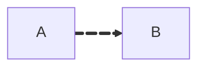

# Drawify SVG 动画能力需求分析与技术实现评估报告

> 版本：0.2.0 | 状态：研究评估 | 日期：2026-06-24
> 关联文档：[competitive-strategy.md](../product/competitive-strategy.md) §4.5 语义动画、[d2-vs-drawify-code-review.md](../product/d2-vs-drawify-code-review.md) §4 Steps Board、[layout-refinement-todo.md](../architecture/layout-refinement-todo.md)、[svg-embedding-design-impact.md](./svg-embedding-design-impact.md)（嵌入方式对设计的约束）

## 摘要

本报告针对 Drawify 后续引入 SVG 动画能力进行系统性研究，覆盖六大应用场景的方案设计、市场竞品对标、技术可行性、API 规范与性能兼容性。核心结论：

1. **战略定位**：动画本身不是壁垒，**语义动画**（Diff/Patch/Steps 过渡）是"语义微调"核心壁垒的视觉放大器，应作为 P1 投入；纯装饰动画归入"图形美观"维度，不建议投入。
2. **技术路线**：推荐 **SVG 内嵌 CSS 动画（`@keyframes` + `transition`）+ JS 控制器（Steps/导出）** 的方案。CSS 通过 `<defs><style>` 内嵌于 SVG 文件，零 JS 依赖即可自包含播放；JS 控制器仅用于 Steps 时序与导出播放控制。全面放弃 SMIL——SMIL 浏览器支持不稳定（Chrome 曾标记弃用）、Safari 无硬件加速、路径 `d` 属性插值存在点数对齐难题，而 CSS 已能覆盖所有需要的动画效果。边路径变形采用"旧路径淡出 + 新路径淡入"的交叉淡入淡出策略。
3. **最小切入路径**：先为 SVG 元素注入稳定 `id`，再基于 `diff2::ChangeSet` 构建"动画渲染器"接收 `(old_scene, new_scene, changeset)` 三元组生成过渡动画；Steps 系统作为第二阶段，需扩展 AST 与 DSL 语法。
4. **当前代码缺口**：SVG 元素无稳定 ID、Patch 不触发重渲染、无 Steps 系统、无交互事件绑定、无动画模块。这些是必须先补齐的基础设施。

---

## 1. 需求分析与场景定义

### 1.1 六大动画应用场景梳理

| 编号 | 场景 | 触发方式 | 战略归属 | 优先级建议 |
|------|------|----------|----------|-----------|
| a | 静态图交互动画 | 鼠标事件（点击/悬浮） | 图形美观 / 交互体验 | P2 |
| b | 自动循环动画 | 渲染参数 / 默认开启 | 语义表达 | P2 |
| c | 参数化动画指令 | 渲染参数指定 | 语义表达 | P1 |
| d | DSL Patch 动画 | Patch 操作触发 | **语义微调** | **P1** |
| e | Steps 动画系统 | 分步播放控制 | **语义微调** | **P1** |
| f | 动画导出功能 | 导出独立 HTML | 交付能力 | P1（依附于 e） |

### 1.2 场景详细定义

#### a) 静态图交互动画

**目标**：在静态导出的 SVG 上，基于鼠标事件实现节点样式变化及边线数据流动效果。

**子能力**：
- 节点悬浮（hover）：高亮边框、放大、阴影增强
- 节点点击（click）：选中态、关联边/节点高亮、其余元素淡化
- 边线数据流：沿边方向流动的光点/虚线滚动，表达"谁调谁"

**约束**：必须在不依赖 JS 运行时的纯 SVG 文件中工作（CSS `:hover` 伪类 + `<style>` 内嵌）。Studio Web 端可额外支持 JS 增强交互。

**战略评估**：归入"图形美观"维度。Mermaid/draw.io 均已支持类似能力，不构成壁垒。建议做到"够用"即可，不投入过多。

#### b) 自动循环动画

**目标**：edge 数据流动效果的持续展示机制，无需用户交互即可循环播放。

**子能力**：
- 边线数据流（默认或按需开启）
- 节点呼吸/脉冲（状态图激活节点）
- 加载态指示（异步处理中的节点）

**约束**：循环动画必须可被渲染参数关闭（避免静态文档场景下的干扰与性能开销）。

**战略评估**：数据流动画对架构图/时序图有实际语义价值（表达调用方向），列为 P2。

#### c) 参数化动画指令

**目标**：支持通过渲染参数指定特定动画效果，如"激活状态图的节点 X"。

**子能力**：
- `animate.highlight(node_id)` — 高亮指定节点
- `animate.activate(node_id)` — 激活态（状态图）
- `animate.flow(edge_id)` — 触发边数据流
- `animate.focus(node_id)` — 聚焦（其余元素淡化）

**约束**：参数化指令是渲染层 API，不污染 DSL 语法。Agent 可通过渲染参数控制，而非修改 DSL 源码。

**战略评估**：语义增强，对状态图/架构图有实际价值，列为 P1。

#### d) DSL Patch 动画

**目标**：在应用 patch 操作时实现节点新增/删除/修改的过渡动画。

**子能力**：
- 节点新增 → 淡入 + 缩放 0→1
- 节点删除 → 淡出 + 缩放 1→0
- 节点位置变更 → 平移过渡
- 节点属性变更 → 颜色/形状平滑插值
- 边新增/删除/路径变更 → 路径变形或淡入淡出

**约束**：动画数据由渲染器在 Patch/Diff 时自动生成，用户和 Agent 不需要控制动画参数。

**战略评估**：**核心壁垒的视觉放大器**。直接强化"改得更精准"的可感知性，企业 Architecture Compare 的体验差异化关键。列为 **P1**。

#### e) Steps 动画系统

**目标**：构建类似 PPT 的分步播放动画功能，支持按步骤展示图表演变。

**子能力**：
- DSL 中声明多个 Step（每个 Step 是一个完整或增量 Diagram）
- 步骤间过渡动画（基于 Diff 自动生成）
- 播放控制：上一步/下一步/自动播放/跳转
- 步骤标题与说明文本

**约束**：Step 间过渡复用场景 d 的 Patch 动画能力。Steps 是 Patch 动画的时间序列编排。

**战略评估**：**对 AI Agent 场景价值极高**——Agent 可生成一系列步骤图演示流程演变。借鉴 D2 的 Steps Board 设计。列为 **P1**。

#### f) 动画导出功能

**目标**：支持将 Steps 动画导出为独立 HTML 页面，可在浏览器中直接播放。

**子能力**：
- 导出为自包含 HTML（内嵌 SVG + CSS + JS 播放器）
- 导出为 GIF / MP4（光栅化，需 headless 浏览器）
- 导出为 SVG 序列（每步一个 SVG）

**约束**：HTML 导出是首选（矢量、可交互、体积小）；GIF/MP4 导出依赖 Playwright 等外部工具，作为 P2。

**战略评估**：交付能力，依附于 Steps 系统。列为 P1（HTML 导出）/ P2（GIF/MP4）。

### 1.3 场景间依赖关系

```
                ┌─────────────────────────────────┐
                │  基础设施：SVG 元素稳定 ID 注入     │
                │  基础设施：动画模块 (render/paint/animation.rs) │
                └──────────────┬──────────────────┘
                               │
          ┌────────────────────┼────────────────────┐
          ▼                    ▼                    ▼
   ┌──────────────┐    ┌──────────────┐    ┌──────────────┐
   │ d) Patch 动画  │    │ c) 参数化指令  │    │ a) 交互动画   │
   │ (diff2 驱动)  │    │ (渲染参数)    │    │ (CSS :hover) │
   └──────┬───────┘    └──────────────┘    └──────────────┘
          │
          ▼
   ┌──────────────┐
   │ e) Steps 动画 │
   │ (Patch 时序)  │
   └──────┬───────┘
          │
          ▼
   ┌──────────────┐
   │ f) 动画导出   │
   │ (HTML/GIF)   │
   └──────────────┘

   独立线：b) 自动循环动画 (CSS keyframes，可并行开发)
```

---

## 2. 市场调研与竞品分析

### 2.1 主流文本画图工具动画能力现状

| 工具 | 动画能力 | 实现技术 | Steps/分步 | 导出动画 | 开源/商业 |
|------|----------|----------|-----------|----------|----------|
| **Mermaid** | 边线动画（`animate: true` / classDef stroke-dasharray） | CSS animation | ❌ 无原生 | ❌ 无 | 开源免费 |
| **D2** | **多 Board 过渡动画**（`--animate-interval`）、GIF 导出 | SMIL + 自研 | ✅ Steps/Layers/Scenarios | ✅ GIF/SVG | 语言开源，Studio 商业 |
| **draw.io** | 连接线 Flow Animation | CSS（SVG 内嵌） | ❌ | ✅ SVG 保留动画 | 免费 |
| **PlantUML** | ❌ 无动画能力 | — | ❌ | ❌ | 开源免费 |
| **Excalidraw** | 原生无，第三方 Excalimate/Smart Presentation 补齐 | JS 插值（Frame 间） | ✅（Frame 模型） | ✅ MP4/GIF/Lottie/SVG | 开源 |
| **FlowGif** | 将 Mermaid 动画化为 GIF | 自研 + Mermaid | ✅ 步进式 | ✅ GIF/MP4/SVG/HTML | 商业（MCP） |
| **Drawify（当前）** | ❌ 无 | — | ❌ | ❌ | 开源 |

### 2.2 行业领先产品的技术特点

#### D2 — 唯一"从文本生成动画图"的语言

D2 是目前唯一在语言层原生支持动画的文本画图工具，其核心机制：

- **`--animate-interval <ms>`**：将多个 Board（Steps/Layers/Scenarios）打包为单个 SVG，按间隔自动切换。仅 SVG/GIF 导出支持。
- **Board 模型**：`d2target.Diagram` 含 `Layers []*Diagram`、`Scenarios []*Diagram`、`Steps []*Diagram`，递归嵌套。
- **GIF 导出**：通过 `xgif.Animate` 将多帧 SVG 光栅化为 GIF。
- **`d2 play`** 命令：交互式播放 Steps。

技术启示：D2 的动画本质是"多帧切换"，帧间无插值过渡，依赖 Board 模型组织内容。Drawify 若做 Steps，应在帧间增加 Patch 动画过渡，体验优于 D2。

#### Mermaid — 轻量 CSS 动画

Mermaid 的动画仅限边线：



或通过 classDef：

```
classDef animated stroke-dasharray: 9,5,stroke-dashoffset: 900,animation: dash 25s linear infinite;
class e1,e2 animated
```

技术启示：纯 CSS `stroke-dashoffset` 动画，零 JS 依赖，体积小。Drawify 的边线数据流动画可直接借鉴此方案。

#### draw.io — 连接线 Flow Animation

draw.io 在连接线属性面板提供 "Flow Animation" 开关，导出 SVG 时保留 CSS 动画。技术上是 `stroke-dashoffset` 的循环动画。

#### Excalimate / Excalidraw Smart Presentation — 关键帧插值

Excalimate 采用关键帧模型（keyframes + sequences），支持：
- 元素属性插值（opacity/scale/position/drawProgress）
- 摄像机动画（平移/缩放）
- 渐进式展现（progressive reveal）
- 导出 MP4/GIF/Lottie/SVG/dotLottie

技术启示：关键帧模型比 D2 的"硬切换"更精细，但实现复杂度高。Drawify 的 Steps 可采用"Patch 动画 + 关键帧"混合：步骤间用 Patch 动画自动插值，无需用户定义关键帧。

### 2.3 企业付费场景的动画功能定价策略

| 产品 | 定价模式 | 动画功能定位 | 用户接受度 |
|------|----------|-------------|-----------|
| D2 Studio (Terrastruct) | 订阅制（$12-49/用户/月） | 动画为付费差异化卖点（"唯一能从文本生成动画图的语言"） | 高，定位开发者 |
| Lucidchart | 订阅制（$7.95-27.95/用户/月） | 动画不在核心卖点，偏交互式协作 | 高，企业市场 |
| FlowGif | 免费 + MCP API | 动画为核心功能，GIF/HTML 导出 | 中，新兴产品 |
| Excalimate | 订阅制 | 动画为核心，导出多格式 | 中，内容创作者 |

**关键洞察**：
- D2 将"文本→动画"作为独占定位，是其商业化的核心差异化。
- 动画能力在企业场景中**不是必需品，但是高价值增值点**，尤其用于架构演示、变更讲解、培训材料。
- Drawify 的语义动画（Diff/Patch 过渡）比 D2 的"多帧切换"更精准，有差异化空间。

### 2.4 市场竞争中的动画功能差异化优势与不足

#### Drawify 的潜在优势

1. **语义动画**：基于 `diff2::ChangeSet` 的语义级 diff，能生成"节点 X 从位置 A 平移到 B"的精准过渡，而非 D2 的整图切换。
2. **零参数动画**：动画由渲染器自动生成，用户/Agent 无需控制动画参数（D2 需要手动组织 Board）。
3. **与 Patch/Intent 联动**：动画是"语义微调"工作流的自然延伸，无需额外学习成本。

#### Drawify 的潜在不足

1. **起步晚**：D2 已有成熟的多 Board + GIF 导出，Drawify 从零开始。
2. **生态弱**：Mermaid 的 GitHub/Notion 集成使其静态图无处不在，动画的传播渠道受限。
3. **交互式探索被排除**：`cytoscape-js-research.md` 明确"产品是静态导出，不是交互式图探索器"，限制了交互动画场景。

---

## 3. 技术可行性研究

### 3.1 当前代码架构对 SVG 动画的支持程度

基于对 `crates/drawify-core/src` 的全面调研，当前架构的支持度评估：

| 维度 | 现状 | 对动画的支持度 | 改造工作量 |
|------|------|---------------|-----------|
| SVG 生成方式 | 纯字符串拼接（`scene_svg::encode`） | ✅ 高（易插入属性/标签） | 低 |
| SVG 元素身份 | **无稳定 ID** | ❌ 阻塞（无法定位元素） | 中 |
| 节点/边数据结构 | `ExportNode`/`ExportEdge` 含 `entity.id`/`edge.index` | ✅ 高（身份锚点已存在） | 低 |
| 语义 Diff | `diff2::ChangeSet`（Add/Remove/Modify） | ✅ 高（天然映射动画语义） | 低 |
| Patch 触发重渲染 | ❌ 不触发（产出 RawDiagram 后手动重跑管线） | ⚠️ 需新增动画编排层 | 中 |
| 渲染参数扩展 | `RenderRequest` 已有结构 | ✅ 高（可加 animation 字段） | 低 |
| Steps 系统 | ❌ 完全不存在 | ❌ 需扩展 AST + DSL + 渲染 | 高 |
| 交互事件绑定 | ❌ SVG 通过 `dangerouslySetInnerHTML` 注入，无事件 | ⚠️ 需改造前端注入方式 | 中 |
| 导出格式 | SVG/PNG/WebP/ASCII/JSON | ⚠️ 需新增 HTML 动画导出 | 中 |

**关键结论**：架构对动画的"语义层"支持度高（diff2、ExportScene 身份锚点），但对"渲染层"支持度低（无元素 ID、无动画模块、无 Steps）。改造路径清晰，无架构性阻碍。

### 3.2 实现各类动画效果所需的技术栈与挑战

| 动画类型 | 技术栈 | 挑战 |
|----------|--------|------|
| 节点淡入淡出 | CSS `opacity` 动画（`@keyframes`） | 需元素 ID + 初始状态类名 |
| 节点平移 | CSS `transform: translate` + `transition` | 需旧新位置坐标，`transform-box: fill-box` |
| 节点缩放 | CSS `transform: scale` 动画 | `transform-origin: center; transform-box: fill-box` |
| 边路径变形 | **交叉淡入淡出**（旧路径 `opacity:1→0` + 新路径 `opacity:0→1`） | 零挑战，规避点对齐问题 |
| 边数据流 | CSS `stroke-dashoffset` keyframes | 零挑战，纯 CSS |
| 高亮/激活 | CSS class 切换 + `transition` | 需状态管理 |
| 入场/出场 | CSS `@keyframes` + 初始类（`.dfy-enter`） | 元素需设置初始状态（如 `opacity:0`） |
| Steps 时序 | JS 控制器（class 切换 + `transition`） | 需前端播放器 |
| GIF/MP4 导出 | Playwright + ffmpeg | 需 headless 浏览器依赖 |

**关键结论**：所有动画效果均可通过 CSS 实现，不需要 SMIL。边路径变形放弃 SMIL `d` 属性插值，采用交叉淡入淡出策略——视觉效果平滑且无点对齐问题。CSS 通过 SVG `<defs><style>` 内嵌，单文件自包含。

### 3.3 SVG SMIL 动画与 CSS 动画的技术优缺点及适用性（决策：放弃 SMIL）

**重要决策：全面放弃 SMIL，采用纯 CSS 方案。** 以下对比说明原因。

| 维度 | SMIL (`<animate>`) | CSS (`@keyframes`/`transition`，SVG 内嵌) |
|------|--------------------|--------------------------------|
| **声明方式** | XML 标签内嵌于 SVG 元素 | `<defs><style>` 内嵌，与结构分离 |
| **属性动画** | 可动画任意 SVG 属性（含 `d`） | 可动画 CSS 属性（`transform`/`opacity`/`fill`/`stroke`）；`d` 属性用交叉淡入淡出替代 |
| **路径变形** | 原生支持但要求点数对齐，实际不可用 | 交叉淡入淡出（旧路径淡出+新路径淡入），效果平滑无点对齐问题 |
| **浏览器支持** | Chrome 曾标记弃用（已暂停但仍有风险）；Safari 无硬件加速 | ✅ 全浏览器支持，Chrome/Firefox/Safari 均硬件加速 |
| **性能** | 主线程，Safari 性能差 | ✅ `transform`/`opacity` 走合成层，硬件加速 |
| **JS 依赖** | 零依赖 | 零依赖（`<style>` 内嵌 SVG） |
| **时序控制** | `begin`/`dur`/`end`/`fill="freeze"` | `animation-delay`/`animation-duration`/`forwards`；支持 stagger 延迟 |
| **交互触发** | `begin="click"`/`begin="mouseover"` | `:hover`/`:active`/`:focus` 伪类 + class 切换 |
| **循环** | `repeatCount="indefinite"` | `animation-iteration-count: infinite` |
| **可维护性** | 标签嵌套深，可读性差；动画逻辑散落在各元素内 | ✅ 样式集中管理，可读性好，与图形结构解耦 |
| **导出友好** | ✅ 纯 SVG 自包含 | ✅ `<style>` 内嵌于 SVG，同样自包含 |
| **硬件加速** | ❌ 仅部分属性 | ✅ transform/opacity 全硬件加速 |
| **prefers-reduced-motion** | 需手动插入 `<animate>` 条件判断 | ✅ 一行 `@media` 查询全局禁用 |

**放弃 SMIL 的理由**：

1. **路径变形这一 SMIL 唯一不可替代的优势已被证伪**：`<animate attributeName="d">` 要求新旧路径的命令序列和点数完全一致才能插值，而 Drawify 布局变更后路径点数经常变化（如折线变贝塞尔曲线、边由 3 个点变 5 个点），导致插值失败。交叉淡入淡出（cross-fade）在视觉上完全能表达"路径变了"的语义，且零约束。
2. **浏览器风险**：Chrome 2015 年就标记过 SMIL 弃用，虽暂停但社区长期存在疑虑；Safari SMIL 无硬件加速，动画卡顿。
3. **性能差距**：CSS 的 `transform`/`opacity` 走 GPU 合成层，60fps 稳定；SMIL 在主线程执行，大图动画容易掉帧。
4. **可维护性**：CSS 将动画逻辑集中在 `<style>` 块中，SMIL 将 `<animate>` 标签散落在每个图形元素内部，调试和维护成本高。
5. **可访问性**：CSS 一行媒体查询即可尊重 `prefers-reduced-motion`，SMIL 需要遍历禁用所有 `<animate>` 元素。

**最终结论**：采用 **SVG 内嵌 CSS（`@keyframes` + `transition`）为主 + JS 控制器（Steps/导出）** 的方案。CSS 通过 `<defs><style><![CDATA[ ... ]]></style></defs>` 内嵌在 SVG 文件中，单文件自包含，零外部依赖，双击打开即有动画。

### 3.4 JavaScript 控制 SVG 动画的实现方案与性能优化

#### 实现方案

JS 仅用于 Steps 播放控制与导出 HTML 播放器，核心动画仍由 CSS 驱动，JS 负责 class 切换：

1. **CSS class 切换（推荐）**：JS 仅做状态管理，通过 `element.classList.add/remove('dfy-enter')` 等触发 CSS `@keyframes` 动画。核心动画逻辑在 CSS 中，JS 不做属性插值。
2. **Web Animations API（WAAPI）**：浏览器原生，API 类似 CSS 但可编程。作为 CSS class 切换的补充，用于需要动态计算时长的场景。
3. **自研轻量控制器**：基于 `requestAnimationFrame`，仅用于 Steps 时序编排（上一步/下一步/自动播放），< 2KB。

**推荐**：CSS class 切换为主 + 自研轻量 Steps 控制器。核心动画全在 CSS 中，JS 不负责属性插值，仅控制"什么时候给哪个元素加什么 class"。

#### 性能优化策略

| 策略 | 说明 |
|------|------|
| 仅动画 `transform`/`opacity` | 触发合成层，避免重排重绘 |
| 避免动画 `fill`/`stroke` | 触发重绘，性能差 |
| `will-change` 提示 | 对即将动画的元素设置 `will-change: transform` |
| 限制同时动画元素数 | 大图（>100 节点）仅动画变更子集 |
| `requestAnimationFrame` 节流 | JS 控制器对齐刷新率 |
| SVG `viewBox` 优化 | 避免视口外元素参与动画 |
| 虚拟 DOM diff（Studio） | 仅更新变更的 SVG 子树 |

---

## 4. 实现方案评估

针对六大场景分别提出至少 2 种技术实现方案，从开发成本、性能、兼容性、可维护性、架构影响五维对比。

### 4.1 场景 a：静态图交互动画

#### 方案 A1：纯 CSS `:hover` 伪类（推荐）

**实现**：在 `scene_svg::encode` 中为每个节点/边注入 `class="dfy-node-{id}"`，在 SVG `<defs>` 内嵌 `<style>` 定义 `:hover` 规则。

```svg
<style>
  .dfy-node:hover { transform: scale(1.05); transform-origin: center; transition: transform 0.2s; }
  .dfy-node:hover ~ .dfy-edge { stroke: #ff6b35; }
</style>
```

**优点**：零 JS 依赖、纯 SVG 自包含、兼容性极好、性能优（硬件加速）。
**缺点**：仅支持 hover/click 基础伪类，无法做"点击节点高亮关联边"等复杂逻辑（需 JS）。

#### 方案 A2：Studio 端 JS 事件增强

**实现**：在 Studio 的 `PreviewCanvas.tsx` 中，将 SVG 从 `dangerouslySetInnerHTML` 改为解析后绑定事件，用 React 状态管理选中/悬浮态，动态切换 class。

**优点**：支持复杂交互逻辑（关联高亮、多选、右键菜单）。
**缺点**：仅 Studio 可用，导出的纯 SVG 无交互；需重构前端注入方式。

**对比**：

| 维度 | A1 纯 CSS | A2 JS 增强 |
|------|-----------|-----------|
| 开发成本 | 低 | 中 |
| 性能 | 优 | 良 |
| 兼容性 | 全平台 | 仅 Studio |
| 可维护性 | 优 | 中 |
| 架构影响 | 仅渲染层 | 需重构前端 |

**建议**：A1 作为基础（导出 SVG 自带交互），A2 作为 Studio 增强后续迭代。

### 4.2 场景 b：自动循环动画

#### 方案 B1：CSS `@keyframes` 内嵌（推荐）

**实现**：渲染参数 `edge_flow: true` 时，在边元素注入 `class="dfy-flow"`，`<style>` 内嵌：

```css
@keyframes dfy-dash { to { stroke-dashoffset: -20; } }
.dfy-flow { stroke-dasharray: 6 4; animation: dfy-dash 1s linear infinite; }
```

**优点**：零 JS、纯 SVG 自包含、性能优、可被参数关闭。
**缺点**：仅支持边线流动，不支持沿路径运动的粒子。

#### 方案 B2：SMIL `<animateMotion>` 粒子流动（❌ 已放弃）

> **注**：本方案因全面放弃 SMIL 而被否决，仅保留作为历史对比。B1 CSS keyframes `stroke-dashoffset` 已完全覆盖边数据流需求。

**实现**：在边上叠加 `<circle r="3"><animateMotion dur="2s" repeatCount="indefinite"><mpath href="#edge-path-{id}"/></animateMotion></circle>`。

**优点**：粒子沿路径运动，视觉效果丰富。
**缺点**：SMIL 兼容性争议、性能较差（主线程）、SVG 体积增大。

**对比**：

| 维度 | B1 CSS keyframes | B2 SMIL animateMotion |
|------|------------------|----------------------|
| 开发成本 | 低 | 中 |
| 性能 | 优 | 差 |
| 兼容性 | 全平台 | 除 IE 外 |
| 可维护性 | 优 | 中 |
| 架构影响 | 无 | 无 |

**建议**：B1 为主，B2 仅在需要粒子效果的高级主题中可选。

### 4.3 场景 c：参数化动画指令

#### 方案 C1：渲染参数 → CSS class 注入（推荐）

**实现**：`RenderRequest` 增加 `animations: Vec<AnimationDirective>` 字段，渲染器根据指令为对应元素注入 class：

```rust
pub enum AnimationDirective {
    Highlight { target: Identifier },
    Activate { target: Identifier },
    Flow { target: usize }, // edge index
    Focus { target: Identifier },
}
```

渲染输出 SVG 中：

```svg
<style>
  .dfy-highlight { stroke: #ff6b35; stroke-width: 3; }
  .dfy-active { fill: #4caf50; }
  .dfy-focus-dim { opacity: 0.3; }
</style>
<g class="dfy-node dfy-highlight">...</g>
```

**优点**：零 JS、纯 SVG、参数化、Agent 友好。
**缺点**：仅支持离散状态切换，不支持连续插值。

#### 方案 C2：渲染参数 → SMIL 声明式动画（❌ 已放弃）

> **注**：本方案因全面放弃 SMIL 而被否决，仅保留作为历史对比。CSS `transition` 已能覆盖颜色/填充等属性的连续插值需求（见 C1）。

**实现**：同 C1 参数模型，但渲染器输出 SMIL 标签：

```svg
<g class="dfy-node">
  <animate attributeName="fill" to="#4caf50" dur="0.3s" fill="freeze"/>
</g>
```

**优点**：支持连续插值动画。
**缺点**：SMIL 兼容性、可读性差。

**对比**：

| 维度 | C1 CSS class | C2 SMIL |
|------|-------------|---------|
| 开发成本 | 低 | 中 |
| 性能 | 优 | 良 |
| 兼容性 | 全平台 | 除 IE |
| 可维护性 | 优 | 中 |
| 架构影响 | 渲染参数扩展 | 同 |

**建议**：C1 为主（覆盖 90% 场景），C2 仅在需要连续插值时使用。

### 4.4 场景 d：DSL Patch 动画（核心）

#### 方案 D1：渲染器自动生成 CSS 过渡（推荐）

**实现**：新增 `render/paint/animation.rs`，接收 `(old_scene, new_scene, changeset)` 三元组。渲染器做两件事：
1. 在 SVG `<defs>` 中输出 `<style>` 块，包含动画所需的 `@keyframes` 和 class 定义
2. 对每个有变更的元素，注入初始状态 class（如 `class="dfy-enter"`），CSS 自动从初始状态过渡到最终状态

```rust
pub fn encode_animation_style(out: &mut String, opts: &AnimationOptions) {
    writeln!(out, "<style><![CDATA[");
    writeln!(out, "@keyframes dfy-enter {{ from {{ opacity:0; transform:scale(0); }} to {{ opacity:1; transform:scale(1); }} }}");
    writeln!(out, "@keyframes dfy-exit {{ from {{ opacity:1; }} to {{ opacity:0; transform:scale(0.5); }} }}");
    writeln!(out, ".dfy-enter {{ animation: dfy-enter {dur}ms cubic-bezier(0.34,1.56,0.64,1) forwards; transform-box:fill-box; transform-origin:center; }}", dur = opts.duration_ms);
    writeln!(out, ".dfy-enter-edge {{ animation: dfy-enter {dur}ms ease-out forwards; }}", dur = opts.duration_ms);
    writeln!(out, ".dfy-move {{ transition: transform {dur}ms cubic-bezier(0.25,0.46,0.45,0.94); }}", dur = opts.duration_ms);
    writeln!(out, ".dfy-edge-fade-in {{ animation: dfy-enter {dur}ms ease-out forwards; }}", dur = opts.duration_ms);
    writeln!(out, "@media (prefers-reduced-motion: reduce) {{ * {{ animation:none!important; transition:none!important; }} }}");
    writeln!(out, "]]></style>");
}

pub fn encode_transition(
    out: &mut String,
    old_scene: &ExportScene,
    new_scene: &ExportScene,
    changes: &ChangeSet,
    opts: &AnimationOptions,
) {
    // 在 SVG 开头输出 <style>（一次性）
    encode_animation_style(out, opts);

    for change in &changes.changes {
        match (change.op, &change.path.target) {
            (ChangeOp::Add, ChangeTarget::Entity) => {
                // 新节点：设置初始状态 opacity:0 transform:scale(0)，CSS 动画到最终状态
                writeln!(out, r#"<g id="node-{}" class="dfy-enter" opacity="0">"#, change.path.id);
                // ... 节点几何（已经是最终状态位置和尺寸）
                writeln!(out, "</g>");
            }
            (ChangeOp::Remove, ChangeTarget::Entity) => {
                // 旧节点：class="dfy-exit"，淡出后视觉消失
                // 注意：Remove 的节点在 new_scene 中不存在，需从 old_scene 取
            }
            (ChangeOp::Modify, ChangeTarget::Entity) => {
                // 位置变更：transform-box:fill-box 配合 CSS transition
                // 先渲染节点在旧位置（transform:translate(old_x, old_y)），
                // 然后 JS/WAAPI 或 CSS transition 移动到新位置
            }
            (ChangeOp::Modify, ChangeTarget::Relation) => {
                // 路径变更：旧路径淡出 + 新路径淡入（交叉淡入淡出）
                // 不做 SMIL d 属性插值
            }
        }
    }
}
```

**优点**：零 JS、纯 SVG 自包含、CSS 硬件加速性能好、浏览器全兼容、样式集中维护、可访问性一行 `@media` 搞定。
**缺点**：Remove 动画需要将旧节点也写入 SVG（而非直接删除），动画结束后才隐藏；位置变更需设置初始 transform 值。

#### 方案 D2：Studio 端 JS 驱动 CSS class 切换

**实现**：Studio 接收 old/new scene JSON，JS 对比差异后通过 `classList.add/remove` 触发 CSS transition/animation：

```typescript
function applyPatchAnimation(oldScene, newScene, changeset) {
  for (const change of changeset.changes) {
    const el = svgContainer.querySelector(`#node-${change.path.id}`);
    if (change.op === 'Add') {
      el.classList.add('dfy-enter');
      // CSS .dfy-enter 动画播放完后移除 class
      el.addEventListener('animationend', () => el.classList.remove('dfy-enter'), { once: true });
    }
    if (change.op === 'Modify' && change.path.property === 'position') {
      // 位置变更：先设旧位置，下一帧切换到新位置，CSS transition 自动过渡
      const { oldX, oldY } = change.oldValue;
      el.style.transform = `translate(${oldX}px, ${oldY}px)`;
      requestAnimationFrame(() => {
        el.style.transform = '';
        el.classList.add('dfy-move');
      });
    }
    // ...
  }
}
```

**优点**：可编程控制时序、动态创建/删除元素方便、支持复杂交互。
**缺点**：仅 Studio/HTML 导出可用，纯 SVG 导出无动画。

**对比**：

| 维度 | D1 CSS 自动生成 | D2 JS class 切换 |
|------|-----------------|-----------------|
| 开发成本 | 中 | 中 |
| 性能 | 优（CSS 硬件加速） | 优（CSS 动画，JS 仅切 class） |
| 兼容性 | ✅ 全浏览器 | 现代浏览器 |
| 可维护性 | 优（样式集中在 CSS） | 良 |
| 架构影响 | 新增动画模块（输出 style + class） | 前端改造 |
| 导出友好 | ✅ 纯 SVG 自包含 | ❌ 仅 Studio/HTML |
| 可访问性 | ✅ 一行 @media 全局禁用 | 同左（CSS 统一处理） |

**建议**：**D1 为基础**（纯 SVG 导出默认），D2 为 Studio 增强体验。两者共用 `ChangeSet → 动画 class` 的映射逻辑，核心动画定义统一在 CSS 中，仅触发方式不同（D1 渲染时直接加 class，D2 JS 动态切 class）。

### 4.5 场景 e：Steps 动画系统

#### 方案 E1：DSL Steps 块 + Patch 动画过渡（推荐）

**实现**：

1. **AST 扩展**：`Diagram` 增加 `steps: Vec<Step>` 字段：

```rust
pub struct Step {
    pub label: String,        // 步骤标题
    pub description: Option<String>,
    pub diagram: Diagram,     // 该步骤的完整图
}

pub struct Diagram {
    // ... 现有字段
    pub steps: Vec<Step>,     // 步骤演示
}
```

2. **DSL 语法扩展**：

```
diagram flowchart {
    steps: {
        "初始状态" {
            A -> B
        }
        "新增 C" {
            A -> B
            B -> C
        }
        "C 连回 A" {
            A -> B
            B -> C
            C -> A
        }
    }
}
```

3. **渲染**：每个 Step 渲染为独立 SVG 帧，相邻帧用 `diff2::diff()` 计算 ChangeSet，用方案 D1 生成 CSS 过渡。最终输出包含所有帧 + CSS 过渡动画的 HTML 播放器，或纯 SVG 版本（按钮用 SVG `<rect>` + CSS `:target` 做最简无 JS 控制）。

4. **播放控制**：HTML 导出内嵌 JS 播放器（上一步/下一步/自动播放），JS 通过 class 切换触发 CSS 过渡；纯 SVG 版用 CSS `:target` 伪类实现无 JS 帧切换。

**优点**：语义清晰、复用 Patch 动画、Agent 友好（Agent 生成 Steps 比生成关键帧简单）。
**缺点**：需扩展 AST + DSL + 渲染管线，工作量最大。

#### 方案 E2：增量 Step 声明（Patch 式）

**实现**：Step 不声明完整图，而是声明相对前一 Step 的 Patch：

```
diagram flowchart {
    steps: {
        "初始状态" {
            A -> B
        }
        "新增 C" {
            + B -> C
        }
        "C 连回 A" {
            + C -> A
        }
    }
}
```

**优点**：DSL 更简洁、与 Patch 语义一致、Agent 生成更易。
**缺点**：需在解析层将增量 Patch 累积为完整 Diagram；错误恢复复杂（某 Step 失败影响后续）。

**对比**：

| 维度 | E1 完整图 Step | E2 增量 Patch Step |
|------|---------------|-------------------|
| 开发成本 | 高 | 高 |
| 性能 | 良 | 良 |
| 兼容性 | — | — |
| 可维护性 | 优（每步独立） | 中（依赖链） |
| Agent 友好 | 良 | 优（增量更自然） |
| 架构影响 | AST + DSL + 渲染 | 同 + Patch 累积器 |

**建议**：**E1 为主**（每步独立完整图，容错性好），E2 语法糖作为后续迭代（解析层转换为 E1）。借鉴 D2 的 Steps Board 设计但增加帧间过渡动画（D2 无过渡）。

### 4.6 场景 f：动画导出功能

#### 方案 F1：自包含 HTML 导出（推荐）

**实现**：新增 `render/encode/html_animation.rs`，输出结构：

```html
<!DOCTYPE html>
<html>
<head><style>/* 播放器样式 */</style></head>
<body>
  <svg id="dfy-svg"><!-- 多帧 SVG + CSS 过渡动画，CSS 内嵌 <defs><style> --></svg>
  <div id="dfy-controls">
    <button onclick="dfy.prev()">◀</button>
    <span id="dfy-label">Step 1</span>
    <button onclick="dfy.next()">▶</button>
    <button onclick="dfy.play()">▶ 自动</button>
  </div>
  <script>
    const dfy = { /* 轻量播放器 < 2KB */ };
  </script>
</body>
</html>
```

**优点**：矢量、可交互、体积小、零依赖、浏览器直接打开。
**缺点**：不支持嵌入 PPT（PPT 不支持 HTML）。

#### 方案 F2：GIF/MP4 光栅化导出

**实现**：依赖 Playwright headless 浏览器，逐帧截图后用 ffmpeg 合成：

```rust
pub fn export_gif(steps: &[RenderOutput], opts: &GifOptions) -> Result<Vec<u8>> {
    // 1. 启动 headless Chrome
    // 2. 逐帧加载 SVG，截图
    // 3. ffmpeg 合成 GIF
}
```

**优点**：可嵌入 PPT/Word、通用性强。
**缺点**：依赖 Playwright + ffmpeg（重依赖）、光栅化失真、体积大。

**对比**：

| 维度 | F1 HTML | F2 GIF/MP4 |
|------|---------|-----------|
| 开发成本 | 中 | 高 |
| 性能 | 优 | 差 |
| 兼容性 | 浏览器 | 全平台 |
| 可维护性 | 优 | 中 |
| 架构影响 | 新增编码器 | 新增重依赖 |
| PPT 友好 | ❌ | ✅ |

**建议**：**F1 为主**（符合矢量定位），F2 作为 P2（企业 PPT 场景需求时再加）。

### 4.7 方案对比总览与分阶段实施建议

#### 优先级排序

| 优先级 | 场景 | 方案 | 理由 |
|--------|------|------|------|
| **P1-a** | 基础设施 | SVG 元素 ID 注入 | 所有动画的前置条件 |
| **P1-b** | d) Patch 动画 | D1 CSS 自动生成 | 核心壁垒，强化语义微调 |
| **P1-c** | c) 参数化指令 | C1 CSS class 注入 | 低成本高价值 |
| **P1-d** | e) Steps 系统 | E1 完整图 Step | AI Agent 高价值 |
| **P1-e** | f) HTML 导出 | F1 自包含 HTML | Steps 的交付形态 |
| P2 | b) 自动循环 | B1 CSS keyframes | 语义增强 |
| P2 | a) 交互动画 | A1 纯 CSS :hover | 体验增强 |
| P3 | f) GIF 导出 | F2 光栅化 | PPT 场景 |

#### 分阶段实施建议

**阶段一（基础设施 + Patch 动画）**：
1. 在 `scene_svg::encode` / `paint_export_node` / `paint_export_edge` 中为元素注入 `id="node-{entity_id}"` / `id="edge-{index}"`
2. 新增 `render/paint/animation.rs`，实现 `ChangeSet → CSS class + @keyframes` 映射（`<style>` 块内嵌 SVG `<defs>`）
3. 扩展 `RenderRequest` 增加 `animation: Option<AnimationSpec>` 字段
4. CLI/Server/WASM 暴露 `render_with_transition(old, new, changeset)` 接口

**阶段二（参数化指令 + 循环动画）**：
1. 实现 `AnimationDirective` 枚举与 CSS class 注入
2. 实现边线数据流 CSS keyframes
3. Studio 前端增加动画参数 UI

**阶段三（Steps 系统 + HTML 导出）**：
1. 扩展 AST `Diagram.steps` 字段
2. 扩展 DSL `steps: { ... }` 语法
3. 实现 Steps 渲染管线（多帧 + 帧间 Patch 动画）
4. 实现 HTML 自包含导出编码器

**阶段四（交互增强 + 光栅化导出）**：
1. CSS `:hover` 交互动画
2. Studio JS 事件增强
3. Playwright GIF/MP4 导出

---

## 5. API 设计与调用规范

### 5.1 动画功能 API 接口与参数规范

#### 5.1.1 Rust Core API

```rust
// crates/drawify-core/src/render/animation.rs

/// 动画配置
#[derive(Debug, Clone, Serialize, Deserialize)]
pub struct AnimationSpec {
    /// 动画类型
    pub kind: AnimationKind,
    /// 持续时间（毫秒）
    pub duration_ms: u32,
    /// 缓动函数
    pub easing: Easing,
    /// 延迟（毫秒）
    pub delay_ms: u32,
}

#[derive(Debug, Clone, Serialize, Deserialize)]
pub enum AnimationKind {
    /// Patch 过渡动画（需 old_scene + changeset）
    Transition { changes: ChangeSet },
    /// 参数化指令
    Directives(Vec<AnimationDirective>),
    /// Steps 播放
    Steps { frames: Vec<StepFrame> },
}

#[derive(Debug, Clone, Serialize, Deserialize)]
pub enum AnimationDirective {
    Highlight { target: Identifier },
    Activate { target: Identifier },
    Flow { edge_index: usize },
    Focus { target: Identifier },
}

#[derive(Debug, Clone, Serialize, Deserialize)]
pub enum Easing {
    Linear,
    EaseIn,
    EaseOut,
    EaseInOut,
    CubicBezier(f64, f64, f64, f64),
}

#[derive(Debug, Clone, Serialize, Deserialize)]
pub struct StepFrame {
    pub label: String,
    pub description: Option<String>,
    pub scene: ExportScene,
}

/// 渲染请求扩展
#[derive(Debug, Clone, Default)]
pub struct RenderRequest {
    // ... 现有字段
    pub animation: Option<AnimationSpec>,
    pub edge_flow: bool,  // 自动循环动画开关
}

/// 渲染带过渡的 SVG
pub fn render_with_transition(
    old_scene: &ExportScene,
    new_scene: &ExportScene,
    changes: &ChangeSet,
    opts: &AnimationSpec,
) -> Result<RenderOutput>;
```

#### 5.1.2 CLI API

```bash
# 渲染带 Patch 过渡动画
drawify render --transition old.dfy new.dfy --changes changes.json -o animated.svg

# 渲染 Steps 动画
drawify render --steps steps.dfy -o animation.html

# 渲染参数化指令
drawify render input.dfy --animate highlight:nodeA,activate:nodeB -o out.svg

# 导出 Steps 为 HTML
drawify export --format html-animation steps.dfy -o out.html

# 导出 Steps 为 GIF（P2）
drawify export --format gif --fps 15 steps.dfy -o out.gif
```

#### 5.1.3 Server HTTP API

```
POST /api/v1/render
Content-Type: application/json

{
  "source": "diagram flowchart { A -> B }",
  "format": "svg",
  "animation": {
    "kind": {
      "Transition": {
        "changes": { "changes": [...] }
      }
    },
    "duration_ms": 400,
    "easing": "EaseInOut"
  },
  "edge_flow": false
}
```

```
POST /api/v1/render/steps
Content-Type: application/json

{
  "source": "diagram flowchart { steps: { ... } }",
  "format": "html",
  "step_duration_ms": 800,
  "autoplay": false
}
```

#### 5.1.4 WASM API

```typescript
// studio/drawify-wasm/drawify_wasm.d.ts
export function renderWithTransition(
  oldSource: string,
  newSource: string,
  changes: ChangeSet,
  opts: AnimationSpec,
): RenderOutput;

export function renderSteps(
  source: string,
  opts: StepsRenderOptions,
): StepsOutput;

export interface StepsOutput {
  frames: SvgFrame[];
  html: string;  // 自包含 HTML
}
```

### 5.2 动画指令的 DSL 语法规则

#### 5.2.1 设计原则

1. **动画不污染核心 DSL**：动画是渲染层关注点，DSL 仅描述"是什么"，不描述"怎么动"。
2. **Steps 是例外**：Steps 是内容结构（多帧图），属于 DSL 范畴。
3. **参数化指令走渲染参数**：通过 CLI flag / API 参数 / Studio UI 传入，不进 DSL。

#### 5.2.2 DSL 语法扩展（仅 Steps）

```
diagram <type> {
    # 现有语法...
    
    # Steps 声明（可选）
    steps: {
        "<step_label>" [as <step_id>] {
            # 完整的 diagram 内容
            <entities/relations/groups>
        }
        "<step_label>" [as <step_id>] {
            ...
        }
    }
}
```

**示例**：

```
diagram flowchart {
    steps: {
        "1. 初始请求" as s1 {
            Client -> API: GET /resource
        }
        "2. 鉴权" as s2 {
            Client -> API: GET /resource
            API -> Auth: verify token
            Auth --> API: valid
        }
        "3. 响应" as s3 {
            Client -> API: GET /resource
            API -> Auth: verify token
            Auth --> API: valid
            API --> Client: 200 OK
        }
    }
}
```

**解析规则**：
- `steps` 是 `diagram` 块内的保留关键字
- 每个 Step 是一个完整的子 Diagram（共享外层 `diagram_type` 与 `config`）
- Step 间过渡由渲染器自动计算（`diff2::diff(step[i], step[i+1])`）
- Step 的 `as <id>` 可选，用于参数化指令引用

#### 5.2.3 非扩展项（明确不做）

- ❌ DSL 中不引入 `animate` / `transition` / `keyframe` 关键字
- ❌ DSL 中不引入节点级动画属性（`A { animate: pulse }`）
- ❌ DSL 中不引入时间轴/关键帧语法

理由：动画参数属于渲染关注点，应由渲染层参数化，而非污染内容描述语言。这与 `competitive-strategy.md` §4.5"动画数据由渲染器自动生成，用户和 Agent 不需要控制动画参数"一致。

### 5.3 Steps 动画的配置格式与播放控制机制

#### 5.3.1 Steps 配置（渲染参数层）

```json
{
  "steps_options": {
    "transition_duration_ms": 600,
    "transition_easing": "EaseInOut",
    "step_label_position": "top",
    "autoplay": false,
    "loop": false,
    "step_interval_ms": 2000
  }
}
```

#### 5.3.2 播放控制机制（HTML 导出内嵌）

```javascript
// 导出 HTML 内嵌的轻量播放器（< 2KB）
const dfyPlayer = {
  frames: [],          // SVG 帧数组
  current: 0,
  timer: null,
  
  next() {
    if (this.current < this.frames.length - 1) {
      this.show(this.current + 1);
    }
  },
  prev() {
    if (this.current > 0) {
      this.show(this.current - 1);
    }
  },
  show(i) {
    this.current = i;
    document.getElementById('dfy-svg').innerHTML = this.frames[i].svg;
    document.getElementById('dfy-label').textContent = this.frames[i].label;
    // CSS 动画自动播放（@keyframes 已内嵌 SVG <style>，无需 JS 触发）
  },
  play() {
    this.timer = setInterval(() => {
      if (this.current < this.frames.length - 1) this.next();
      else clearInterval(this.timer);
    }, this.options.step_interval_ms);
  },
  pause() { clearInterval(this.timer); }
};
```

#### 5.3.3 Studio 端播放控制

Studio 端复用 WASM 渲染的帧数据，提供更丰富的 UI：
- 步骤时间轴（可拖拽定位）
- 过渡速度调节
- 单步预览
- 导出当前帧

### 5.4 动画导出功能的接口设计

#### 5.4.1 导出格式枚举

```rust
#[derive(Debug, Clone, Serialize, Deserialize)]
pub enum ExportFormat {
    // 现有
    Svg,
    Png,
    WebP,
    Ascii,
    Json,
    // 新增
    HtmlAnimation,   // 自包含 HTML（Steps 播放器）
    SvgAnimation,    // 单 SVG 内嵌多帧 + CSS 过渡（纯 SVG Steps，按钮用 CSS :target）
    Gif,             // 光栅化 GIF（P2，需 Playwright）
    Mp4,             // 光栅化 MP4（P2）
}
```

#### 5.4.2 导出接口

```rust
pub fn export_animation(
    source: &str,
    format: ExportFormat,
    opts: &ExportOptions,
) -> Result<RenderOutput>;

pub struct ExportOptions {
    pub steps_options: Option<StepsOptions>,
    pub gif_fps: Option<u8>,
    pub gif_width: Option<u32>,
    pub html_template: Option<HtmlTemplate>,  // 自定义播放器模板
}
```

#### 5.4.3 HTML 导出模板规范

导出的 HTML 必须满足：
- **自包含**：无外部依赖（CSS/JS 全部内嵌）
- **可离线打开**：双击 HTML 文件即可在浏览器播放
- **可嵌入**：可通过 `<iframe>` 嵌入其他页面
- **可定制**：支持自定义播放器模板（企业品牌）

---

## 6. 性能与兼容性考虑

### 6.1 SVG 动画在不同浏览器环境下的兼容性

#### 6.1.1 兼容性矩阵

| 技术 | Chrome | Firefox | Safari | Edge | IE | 移动端 |
|------|--------|---------|--------|------|----|----|
| CSS `@keyframes` | ✅ 全版本 | ✅ 全版本 | ✅ 全版本 | ✅ 全版本 | ✅ 10+ | ✅ |
| CSS `transition` | ✅ 全版本 | ✅ 全版本 | ✅ 全版本 | ✅ 全版本 | ✅ 10+ | ✅ |
| CSS `:hover` | ✅ | ✅ | ✅ | ✅ | ✅ | ⚠️ 触摸设备无 hover |
| CSS `transform-box: fill-box` | ✅ 58+ | ✅ 55+ | ✅ 13.1+ | ✅ 79+ | ❌ | ✅ |
| `stroke-dashoffset` 动画 | ✅ | ✅ | ✅ | ✅ | ✅ | ✅ |
| CSS `@media (prefers-reduced-motion)` | ✅ 74+ | ✅ 63+ | ✅ 10.1+ | ✅ 79+ | ❌ | ✅ |
| WAAPI | ✅ 84+ | ✅ 75+ | ✅ 13.1+ | ✅ 84+ | ❌ | ✅ |

> 注：已全面放弃 SMIL，无 SMIL 兼容性风险。`transform-box: fill-box` 是唯一需注意的 CSS 属性，但现代浏览器（2017+）均已支持。

#### 6.1.2 兼容性风险与缓解

| 风险 | 影响 | 缓解策略 |
|------|------|----------|
| 旧浏览器不支持 `transform-box: fill-box` | 低（IE/Safari <13.1 份额极小） | `CompatMode::Safe` 时用 `transform-origin` 像素值替代，或退化为仅淡入淡出不缩放 |
| IE 不支持 CSS 动画 | 极低（IE 已退役） | `CompatMode::Static` 输出纯静态图 |
| 移动端无 hover | 中 | 交互动画提供 `:active` / `:focus` 替代；触摸态用 `tabindex` |
| 大图（>100 节点）同时动画元素多 | 中 | 仅动画 ChangeSet 涉及的元素；大图降级为瞬时应用无过渡 |

#### 6.1.3 降级策略

渲染器根据 `RenderRequest` 的 `compat_mode` 参数输出不同方案：

```rust
pub enum CompatMode {
    Modern,    // CSS @keyframes + transition（默认，含 transform-box: fill-box）
    Safe,      // 仅 CSS transition，无 scale 动画（用 opacity + translate 替代，兼容旧浏览器）
    Static,    // 无动画（静态文档场景）
}
```

### 6.2 复杂动画场景下的性能瓶颈与优化方案

#### 6.2.1 性能瓶颈分析

| 场景 | 瓶颈 | 触发条件 |
|------|------|----------|
| 大图 Patch 动画 | 主线程阻塞 | 节点数 > 100，同时动画元素多 |
| 边路径变形 | 重绘开销 | 边数 > 50，交叉淡入淡出同时存在两条路径 |
| Steps 连续播放 | 内存占用 | 帧数 > 20，每帧完整 SVG |
| GIF 导出 | 渲染耗时 | 帧数 × 分辨率高 |
| Studio 实时预览 | React 重渲染 | `dangerouslySetInnerHTML` 全量替换 |

#### 6.2.2 优化方案

**渲染层优化**：
- 仅动画 `ChangeSet` 涉及的元素，未变更元素保持静态
- 路径变形降级为交叉淡入淡出（规避点对齐与重绘）
- 大图（>100 节点）Patch 动画仅动画前 N 个变更，其余瞬时应用
- SVG 元素分组（`<g>`），按变更批量应用 transform

**Studio 前端优化**：
- 将 `dangerouslySetInnerHTML` 改为增量 DOM 更新（仅变更的子树）
- 动画期间暂停 React 重渲染（`useDeferredValue` / `startTransition`）
- WASM 渲染在 Web Worker 中执行，避免阻塞主线程

**导出优化**：
- HTML 导出：帧间共享公共 SVG defs（渐变、滤镜），仅差异部分独立
- GIF 导出：限制帧率（≤15fps）、分辨率（≤1280px）、颜色数（256）

#### 6.2.3 性能基准建议

| 指标 | 基准目标 | 测量方法 |
|------|----------|----------|
| Patch 动画首帧渲染 | < 100ms（100 节点图） | `performance.now()` 计时 |
| Steps 帧间过渡 | < 300ms（50 节点图） | 同上 |
| SVG 动画文件体积 | < 500KB（20 步 Steps） | 文件大小 |
| HTML 导出体积 | < 1MB（20 步 Steps） | 文件大小 |
| Studio 动画帧率 | ≥ 30fps | Chrome DevTools Performance |
| GIF 导出耗时 | < 10s（20 步, 1280px） | 端到端计时 |

### 6.3 动画效果的性能基准与质量标准

#### 6.3.1 动画质量标准

| 维度 | 标准 |
|------|------|
| 流畅度 | 60fps（简单过渡）/ 30fps（复杂过渡） |
| 时长 | 单次过渡 300-600ms（< 300ms 看不清, > 600ms 拖沓） |
| 缓动 | 默认 `EaseInOut`，避免 `Linear`（机械感） |
| 视觉一致性 | 所有过渡统一时长与缓动（可主题化覆盖） |
| 可降级 | 任一动画可被 `compat_mode: Static` 关闭 |
| 可访问性 | 尊重 `prefers-reduced-motion` 媒体查询 |

#### 6.3.2 可访问性考虑

导出的 SVG/HTML 必须内嵌：

```css
@media (prefers-reduced-motion: reduce) {
  * { animation: none !important; transition: none !important; }
}
```

确保前庭功能障碍用户可禁用动画。CSS 方案的优势在于一行全局媒体查询即可禁用所有动画，无需遍历禁用 SMIL 元素。

#### 6.3.3 质量验收清单

- [ ] 动画在 Chrome/Firefox/Safari 均流畅播放（CSS 硬件加速）
- [ ] `prefers-reduced-motion` 生效（一行 CSS 全局禁用）
- [ ] 大图（100 节点）Patch 动画 < 100ms 首帧
- [ ] Steps HTML 导出可双击在浏览器打开
- [ ] 导出 SVG 无外部依赖（CSS 内嵌 `<defs><style>`）
- [ ] 动画可被渲染参数完全关闭（`compat_mode: Static`）
- [ ] `transform-box: fill-box` 在旧浏览器有降级（Safe 模式）

---

## 7. 结论与建议

### 7.1 核心结论

1. **战略上**：动画应聚焦**语义动画**（Patch/Steps 过渡），作为"语义微调"核心壁垒的视觉放大器。纯装饰动画不投入。
2. **技术上**：当前架构对动画的语义层支持度高（diff2、ExportScene 身份锚点），渲染层需补齐元素 ID、动画模块、Steps 系统。无架构性阻碍。
3. **路线上**：推荐 **SVG 内嵌 CSS（`@keyframes` + `transition`）+ JS 控制器（Steps/导出）** 的方案，全面放弃 SMIL。CSS 通过 `<defs><style><![CDATA[...]]></style></defs>` 内嵌于 SVG 文件，单文件自包含、全浏览器硬件加速、可维护性好。分四阶段实施。

### 7.2 关键决策点

| 决策 | 推荐 | 备选 | 理由 |
|------|------|------|------|
| Patch 动画技术 | **CSS `@keyframes` 自动生成** | SMIL（已放弃）/ JS WAAPI | 导出友好、CSS 硬件加速、全浏览器兼容、可访问性一行处理 |
| 边路径变形 | **交叉淡入淡出** | SMIL `d` 插值（已放弃） | 规避点数对齐难题，CSS opacity 动画即可实现 |
| Steps 语法 | 完整图 Step | 增量 Patch Step | 容错性好，Agent 友好；增量语法糖作为后续迭代 |
| 导出格式 | HTML 自包含 + 纯 SVG 版 | GIF/MP4 | 矢量、可交互、零依赖；纯 SVG 版可嵌入 GitHub |
| DSL 动画语法 | 仅 Steps | 节点级 animate 属性 | 动画属渲染层，不污染 DSL |
| CSS 位置 | **SVG `<defs><style>` 内嵌** | HTML 外部样式 | 单文件自包含，双击 SVG 即有动画，零外部依赖 |

### 7.3 风险与缓解

| 风险 | 概率 | 影响 | 缓解 |
|------|------|------|------|
| 旧浏览器 `transform-box` 不兼容 | 低 | 低 | `CompatMode::Safe` 降级为无缩放动画，仅淡入淡出+平移 |
| Steps 系统工作量超预期 | 中 | 高 | 分阶段交付，先 Patch 动画再 Steps，Steps 复用 Patch 动画 class |
| 大图（>100 节点）动画卡顿 | 中 | 中 | 仅动画 ChangeSet 涉及元素；大图降级为瞬时应用 |
| DSL `steps` 与现有解析器冲突 | 低 | 中 | `steps` 作为保留关键字，解析器扩展 |
| Remove 动画需保留旧节点 | 中 | 低 | 旧节点淡出后设 `visibility: hidden` 或 `display: none`（JS 场景用 animationend 移除） |

### 7.4 与现有规划的关系

| 现有文档 | 关系 |
|----------|------|
| [competitive-strategy.md](../product/competitive-strategy.md) §4.5 | 本报告细化语义动画的 P1/P2 优先级与技术方案 |
| [d2-vs-drawify-code-review.md](../product/d2-vs-drawify-code-review.md) §4 | 本报告细化 Steps Board 的 AST/DSL/渲染设计 |
| [layout-refinement-todo.md](../architecture/layout-refinement-todo.md) | 2026-06-15 决策"移除 Intent 路线动画项，MVP 聚焦 P1a/P1b"，本报告的动画工作应在 Layout Intent MVP 完成后启动 |
| [cytoscape-js-research.md](../architecture/cytoscape-js-research.md) | "产品是静态导出，非交互式探索器"——本报告的交互动画（场景 a）定位为导出 SVG 自带的轻交互，非交互式探索 |
| [export-scene-spec.md](../specs/export-scene-spec.md) | ExportScene 是动画渲染器的输入，需扩展 `id` 字段保证元素身份稳定 |

### 7.5 下一步行动

1. **等待 Layout Intent MVP 完成**（P1a/P1b），动画工作随后启动
2. **启动阶段一**：SVG 元素 ID 注入 + Patch 动画模块（最小可行）
3. **同步更新** [language-spec.md](../specs/language-spec.md) 增加 `steps` 语法
4. **同步更新** [export-scene-spec.md](../specs/export-scene-spec.md) 增加 `id` 字段
5. **建立性能基准**：在 `benchmarks/` 下新增动画性能测试

---

## 修订记录

| 版本 | 日期 | 说明 |
|------|------|------|
| 0.2.0 | 2026-06-24 | 技术路线重大调整：全面放弃 SMIL，采用 SVG 内嵌 CSS（`@keyframes` + `transition`）方案。更新 §3.2/§3.3/§4.4/§6.1 等章节，补充放弃 SMIL 的理由、交叉淡入淡出策略、SVG 内嵌 CSS 说明。 |
| 0.1.0-draft | 2026-06-20 | 初稿：六大场景方案设计、市场竞品对标、技术可行性、API 规范、性能兼容性 |
