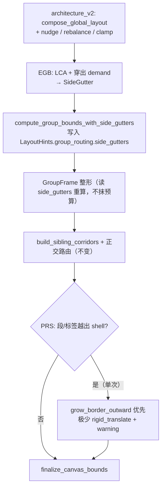
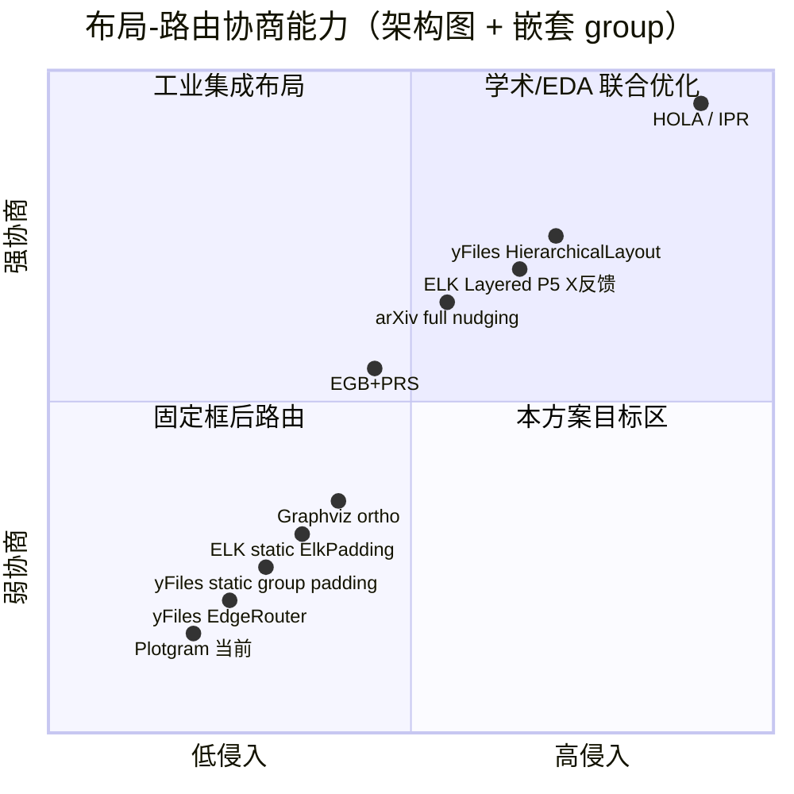

# 布局与边路由双向协商：文献与同类产品调研

> 日期：2026-07-09  
> 范围：architecture 图 group 内边距 / 走廊 gutter 不足问题的背景调研  
> 触发用例：`showcase/architecture/c.layout-stress-nested.pgm`（`cloud`「云端基础设施」左侧过挤）  
> 关联文档：  
> - [slot-post-routing-proposal.md](./slot-post-routing-proposal.md)（路由分层与信息契约）  
> - [orthogonal-routing-comparative-analysis.md](./orthogonal-routing-comparative-analysis.md)（Plotgram vs ELK/yFiles 路由对比）

---

## 一、问题背景

### 1.1 现象

在 `c.layout-stress-nested.pgm` 中，外层 group `cloud`（云端基础设施）**左侧内边距过小**：

- 竖直走廊线、`发送事件`、`Webhook 通知 (穿透云端与VPC)` 等标签几乎贴左边框；
- 内层子网（`data_subnet`、`private_subnet` 等）左对齐，未给左侧边通道预留 gutter；
- 部分边绕到 group 左边界外（如 `biz_svc → db_master` 水平段 x < group.x）。

### 1.2 根因（Plotgram 当前管线）

```
architecture_v2 节点/组布局
  → compute_group_bounds（成员 bbox + 固定 padding）
  → GroupFrame 整形
  → orthogonal 边路由（走廊 hint 由布局后几何推导）
  → refine / repulse 微调
  → finalize_canvas_bounds
```

**布局阶段不知道**「哪些边会从 group 哪一侧出去、标签有多长」；**走廊**（`build_sibling_corridors`）在布局**之后**才写入 `hints.group_routing`，仅供路由消费，不反向撑大 group 框。

此外，`cloud` 为**纯容器组**（无直接 entity），`container_padding` 将水平 padding 减半（architecture 叶子组 left=28px → 容器组 left≈14px），进一步压缩左侧空间。

### 1.3 人类绘图 vs 当前引擎

| 人类操作 | 当前 Plotgram |
|----------|---------------|
| 预判左侧会有竖走廊、长标签，**先留 gutter 再摆盒子** | 先按节点紧致排布，**事后**在固定框内塞线 |
| 发现挤了 → **扩外框 / 右移子组** | group 框 ≈ 成员 bbox + 固定 padding，路由难推动整块内容 |
| 边、标签、组框**一起收敛** | 基本单向：布局 → 路由 → 局部 refine |

本调研回答：**同类学术方案与工业产品是否做过「布局 ↔ 路由」双向协商？做到什么程度？对 Plotgram 有何启示？**

---

## 二、协商强度谱系


| 强度 | 含义 | 典型代表 |
|------|------|----------|
| **强耦合** | 布局与路由在同一优化循环中迭代，或路由后可移动/放大节点框 | HOLA、IPR、full nudging |
| **半耦合** | 粗粒度布局先定，路由阶段反推一维坐标或层间宽度 | ELK Layered、yFiles HierarchicalLayout |
| **弱耦合** | 节点/组框固定，路由在剩余空间内寻路 | yFiles EdgeRouter、Plotgram 当前 architecture |

---

## 三、学术文献

### 3.1 力导向 + 边路由联合优化

**Dwyer, Marriott, Wybrow — *Integrating Edge Routing into Force-Directed Layout* (GD 2006)**  
- 链接：[Springer](https://link.springer.com/chapter/10.1007/978-3-540-70904-6_3)  
- 要点：在 constrained stress majorization 中**同时移动节点与边 bend point**；用 separation constraints 避免标签压线、避免新增交叉。  
- 意义：**节点位置不是路由的前置常量**，路由几何参与布局能量最小化。

同团队 **IPSep-CoLa** (TVCG 2006) 提供分离约束下的 stress 布局基础。

### 3.2 HOLA：模拟人类「边想边改」

**Kieffer, Dwyer, Marriott, Wybrow — *HOLA: Human-like Orthogonal Network Layout* (TVCG 2016)**  
- 论文：[PDF](https://marvl.infotech.monash.edu/~dwyer/papers/hola2015.pdf)  
- 实现：[skieffer/hola](https://github.com/skieffer/hola)（基于 Adaptagrams）

HOLA 明确反对僵硬 TSM 单向流水线，步骤概览：

1. **Stress 解开图**（untangle，暴露对称性）  
2. **增量改进**（调 bend、网格对齐——类似人类 opportunistic fix）  
3. **子树独立布局再拼回**  
4. **最终正交路由**，并保证可读性  

用户研究结论：自动布局可接近手绘质量，前提是**避免「拓扑锁死 → 形状锁死 → 只压 metrics」**。

与 Plotgram 问题的关联：人类会「发现左侧挤了再推开」，HOLA 的 P2「增量改进」正是这种协商的算法化。

### 3.3 放置与路由交替迭代（电路 / EDA）

**Eschbach et al. — *Orthogonal Circuit Visualization Improved by Merging the Placement and Routing Phases* (2005)**  
- 链接：[PDF](https://edocs.tib.eu/files/e01fn06/519560035l.pdf)  
- 要点：经典流程是「先摆节点 → 再路由」；此文在**同一层内交替**「交换两节点顺序」与「重新正交嵌入」，直至局部最优。  
- 意义：最早的 **placement ↔ routing 互相影响** 工程实践之一。

VLSI 领域更激进：

| 工作 | 要点 |
|------|------|
| **IPR — Integrated Placement and Routing** (DAC 2007) | 将 global routing 嵌入 placement，减少「布局以为可布、布线拥塞」的不一致 |
| **RUPlace** (DAC 2025) | ADMM 统一优化 placement + routing，交替运行 global routing 与 incremental placement |

类比：布线拥塞**反馈**推单元位置——即「路由告诉布局要腾空间」。

### 3.4 路由后 nudging：允许扩框

**A Simple Pipeline for Orthogonal Graph Drawing** (arXiv:2309.01671)  
- 链接：[PDF](https://arxiv.org/pdf/2309.01671)

正交流水线末步 **Edge Nudging** 两种模式：

| 模式 | 行为 |
|------|------|
| **constrained nudging** | 节点框不动，只调整路径段间距 |
| **full nudging** | 节点框**可移动、必要时可放大**，以满足最小间距 δ；论文 Fig.6 展示顶点被略微放大以给端口腾空间 |

与 `cloud` 左侧 gutter 问题直接对应：**路由发现越界 → 扩 group 壳或平移内容**，而非在 14px 内硬塞。

### 3.5 TSM（Topology-Shape-Metrics）

**Tamassia (1987 起)** 三阶段：planarization → orthogonalization → compaction。

- Compaction 可动节点坐标、压面积；  
- 但**拓扑与边形状已锁死**，无法回头改「应从 Left 还是 Bottom 出」。  
- yFiles Orthogonal Layout 内部采用 TSM 思路。

### 3.6 Sugiyama 框架内的步骤交互

**Graph Drawing Handbook — Hierarchical Drawing Algorithms**（Sugiyama 章）明确指出：

> the steps may interact with each other and a solution to one step can have a bearing on later steps.

即：分层本身允许步骤间影响，但**具体实现**决定耦合强弱（见下文 ELK / yFiles）。

---

## 四、同类产品

### 4.1 ELK（Eclipse Layout Kernel）

文档：[Layered 五阶段概述](https://eclipse.dev/elk/blog/posts/2025/25-08-21-layered.html)

| 阶段 | 职责 |
|------|------|
| Phase 4 Node Placement | 确定 **Y** 坐标、层内对齐 |
| Phase 5 Edge Routing | 确定边路径，**finalize X 坐标** |

**半双向**：路由会反推节点在层内的 X，并为层间走廊压缩/扩展宽度（`OrthogonalEdgeRouter` 最小化层间通道宽度）。

**compound / nested group**：

- 支持跨层级边（`hierarchyHandling: INCLUDE_CHILDREN`）；  
- group `padding` / `margin` 为**静态**配置（`ElkPadding`、`ElkMargin`），不因「左侧边多」动态扩左边距。

### 4.2 yFiles

| 组件 | 布局↔路由关系 |
|------|----------------|
| **HierarchicalLayout** | Layering → Sequencing → **Drawing（联合定坐标 + 路由）**；`minimumLayerDistance`、`gridSpacing` 与路由协同 |
| **Orthogonal Layout (TSM)** | 内部三阶段；compaction 可动节点，非实时路由反馈 |
| **OrthogonalEdgeRouter / EdgeRouter** | 文档写明：**节点位置固定，路由不修改节点** |
| **GroupBoundsCalculator** | 可按 group 配置 `GROUP_NODE_PADDING`，属布局时**静态** padding |
| **GroupNodeRouterStage** | 解决 group 当障碍物 vs 端点在 group 内的矛盾；**不**根据路由结果动态扩 group gutter |

文档亦指出：独立 EdgeRouter 的质量/性能通常**不如**带 integrated routing 的 HierarchicalLayout。

### 4.3 Graphviz

- `splines=ortho`：dot 引擎内置正交路由，但与 cluster、port、边标签兼容性差（官方注明 ortho 不支持 port 与 edge labels）。  
- 更接近「布局引擎内置一种路由」，而非成熟的 nested group gutter 协商。  
- 复杂架构图社区经验：常需 `constraint=false`、`ranksep` 等手工调参。

### 4.4 draw.io / Lucidchart / Miro

偏交互式绘图；自动布局能力有限。**人类手动留 gutter**，软件较少实现「路由越界 → 自动扩 group」的闭环。

### 4.5 OGDF

**ClusterOrthoLayout**：聚类正交布局，提供 `margin()`（包围盒到绘制边界的距离）与 `separation()`（边与顶点最小间距）——仍是**布局参数**，非路由后反馈。

---

## 五、Plotgram 在谱系中的位置

当前 architecture 管线属于 **弱耦合 / 固定节点路由** 分支：

```
architecture_v2（节点、子组位置、RowAlign::Start）
  → compute_group_bounds（叶子 padding 28 / 容器 padding ≈14）
  → hints.group_routing.corridors（布局后几何推导，仅供路由）
  → orthogonal 路由 + corridor + lane + label
  → refine 推节点（消交叉，非系统预留 gutter）
  → GroupFrame restore（按节点重算 bounds，仍无「边通道预算」）
```

与 [slot-post-routing-proposal.md](./slot-post-routing-proposal.md) 中「瞎子分层」诊断一致：**每层决策时缺少后续层信息**；布局层尤其缺少「边从哪侧出、标签多长」。

与 Phase 1–4 正交路由重构的关系：**无直接冲突**；parallel_gap、标签 whitespace 等改善路由质量，但**未**在布局阶段引入 group 边框 gutter 预算。

---

## 六、对 Plotgram 的可行方向（按侵入性排序）

| 方案 | 描述 | 参照 | 侵入性 | 预期效果 |
|------|------|------|--------|----------|
| **A. 静态加大容器组 padding** | 提高 `container_padding` 或 architecture 非对称 left | yFiles `defaultPadding`、OGDF `margin` | 低 | 全局缓解，不够精准 |
| **B. 布局前边感知 inset** | 统计每组各侧预期边数 / 标签宽度，非对称扩大 `GroupPadding.x` | 人类「先留道再摆盒」 | 中 | 对 `cloud` 左侧较精准 |
| **C. 路由反推一维坐标** | 借鉴 ELK Phase 5：走廊占用反推子组整体 x 偏移 | ELK Layered | 中高 | 需定义 architecture 的「可动维度」 |
| **D. 路由后 full nudging / 扩壳** | 路径或标签越出 border shell 时推开 group 左边框或平移子组 | arXiv:2309 full nudging | 中 | 最接近人类「发现挤了再推开」 |
| **E. HOLA 式增量改进** | 在现有管线末加一轮 opportunistic fix（扩壳 + 局部重路由） | HOLA P2 | 中 | 不推翻 architecture_v2 |
| **F. 全联合优化** | stress + constraints 或 EDA 式统一目标 | HOLA、IPR | 高 | 算法体系变更，暂不推荐 |

### 6.1 推荐组合（已定稿为 §九）

1. **EGB**（边感知 gutter 预算，含 LCA + 穿出双层 demand）— 布局前主力  
2. **PRS**（路由后单次扩壳，默认只 `grow_border_outward`）— 安全网  
3. **长期可选**：若 architecture 图占比继续上升，再评估 ELK 式一维坐标反推（§六 方案 C），不与 EGB+PRS 并行实施  

### 6.2 与现有架构原则的衔接

[AGENTS.md](../../../AGENTS.md) 要求布局算法**确定性**；任何协商方案须：

- 边/组排序显式全序，不依赖 `HashMap` 迭代序；  
- 反馈轮次有上限（如 HOLA 局部最优、full nudging 单次 LP）；  
- 不做不可调试的全局黑盒联合优化（见 slot-post-routing-proposal §3.1）。

---

## 七、参考文献与链接

| 类型 | 引用 |
|------|------|
| 力导向+路由 | Dwyer T, Marriott K, Wybrow M. *Integrating Edge Routing into Force-Directed Layout.* GD 2006. [doi:10.1007/978-3-540-70904-6_3](https://doi.org/10.1007/978-3-540-70904-6_3) |
| HOLA | Kieffer S, Dwyer T, Marriott K, Wybrow M. *HOLA: Human-like Orthogonal Network Layout.* IEEE TVCG 22(1), 2016. [PDF](https://marvl.infotech.monash.edu/~dwyer/papers/hola2015.pdf) |
| 放置路由合并 | Eschbach T, Günther W, Becker B. *Orthogonal Circuit Visualization Improved by Merging the Placement and Routing Phases.* 2005. [PDF](https://edocs.tib.eu/files/e01fn06/519560035l.pdf) |
| IPR | Pan M, Chu C. *IPR: an integrated placement and routing algorithm.* DAC 2007. |
| full nudging | *A Simple Pipeline for Orthogonal Graph Drawing.* arXiv:2309.01671. [PDF](https://arxiv.org/pdf/2309.01671) |
| TSM | Tamassia R. *On embedding a graph in the grid with the minimum number of bends.* SIAM J. Comput. 1987. |
| ELK | [The Five Phases](https://rtsys.informatik.uni-kiel.de/confluence/display/KIELER/The+Five+Phases) |
| yFiles | [Orthogonal Edge Routing](https://docs.yworks.com/yfiles/doc/developers-guide/orthogonal_edge_router.html)、[EdgeRouter](https://docs.yworks.com/yfiles/doc/developers-guide/polyline_edge_router.html)、[GroupBoundsCalculator](https://docs.yworks.com/yfiles-html/api/GroupBoundsCalculator/) |
| Graphviz | [splines=ortho](https://graphviz.org/docs/attrs/splines/) |

---

## 八、状态

| 项 | 状态 |
|----|------|
| 文献与产品调研 | ✅ 本文档 |
| 边感知 inset 方案设计 | ✅ 见 §九（EGB + PRS，含 LCA demand） |
| `c.layout-stress-nested` 验证 | ⬜ 待实施（E-3） |
| 路由后扩壳原型 | ⬜ 待实施（E-4） |
| 同类产品定位 / 性能评估 | ✅ 见 §9.10 / §9.11 |

---

## 九、可实现方案：EGB + PRS（边感知 Gutter 预算 + 路由后单次扩壳）

> 本节把 §六 推荐组合中的 **B（边感知 inset）+ D（路由后扩壳）** 落成一个可编码、可测试、可回滚的完整方案，供 AI Agent 直接实现。
> 命名：**EGB**（Edge-aware Gutter Budget，布局前预算）+ **PRS**（Post-Routing Shell expansion，路由后单次扩壳）。

### 9.1 设计总纲

一句话：**布局前用「边侧需求预算」非对称地撑开 group 各侧 gutter（EGB，主力），路由后用「唯一一次扩壳」兜底修正越界（PRS，安全网）**。



与既有架构原则的衔接：

| 原则来源 | 要求 | 本方案如何满足 |
|----------|------|----------------|
| [AGENTS.md](../../../AGENTS.md) §2 | 布局迭代确定性，不依赖 `HashMap` 序 | 边侧统计按 `(from_id, to_id)` 全序累加，budget 表用 `BTreeMap<(GroupId, Side), _>` |
| [slot-post-routing-proposal.md](./slot-post-routing-proposal.md) §3.3 | 唯一一次后向反馈 | EGB 是前向预算（无反馈）；PRS 是**单次、有上限**的后向修正，不进入迭代循环 |
| §三 full nudging (arXiv:2309) | 越界时可平移/放大框，而非硬塞 | PRS **默认只向外扩壳**（不动节点）；仅在 sibling 碰撞且扩壳不足时极少触发平移，且不重路由 |
| §六 侵入性排序 | 优先低侵入 | EGB 只改 `GroupPadding` 与 `compute_group_bounds`；路由/bundling/slot **零改动** |

**为什么是这两件事的组合，而非单一方案**：
- 只做 EGB：预算是估计值，极端场景（标签超长、临时高密度）仍可能小幅越界 → 需要 PRS 兜底。
- 只做 PRS：路由后才发现挤，扩壳会引发 sibling 位移 → 连锁重路由，违反"唯一一次反馈"。
- EGB 先把 95% 的空间在布局阶段准备好，PRS 只处理残余小越界（且只动最外层/空白方向），两者互补且都不触发重路由。

---

### 9.2 数据结构变更（第一步，独立可编译）

当前 `GroupPadding`（[group_bounds.rs](../../../crates/plotgram-core/src/layout/node/common/group_bounds.rs:12)）是**水平对称**的（只有 `x`、`x_delta`）。这是"左侧过挤"无法精准修复的结构性根因。改为**四侧独立**：

```rust
// crates/plotgram-core/src/layout/node/common/group_bounds.rs

/// 分组包围框的四侧内边距（各侧独立，支持非对称 gutter）。
#[derive(Debug, Clone, Copy)]
pub struct GroupPadding {
    pub left: f64,
    pub right: f64,
    pub top: f64,    // 含标题区 header_height
    pub bottom: f64,
}

impl GroupPadding {
    /// 统一 padding（四侧相同，top 额外加 header），兼容旧 `uniform`。
    pub fn uniform(padding: f64, header_height: f64) -> Self {
        Self { left: padding, right: padding, top: padding + header_height, bottom: padding }
    }

    /// 逐侧取两者较大值（base 与 budget 合成时用）。
    pub fn max_per_side(self, other: SideGutter) -> Self {
        Self {
            left: self.left.max(other.left),
            right: self.right.max(other.right),
            top: self.top.max(other.top),
            bottom: self.bottom.max(other.bottom),
        }
    }
}

/// 单个 group 的四侧 gutter 预算（EGB 产出，叠加到 base padding 上）。
#[derive(Debug, Clone, Copy, Default)]
pub struct SideGutter {
    pub left: f64,
    pub right: f64,
    pub top: f64,
    pub bottom: f64,
}
```

`compute_group_bounds` 的应用处（[group_bounds.rs:144](../../../crates/plotgram-core/src/layout/node/common/group_bounds.rs:144)）改为四侧独立：

```rust
GroupLayout {
    x:      min_x - pad.left,
    y:      min_y - pad.top,
    width:  (max_x - min_x) + pad.left + pad.right,
    height: (max_y - min_y) + pad.top + pad.bottom,
    ..Default::default()
}
```

> ⚠️ 破坏性变更：`GroupPadding` 字段从 `{x, y_top, x_delta, y_delta}` 改为 `{left, right, top, bottom}`。按 [AGENTS.md](../../../AGENTS.md) §1「无向后兼容约束」，**直接改所有引用点**（`force_directed()`、`GroupPaddingLike`、pipeline 调用等），不保留旧字段。引用点见下表。

| 引用点 | 处理 |
|--------|------|
| [group_bounds.rs](../../../crates/plotgram-core/src/layout/node/common/group_bounds.rs) `force_directed()` / `container_padding()` | 改为四侧写法（`container_padding` 的"水平减半"改为 `left/right` 各减半） |
| [group_sizing.rs](../../../crates/plotgram-core/src/layout/node/architecture_v2/group_sizing.rs:153) `GroupPaddingLike` | 同步四侧字段 |
| [group_frame/mod.rs](../../../crates/plotgram-core/src/layout/group_frame/mod.rs) `recompute_group_bounds` / `group_padding_for_algo` | 四侧化；architecture 非对称默认值改为 `{left:28, top:48, right:28, bottom:28}`（与旧 `x/y_top/x_delta/y_delta` 语义等价） |
| [group/rect.rs](../../../crates/plotgram-core/src/layout/group/rect.rs) `routing_group_padding` | 同步四侧 |
| [pipeline.rs](../../../crates/plotgram-core/src/layout/node/architecture_v2/pipeline.rs:157) `GroupBoundsPhase` | 无顶层分组路径：读 `LayoutContext.side_gutters` |
| [group_frame/pass.rs](../../../crates/plotgram-core/src/layout/group_frame/pass.rs) | **主路径**：`recompute_group_bounds` 读 `LayoutResult.hints.group_routing.side_gutters` |

**持久化载体**（避免 EGB 被后续 pass 抹掉）：

```rust
// crates/plotgram-core/src/layout/group/context.rs — 扩展现有 GroupRoutingHints
pub struct GroupRoutingHints {
    pub corridors: Vec<GroupCorridor>,
    pub border_shell_pad: f64,
    /// EGB 产出；`BTreeMap` 保证确定性迭代。architecture 专用；其他图为空。
    pub side_gutters: BTreeMap<String, SideGutter>,
}
```

---

### 9.3 EGB 核心算法：边侧需求估计

**目标**：在布局阶段（还没有路由几何时）估计「每个 group 每一侧将承载多少穿越边 / 标签宽度」，据此生成 `SideGutter`。

**关键洞察（两层 demand，缺一不可）**：

1. **穿出 demand**（`exit_groups`）：边从 u 侧离开、进入 v 侧时，在「u 祖先 \ v 祖先」与「v 祖先 \ u 祖先」的 group 上计侧向需求——覆盖**穿出到组外**的边（如 `biz_svc → third_party` 对 `cloud`）。
2. **LCA demand**（**必须**，修正初版遗漏）：当 `leaf(u) ≠ leaf(v)` 时，在 **LCA(leaf(u), leaf(v))** 及其到两端的祖先链上计需求——覆盖**父组内跨子树借道**（如 `biz_svc → mq` 在 `cloud` 左侧竖走廊，两端同在 `cloud` 内但不同子网）。

仅做 `exit_groups` 祖先差集时，`cloud` **不会**为 `private_subnet ↔ data_subnet` 的边累计 gutter，正是 `c.layout-stress-nested` 左挤的主因之一。

#### 9.3.1 输入（布局阶段均已具备）

| 输入 | 来源 |
|------|------|
| 各节点 bbox | `nodes: HashMap<String, NodeLayout>`（Phase C 后） |
| 各 group bbox（base padding 版） | 先跑一次 `compute_group_bounds` 得到初值（用于判方向） |
| node → leaf group / 祖先链 | 提取 [`build_group_hierarchy`](../../../crates/plotgram-core/src/layout/group/context.rs:201) 为 `pub(crate)`（当前为 private），或新建 `group/hierarchy.rs` |
| 边列表 + 标签文本宽度 | `diagram.relations`（标签宽度用现有文本测量，无标签则 0） |

#### 9.3.2 算法（确定性伪代码）

```
fn estimate_side_gutters(diagram, nodes, base_groups, hierarchy) -> BTreeMap<GroupId, SideGutter>:
    demand: BTreeMap<(GroupId, Side), LaneDemand> = {}

    edges = sort(diagram.relations, key = |r| (r.from, r.to))

    for e in edges:
        gu = hierarchy.node_leaf_group[e.from]
        gv = hierarchy.node_leaf_group[e.to]
        if gu.is_none() && gv.is_none(): continue
        if gu == gv: continue   # 同 leaf group，无跨子树需求

        cu = center(nodes[e.from])
        cv = center(nodes[e.to])
        label_w = measure_label_width(e.label)

        # ── A) LCA demand：父组内跨子树（cloud 左走廊的主来源）──
        if gu != gv:
            lca = lowest_common_ancestor(gu, gv, hierarchy)   # 无 group 的节点 → lca = None，跳过
            if let Some(lca_id) = lca:
                accrue_on_path(
                    &mut demand, lca_id, gu, gv, hierarchy,
                    cu, cv, base_groups, label_w,
                    weight = 1.0,
                )
                # accrue_on_path：对 lca 到 gu、lca 到 gv 路径上每个祖先 (含 lca) 累加
                # side = soft_dominant_side(cu, base_groups[g], cv)  # 见 9.3.4

        # ── B) 穿出 demand：穿出到对端子树之外的边 ──
        if let (Some(gu), Some(gv)) = (gu, gv):
            exit_u = ancestors(gu) \ ancestors(gv)
            exit_v = ancestors(gv) \ ancestors(gu)
            for g in exit_u:
                side = soft_dominant_side(cu, base_groups[g], cv)
                accrue_demand(&mut demand, g, side, label_w, weight = 1.0)
            for g in exit_v:
                side = soft_dominant_side(cv, base_groups[g], cu)
                accrue_demand(&mut demand, g, side, label_w, weight = 1.0)

    # demand → 物理 gutter（每 (g,side) 独立，取 min(sum, GUTTER_MAX)）
    return demand_to_side_gutters(demand)

fn accrue_demand(demand, g, side_weights, label_w, weight):
    # side_weights: [(Side, f64)] 来自 soft_dominant_side，和为 1
    for (side, w) in side_weights:
        d = demand[(g, side)]
        d.lanes += weight * w          # 可 fractional lane
        if side in {Left, Right}:
            d.label_w = max(d.label_w, label_w * w)

fn demand_to_gutter(d: LaneDemand) -> f64:
    lanes_ceil = d.lanes.ceil() as u32
    min(
        SHELL_PAD + PORT_STUB_CLEARANCE
            + lanes_ceil.saturating_sub(1) * LANE_PITCH
            + d.label_w,
        GUTTER_MAX,
    )
```

**`lowest_common_ancestor`**：对两 leaf group id，沿 `group_ancestors` 有序列表取最深公共祖先（`BTreeSet` 交集后取 depth 最大者）。确定性：祖先列表已按 depth 升序存储。

#### 9.3.3 `soft_dominant_side`（方位判定，避免硬切）

```
fn soft_dominant_side(from_center, group_bbox, to_center) -> [(Side, f64)]:
    dx = to_center.x - group_bbox.center_x
    dy = to_center.y - group_bbox.center_y
    ax, ay = dx.abs(), dy.abs()
    total = ax + ay
    if total < EPS: return [(Left, 0.5), (Right, 0.5)]   # 退化：均分左右

    # 主侧占 70%，次侧占 30%（斜向边两侧各留一点预算）
    if ax >= ay:
        primary   = if dx < 0 { Left } else { Right }
        secondary = if dy < 0 { Top } else { Bottom }
    else:
        primary   = if dy < 0 { Top } else { Bottom }
        secondary = if dx < 0 { Left } else { Right }
    return [(primary, 0.7), (secondary, 0.3)]
```

#### 9.3.4 物理参数（引用现有常量 + 一个上限）

| 参数 | 值 | 来源 |
|------|-----|------|
| `SHELL_PAD` | 12.0 | [`GROUP_BORDER_SHELL_PAD`](../../../crates/plotgram-core/src/layout/group/constants.rs:4) |
| `PORT_STUB_CLEARANCE` | 16.0 | [constants.rs:7](../../../crates/plotgram-core/src/layout/group/constants.rs:7) |
| `LANE_PITCH` | 18.0 | [`CORRIDOR_LANE_PITCH`](../../../crates/plotgram-core/src/layout/edge/edge_routing_orthogonal/corridor_route.rs:22) |
| `GUTTER_MAX` | 84.0（≈3×28） | 新增于 `edge_gutter.rs`，防极端估计撑爆画布 |

#### 9.3.5 `c.layout-stress-nested` 推演（修正后）

| 边 | LCA | 预期主要 gutter 侧 |
|----|-----|-------------------|
| `biz_svc → mq` | `cloud` | Left（`private_subnet` 在左下，`data_subnet` 在左上，竖走廊借 `cloud` 左侧） |
| `biz_svc → third_party` | `cloud`（穿出） | Left（`third_party` 在 `external`，整体偏左下） |
| `biz_svc → db_master` | `cloud` | Left / Bottom（soft 分配） |
| `client → gateway` | 子组内或 `external` | 一般不增加 `cloud.left` |

EGB 后预期：`cloud.left` gutter ≈ `28 + 16 + n×18 + label_w`（叠加 base），**显著大于**当前容器组 ≈14px。

---

### 9.4 EGB 集成点（两条代码路径）

> **重要**：`c.layout-stress-nested` 等有顶层分组时走 [`two_phase.rs`](../../../crates/plotgram-core/src/layout/node/architecture_v2/two_phase.rs)，**不经过** [`architecture_v2/pipeline.rs`](../../../crates/plotgram-core/src/layout/node/architecture_v2/pipeline.rs) 的 `GroupBoundsPhase`。  
> 全局 [`layout/pipeline.rs`](../../../crates/plotgram-core/src/layout/pipeline.rs) 在布局后还会调用 [`GroupFramePass`](../../../crates/plotgram-core/src/layout/group_frame/pass.rs) 的 `recompute_group_bounds`——**若不在此处读 `side_gutters`，EGB 会被抹掉**。

#### 9.4.1 主路径：`two_phase`（有顶层分组）

在 [`two_phase.rs`](../../../crates/plotgram-core/src/layout/node/architecture_v2/two_phase.rs) 中，**必须在所有节点位置落定之后**再跑 EGB：

```
compose_global_layout
  → nudge_intra_nodes_toward_cross_group_edges   # 可能改 x
  → rebalance_infrastructure_layers              # 可能改 y
  → clamp_to_canvas
  → 【EGB 插入点】
  → build_sibling_corridors
```

```rust
// clamp_to_canvas 之后
let base_groups = compute_group_bounds(diagram, &nodes, leaf_padding);
let hierarchy = build_group_hierarchy_pub(diagram, &base_groups);
let side_gutters = estimate_side_gutters(diagram, &nodes, &base_groups, &hierarchy);
let groups = compute_group_bounds_with_side_gutters(
    diagram, &nodes, leaf_padding, &side_gutters,
);

// 写入 hints，供 GroupFramePass 后续重算
let group_routing = GroupRoutingHints {
    corridors: /* 用新 groups 再 build */,
    border_shell_pad: GROUP_BORDER_SHELL_PAD,
    side_gutters,
};
```

#### 9.4.2 次路径：无顶层分组 + `architecture_v2/pipeline`

[`pipeline.rs` `GroupBoundsPhase`](../../../crates/plotgram-core/src/layout/node/architecture_v2/pipeline.rs:152)：`LayoutContext` 增 `side_gutters: BTreeMap<String, SideGutter>`，在 Phase 6 调用 `compute_group_bounds_with_side_gutters`。

#### 9.4.3 全局 GroupFramePass（必须）

修改 [`group_frame/mod.rs` `recompute_group_bounds`](../../../crates/plotgram-core/src/layout/group_frame/mod.rs:1491)：

```rust
pub fn recompute_group_bounds(
    diagram: &Diagram,
    layout: &mut LayoutResult,
    base_padding: GroupPadding,
) {
    let side_gutters = layout
        .hints
        .group_routing
        .as_ref()
        .map(|h| &h.side_gutters)
        .filter(|_| /* algo == architecture */);
    layout.groups = if let Some(gutters) = side_gutters {
        compute_group_bounds_with_side_gutters(diagram, &layout.nodes, base_padding, gutters)
    } else {
        compute_group_bounds(diagram, &layout.nodes, base_padding)
    };
}
```

调用链覆盖：`apply_after_node_snap` → `refresh_before_route` → `restore_after_node_moves`。

#### 9.4.4 `compute_group_bounds_with_side_gutters`

与 `compute_group_bounds` 相同 depth 降序遍历；对每个 group：

```rust
let leaf_pad = if is_container { container_padding(base) } else { base };
let budget = side_gutters.get(gid).copied().unwrap_or_default();
let pad = leaf_pad.max_per_side(budget);   // 逐侧取 max，budget 覆盖容器减半
```

---

### 9.5 PRS：路由后单次扩壳（安全网）

**触发时机**：正交路由 + `resolve_label_overlaps` + `repulse` 全部完成后，[`layout/pipeline.rs`](../../../crates/plotgram-core/src/layout/pipeline.rs) 的 `run_post_route_group_frame` **之后**、`finalize_canvas_bounds` **之前**，执行**恰好一次**。仅 `diagram_type == Architecture` 且 `side_gutters` 非空或发生过路由时启用。

**策略优先级**（降低跨子树边破坏风险）：

| 优先级 | 动作 | 节点/边 | 重路由 |
|--------|------|---------|--------|
| 1 | `grow_border_outward(g, side, δ)` | 只改 `GroupLayout` 矩形；**内部节点与边 points 不变** | 否 |
| 2 | `propagate_to_ancestors(g)` | 祖先框随子框扩大 | 否 |
| 3 | `rigid_translate_subtree(sibling, Δ)` | **仅当**扩壳后与 sibling group 矩形重叠 | 否（整子树节点+边 points 同 Δ 平移） |
| 4 | 仍越界 | 记 `GroupLayoutWarning`，**不迭代、不重路由** | — |

```
fn post_route_shell_expand(layout) -> bool:
    overflow = scan_overflow(layout.edges, layout.labels, layout.groups)  # border_shell 复用

    if overflow.is_empty(): return false

    for (g, side) in sorted(overflow.keys(), by = (depth asc, id asc)):
        δ = overflow[(g, side)]
        grow_border_outward(&mut layout.groups[g], side, δ)   # 向外扩，不缩
        propagate_to_ancestors(&mut layout.groups, g)

    # 仅检测 group 矩形碰撞（不含边路径）
    for collision in detect_group_rect_collisions_among_siblings(&layout.groups):
        if collision.can_resolve_by_translate:
            rigid_translate_subtree(layout, collision.sibling, collision.delta)
            push_warning_if_cross_subtree_edge_stressed(layout, collision)
        else:
            push_warning(layout, "prs_unresolved_overflow")

    return true
```

**为何默认不重路由**：

- **策略 1–2** 只扩大 group 边框（如 `cloud.x -= δ`，`cloud.width += δ`），内容与路径相对画布不变，视觉上左侧留白增加——正是 `cloud` 左挤的修复形态。
- **策略 3** 是例外：平移一端子树会使跨子树边一端动、一端不动，可能新增折点；因此 **EGB 应使策略 3 在 stress-nested 上几乎不触发**；若触发则记 warning，供调参。

**边界**：

- 单次执行，无循环。
- EGB 覆盖良好时，PRS 在 `c.layout-stress-nested` 上应 **no-op 或仅 sub-pixel 级 grow**（回归指标）。

---

### 9.6 确定性保证清单

| 环节 | 潜在不确定源 | 对策 |
|------|-------------|------|
| 边侧统计 | 边遍历顺序 | 按 `(from_id, to_id)` 排序后累加 |
| demand 表 | `HashMap` 迭代 | 用 `BTreeMap<(GroupId, Side), _>` |
| gutter 合成 | 浮点累加顺序 | 每 `(group, side)` 独立求 max/sum，无跨键依赖 |
| LCA 路径累加 | 祖先链遍历序 | 沿 `group_ancestors` 有序列表；同深度 tie-break 用 group id |
| PRS 扩壳顺序 | group 处理序 | 按 `(depth asc, id asc)` 全序 |
| PRS 平移子树 | 子树成员 | 从 `child_group_ids` 递归收集 entity id，id 排序后平移 |
| `soft_dominant_side` | 浮点比较 | 用同一 `EPS`；`total < EPS` 走固定 fallback |

符合 [AGENTS.md](../../../AGENTS.md) §2「不得依赖 HashMap key 排序驱动迭代」。

---

### 9.7 面向 AI Agent 的任务分解

> 执行规则：严格按序，每个 Task 完成后 `cargo check -p plotgram-core` + `cargo test -p plotgram-core` 通过再进入下一个。按 [AGENTS.md](../../../AGENTS.md) §1 直接删旧字段，不留兼容层。用户规则：非必要不写测试代码；但本方案 §9.7 的验证性单测属"必要"（防回归），可保留最小集。

#### Task E-1：GroupPadding 改为四侧非对称（结构基础）

- **前置**：无
- **修改文件**：
  - [group_bounds.rs](../../../crates/plotgram-core/src/layout/node/common/group_bounds.rs)：`GroupPadding` 字段改 `{left,right,top,bottom}`；新增 `SideGutter`、`max_per_side`；`uniform`/`force_directed`/`container_padding` 改写；`compute_group_bounds` 应用处四侧化
  - [group_sizing.rs](../../../crates/plotgram-core/src/layout/node/architecture_v2/group_sizing.rs:153)：`GroupPaddingLike` 四侧化
  - 全仓 `GroupPadding` 构造/字段引用点（用 `rg 'GroupPadding|\.x_delta|\.y_delta|\.y_top'` 找齐）
- **验证**：全量 `cargo test` 通过；渲染任一 architecture 示例，几何与改前**逐像素一致**（uniform 路径未改变语义）
- **回滚**：git revert 单 commit

#### Task E-2：实现 estimate_side_gutters（EGB 核心，纯函数）

- **前置**：E-1
- **修改文件**：
  - 新增 `crates/plotgram-core/src/layout/node/common/edge_gutter.rs`
  - 新增或扩展 `crates/plotgram-core/src/layout/group/hierarchy.rs`：`pub(crate) build_group_hierarchy` + `lowest_common_ancestor`
- **实现**：§9.3 伪代码；输入 `&Diagram, &HashMap<String,NodeLayout>, &HashMap<String,GroupLayout>, &hierarchy`，输出 `BTreeMap<String, SideGutter>`；复用 [`build_group_hierarchy`](../../../crates/plotgram-core/src/layout/group/context.rs:201)（如私有则提取为 `pub(crate)`）
- **验证**（最小必要单测）：
  - **LCA**：`cloud` 下 `private_subnet` 与 `data_subnet` 各一节点相连 → `side_gutters["cloud"].left > 0`
  - **穿出**：子组 → 外部 group 的边 → 祖先容器对应侧 gutter > 0
  - **同 leaf**：组内边 → `SideGutter` 全零
  - **确定性**：同输入两次 `estimate_side_gutters` 输出逐字段相等
- **回滚**：删文件（未接入管线，零影响）

#### Task E-3：接入 two_phase、GroupFramePass 与 hints 持久化

- **前置**：E-2
- **修改文件**：
  - [two_phase.rs](../../../crates/plotgram-core/src/layout/node/architecture_v2/two_phase.rs)：`clamp_to_canvas` **之后**、`build_sibling_corridors` **之前**调用 EGB（见 §9.4.1）
  - [group/context.rs](../../../crates/plotgram-core/src/layout/group/context.rs)：`GroupRoutingHints` 增 `side_gutters: BTreeMap<String, SideGutter>`
  - [group_frame/mod.rs](../../../crates/plotgram-core/src/layout/group_frame/mod.rs)：`recompute_group_bounds` 读 `side_gutters`（§9.4.3）
  - [group_bounds.rs](../../../crates/plotgram-core/src/layout/node/common/group_bounds.rs)：新增 `compute_group_bounds_with_side_gutters`
  - [architecture_v2/pipeline.rs](../../../crates/plotgram-core/src/layout/node/architecture_v2/pipeline.rs)（次路径）：`LayoutContext.side_gutters` + `GroupBoundsPhase`
  - [group/hierarchy.rs](../../../crates/plotgram-core/src/layout/group/)（或 `context.rs`）：`pub(crate) fn build_group_hierarchy(...)`
- **验证**：
  - `c.layout-stress-nested.pgm`：`cloud.x` 左移、`cloud.width` 增大；`biz_svc→db_master` 水平段最小 x ≥ `cloud.x + shell_pad`（左越界消失）
  - **回归**：`refresh_before_route` 前后 `cloud.width` 不变（EGB 未被抹掉）
  - 其余 architecture 示例：组框只增不减、无重叠 warning 新增
- **回滚**：`two_phase` 改回 `compute_group_bounds`；`GroupRoutingHints.side_gutters` 默认空

#### Task E-4：PRS 路由后单次扩壳（安全网）

- **前置**：E-3
- **修改文件**：新增 `crates/plotgram-core/src/layout/group/post_route_shell.rs`；在 [layout/pipeline.rs](../../../crates/plotgram-core/src/layout/pipeline.rs) `run_post_route_group_frame` **之后**、`finalize_canvas_bounds` 前调用一次（仅 architecture）
- **实现**：§9.5 优先级策略；默认 `grow_border_outward`；`rigid_translate_subtree` 仅碰撞兜底 + warning
- **验证**：构造标签超长的极端用例，确认单次 PRS 后无 clip；`c.layout-stress-nested` 在 E-3 后 PRS 应几乎不触发（回归 EGB 覆盖率）
- **回滚**：注释掉 pipeline 中 PRS 调用点

#### Task E-5（可选）：参数调优与全量回归

- **前置**：E-4
- 内容：`GUTTER_MAX` 上限、`LANE_PITCH` 是否区分 bundling、全 showcase 截图对比、确定性双跑一致性校验（同输入两次输出逐字节相同）

---

### 9.8 与既有已实现工作的关系

| 已实现（见 [slot-post-routing-proposal.md](./slot-post-routing-proposal.md) §十） | 本方案 |
|--------------------------------------------------------------------------|--------|
| P0 Group 感知 Side 选择、P1 通道优先、A Slot 重规划 | **正交互补**：那些改的是"边在既定框内怎么走"，本方案改的是"框留多大 gutter"。EGB 让 side 选择/走廊有真实空间可用 |
| `build_sibling_corridors` / `GroupCorridor` | PRS 与 EGB 均不改走廊生成；EGB 撑开 gutter 后，走廊 gap 自然变宽，路由质量随之提升 |
| `GroupRoutingContext.endpoint_group_set` | EGB 的 **穿出 demand** 与 `ancestors(u)\ancestors(v)` 语义相近；**LCA demand** 为新增，专补父组内跨子树 |
| `nudge_intra_nodes_toward_cross_group_edges`（two_phase 已有） | 在**组内**微调节点 x；EGB 在**容器**级扩 gutter——互补，不替换 |

### 9.9 风险与对策

| 风险 | 对策 |
|------|------|
| gutter 估计偏大 → 图整体变松散 | `GUTTER_MAX` 钳制；`soft_dominant_side` 70/30 避免单侧过度；仅跨 leaf / 穿出边计入 |
| LCA 误指顶层 | 无 group 节点跳过；LCA 为 `None` 时不累加 |
| `dominant_side` 斜向边误判侧 | 已改为 `soft_dominant_side`；PRS 兜底 |
| 容器组 padding 减半与 EGB 冲突 | `max_per_side(base, budget)`，budget 覆盖减半 |
| GroupFramePass 抹掉 EGB | `side_gutters` 持久化于 `LayoutHints` + `recompute_group_bounds` 必读（§9.4.3） |
| PRS 平移子树破坏跨子树边 | **默认只扩壳**；平移为末级兜底 + warning；stress-nested 上 EGB 应使平移几乎不触发 |
| 破坏 flowchart 等非 architecture 图 | EGB/PRS 仅 architecture；`side_gutters` 空表时行为与现网一致 |
| EGB 在 nudge/rebalance 之前运行 | 插入点必须在 `clamp_to_canvas` 之后（§9.4.1） |

---

### 9.10 与同类产品的比较位置

本方案（EGB + PRS）在 §二「协商强度谱系」中的定位：**弱耦合 → 半耦合之间**，更接近「**前向预算 + 单次受限后向修正**」，而非全联合优化。



| 对比对象 | 协商方式 | 嵌套 group 左侧 gutter | 相对 EGB+PRS |
|----------|----------|------------------------|--------------|
| **Plotgram 当前** | 固定对称/减半 padding → 后路由 | 无预算，易贴边 | 基线 |
| **yFiles `GroupBoundsCalculator`** | 每 group **静态** `GROUP_NODE_PADDING` | 可配四侧，但不随边密度变 | EGB = 动态版 padding |
| **yFiles `OrthogonalEdgeRouter`** | 节点**固定**，路由寻路 | `nodeMargins` 绕节点，不扩 group 壳 | PRS 补 group 壳，仍不重路由 |
| **yFiles `HierarchicalLayout`** | Drawing 阶段**联合**定坐标+路由 | 层间距随路由变；偏层次图 | 更强，但算法体系不同 |
| **ELK Layered** | Phase 5 反推 **X**、压缩层间宽 | `ElkPadding` 静态；compound 边支持但不动态扩壳 | EGB 类似前向 padding；无 X 反推 |
| **arXiv:2309 full nudging** | 路由后 LP 平移/扩框 | 支持扩 vertex box | PRS 取其「扩壳」子集，单次无 LP |
| **HOLA / IPR** | 多轮 stress / 联合优化 | 全局最优取向 | 远强于本方案，工程代价过高 |
| **Graphviz `splines=ortho`** | dot 内置 ortho，cluster 弱 | 无 group gutter 协商 | 不适合 nested 架构图 |
| **draw.io 等** | 人手动留空 | 人脑做 EGB | 自动化的目标即逼近此效果 |

**差异化陈述**（对外/对产品）：

1. 比 **纯后路由**（当前 Plotgram、yFiles EdgeRouter）多一层 **边拓扑感知的前向 gutter 预算**，且对 **父组内跨子树边（LCA）** 显式建模——这是静态 padding 方案做不到的。  
2. 比 **ELK Phase 5 / HierarchicalLayout** 侵入性低：不改 architecture_v2 宏观排布、不重写 Sugiyama，路由/slot/corridor **零改动**。  
3. 比 **HOLA / EDA 联合优化** 可控、可调试：EGB 纯函数可单测；PRS 单次、可 warning，符合「唯一一次后向反馈」。  
4. 落在工业界常见甜点：**「动态 GroupBoundsCalculator + 一次 shell expand」**，在架构图 niche 里补齐 nested container 左侧走廊，而不追求通用图的全局最优。

---

### 9.11 性能影响判断

#### 9.11.1 复杂度（渐近）

| 阶段 | 复杂度 | 典型量级（stress-nested） |
|------|--------|---------------------------|
| **EGB `estimate_side_gutters`** | O(E · D) | E≈15 边，D≤3 层 group → ~45 次常数操作 |
| **`build_group_hierarchy`**（若未缓存） | O(N + G) | N≈12 节点，G≈6 组 |
| **额外 `compute_group_bounds`** | O(G · (成员数)) | 与现有一次重算同阶，+1 次 |
| **PRS `scan_overflow`** | O(S · G) | S≈边段数+标签数，G≈6；单次 |
| **PRS `grow_border_outward`** | O(G) | 常数级 |

其中 E = 边数，D = 祖先深度，G = group 数，S = 段/标签数。

#### 9.11.2 相对现有管线的增量（经验判断）

基于当前 `plotgram-core` 管线计时（layout 通常数 ms～数十 ms，route 占比较大）：

| 项 | 预期增量 | 说明 |
|----|----------|------|
| **CPU 时间** | **< 5%** 整图 layout+route | EGB 为轻量纯 Rust 算术；无图搜索、无 LP |
| **内存** | **+O(G)** | `BTreeMap` 存 `SideGutter`，每 group 16 字节级 |
| **路由耗时** | **0～10%** | 画布略变大，障碍物网格略增；gutter 加在 group **内侧**，不显著增加路由搜索空间 |
| **refine 轮次** | **不变或略减** | 左侧越界减少 → 可能少几次 push |
| **输出尺寸** | **宽度 +5%～15%**（architecture 密集图） | 非对称 gutter 有意为之；`GUTTER_MAX` 封顶 |

**不会触发的昂贵路径**：

- 无路由重算循环（PRS 明确禁止）  
- 无全局 stress / ADMM  
- flowchart / state 等图 **零开销**（不调用 EGB/PRS）

#### 9.11.3 建议的性能观测点（E-5）

在 `LayoutHints` 或 debug stats 中可选记录（不影响布局结果）：

```rust
pub struct GutterBudgetDebug {
    pub egb_ms: f64,
    pub prs_ms: f64,
    pub prs_grew: bool,
    pub max_side_gutter: f64,   // 各侧 budget 最大值
    pub canvas_area_delta_pct: f64,
}
```

验收：`c.layout-stress-nested` 上 `egb_ms + prs_ms < 0.5ms`（Release，M 系列 Mac 量级）；全 showcase architecture 批渲染总时长增加 **< 10%**。

#### 9.11.4 结论

**性能风险低**：EGB+PRS 属于布局管线的 **O(E·D) 前缀预算 + O(S·G) 单次扫描**，相对正交路由主成本可忽略。主要代价是 **画布面积略增**（可读性换空间），而非 CPU 瓶颈。若未来图规模上到 E>500、G>50，仍建议对 EGB 做「仅对 `depth < K` 的容器组计 LCA」裁剪——当前 showcase 规模无需 premature optimization。
