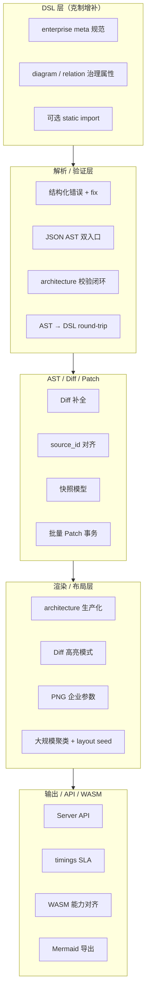
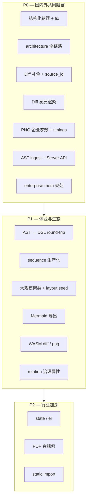

# Drawify 企业能力路线图（DSL / 解析 / 渲染）

> 版本：0.1.0-draft | 状态：需求设计中

本文档基于国内外企业需求（银行合规、互联网 K8s 治理、国际 Agent / DevOps / GRC），梳理 Drawify 在 **DSL、解析验证、AST/Diff、渲染布局、输出 API** 各层应做的功能级提升与补充，并给出优先级。

相关文档：

- [规模化架构图战略](./scale-diagram-strategy.md) — 国内银行 / 互联网场景
- [国际市场企业服务机会](./international-market-opportunities.md) — 国际行业与售卖形态

**核心原则**：DSL 克制增补、不做编程化扩展；规模化与企业治理主要靠 **AST 管线、Diff、Compose、API** 补齐。

---

## 1. 现状与目标差距

| 能力 | 现状 | 企业阻塞程度 |
|------|------|--------------|
| `flowchart` | ✅ 可用 | — |
| `sequence` | 布局 / 渲染器有，profile `implemented: true` | 国际 APM / 调用链需打磨 |
| `architecture` | 渲染器有，profile 仍 `implemented: false` | **国内 K8s / 微服务 POC 阻塞** |
| 结构化错误 + fix | 设计文档有，运行时常为 `Vec<String>` | **Agent / CI 门禁阻塞** |
| Diff / Patch | 实体增删有；属性 / 关系 / 分组变更待补 | **Architecture Compare 阻塞** |
| `drawify-server` | 占位 | **企业集成阻塞** |
| 大规模图 | 无聚类 / 折叠渲染 | 50+ 节点可读性 |
| Diff 视觉高亮 | 无 | Compare 产品化 |
| AST → DSL 反序列化 | 弱 / 无 | 合规审阅、人工改图 |
| Mermaid 导出 | 无 | 国际生态互操作 |

---

## 2. 分层提升总览



---

## 3. DSL 层

企业场景**不需要** `for`、宏、模板；DSL 服务「语义表达 + 人工微调」，批量生成由 Connector → AST Builder 完成。

### 3.1 P0 — 企业元数据约定（几乎不扩语法）

在现有 `meta.*` 上标准化 schema 与校验提示（文档 + 可选 warning）：

| meta 字段 | 用途 | 需求来源 |
|-----------|------|----------|
| `meta.source` | 数据源类型（k8s、terraform、cmdb） | Diff 对齐、审计 |
| `meta.source_id` | 稳定资源身份 | `match_by` Diff |
| `meta.source_hash` | 内容指纹 | 合规留档 |
| `meta.generated_at` | 生成时间 | 银行 / 国际审计 |
| `meta.zone` | 安全域 / DMZ / 核心区 | 银行、GDPR |
| `meta.classification` | 机密等级 | 银行、国防 |
| `meta.owner` | 责任团队 | 服务目录、Backstage |
| `meta.replicas` / `meta.image` | K8s 工作负载 | 互联网 K8s POC |

**工作项**：`validation/attrs` 增加 enterprise profile 级 **W 级提示**（缺 `source_id` 时提醒），非全局强制。

### 3.2 P0 — 图表级声明属性

规范并校验 diagram 级 attribute（语法已支持）：

```drawify
diagram architecture {
    title: "支付域生产拓扑"
    layout-algo: force-directed
    view: overview
    snapshot-id: "pay-prod-2026-06-07"
}
```

`view`、`snapshot-id` 与 Compose 规则、快照 API 对齐。

### 3.3 P1 — 关系治理属性（箭头仍仅 3 种）

可选 relation `meta.*`，不新增箭头类型：

| 属性 | 用途 |
|------|------|
| `meta.protocol` | gRPC、HTTP、MQ |
| `meta.criticality` | critical、normal |
| `meta.allowed` | 跨区访问是否合规 |

用于银行安全域图、国际 SOC2 证据链。

### 3.4 P1 — 静态 `import`（可选）

```drawify
import "shared/three-tier.dfy"
```

编译期展开，无参数、无循环。优先级低于 AST Compose。

### 3.5 明确不做

- `for` / `repeat` / 宏 / 条件分支
- group 嵌套超过 2 层
- 手写布局坐标

---

## 4. 解析器与验证器

### 4.1 P0 — 结构化错误 + 修复建议

落地 `docs/specs/error-model.md` 至 Parser、Validator、WASM、Server、CLI JSON：

- 字段：`code`、`severity`、`location`、`context`、`suggestion.fix`
- 一次返回多个错误
- 国内 CI 门禁、国际 Agent ISV 的**首要差异化**

### 4.2 P0 — 双入口解析

| 入口 | 场景 |
|------|------|
| 文本 DSL → AST | 人写、Agent 写 |
| **JSON AST → Diagram** | Connector、Compose、Patch 后直接渲染 |

企业规模化主路径为第二条；需提供 **AST ingest API**（可不经文本 DSL）。

### 4.3 P0 — `architecture` 类型校验闭环

- `validation/architecture.rs` 与 `ARCHITECTURE_ENTITY_TYPES` 对齐
- `diagram/registry.rs` 中 `implemented: true`
- 与力导向布局、ArchitectureRenderer 联调验收

### 4.4 P1 — AST → DSL 格式化（Round-trip）

Compose 产出 AST 后序列化为可读 `.dfy`，用于：

- 合规人工审阅
- PR 可读 diff（文本 + 语义双层）
- 国际客户文本源文件习惯

### 4.5 P1 — 多文件解析（配合 import）

- 模块图解析
- 循环 `import` 检测与报错

---

## 5. AST / Diff / Patch

国内外共同卖点：**语义 Diff + 快照 + Architecture Compare**。

### 5.1 P0 — 补全 Diff（`diff.rs` TODO）

需覆盖：

- 属性 modify（镜像版本、replicas、zone 等）
- 关系 label / arrow 变更
- group 增删、label、成员变化

并按 `meta.source_id` 做**跨快照实体对齐**（见 [scale-diagram-strategy.md §9.4](./scale-diagram-strategy.md#94-server-api-设计poc-范围)）。

### 5.2 P0 — Diff 人类可读报告

- `human_summary`、`markdown_report`
- 变更分类：add / remove / modify / security-relevant

### 5.3 P1 — 快照模型一等公民

扩展 AST `source_info`（JSON 字段，不必进 DSL）：

- `generated_at`
- `compose_rule`
- `view`
- `cluster`

### 5.4 P1 — 批量 Patch 事务性

- Connector 一次添加大量 entity 时原子应用
- 失败全量回滚

---

## 6. 渲染器与布局

### 6.1 P0 — `architecture` 渲染生产化

- profile `implemented: true`
- 力导向 + **group 分区视觉**（Namespace / 安全域）
- 50 节点内布局稳定

### 6.2 P0 — Diff 高亮渲染模式

`RenderRequest` 扩展（非 DSL 语法）：

| 模式 | 效果 |
|------|------|
| `highlight-diff` | 新增绿、删除红、修改黄 |
| `base` / `target` | 双图切换素材 |

配合亚秒级 SVG 重绘，实现 Architecture Compare。

### 6.3 P0 — PNG 企业导出参数

在 `render/format/png.rs` 上扩展 `RenderOptions`：

| 参数 | 用途 |
|------|------|
| `dpi` | 150 / 300 合规打印 |
| `scale` / `max_width` | 尺寸控制 |
| `watermark` | 机构、时间、classification |
| `background` | 白底归档 |

### 6.4 P0 — 大规模图策略

| 能力 | 说明 |
|------|------|
| 节点聚类折叠 | 同 group 超 N 个 → 「+12 more」 |
| 边抽样 | overview 只保留关键边 |
| 布局预算 | `max_nodes`、`layout_timeout_ms` |
| 布局 seed | 同一 AST 坐标可复现，Diff 对比不「乱跳」 |

### 6.5 P1 — `sequence` 生产化

- 调用链、OAuth、发布流水线
- 边标签支持 `meta` 延迟 / QPS
- 国际 APM、国内故障复盘

### 6.6 P2 — `state` / `er`

- 审批流、数据 lineage（制药 GxP）
- 优先级低于 architecture / sequence

### 6.7 P2 — PDF 合规导出包

PNG + Diff 摘要 + 元数据 → 单份 PDF 报告页。

---

## 7. 输出 / API / WASM

### 7.1 P0 — Server API

| 端点 | 说明 |
|------|------|
| `POST /render` | source 或 ast → svg / png / json |
| `POST /validate` | 结构化错误 |
| `POST /diff` | 语义 Diff + 报告 |
| `POST /patch` | 事务 Patch |
| `GET /health` | 健康检查 |

响应统一包含性能指标：

```json
{
  "timings": {
    "parse_ms": 2,
    "layout_ms": 8,
    "render_ms": 15,
    "total_ms": 28
  }
}
```

支撑对外「亚秒级 / 20ms 级渲染」SLA 验收。

`POST /compose` 可放在 Phase 2（Connector 层）。

### 7.2 P0 — WASM 与 CLI 能力对齐

- `diff`、`validate` 结构化 JSON
- `png` 二进制输出（专网本地归档）
- 与 Server 同 response schema

### 7.3 P1 — Mermaid 导出

- AST → Mermaid 字符串
- CLI：`drawify render foo.dfy -f mermaid`
- 国际 GitHub / GitLab；国内生态过渡

### 7.4 P1 — 渲染产物溯源元数据

SVG / PNG 嵌入或伴生：

- `snapshot-id`
- `generated-at`
- 供合规系统解析

---

## 8. 优先级路线图



### P0 清单（建议下一迭代）

1. 结构化错误全链路
2. `architecture` implemented + 验收
3. Diff 属性 / 关系 / 分组 + `source_id` 对齐
4. `highlight-diff` 渲染模式
5. PNG dpi / watermark 选项
6. `timings` 字段
7. Server `/render` `/validate` `/diff` `/patch`
8. JSON AST ingest
9. enterprise meta 规范文档 + 校验警告

### P1 清单

1. AST → DSL formatter
2. `sequence` 打磨
3. 大规模聚类与 layout seed
4. Mermaid 导出
5. WASM 能力补齐
6. relation / diagram 治理属性

### P2 清单

1. `state`、`er` 生产化
2. PDF 合规导出包
3. 静态 `import`

---

## 9. 需求来源对照表

| 需求来源 | 最依赖的 Core 能力 | DSL 是否改动 |
|----------|-------------------|--------------|
| 国内银行审批 / 留档 | PNG 导出、Diff 报告、meta 溯源、Compare 高亮 | 几乎不改，规范 meta |
| 国内互联网 K8s | architecture、AST ingest、Diff | 不改 |
| 国际 Agent ISV | 结构化错误、Server API、JSON AST | 不改 |
| 国际 DevOps / PR 门禁 | Diff、Mermaid 导出、markdown 报告 | 不改 |
| 国际 GDPR / 合规 | WASM 本地渲染、PNG 归档、timings SLA | 不改 |
| 咨询 / SI 模板 | AST round-trip、可选 import | 极小扩展 |

---

## 10. 与 Compose / Connector 的边界

以下能力**不在 DSL / Core 渲染器内实现**，而由独立模块承担（见 [scale-diagram-strategy.md](./scale-diagram-strategy.md)）：

| 能力 | 归属 |
|------|------|
| K8s / Terraform 数据拉取 | Connector |
| 聚合规则 YAML | Compose 引擎 |
| 批量建节点 | AST Builder SDK |
| `POST /compose` | drawify-server + Compose |

Core 团队聚焦：**给定 Diagram AST，校验、Diff、布局、渲染、导出做到极致**。

---

## 11. 结论

| 层级 | 策略 |
|------|------|
| **DSL** | 企业 meta 规范 + 少量治理属性；不编程化 |
| **解析** | 结构化错误、双入口、architecture 闭环、round-trip |
| **AST/Diff** | 补全 Diff、source_id 对齐、快照、事务 Patch |
| **渲染** | architecture/sequence 生产化、Diff 高亮、PNG 企业参数、大规模可读 |
| **API** | Server/WASM 对齐、timings、Mermaid 互操作 |

国内银行、互联网与国际 Agent / DevOps 市场**共用同一套 Core**；Connector 与合规话术按市场分化。

---

## 修订记录

| 版本 | 日期 | 说明 |
|------|------|------|
| 0.1.0-draft | 2026-06-07 | 初稿：分层能力路线图与 P0/P1/P2 |
