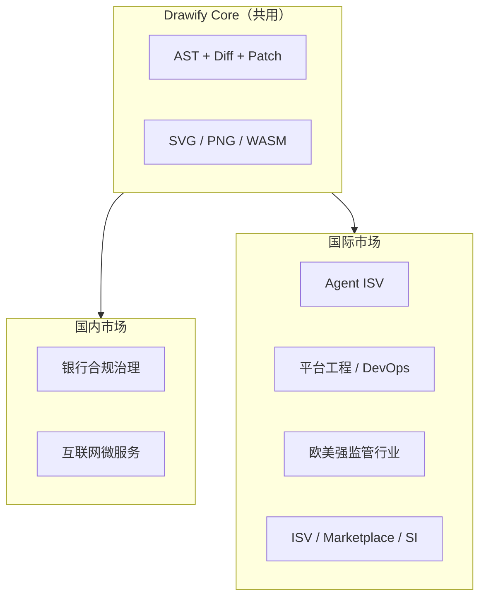

# Drawify 国际市场企业服务机会

> 版本：0.1.0-draft | 状态：需求设计中

本文档总结 Drawify 在**中国以外国际市场**的企业服务销售机会：目标行业、地区侧重、售卖形态、产品包装与进入优先级。与 [规模化架构图战略](./scale-diagram-strategy.md)（国内银行、互联网）互补，共用同一套技术底座。

---

## 1. 国际市场的三条共性需求

Drawify 的国际化企业服务不宜简单复制「中国银行 / 中国互联网公司」打法，应围绕以下全球共性展开：

| 需求 | 说明 | Drawify 对应能力 |
|------|------|-----------------|
| **AI Agent 可靠出图** | LangChain、Copilot、企业 Agent 平台需要稳定 diagram 输出 | 低语法空间 DSL、结构化错误、Agent 自我修正闭环 |
| **架构与真实系统同步** | DevOps、合规、审计要求图不是「幻灯片」 | Connector + Compose、语义 Diff、快照时间线 |
| **敏感环境本地渲染** | 数据驻留、空域隔离、监管限制 | WASM 本地渲染、私有化 Server、PNG 归档 |

**国际一句话定位：**

> Drawify is the architecture evidence layer for the AI era — connect live infrastructure to auditable, diffable diagrams in milliseconds, deployable on-prem for regulated industries worldwide.

国内可强调「金融级架构治理」；国际同一产品可讲 **AI-native diagram infrastructure for regulated and platform teams**。

---

## 2. 全球通用高价值行业

以下行业与银行类似：**监管强、架构复杂、文档是交付物、变更要留痕**。

| 行业 | 典型买家 | Drawify 卖点 | 与国内银行场景相似度 |
|------|----------|-------------|----------------------|
| **保险** | 架构办、合规、IT 治理 | 系统全景图、变更 Diff、PNG 归档 | 很高 |
| **医疗健康** | 医院集团 IT、医疗 SaaS、药企 IT | HIPAA / GxP 架构文档、数据流图、不可篡改快照 | 高 |
| **能源 / 公用事业** | 电网、油气、可再生能源 | OT/IT 融合拓扑、分区安全图、灾备对比 | 高 |
| **电信** | 运营商、设备商服务部 | 5G / 核心网分区、服务依赖、变更门禁 | 中高 |
| **航空航天 / 国防承包商** | 工程、适航、安全办 | 空域隔离部署、本地 WASM、无云外传 | 高（更强调 air-gap） |
| **汽车制造** | 车联网、智能制造 IT | 供应链 + 工厂系统架构、ISO 文档自动化 | 中 |
| **制药 / 生命科学** | 验证（Validation）团队 | 计算机化系统架构图、版本化 Diff 证据 | 很高 |

**共性话术（英文对外）：**

> Architecture as auditable evidence — not slides, but machine-verifiable diagrams tied to live systems.

---

## 3. 按地区的机会侧重

### 3.1 北美（美国、加拿大）

| 机会 | 说明 |
|------|------|
| **平台工程 / SRE** | K8s + Terraform Connector，嵌入 CI、PR 门禁；客户多、付费意愿强 |
| **AI 应用厂商** | OpenAI / Azure AI、Anthropic 生态里的 B2B Agent，需要稳定 diagram API |
| **开发者门户** | Backstage（Spotify 起源，全球采用）插件 — 服务目录 → 架构图 |
| **GRC / 合规科技** | SOC2、SOX 客户要「系统变更可追溯」；卖 OEM / API 比卖终端更合适 |
| **联邦政府 / 国防分包** | FedRAMP、IL4/IL5 环境：私有化 Server + WASM，强调数据不离开边界 |

**建议入口**：DevOps 场景（K8s POC）→ 扩展到 SOC2 审计留档。

---

### 3.2 欧洲（英国、德国、法国、北欧）

| 机会 | 说明 |
|------|------|
| **GDPR / 数据驻留** | 与银行「数据不出域」同一叙事：欧盟数据在 EU 区域 WASM/Server 渲染 |
| **金融（非银行）** | 保险、资管、支付机构基础设施团队 |
| **制造业数字化** | 德国工业 4.0、供应链架构文档 |
| **公共部门** | 数字政府、智慧城市招标，常要求可归档交付物（PNG / PDF） |
| **架构方法论工具链** | 与 Structurizr、C4 Model 社区对接 — Drawify 做「可渲染、可 Diff 的执行层」 |

**建议入口**：GDPR + 变更 Diff 报告，面向合规意识强的中型企业与北欧市场。

---

### 3.3 亚太（除中国大陆外）

| 地区 | 机会 |
|------|------|
| **新加坡 / 香港** | 区域总部、金融监管科技、多云架构治理 — 英语商务 + 亚太合规 |
| **日本 / 韩国** | 大型制造、金融、电信；重视文档规范与长期归档；CJK 渲染能力是加分项 |
| **澳大利亚** | 矿业、能源、政府；远程基础设施、灾备拓扑 |
| **印度** | 全球交付中心（GCC）、系统集成商 — 体量大但价格敏感，适合 API / 按量计费 |

---

### 3.4 中东 / 拉美（选择性进入）

| 地区 | 机会 |
|------|------|
| **海湾国家** | 主权基金、智慧城市、国企数字化 — 大单、重私有化部署 |
| **巴西 / 墨西哥** | 金融、零售集团 IT 现代化 — 可通过本地 SI 合作 |

这类市场更适合**项目制 + 私有化许可**，而非纯 SaaS。

---

## 4. 售卖形态：除终端企业外的国际化路径

直接销售银行 / 大厂周期长。国际市场常见更快路径是 **B2B2B / 平台嵌入**。

### 4.1 LLM / Agent 平台（全球最快验证）

| 客户类型 | 价值 |
|----------|------|
| LangChain、LlamaIndex、CrewAI 类框架 | Diagram tool / render backend |
| 企业 Agent 平台（Glean、Moveworks 类） | 可靠 diagram 生成 + 结构化错误 |
| Copilot 扩展、IDE 插件市场 | 与 Cursor 路线一致，面向全球 ISV |

**卖点**：Agent 生成图表正确率 + 可自动修复，比 Mermaid 少 3–5 轮重试。

---

### 4.2 DevOps / 云生态（全球体量最大）

| 集成点 | 场景 |
|--------|------|
| GitHub / GitLab App | PR 自动附架构 Diff 图 |
| Kubernetes 生态 | 与 Helm / Kustomize 变更联动 |
| Terraform Cloud / Spacelift | IaC plan → 架构变更预览 |
| ServiceNow / Jira Service Management | 变更单附件：before/after PNG + Diff |
| Datadog / Grafana（长期） | 拓扑与监控对象对齐 |

---

### 4.3 文档与协作平台（全球分销）

| 平台 | 模式 |
|------|------|
| Confluence / Notion 企业版 | 宏 / 嵌入：`.dfy` 块实时渲染 |
| Atlassian Marketplace | 全球自助采购，适合 SMB 与中型企业 |
| Wiki.js、BookStack 等开源文档栈 | OEM 渲染引擎 |

PNG 在此特别重要：许多 Wiki 对 SVG 限制多，PNG 嵌入更顺畅。

---

### 4.4 咨询与系统集成商

| 买家 | 用法 |
|------|------|
| Big 4、Accenture、区域 SI | 交付物模板：客户架构评估报告自动生成 |
| 云 MSP | 托管客户的多租户架构视图 + 季度 Diff 报告 |

售卖 **引擎 + Connector 套件**，由 SI 交付项目 — 适合中东、欧洲公共招标。

---

### 4.5 合规 / GRC 厂商（OEM）

| 类型 | 能力打包 |
|------|----------|
| Vanta、Drata（SOC2） | 变更证据链 |
| Archer、ServiceNow GRC | 控制项 ↔ 架构图映射 |
| 行业专用（如医疗 HIPAA 工具） | 数据流图自动更新 |

---

## 5. 国际市场的产品包装

同一套技术，国际话术可与国内略有不同：

| 国内强调 | 国际强调 |
|----------|----------|
| 银行审批、监管报送 | SOC2 / ISO 27001 / HIPAA evidence |
| 数据不出域 | Data residency、GDPR、air-gapped |
| 亚秒级门禁 | Shift-left architecture governance |
| PNG 合规归档 | Immutable audit artifact |
| K8s 拓扑 | Platform engineering live diagram |
| 架构 Compare 快速切换 | Live architecture diff & visual compare |

**建议对外产品线命名（草案）：**

| 产品包 | 内容 |
|--------|------|
| **Drawify Govern** | Diff、快照、PNG 导出、变更门禁 |
| **Drawify Compose** | K8s / Terraform / OpenAPI Connectors |
| **Drawify Embed** | WASM / SDK，供 ISV 嵌入 |
| **Drawify Agent API** | 面向 LLM 应用的 render + validate + fix 闭环 |

---

## 6. 国际市场进入优先级

| 优先级 | 目标市场 | 理由 |
|--------|----------|------|
| **P0** | 全球 AI / Agent ISV（美、欧） | 与产品定位最一致，决策链短，API 即可成交 |
| **P0** | 平台工程 / K8s 团队（美、新加坡、欧） | K8s POC 可直接复用，技术买家理解价值快 |
| **P1** | Backstage / 内部开发者门户 | 全球标配，插件分发路径清晰 |
| **P1** | 保险、医疗、药企（欧美） | 合规溢价高，愿为 Diff + 归档付费 |
| **P2** | 云 Marketplace（AWS / Azure / GCP） | 渠道大，上架与合规成本高 |
| **P2** | 政府 / 国防（美联邦、欧盟） | 单价高，销售周期长 |
| **P3** | 制造、汽车、能源 | 需行业 Connector，定制投入多 |

**不建议早期主攻：**

- 纯创意设计团队（Figma / Lucidchart 主导）
- 手绘白板场景（Excalidraw 定位）
- 已满意 Mermaid、且无 Agent / 合规痛点的团队

---

## 7. 进入国际市场需补充的能力

| 缺口 | 说明 |
|------|------|
| **合规映射白皮书** | SOC2、HIPAA、GDPR 与「快照 + Diff + PNG」的对应关系（英文） |
| **Connector 本地化** | AWS / Azure / GCP Resource Graph、Okta、ServiceNow 等 |
| **部署形态** | EU / US region、私有化 Helm chart、离线 WASM 包 |
| **计费模型** | API 调用量、快照数、Connector 数 — 国际习惯订阅 + usage |
| **英文 POC 案例** | 至少 2 个：K8s Architecture Compare、Terraform zone diagram |
| **竞品对比（国际）** | vs Structurizr、IcePanel、Mermaid Enterprise、Lucidchart API |

语言层面：DSL 与 API 以英文为主即可；项目已具备 CJK 字体支持，对日韩市场是差异化加分。

---

## 8. 与国内战略的协同关系

| 维度 | 国内 | 国际 |
|------|------|------|
| 首要买家 | 银行、大型互联网 | Agent 平台、平台工程团队 |
| 合规框架 | 银保监会、等保、数据本地化 | SOC2、GDPR、HIPAA、FedRAMP |
| 售卖路径 | 直销 + 私有化招标 | API / OEM + Marketplace + SI |
| 首选 POC | K8s 部署拓扑 + 审批 Diff | 同上 + GitHub PR 门禁 + Backstage 插件 |

技术路线共用 [规模化架构图战略](./scale-diagram-strategy.md) 中的 Connector、Compose、Server API 设计，仅 GTM 话术、合规映射与 Connector 优先级按市场调整。

---

## 9. 相关文档

- [企业场景目录](./README.md)
- [规模化架构图战略](./scale-diagram-strategy.md) — 国内银行 / 互联网场景与 K8s POC
- [产品愿景](../product/vision.md)
- [竞品对比](../product/comparison.md)

---

## 修订记录

| 版本 | 日期 | 说明 |
|------|------|------|
| 0.1.0-draft | 2026-06-07 | 初稿：国际市场行业、地区、售卖形态与优先级 |
