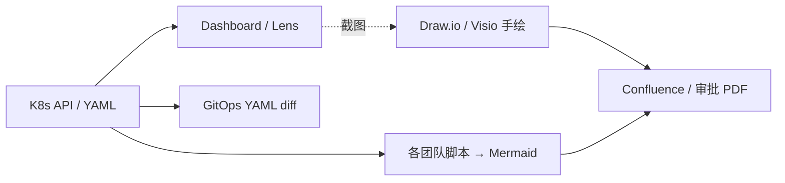
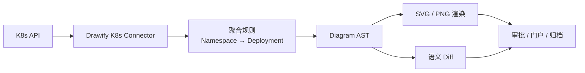

# K8s 架构可视化：行业现状与 Drawify 定位

> 版本：0.1.0-draft | 状态：需求设计中

本文档说明**在 Drawify 之前**，业界如何解决 Kubernetes 拓扑/架构画图问题，常见方案的边界在哪里，以及 Drawify 要填补的空白。适用于客户沟通、内部评审、销售材料引用。

相关文档：

- [规模化架构图战略](./scale-diagram-strategy.md) — Drawify K8s Connector POC 设计
- [企业能力路线图](./capability-roadmap.md) — Core 能力排期

---

## 1. 核心结论（可直接用于对外表述）

> 以前靠 **Dashboard 看现状 + 手绘 / Mermaid 写文档 + Git diff 看配置变更**，三块工具各干各的，没有统一、可 Diff、可归档的架构图管线。  
> **Drawify 不是又一个 K8s UI**，而是把**集群真实状态**变成**可治理的架构证据**。

在 Drawify 出现之前，行业里**并没有**一种统一的「架构描述语言 + 渲染引擎」，专门把 K8s 状态变成可进审批流、可合规留档的图。大家是用**多种工具拼接**来应付不同片段需求。

---

## 2. 行业里实际在用什么

| 类别 | 代表工具 | 解决什么 | 普遍痛点 |
|------|----------|----------|----------|
| **集群控制台** | Kubernetes Dashboard、Lens、k9s | 查看 Pod / Deployment / Service 实时状态 | 偏运维查看，不是架构文档；难导出合规材料 |
| **Service Mesh UI** | Kiali（Istio）、Linkerd Viz | 服务间流量、调用关系 | 绑定特定 Mesh；难做跨集群、跨系统全景 |
| **云厂商控制台** | AWS EKS、Azure AKS、GCP GKE 资源视图 | 云上资源关系 | 多云 / 混合云割裂；难接入内部 CMDB / 审批流 |
| **GitOps / 清单** | Helm、Kustomize、Argo CD UI | 清单与同步状态 | 配置视图 ≠ 业务架构图；审批人看不懂 YAML |
| **手工画图** | Visio、Lucidchart、Draw.io、PPT | 评审、汇报、招投标 | **与真实集群脱节**，更新依赖人工 |
| **文档内嵌图** | Mermaid、PlantUML、Graphviz | README、Confluence、设计文档 | 手写 / AI 生成易错；**难语义 Diff**；难与 API 状态对齐 |
| **服务目录** | Backstage、内部 CMDB | 服务元数据、owner、依赖 | 有目录，**稳定出图与变更对比弱** |
| **APM / 可观测** | Datadog、Grafana、SkyWalking、Jaeger | 运行时依赖、调用链 | 偏监控排障，不是架构治理与合规留档 |
| **IaC 可视化** | Terraform Graph、Rover 等 | 云资源依赖 | 偏 IaC 层，Workload 层往往另做一套 |
| **专用 K8s 探索工具** | kubevious、Goldpinger 等 | 集群结构探索 | 小众，难进入银行审批 / 国际 GRC 流程 |

**共性**：每类工具解决**一个切片**，没有端到端链路：

```
活集群 → 语义架构图 → 变更 Diff → 合规归档（PNG/PDF + 审计字段）
```

---

## 3. 没有 Drawify 时的五种典型做法

### 3.1 平台团队手工维护（最常见）

```text
SRE 看 Dashboard / Lens
    → 截图或凭记忆
    → 在 Draw.io / Visio 里重画
    → 贴进 Confluence / 审批 Word / PPT
    → 下次发布再人工改一版
```

| 维度 | 评价 |
|------|------|
| 适用 | 招投标、架构评审、监管材料 |
| 优点 | 版式可控、非技术人员能看懂 |
| 缺点 | **图与生产不一致**；维护成本高；无机器可读的变更记录 |

银行、大型互联网公司**大量存在**此模式，审计时「图与实际不符」是常见风险。

---

### 3.2 从 YAML / Helm 脚本生成静态图

```text
helm template / kustomize build
    → 自定义脚本解析 Deployment、Service
    → 输出 Mermaid / Graphviz / PlantUML
    → 嵌入 CI 或文档
```

| 维度 | 评价 |
|------|------|
| 适用 | 有工程文化的互联网团队 |
| 优点 | 比纯手绘更接近清单真相 |
| 缺点 | **各团队脚本不统一**；复杂图 Mermaid 易错；几乎无跨版本**语义 Diff**；仍不是「API 实况」 |

---

### 3.3 只做 GitOps diff，不画图

```text
Argo CD / Flux 展示 manifest diff
PR 里看 YAML 行级变更
```

| 维度 | 评价 |
|------|------|
| 适用 | 研发 CI 门禁 |
| 优点 | 配置变更可追溯 |
| 缺点 | **审批人、合规官看不懂 YAML**；架构评审仍需另备一张图 |

---

### 3.4 Backstage + 文档 / 插件

```text
服务目录登记组件、API、依赖
    → 文档页或插件里嵌 Mermaid 架构图
```

| 维度 | 评价 |
|------|------|
| 适用 | 有开发者门户的企业 |
| 优点 | 服务元数据与文档入口统一 |
| 缺点 | 图常仍手写或半自动；**与 K8s Deployment 实况同步弱** |

---

### 3.5 监控 / Mesh「临时看图」

```text
故障时打开 Kiali 看流量
on-call 用 Lens 看 Pod 分布
```

| 维度 | 评价 |
|------|------|
| 适用 | 排障、容量事件 |
| 优点 | 真实、实时 |
| 缺点 | **不适合作为已批准架构基线**；无法直接进合规归档 |

---

## 4. 碎片化路径 vs Drawify 目标路径

### 4.1 传统碎片化路径



问题：**五条支路、五种真相**，没有「架构证据」单一来源。

### 4.2 Drawify 目标路径



详见 [K8s Connector POC](./scale-diagram-strategy.md#9-poc-链路详解k8s-connector--聚合规则--diff-报告)。

---

## 5. 为什么老方案在银行 / 大企业不够用

| 企业需求 | 老方案缺口 | Drawify 对应能力 |
|----------|------------|-----------------|
| 与生产一致 | 手绘图、过期 Confluence | Connector 拉 API 实况 |
| 变更可审计 | YAML 行 diff ≠ 架构 diff | 语义 Diff + markdown 报告 |
| 可读规模 | Dashboard 太细（100 Pod）；手绘太粗 | 聚合规则（Namespace / Deployment） |
| 合规附件 | 截图不规范、无时间戳 | PNG 企业参数 + meta 溯源 |
| 数据不出域 | 部分 SaaS 画图 / 云拓扑 | WASM 本地渲染、私有化 Server |
| AI 自动生成 | Mermaid 幻觉、无结构化修复 | Drawify DSL + 错误码 + Patch |

国际场景同理：SOC2 / GDPR 要的是 **evidence**，不是 **slides**。

---

## 6. Drawify 与现有工具的关系（不是替代谁）

| 工具 | 关系 |
|------|------|
| **Lens / Dashboard** | 互补 — 他们看 Pod 级运维；Drawify 出聚合级架构证据 |
| **Kiali** | 互补 — Mesh 流量；Drawify 可后续接边数据，但主战场是归档与 Diff |
| **Argo CD** | 互补 — 配置同步；Drawify 把变更翻译成架构图 + 语义 Diff |
| **Backstage** | 集成 — Drawify 作渲染引擎 / 架构视图插件 |
| **Mermaid** | 过渡 — 可导出 Mermaid；Drawify 作更可靠的生成与 AST 源 |
| **Draw.io / Lucid** | 部分替代手绘维护 — 自动生成 + 人工 DSL 微调 |

**定位句**：

> Drawify 填补的是 **「架构治理与文档自动化」** 层，位于实时控制台与手绘文档之间的空白地带。

---

## 7. 对比总表（评审 / 标书可用）

| 维度 | Dashboard / Lens | 手绘 / Draw.io | 脚本 → Mermaid | GitOps diff | Drawify 目标 |
|------|------------------|----------------|----------------|-------------|-------------|
| 数据来源 | K8s API 实时 | 人脑 / 旧图 | YAML 清单 | Git 仓库 | K8s API + 聚合规则 |
| 节点粒度 | Pod 级 | 随意 | 取决于脚本 | 无图 | Deployment 级（可下钻） |
| 更新方式 | 实时刷新 | 人工 | CI 触发 | 每次 commit | CI / 定时 / 按需 compose |
| 变更对比 | 无 | 无 | 弱（文本 diff） | YAML 行 diff | **语义 Diff** |
| 合规归档 | 截图 | 导出文件 | 嵌入文档 | 不适用 | **PNG + 报告 + meta** |
| 审批可读性 | 偏运维 | 好 | 中 | 差 | 好（聚合 + 标签） |
| AI 友好 | 不适用 | 不适用 | 中 | 不适用 | **高（结构化错误）** |
| 数据驻留 | 视部署而定 | 本地 | 视 CI 而定 | 内网 | **WASM / 私有化** |

---

## 8. 常见客户问题与回答

### Q1：我们已经有 Lens / Dashboard，为什么还要 Drawify？

**A**：Lens 解决「现在集群里有什么 Pod」；Drawify 解决「这份架构能不能进审批、能不能和上周比 Diff、能不能作为监管附件归档」。用途不同，不冲突。

### Q2：我们 Confluence 里全是 Mermaid，要迁移吗？

**A**：不必一次性迁移。短期可 AST → Mermaid 导出；新图用 Drawify 生成；老图逐步替换。价值在 **自动生成 + Diff**，不在推翻现有 Wiki。

### Q3：和 Backstage 是否重复？

**A**：Backstage 是服务目录与门户；Drawify 是图表语义层与渲染引擎。典型集成：Backstage 展示 Drawify 渲染结果，目录元数据写入 `meta.owner` 等字段。

### Q4：能画 100 个 Pod 吗？

**A**：能生成，但不建议作为默认交付物。企业需要的是 **Namespace → Deployment 聚合图**；Pod 级留给 Dashboard，Pod 异常留给 troubleshooting 视图。见 [scale-diagram-strategy.md §2](./scale-diagram-strategy.md#2-为什么不是画-100-个-pod)。

---

## 9. 演示话术（15 秒 / 2 分钟）

**15 秒版**

> 以前 K8s 架构图靠截图和手绘，和真实集群对不上。Drawify 从 K8s API 自动生成可聚合、可 Diff、可归档的架构图，给审批和合规用，不是替代 Lens。

**2 分钟版**

> 大多数团队用三套东西：Lens 看现状，Argo 看 YAML 变更，Confluence 里贴手绘或 Mermaid 图。三套各说各话，审批时图经常过期。Drawify 用 Connector 拉集群状态，按 Namespace 和 Deployment 聚合，生成 AST，亚秒级渲染 SVG 和 PNG，并用语义 Diff 对比两次发布之间的架构变化，输出能贴进 PR 和审批流的报告。我们不跟 Dashboard 抢 Pod 级运维，我们做的是架构证据层。

---

## 10. 相关文档

- [规模化架构图战略](./scale-diagram-strategy.md)
- [企业能力路线图](./capability-roadmap.md)
- [国际市场机会](./international-market-opportunities.md)
- [产品竞品对比](../product/comparison.md)

---

## 修订记录

| 版本 | 日期 | 说明 |
|------|------|------|
| 0.1.0-draft | 2026-06-07 | 初稿：K8s 可视化行业现状与 Drawify 定位 |
