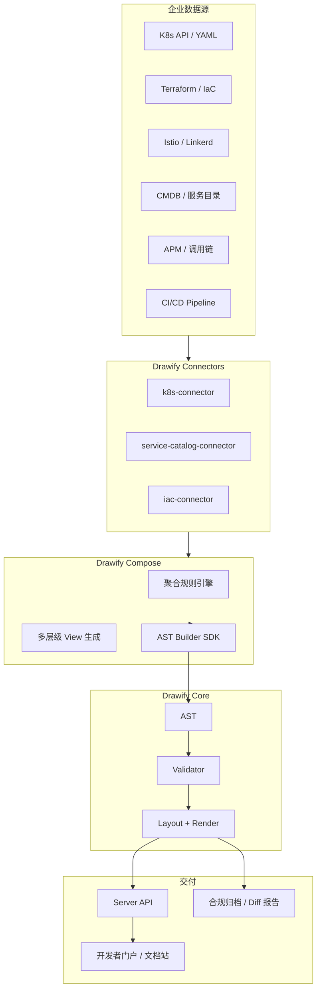
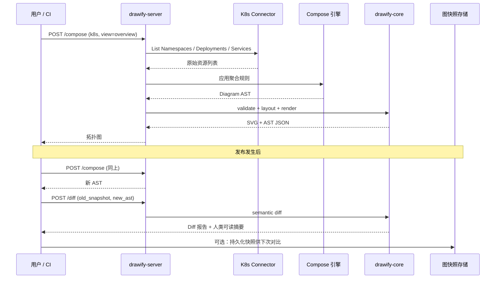

# Drawify 企业规模化架构图战略

> 版本：0.1.0-draft | 状态：需求设计中

本文档定义 Drawify 面向银行、大型互联网公司的规模化出图战略：产品分层、高价值场景、能力清单、落地路径，以及可直接用于 POC / 客户评审的 K8s Connector 链路设计。

---

## 1. 核心结论

**不要把「编程能力」塞进 DSL，而是建设「数据源 → 聚合 → AST → 多层级视图 → 渲染」的企业级管线。**

| 层级 | 职责 | 说明 |
|------|------|------|
| Drawify DSL | 语义表达 | 服务 AI Agent、架构师手写、PR 中小幅修改；保持声明式、低语法空间 |
| Connectors | 数据接入 | 从 K8s、Terraform、CMDB、APM 等拉取结构化数据 |
| Compose | 聚合与视图 | 折叠 Pod、分层级、过滤、命名；批量生成 AST |
| Core | 渲染引擎 | 校验、布局、渲染；消费已展开的 AST，不理解 K8s |

企业真正需要的不是「在 DSL 里写 `for` 循环画 100 个 Pod」，而是：

1. 从真实系统状态**自动出图**
2. **多层级视图**（全景 → 域 → 部署细节，可下钻）
3. **变更可追踪**（Diff 报告、PR 自动更新）
4. **可嵌入现有平台**（开发者门户、文档站、合规系统）

---

## 2. 为什么不是「画 100 个 Pod」

从 K8s YAML 生成 100 个 Pod 节点技术上可行，但不是企业想要的交付物。

| 问题 | 说明 |
|------|------|
| 不可读 | 100 节点 + 依赖边，单张 SVG 无法用于评审、合规、on-call |
| 不可维护 | 集群状态持续变化，手改 DSL 或展开循环都追不上 |
| 不合规 | 银行要的是系统级 / 域级 / 数据流级留痕，不是 Pod 清单图 |
| 已有工具 | K8s Dashboard、Lens、Service Mesh UI 已覆盖 Pod 级；缺的是跨系统、可归档、可 Diff 的架构文档 |

**正确做法**：默认聚合（Namespace → Deployment），Pod 仅在故障排查视图下按需展开，且折叠为副本数展示。

---

## 3. 产品分层架构



**设计原则：**

- DSL 继续声明式，不引入图灵完备语法
- 规模化在 Connector + Compose 层完成
- Core 已有 AST、Diff、Patch 能力，是企业增量同步的基础（见 `specs/ast-spec.md`）

---

## 4. 高价值企业场景（按落地优先级）

### P0：服务架构全景图

**受众**：互联网 + 银行通用

| 项 | 内容 |
|----|------|
| 输入 | 服务目录、OpenAPI、CMDB、`package.json` 依赖 |
| 输出 | `diagram architecture`，按 `group` 分域 |
| 规模 | 聚合后 20~50 个逻辑服务，非数百微服务裸列 |
| 卖点 | Backstage 有目录，但难以稳定产出可归档、可 Diff 的架构图 |

### P0：K8s 部署拓扑（聚合版）

**受众**：互联网公司 SRE / 平台团队

| 层级 | 节点类型 | 示例 |
|------|----------|------|
| L1 | Namespace / 业务域 | `ns:payment-prod` |
| L2 | Deployment / StatefulSet | `pay-core`（replicas: 12） |
| L3（可选下钻） | Pod 实例 | 仅故障排查视图；默认折叠为副本数 |

**价值**：SRE 看部署结构；研发看版本；合规看环境隔离——同一份 AST，多种 meta 过滤视图。

### P1：IaC → 架构图

**受众**：银行、金融云

| 项 | 内容 |
|----|------|
| 输入 | Terraform、云厂商 Resource Graph |
| 输出 | 网络分区图、安全域图、灾备拓扑 |
| 典型需求 | 核心区 / 互联网区 / DMZ；主备机房；数据流向与跨区访问 |

Drawify 的 `group` + `meta.zone` + `meta.classification` 适配合规留档场景。

### P1：变更感知架构（Diff）

**受众**：互联网 PR 门禁、银行变更审批

```
发布 / Terraform apply
  → Connector 拉取新状态
  → AST Builder 生成新 Diagram
  → diff(旧, 新)
  → PR / 合规系统收到结构化变更报告
```

**差异化**：`drawify diff` / `drawify patch` 是相比 Mermaid、PlantUML 最难被替代的企业能力。

### P2：调用链 / 依赖热力图

**输入**：SkyWalking、Jaeger、内部 APM  
**输出**：时序图或架构图，边带 `meta.qps`、`meta.p99`  
**用途**：故障复盘、容量规划、架构评审（非日常全量）

### P2：CI/CD 流水线图

**输入**：Jenkins、GitLab CI、内部发布系统  
**输出**：`diagram flowchart`，每 stage 一个 entity  
**用途**：发布单附件、审计留档

---

## 5. 企业能力清单

### A. AST Builder SDK（必做）

替代 DSL 内循环。Connector 直接构建 AST，不经过文本 DSL。

- 支持批量 `add_entity` / `add_relation` / `add_group`
- 输出走现有 validate → layout → render 管线
- 语言绑定：Rust 原生；后续可提供 Python / TypeScript 封装

### B. Compose 聚合规则（声明式配置）

用 YAML/JSON 规则文件描述聚合逻辑，**不是** Drawify 语法扩展。

- `aggregate`：按字段分组、折叠子资源
- `views`：overview / troubleshooting 等多视图
- `filter`：按 status、label、namespace 筛选

详见本文 §9.3 聚合规则示例。

### C. 多视图 API

同一数据源，不同 `view` 参数生成不同 Diagram AST。

```http
POST /compose
{
  "source": { "type": "k8s", "namespace": "payment-prod" },
  "view": "overview",
  "format": "svg"
}
```

### D. 源绑定与可追溯 meta

每个 entity 携带源指纹，支撑 Diff 与审计：

```drawify
entity pay_core "pay-core" {
    type: service
    meta.source: "k8s"
    meta.source_id: "deployment/payment-prod/pay-core"
    meta.source_hash: "abc123"
    meta.generated_at: "2026-06-07T10:00:00Z"
}
```

### E. 大规模渲染策略（Core 增强）

| 能力 | 说明 |
|------|------|
| 自动聚类 | 同 group 内节点过多时合并为「+N more」 |
| LOD / 分层渲染 | overview 只画 group 边框与关键边 |
| 布局选择 | 架构图用力导向 + 聚类；DAG 用 Sugiyama |
| 交互下钻 | JSON/SVG 带 `meta.drill_down_view`，由前端展开 |
| 性能预算 | `max_nodes`、`timeout` 等企业 API 参数 |

### F. Server API（企业集成阻塞项）

当前 `drawify-server` 为占位实现。企业版至少需要：

| 端点 | 说明 |
|------|------|
| `POST /render` | source 或 ast → svg / json / png |
| `POST /validate` | 结构化错误（E001–E005） |
| `POST /diff` | 两份 diagram → 语义 Diff |
| `POST /patch` | Patch 应用 |
| `POST /compose` | connector + rules → ast → render |
| `GET /health` | 健康检查 |

---

## 6. 银行 vs 互联网：场景侧重

| 维度 | 银行 | 大型互联网 |
|------|------|------------|
| 核心诉求 | 合规留档、安全域、数据流向、变更审批 | 快速迭代、服务治理、故障复盘、发布可视化 |
| 数据源 | IaC、CMDB、安全扫描、数据目录 | K8s、Service Mesh、APM、CI/CD |
| 图的类型 | 安全域架构图、系统全景、数据 lineage | 微服务依赖、部署拓扑、调用链 |
| 节点规模 | 逻辑系统 50~200（聚合后） | 服务 100~500，Pod 需强聚合 |
| 采购决策点 | 对接 CMDB、审计报告 | 接 K8s/发布系统、进 PR 门禁 |
| Drawify 卖点 | AST Diff + 结构化 meta + 可归档输出 | 自动化 + Patch 增量 + API 集成 |

**共同刚需**：不是「画得多」，而是**画得对、跟得上变更、能进流程**。

---

## 7. 不建议做 vs 建议做

| 不建议 | 建议 |
|--------|------|
| DSL 内 `for` / 宏 / 模板语言 | Connector + AST Builder |
| 单图展示 100 个 Pod | 聚合 + 多视图下钻 |
| 替代 K8s Dashboard | 做「架构文档自动化」层 |
| 先追求交互式编辑器 | 先 Server API + 2~3 个 Connector |
| 通用「任意数据源」框架先行 | 先做 K8s + 服务目录 + Terraform |

---

## 8. 落地路径（MVP → 企业扩展）

### Phase 1（POC，约 3 个月）

1. 实现 `drawify-server`：`/render`、`/diff`、`/patch`
2. 发布 `drawify-compose` 库：AST Builder + 聚合规则解析
3. 实现 **K8s Connector**（Namespace → Deployment，折叠 Pod）
4. 演示：**集群变更 → 自动 Diff 报告 → 更新架构文档**

### Phase 2（企业扩展）

5. Terraform Connector（安全域 / 网络分区图）
6. 服务目录 Connector（依赖图 + owner）
7. 开发者门户插件（Backstage 类）嵌入 Drawify 预览

### Phase 3（银行专项）

8. 数据 lineage 视图
9. 合规导出（PDF + 变更历史 + meta 审计字段）
10. 与内部 CMDB 双向绑定

---

## 9. POC 链路详解：K8s Connector + 聚合规则 + Diff 报告

本节提供可直接用于客户演示或内部评审的端到端 POC 设计，包括接口、数据流、规则示例与输出样例。

### 9.1 POC 目标与成功标准

| 项 | 定义 |
|----|------|
| 目标 | 从 K8s 集群自动生成部署拓扑图；集群变更后产出语义级 Diff 报告 |
| 受众 | 平台团队、SRE、架构治理团队 |
| 演示时长 | 15 分钟（接入 → 出图 → 模拟发布 → Diff） |
| 成功标准 | overview 视图节点数 ≤ 50；Diff 能指出新增/删除/变更的 Deployment；报告可嵌入 PR 评论 |

### 9.2 端到端数据流



### 9.3 聚合规则规格（Compose Rules）

规则文件与 Drawify 源码分离，建议路径：`compose-rules/k8s-overview.yaml`。

```yaml
# compose-rules/k8s-overview.yaml
apiVersion: drawify.compose/v1
kind: ComposeRule
metadata:
  name: k8s-overview
  description: K8s 部署拓扑概览视图

source:
  type: k8s
  # 运行时由 API 请求覆盖
  namespace: "*"
  include_kinds:
    - Namespace
    - Deployment
    - StatefulSet
    - Service

aggregate:
  # L1：每个 Namespace 对应一个 group
  - level: namespace
    kind: Namespace
    group:
      id: "ns_{{ .metadata.name }}"
      label: "{{ .metadata.name }}"
      meta:
        source: k8s
        source_id: "namespace/{{ .metadata.name }}"

  # L2：Deployment / StatefulSet 作为 entity，折叠 Pod
  - level: workload
    kinds: [Deployment, StatefulSet]
    parent_group: "ns_{{ .metadata.namespace }}"
    entity:
      id: "{{ .kind | lower }}_{{ .metadata.namespace }}_{{ .metadata.name }}"
      label: "{{ .metadata.name }}"
      type: service
      meta:
        source: k8s
        source_id: "{{ .kind | lower }}/{{ .metadata.namespace }}/{{ .metadata.name }}"
        k8s_kind: "{{ .kind }}"
        replicas: "{{ .spec.replicas | default 1 }}"
        image: "{{ .spec.template.spec.containers[0].image }}"
        labels: "{{ .metadata.labels | toJson }}"

  # Service → 关系边（仅 ClusterIP / LoadBalancer）
  - level: service_edge
    kind: Service
    relation:
      from: "deployment_{{ .metadata.namespace }}_{{ .spec.selector.app }}"
      to: "service_{{ .metadata.namespace }}_{{ .metadata.name }}"
      arrow: active
      label: "exposes"
    # 注：selector 匹配逻辑在 Connector 实现中处理

views:
  overview:
    description: 生产全景，隐藏 Pod
    hide_kinds: [Pod, ReplicaSet]
    max_entities: 50
    collapse_empty_groups: true

  troubleshooting:
    description: 故障排查，展示异常 Pod
    show_kinds: [Pod]
    filter: "status.phase != Running"
    max_entities: 200

output:
  diagram_type: architecture
  default_attributes:
    layout-algo: force-directed
    title: "K8s 部署拓扑"
```

**规则引擎语义（草案）：**

| 字段 | 说明 |
|------|------|
| `aggregate[].level` | 聚合层级名称，仅用于文档与调试 |
| `parent_group` | 子 entity 归属的 group ID 模板 |
| `views.*.hide_kinds` | 从 AST 构建中排除的资源类型 |
| `views.*.max_entities` | 超出时触发告警或自动聚类（Phase 2） |
| 模板语法 | 借鉴 Go template；实现阶段可换为更安全的内置模板 |

### 9.4 Server API 设计（POC 范围）

#### POST /compose

从数据源生成 Diagram 并可选渲染。

**请求：**

```json
{
  "source": {
    "type": "k8s",
    "kubeconfig": "/path/to/kubeconfig",
    "context": "prod-cluster",
    "namespace": "payment-prod",
    "label_selector": "app.kubernetes.io/part-of=payment"
  },
  "compose_rule": "k8s-overview",
  "view": "overview",
  "format": "svg",
  "options": {
    "max_entities": 50,
    "include_meta": true
  }
}
```

**响应（成功）：**

```json
{
  "success": true,
  "diagram": {
    "diagram_type": "architecture",
    "attributes": [
      { "key": "title", "value": "K8s 部署拓扑 — payment-prod" },
      { "key": "layout-algo", "value": "force-directed" }
    ],
    "entities": [
      {
        "id": "deployment_payment_prod_pay_core",
        "label": "pay-core",
        "attributes": {
          "standard": { "type": { "$enum": "service" } },
          "meta": {
            "source": "k8s",
            "source_id": "deployment/payment-prod/pay-core",
            "k8s_kind": "Deployment",
            "replicas": 12,
            "image": "registry.example.com/pay-core:v2.3.1"
          }
        },
        "group_id": "ns_payment_prod"
      }
    ],
    "groups": [
      {
        "id": "ns_payment_prod",
        "label": "payment-prod",
        "depth": 1,
        "entity_ids": ["deployment_payment_prod_pay_core", "deployment_payment_prod_pay_gateway"]
      }
    ],
    "relations": [],
    "source_info": {
      "file": null,
      "line_count": 0,
      "generated_at": "2026-06-07T10:00:00Z",
      "compose_rule": "k8s-overview",
      "view": "overview"
    }
  },
  "output": "<svg xmlns=\"http://www.w3.org/2000/svg\" ...>",
  "stats": {
    "entity_count": 8,
    "group_count": 1,
    "relation_count": 4,
    "source_resource_count": 847,
    "aggregated_from": 847
  }
}
```

**响应（失败）：**

```json
{
  "success": false,
  "errors": [
    {
      "code": "C001",
      "severity": "error",
      "message": "无法连接 K8s API：context 'prod-cluster' 不存在",
      "context": { "connector": "k8s", "context": "prod-cluster" },
      "suggestion": "检查 kubeconfig 与 context 名称"
    }
  ]
}
```

#### POST /diff

对比两份 Diagram（或快照 ID），输出语义级变更。

**请求：**

```json
{
  "base": {
    "snapshot_id": "payment-prod-2026-06-06T18:00:00Z"
  },
  "target": {
    "source": {
      "type": "k8s",
      "context": "prod-cluster",
      "namespace": "payment-prod"
    },
    "compose_rule": "k8s-overview",
    "view": "overview"
  },
  "options": {
    "match_by": "meta.source_id",
    "include_unchanged": false
  }
}
```

`match_by: meta.source_id` 确保跨次生成时按 K8s 资源身份对齐，而非按 entity 列表下标。

**响应：**

```json
{
  "success": true,
  "summary": {
    "added_entities": 1,
    "removed_entities": 0,
    "modified_entities": 2,
    "added_relations": 1,
    "removed_relations": 0,
    "modified_relations": 0
  },
  "changes": [
    {
      "type": "add",
      "path": "/entities/deployment_payment_prod_pay_risk",
      "value": {
        "id": "deployment_payment_prod_pay_risk",
        "label": "pay-risk",
        "meta": { "source_id": "deployment/payment-prod/pay-risk", "replicas": 3 }
      },
      "description": "新增 Deployment `pay-risk`（3 副本）"
    },
    {
      "type": "modify",
      "path": "/entities/deployment_payment_prod_pay_core/attributes/meta/image",
      "old_value": "registry.example.com/pay-core:v2.3.0",
      "new_value": "registry.example.com/pay-core:v2.3.1",
      "description": "pay-core 镜像版本 v2.3.0 → v2.3.1"
    },
    {
      "type": "modify",
      "path": "/entities/deployment_payment_prod_pay_core/attributes/meta/replicas",
      "old_value": 8,
      "new_value": 12,
      "description": "pay-core 副本数 8 → 12"
    },
    {
      "type": "add",
      "path": "/relations/4",
      "value": {
        "from": "deployment_payment_prod_pay_gateway",
        "to": "deployment_payment_prod_pay_risk",
        "arrow": "active",
        "label": "风控调用"
      },
      "description": "新增调用关系 pay-gateway → pay-risk"
    }
  ],
  "human_summary": "本次变更：新增 1 个 Deployment（pay-risk），pay-core 升级镜像并扩容 4 副本，新增 1 条服务调用边。",
  "markdown_report": "## 架构变更报告\n\n**集群**: prod-cluster  \n**命名空间**: payment-prod  \n**对比基准**: 2026-06-06 18:00 UTC\n\n### 变更摘要\n\n- ➕ 新增 Deployment `pay-risk`（3 副本）\n- 🔄 `pay-core` 镜像 v2.3.0 → v2.3.1\n- 🔄 `pay-core` 副本 8 → 12\n- ➕ 新增关系 pay-gateway → pay-risk\n"
}
```

#### POST /snapshots（可选，POC+）

持久化 Diagram 快照，供 CI 定时对比。

```json
{
  "snapshot_id": "payment-prod-2026-06-07T10:00:00Z",
  "diagram": { "...": "完整 AST" },
  "metadata": {
    "cluster": "prod-cluster",
    "namespace": "payment-prod",
    "trigger": "cron",
    "git_commit": "abc1234"
  }
}
```

### 9.5 生成的 Drawify 文本示例（可选导出）

Compose 产出以 AST 为主；以下为由 AST 序列化的 `.dfy` 示例，供文档归档或人工审阅：

```drawify
diagram architecture {
    layout-algo: force-directed
    title: "K8s 部署拓扑 — payment-prod"

    group ns_payment_prod "payment-prod" {
        entity deployment_payment_prod_pay_gateway "pay-gateway" {
            type: service
            meta.source: "k8s"
            meta.source_id: "deployment/payment-prod/pay-gateway"
            meta.k8s_kind: "Deployment"
            meta.replicas: 4
            meta.image: "registry.example.com/pay-gateway:v1.8.0"
        }

        entity deployment_payment_prod_pay_core "pay-core" {
            type: service
            meta.source: "k8s"
            meta.source_id: "deployment/payment-prod/pay-core"
            meta.k8s_kind: "Deployment"
            meta.replicas: 12
            meta.image: "registry.example.com/pay-core:v2.3.1"
        }

        entity deployment_payment_prod_pay_risk "pay-risk" {
            type: service
            meta.source: "k8s"
            meta.source_id: "deployment/payment-prod/pay-risk"
            meta.k8s_kind: "Deployment"
            meta.replicas: 3
            meta.image: "registry.example.com/pay-risk:v1.0.0"
        }
    }

    deployment_payment_prod_pay_gateway -> deployment_payment_prod_pay_core "业务调用"
    deployment_payment_prod_pay_gateway -> deployment_payment_prod_pay_risk "风控调用"
}
```

注意：关系边在 POC 阶段可来自 Service selector 推断，或 Phase 2 接入 Service Mesh 流量数据。

### 9.6 Diff 报告交付形态

| 交付渠道 | 格式 | 用途 |
|----------|------|------|
| CI / PR 评论 | `markdown_report` | 开发人员快速浏览 |
| 架构治理平台 | `changes` JSON | 程序化审批流 |
| 合规归档 | SVG before/after + Diff JSON | 银行变更留痕 |
| Slack / 飞书 | `human_summary` 一行摘要 | on-call 通知 |

**PR 评论示例（可直接粘贴）：**

```markdown
### 🏗️ Drawify 架构变更检测

**命名空间**: `payment-prod` | **基准**: 2026-06-06 18:00 UTC

| 类型 | 数量 |
|------|------|
| 新增实体 | 1 |
| 修改实体 | 2 |
| 新增关系 | 1 |

**详情**
- ➕ 新增 Deployment `pay-risk`（3 副本）
- 🔄 `pay-core` 镜像 v2.3.0 → v2.3.1，副本 8 → 12
- ➕ 新增调用 pay-gateway → pay-risk

[查看拓扑图 diff](https://docs.example.com/arch/payment-prod/latest.svg)
```

### 9.7 POC 演示脚本（15 分钟）

| 步骤 | 操作 | 预期结果 |
|------|------|----------|
| 1 | 配置 kubeconfig，调用 `POST /compose` view=overview | 返回 payment-prod 拓扑 SVG，实体数 < 20 |
| 2 | 保存快照 `POST /snapshots` | 获得 snapshot_id |
| 3 | 在测试集群部署新 Deployment `pay-risk`，升级 `pay-core` 镜像 | K8s 状态变更 |
| 4 | 再次 `POST /compose` | 新 AST |
| 5 | `POST /diff` base=snapshot_id | 输出 §9.4 格式的 Diff 报告 |
| 6 | 将 `markdown_report` 贴入模拟 PR | 评审可见结构化变更 |

### 9.8 POC 实现范围与边界

**In Scope（Phase 1 POC）**

- 只读 K8s API（Namespace、Deployment、StatefulSet、Service）
- overview 视图，不展示 Pod
- AST 生成 + SVG 渲染
- 基于 `meta.source_id` 的语义 Diff
- Markdown 人类可读报告

**Out of Scope（后续迭代）**

- 多集群联邦视图
- Service Mesh 流量边
- 写回 K8s（GitOps 由客户现有工具负责）
- 实时 watch 推送（先用 CI 定时触发）
- 交互式下钻 UI（由客户门户集成）

### 9.9 错误码扩展（Connector 层）

在现有 E001–E005 基础上，Compose / Connector 层建议新增：

| 错误码 | 类型 | 说明 |
|--------|------|------|
| C001 | ConnectorAuth | 无法连接数据源（K8s kubeconfig、RBAC） |
| C002 | ConnectorTimeout | 数据源 API 超时 |
| C003 | ComposeRuleInvalid | 聚合规则语法或语义错误 |
| C004 | ViewLimitExceeded | 实体数超过 view.max_entities |
| C005 | SourceResourceSkipped | 部分资源因缺少字段被跳过（warning） |

---

## 10. 对外定位（一句话）

> **Drawify 是企业架构的「语义层 + 渲染引擎」：从 K8s、IaC、服务目录自动生成可 Diff、可归档、可下钻的架构图；DSL 负责表达与微调，规模化由 Connector 与 Compose 完成。**

---

## 11. 相关文档

- [企业场景目录](./README.md)
- [AST 与 Patch 规范](../specs/ast-spec.md)
- [产品愿景](../product/vision.md)
- [使用案例](../product/use-cases.md)
- [系统架构](../architecture/overview.md)

---

## 修订记录

| 版本 | 日期 | 说明 |
|------|------|------|
| 0.1.0-draft | 2026-06-07 | 初稿：战略总览 + K8s POC 链路 |
