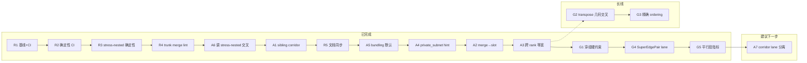

# 布局与边路由算法改进方案

> 基于 `crates/plotgram-core/src/layout` 源码分析与 `showcase/` 下 SVG 渲染效果的实测观察（2026-07）。
> 目标：在现有 Sugiyama-v2 + 正交路由体系基本成型的前提下，找出影响视觉质量的关键短板，给出可执行的改进策略。

---

## 一、现状分析

### 1.1 当前算法体系概览

**布局层（LayoutStrategy）** 以 Sugiyama-v2 四阶段流水线为核心生产路径：

| 阶段 | 实现 | 位置 |
|------|------|------|
| 去环 | Greedy FAS（`greedy_cycle_reversal`） | `layout/node/sugiyama_v2/graph.rs`、`node/common/acyclic.rs` |
| Rank 分配 | Network-Simplex 风格（可行紧树 + cut value pivot，最多 64 轮） | `layout/node/sugiyama_v2/rank.rs` |
| 交叉最小化 | 加权中位数 + transpose，固定 8 轮扫描 | `layout/node/sugiyama_v2/order.rs` |
| 坐标分配 | Brandes-Köpf 四趟 + 真实节点重叠消除 | `layout/node/sugiyama_v2/coordinate.rs` |

其他图类型各有独立策略：flowchart 有 group 时走分治堆叠（`flowchart/group_divide.rs`）、architecture 走两阶段布局（`architecture_v2/two_phase.rs`）、state 默认 circular、mindmap 径向、er 走 Sugiyama-v2 + straight 路由。

**路由层（EdgeRoutingStrategy）** 以 orthogonal 为主路径：端口对选择 → slot 磁吸 → 候选折线枚举（L 形 / channel detour / z-fold / staircase）→ 启发式打分 → 多轮冲突消解（reroute ≤3 轮）→ lane 分离 → 标签避障。路由后有 refine（默认 1 轮推节点）、组框排斥、可选 bundling、像素 snap 等后处理（`layout/pipeline.rs` L187-263）。

整体架构是 Graphviz dot 路线的工程近似，管线分层清晰、职责边界明确，**框架本身不需要推翻重来**，问题集中在若干局部算法的质量上限与策略选择上。

### 1.2 showcase 实测观察到的问题

对 flowchart / architecture / er / state 四类共 12 个代表性 SVG 做了渲染检查，问题按严重程度归类如下。

#### 问题 A：标签遮挡与错位（严重，普遍）

- `state/c.payment-flow.svg`：**边标签"退款失败，保持成功"直接遮住"支付成功"节点**，节点文字不可读；"次数未超限"与"用户确认支付"两个标签相互堆叠。
- `state/c.layout-stress-transitions.svg`：标签"允许重试 (大回环)"压在边线上；自环标签"等待外部事件唤醒 (自环)"漂离所属节点较远，归属关系不直观。
- `architecture/c.hybrid-cloud-dr-topology.svg`：标签"async replication"覆盖在"Unified …"节点上，把节点文字截断；"sync"、"image pull"等标签漂浮在空白处，看不出属于哪条边。

根因定位：`edge/common/label_avoidance.rs` 的迭代 AABB 推开存在**震荡检测后直接放弃**的逻辑（L79-80 附近），且标签避障只在路由末尾做一次，被推开后不会重新评估"标签-边归属可读性"；circular 路由的 `RadialPlacer` 只做径向推开，不检测标签与**其他节点**的碰撞。

#### 问题 B：跨组（group）边路由质量差（严重，architecture 类高发）

- `architecture/c.k8s-multi-cluster-federation.svg`、`c.cloud-native.svg`、`c.hybrid-cloud-dr-topology.svg`：跨组边沿组框外缘长距离平行走线，多条边叠出"假边框"效果；部分边穿过无关组内部；边绕行路径极长（绕整幅图外围一圈）。

根因定位：

1. 正交打分中穿组只是**软惩罚**（`edge_routing_orthogonal/scoring.rs` `GROUP_TRANSIT_PENALTY`），组铺满时允许穿越；
2. 候选枚举（L 形/z-fold/staircase）是局部启发式，没有"组间走廊"的概念，长跨组边只能靠 channel detour 多档 margin 一档一档往外推，最后都挤到最外圈；
3. `two_phase.rs` 宏观 block 拼接是简化策略（L635 注释"直接按 block 顺序拼接"），组间没有为跨组边预留通道空间。

#### 问题 C：state 图默认 circular 布局不适配（严重，state 类）

- `state/c.payment-flow.svg`：该图本质是"主干 DAG + 少量回环"，circular 布局把节点排在圆周上导致边端点集中在节点一侧、边扇形缠绕交叉、小圆节点（已过期/已退款）文字溢出。
- `state/c.layout-stress-transitions.svg`:多重回环下交叉密集,主流程方向感丢失。

根因定位：`profile/mod.rs` 将 state 默认绑定 circular，但大多数实际状态机是**低回环率的准 DAG**，Sugiyama 去环后分层布局效果会明显更好。circular 只适合强连通、环状结构占主导的图。

#### 问题 D：ER straight 路由在稠密图下大量交叉（中等，er 类）

- `er/c.layout-stress-dense.svg`：9 个实体、20+ 关系全部直线连接，交叉数爆炸，菱形关系标签散落在交叉区，可读性极低。
- `er/c.ecommerce-schema.svg`：中等密度下尚可，但已出现边贴节点、标签靠近交叉点的现象。

根因定位：ER 走 Sugiyama-v2 分层，但**交叉最小化的目标函数只统计相邻层间边交叉**，straight 直连边（跨层、层内）的实际几何交叉不在优化范围内；straight 路由本身零避障。

#### 问题 E：布局松散、长边绕行、主干不对齐（中等，flowchart 类）

- `flowchart/c.layout-stress-dag.svg`："结束"节点被放在中部而非底部汇聚位置；回环边全部走右侧最外圈单一通道；整图稀疏、纵横比失衡。
- `flowchart/c.aml-case-investigation.svg`：主链节点（人工调查→冻结账户→升级合规经理）横向漂移，主干不成直线；整图窄长，右侧大片空白只放一条长边。

根因定位：

1. BK 坐标分配后没有**全局紧凑化（compaction）**阶段，dummy 链拉开的空间不回收；
2. 反转的回环边在路由时全部选择同一外侧通道（layer_order 低 rank 优先 + slot 磁吸使它们同侧汇聚），没有左右均衡分配;
3. rank 分配对 sink 节点（"结束"）没有"拉到最大层"的偏好——network simplex 求的是最小总边长，长回边会把 sink 提前。

#### 问题 F：其余观察

- 自环在非 circular 路由下无专门处理（`edge_geometry.rs` L46-48 中心重合时法线取默认值），orthogonal 下自环可能产生退化折线。
- refine 默认只跑 1 轮（`refine/mod.rs` `max_passes: 1`），路由退化边（`degraded_count`）残留后无二次补救。
- lint 已能检测边交叉/穿障（`lint/mod.rs` L303-327）但只报 warning，没有形成"渲染 → 量化打分 → 回归对比"的闭环。

### 1.3 问题-模块映射汇总

| 问题 | 影响图类型 | 严重度 | 核心模块 |
|------|-----------|--------|----------|
| A 标签遮挡/错位 | 全部 | 高 | `label_avoidance.rs`、`label_placement.rs` |
| B 跨组边路由 | architecture、flowchart(带 group) | 高 | `edge_routing_orthogonal/`、`two_phase.rs`、`group_frame/` |
| C state 默认 circular | state | 高 | `profile/mod.rs`、`circular/` |
| D ER 直线交叉 | er | 中 | `edge_routing.rs`、`sugiyama_v2/order.rs` |
| E 松散/长边/主干不齐 | flowchart | 中 | `coordinate.rs`、`rank.rs`、`layer_order.rs` |
| F 自环/refine/评估 | 全部 | 中低 | `edge_geometry.rs`、`refine/`、`lint/` |

---

## 二、改进策略

按「收益/成本比」排出 P0 → P2 三档。每项给出方案、涉及文件、实施要点与验收方式。

### P0-1 标签放置全面重做：从"事后推开"改为"候选位打分"

**对应问题 A。这是所有 showcase 中最刺眼的缺陷，且改动范围可控。**

方案：把标签放置从"先放锚点、碰撞了再迭代推开"改为**候选位枚举 + 打分选优**：

1. 对每条边生成候选锚点集合：沿路径 t ∈ {0.3, 0.5, 0.7} × 法线两侧偏移 {1x, 2x} 共约 12 个候选框。
2. 打分项：与节点 AABB 相交（硬否决）、与其他标签相交（高惩罚）、与非本边线段相交（中惩罚）、离本边距离（近者优）、离路径中点距离（近者优）。
3. 全部候选被否决时才回退到现有迭代推开，且推开后仍与节点相交则**加白色底衬 + 引导短线（leader line）**连回所属边，保证归属可读。
4. circular 的 `RadialPlacer` 复用同一候选打分框架，把"与其他节点碰撞"纳入硬否决（当前缺失，直接导致 payment-flow 的节点遮挡）。

涉及文件：

- `layout/edge/common/label_avoidance.rs`（主体重写，保留对外签名 `resolve_label_overlaps`）
- `layout/edge/label_placement.rs`（RadialPlacer 接入）
- `layout/edge/edge_bundling/label_placement.rs`（SegmentAware 流水线复用打分器）
- 渲染层 leader line 已在 `render/paint/svg_utils.rs` L547+ 绘制（`label.leader_to` 字段驱动）

实施要点：候选打分本质是每边 O(候选数 × 障碍数)，用现有 `SegmentGrid`/AABB 索引即可，不引入新依赖；标签间冲突按边序贪心（先路由的边先占位），避免全局优化的复杂度。

验收：`state/c.payment-flow`、`architecture/c.hybrid-cloud-dr-topology` 重渲染后无"标签遮节点"实例；lint 增加 `label-node-overlap` / `label-label-overlap` 检查项并在全 showcase 上清零。

### P0-2 跨组边引入"组间走廊（corridor）"路由

**对应问题 B。architecture 是产品重点场景，当前是效果最差的一类。**

方案：分两步，先布局侧预留空间，再路由侧结构化走线。

1. **布局侧**：在 `two_phase.rs` Phase B 宏观排布时，统计相邻 block 之间的跨组边数量 k，把 block 间距从固定 gap 改为 `gap = base + k * lane_width`（与 `engine.rs` 已有的 `compute_per_layer_gaps` 思路一致，只是搬到组级）。
2. **路由侧**：为每对相邻组框之间建立显式 **corridor 对象**（一个矩形通道 + 车道计数器）。跨组边路由改为三段式：`源节点 → 源组边界端口 → corridor 车道 → 目标组边界端口 → 目标节点`。corridor 内按车道索引分配平行偏移，天然避免"多条边叠成假边框"。
3. 组边界端口沿组框边均匀分配（复用现有 slot 的 Compact/Concentrate 策略，把"节点边界"换成"组框边界"）。
4. 把 `GROUP_TRANSIT_PENALTY` 从软惩罚提为**默认硬约束**（仅当无 corridor 可达时降级为软惩罚），消除"边穿无关组"的情况。

涉及文件：

- `layout/node/architecture_v2/two_phase.rs`（组间 gap 按跨组边负载放大）
- `layout/edge/edge_routing_orthogonal/mod.rs`（跨组边识别 + 三段式路由分支）
- 新文件 `layout/edge/edge_routing_orthogonal/corridor.rs`（corridor 建模与车道分配）
- `layout/edge/edge_routing_orthogonal/scoring.rs`（穿组硬约束开关）

实施要点：corridor 只需覆盖"相邻组"与"组到图外围"两类；非相邻组之间的边走 corridor 序列（组间邻接图上的 BFS 最短走廊链），不需要通用 A*。flowchart 的 group_divide 路径（泳道图）可直接复用同一 corridor 结构处理跨泳道回边。

验收：`architecture/c.k8s-multi-cluster-federation`、`c.cloud-native` 重渲染后无边穿组内部、无三条以上边贴组框叠行；跨组边平均路径长度下降（lint 增加统计项）。

### P0-3 state 图布局策略自动选择：准 DAG 走 Sugiyama

**对应问题 C。改动小、收益立竿见影。**

方案：

1. 在 state 布局入口增加结构判定：计算 Greedy FAS 需要反转的边比例 `r = 反转边数 / 总边数`（`node/common/acyclic.rs` 已有全部基础设施）。
2. `r < 0.3`（经验阈值,可调）→ 走 Sugiyama-v2（TB 方向），回环边由正交路由的 channel detour 处理；`r ≥ 0.3` 或图为强连通主导 → 保留 circular。
3. 用户显式指定 `layout: circular` 时不做覆盖，仅默认策略参与自动选择。
4. 同时给 initial/final 等小圆节点在 Sugiyama 路径下补充 rank 约束：initial 强制 rank 0，final 强制最大 rank(利用现有 `apply_group_rank_constraints` 的约束机制)。

涉及文件：

- `layout/profile/mod.rs`(state 默认 layout 改为新的 `state-auto` 或在 state 门面内做判定)
- `layout/node/circular/mod.rs` 或新增 `layout/node/state/mod.rs` 门面
- `layout/node/sugiyama_v2/preset.rs`（新增 `STATE_PRESET`：紧凑 gap + 状态节点尺寸）

验收：`state/c.payment-flow` 呈现自上而下的主流程，回环边走侧通道；`c.layout-stress-transitions`（高回环率）维持 circular 不回归。

### P1-1 ER 默认路由从 straight 换为避障折线/spline，并在布局侧惩罚几何交叉

**对应问题 D。**

方案：

1. ER 默认 `edge_routing` 从 straight 切换为 **spline**（可见性图 + Dijkstra 已实现，`edge_routing_spline.rs`），保持关系图的柔和视觉；稠密图（边数 > 节点数 × 1.5）下自动启用。
2. 布局侧在 `order.rs` 的 transpose 阶段之后，追加一轮**跨层几何交叉估计**：对 rank 差 ≥ 2 的边对，用层坐标近似判断直连是否交叉，交叉对数纳入 transpose 的接受判据（当前只数相邻层交叉）。
3. ER 关系菱形标签接入 P0-1 的候选打分框架，优先放在边的 1/3 处而非中点（中点最容易落在交叉区）。

涉及文件：`layout/profile/mod.rs`、`layout/node/sugiyama_v2/order.rs`、`layout/edge/edge_routing_spline.rs`

验收：`er/c.layout-stress-dense` 交叉数显著下降（lint 交叉计数对比），标签无堆叠。

### P1-2 坐标紧凑化与主干对齐

**对应问题 E 的"松散、主干不齐"。**

方案：

1. 在 BK 四趟之后增加 **compaction pass**：按层扫描,在不产生重叠、不破坏已有对齐块的前提下,将每个节点向其邻居重心方向做受限位移（类似 dagre 的 balance + Graphviz 的 priority method）。迭代 2-3 轮即可显著回收 dummy 链拉开的空白。
2. **主干直线化**：识别"度数权重最大的路径"（从 source 到 sink 按边权贪心的 spine），对 spine 上的节点施加同轴对齐偏好（在 BK 的对齐块合并时给 spine 边更高优先级）。这直接解决 aml 案例中主链左右漂移的问题，等价于 Graphviz 对 straight-chain 的处理。
3. sink 汇聚：rank 阶段给出度为 0 的"终止语义"节点（type=end/final）加 `rank = max_rank` 约束，复用 P0-3 第 4 点的机制。

涉及文件：`layout/node/sugiyama_v2/coordinate.rs`（compaction + spine 对齐）、`rank.rs`（sink 约束）

实施要点：compaction 必须确定性（遵守 AGENTS.md 规则 2：按 node id / 层内序排序迭代，禁止依赖 HashMap 顺序）。

验收：`flowchart/c.aml-case-investigation` 主链成一条直线；`c.layout-stress-dag` 的"结束"落到最底层；全 showcase 画布面积（bounding box）平均下降且无新增重叠。

### P1-3 回环边通道左右均衡

**对应问题 E 的"回环边挤单侧"。**

方案：路由前对所有反转边（Greedy FAS 标记的回边）做一次**侧向分配**：按源/目标节点的 x 重心决定走左侧还是右侧外通道，同侧回边超过阈值（如 3 条）时溢出到另一侧；同侧内部按 rank 跨度排序分配由内到外的通道档位（跨度小的贴内圈）。

涉及文件：`layout/edge/edge_routing_orthogonal/mod.rs`（Step 1 端口选择前注入 side hint）、`slot.rs`（接受外部 side 偏好）

验收：`flowchart/c.layout-stress-dag` 回环边分布两侧,右外圈不再出现 3 条以上平行长边。

### P2-1 自环统一处理

方案：在 `routing_skeleton.rs` / orthogonal 入口统一拦截 `from == to`：生成标准化自环几何（默认右上角矩形环或贝塞尔小环，尺寸随节点大小缩放，多个自环按角落轮转分配），标签固定放在环外侧。circular 已有的 `route_self_loop` 收敛到同一实现。

涉及文件：新增 `layout/edge/common/self_loop.rs`；各路由入口接入。

### P2-2 refine 多轮 + 退化边兜底

方案：`max_passes` 从 1 提到 3（带早停：无退化边即停）；对 reroute 三轮后仍冲突的边，最后一轮允许使用 spline 可见性图路由作为兜底（混合路由：单条边降级为曲线绕障，优于保留穿障折线）。

涉及文件：`layout/refine/mod.rs`、`edge_routing_orthogonal/mod.rs`（`degraded` 边标记透传）

注意：refine 轮数增加有性能成本，需在 benchmark（`benchmarks/`）上确认大图（200+ 节点）耗时可接受；遵守 AGENTS.md 规则 4，优先保证性能。

### P2-3 建立量化质量回归闭环

现有 lint 只报 warning，建议升级为可跟踪的质量分数：

1. 在 `plotgram-eval` 中定义质量指标向量：边交叉数、边穿节点数、边穿组数、标签遮挡数、总边长、拐点数、画布面积、纵横比偏离度。
2. `showcase/render-all.sh` 之后跑指标提取，输出 JSON 基线入库（`eval-data/`）。
3. 每次布局/路由改动跑全量 showcase 对比基线，指标退化即 CI 报警。P0/P1 各项的"验收"均以此闭环为准。

涉及文件：`crates/plotgram-eval/`、`layout/lint/mod.rs`（指标导出接口）、`showcase/eval-showcase.sh`

### P2-4 完整化 Network Simplex 与 BK（长线）

当前 rank 的 NS-style 在 pivot 后整表重算 cut value（`rank.rs` L172-176），architecture 无 group 路径的坐标分配还是 BK 简化版（`architecture_v2/layout/coordinate.rs` L40）。建议：

1. rank：实现 cut value 的**增量维护**（只重算受 pivot 影响的树边），把 64 轮上限提高到收敛为止,大图 rank 质量与速度同时受益。
2. architecture 坐标：直接复用 `sugiyama_v2/coordinate.rs` 的完整 BK 四趟，删除简化版（无向后兼容约束，可直接替换）。
3. 交叉最小化：`ordering_sweeps` 从固定 8 轮改为"无改进 2 轮早停 + 上限 16 轮"，小图（≤ 30 节点）可选做一轮基于交叉矩阵的精确相邻层排序（分支限界）。

优先级放 P2 的原因：这三项对 showcase 可见问题的边际改善小于 P0/P1，但属于长期质量地基。

---

## 三、实施路线图

| 阶段 | 内容 | 依赖 |
|------|------|------|
| 第 1 步 | P2-3 评估闭环先行（基线入库） + P0-1 标签候选打分 | 无 |
| 第 2 步 | P0-3 state 自动选择 + P1-3 回环边均衡 | 评估闭环 |
| 第 3 步 | P0-2 组间 corridor（先 architecture，后泳道 flowchart） | 评估闭环 |
| 第 4 步 | P1-1 ER spline 默认 + P1-2 紧凑化/主干对齐 | 评估闭环 |
| 第 5 步 | P2-1 自环、P2-2 refine 多轮、P2-4 NS/BK 完整化 | 前四步稳定 |

把评估闭环放在最前面是刻意的：后续每一项改动都会同时影响多类图，没有量化基线就无法判断"这轮改进是否在别处引入回归"，也无法客观验收。

## 四、风险与约束

- **确定性**：corridor 车道分配、标签候选打分、compaction 全部涉及迭代顺序，必须用显式排序键（id / rank / 层内序），禁止 HashMap 迭代序（AGENTS.md 规则 2）。
- **性能**：标签候选打分与几何交叉估计都是 O(边数 × 障碍数) 级别，需依赖现有 SegmentGrid / AABB 索引；refine 多轮在 stress 图上需 benchmark 验证。
- **默认值变更**：state 默认布局、ER 默认路由属于行为变更，本项目无向后兼容约束（AGENTS.md 规则 1），可直接切换，但需同步更新 `showcase/` 基线 SVG 与文档。

---

## 五、实施变更摘要

> 记录截至 2026-07-08 已落地的代码变更，对应上文「三、实施路线图」第 1–5 步及贯穿全程的**确定性修复**。
> 本摘要以实际代码为准，与方案原文存在差异处已在各节标注。

### 5.1 总览

| 路线图步骤 | 方案项 | 状态 | 一句话摘要 |
|-----------|--------|------|-----------|
| 第 1 步 | P2-3 评估闭环 | ✅ 已完成 | `plotgram-eval` 基线生成/对比 + `eval-data/showcase-baseline.json`（79 个 showcase） |
| 第 1 步 | P0-1 标签候选打分 | ✅ 主体完成 | 新增候选位枚举打分；保留迭代推开兜底 + leader line；`push_label_from_obstacle` 位移修正 + 候选全否决时取最小重叠 |
| 第 2 步 | P0-3 state 自动选择 | ✅ 已完成 | 新增 `state` 布局门面，FAS 反转率 < 0.3 走 Sugiyama |
| 第 2 步 | P1-3 回环边左右均衡 | ✅ 已完成 | `feedback_side.rs` 在路由前分配 Left/Right 外通道 |
| 第 3 步 | P0-2 组间 corridor | ✅ 主体完成 | 布局侧自适应组间距 + 路由侧三段式走廊走线 |
| 第 4 步 | P1-1 ER spline 默认 | ✅ 已完成 | `profile/mod.rs` ER 默认路由改为 `spline` |
| 第 4 步 | P1-2 紧凑化/主干对齐 | ✅ 主体完成 | BK 后 `compact_layer_centers` + spine 对齐 + sink/final rank 约束 |
| 第 5 步 | P2-1 自环统一 | ✅ 已完成 | `self_loop.rs` 接入 orthogonal/bezier/spline/circular |
| 第 5 步 | P2-2 refine 多轮 | ✅ 已完成 | `max_passes: 3` + spline 可见性图兜底 |
| 第 5 步 | P2-4 NS/BK 完整化 | ✅ 主体完成 | cut value 增量维护；architecture 无 group 路径复用完整 BK |
| 贯穿 | 布局/路由确定性 | ✅ 已完成 | 消除 HashMap 迭代序驱动的波动；新增回归测试 |

**变更规模**：约 42 个文件、+1700 / −350 行（含新增 6 个源文件）；`eval-data/showcase-baseline.json` 已入库（79 条目）。

**尚未完全落地**（方案有描述、代码未做或仅部分做）：

- ~~P0-1：渲染层 leader line 绘制（`label.leader_to` 字段已写入，SVG 绘制待接）~~ ✅ 已在 `render/paint/svg_utils.rs` L547+ 绘制
- P0-2：`GROUP_TRANSIT_PENALTY` 仍为软惩罚，未升级为默认硬约束
- P1-1：布局侧跨层几何交叉估计纳入 transpose 判据（未实现）
- P2-4：ordering 精确分支限界（小图可选）未实现

---

### 5.2 第 1 步：评估闭环 + 标签候选打分

#### P2-3 量化质量回归闭环

**新增 / 扩展模块**

| 模块 | 路径 | 说明 |
|------|------|------|
| 基线管理 | `crates/plotgram-eval/src/baseline.rs` | `ShowcaseBaseline` 序列化、生成、对比、回归报告 |
| 指标扩展 | `crates/plotgram-eval/src/metrics.rs` | 新增 `bend_count`、`edge_through_groups`、`label_*_overlaps`、`aspect_ratio_deviation`、`channel_congestion` 等 |
| CLI | `crates/plotgram-eval/src/bin/eval.rs` | `baseline` / `baseline-check` 子命令 |
| Shell 入口 | `showcase/eval-showcase.sh` | `baseline` / `check` 模式，输出至 `eval-data/showcase-baseline.json` |
| Lint 导出 | `layout/lint/mod.rs` | `LintMetricsSummary` 汇总；新增 `label_node_overlap` / `label_label_overlap` 规则 |

**用法**

```bash
./showcase/eval-showcase.sh baseline   # 生成/更新基线
./showcase/eval-showcase.sh check      # 对比回归，有退化则 exit 1
```

#### P0-1 标签候选位打分

**新增** `layout/edge/common/label_candidate.rs`：

- 沿路径 t ∈ {0.3, 0.5, 0.7} × 法线两侧偏移生成约 12 个候选框
- 打分：节点 AABB 相交硬否决；标签/非本边/分组重叠高惩罚；距路径与中点距离软偏好
- 按边序贪心占位，全部候选否决时回退 `label_avoidance.rs` 迭代推开

**修改** `layout/edge/common/label_avoidance.rs`：

- 流程改为：候选打分 → 迭代推开（兜底）→ `assign_leader_lines` 设置 `label.leader_to`

**接入点**：`label_placement.rs`、路由管线末尾的标签避障阶段。

---

### 5.3 第 2 步：state 自动选择 + 回环边均衡

#### P0-3 state 图布局策略自动选择

**新增** `layout/node/state/mod.rs`：

- `SUGIYAMA_REVERSAL_THRESHOLD = 0.3`：Greedy FAS 反转边比例低于阈值 → Sugiyama-v2（TB）+ 正交路由
- 高于阈值或用户显式 `layout: circular` → 保留 circular
- 注册至 `layout/registry.rs`，`profile/mod.rs` state 默认 `layout_algo: "state"`

**配套** `sugiyama_v2/preset.rs` 新增 `STATE_PRESET`（紧凑 gap + 状态节点尺寸）；`engine.rs` 增加 `apply_state_semantic_rank_constraints`（`initial` → rank 0，`final` → max rank）。

**删除** `layout/node/circular/facade.rs`（逻辑收敛到 state 门面）。

#### P1-3 回环边通道左右均衡

**新增** `layout/edge/edge_routing_orthogonal/feedback_side.rs`：

- 对 Greedy FAS 标记的反转边，按源/目标 x（或 y）重心分 Left/Right（TB）或 Top/Bottom（LR）桶
- 同侧超过 `MAX_SAME_SIDE_FEEDBACK = 3` 条时溢出到另一侧；桶内按 rank 跨度排序分配 lane
- 自环边跳过（由自环路由单独处理）

**接入** `edge_routing_orthogonal/mod.rs` Step 1 之前：`assign_feedback_sides` → `apply_feedback_side_overrides`。

---

### 5.4 第 3 步：组间 corridor 路由

#### 布局侧：组间距按跨组边负载放大

**修改** `architecture_v2/two_phase.rs`：

- `adaptive_group_gap(pair_edge_count)`：相邻 block 水平间距随跨组边对数增大
- `count_cross_edges_per_rank_gap`：统计 rank 间隙上的跨组边数，层间距 `LAYER_GAP + extra`
- Phase B 宏观排布完成后调用 `group::build_corridors_from_groups` 生成走廊对象

#### 路由侧：三段式走廊走线

**新增** `layout/edge/edge_routing_orthogonal/corridor_route.rs`：

- `plan_corridor_routes`：为跨组边规划走廊链 + 车道序号
- `try_build_corridor_path`：源节点 → 源组边界 → corridor 车道 → 目标组边界 → 目标节点
- 组间邻接图上 BFS 找最短走廊链；车道按负载居中偏移

**接入** `edge_routing_orthogonal/mod.rs`：路由主循环中优先尝试 corridor 候选路径，失败时回退常规模板枚举。

**未做**：`GROUP_TRANSIT_PENALTY`（`scoring.rs`）仍为 3000 分软惩罚，corridor 不可达时仍允许穿组降级。

---

### 5.5 第 4 步：ER spline + 紧凑化/主干对齐

#### P1-1 ER 默认 spline 路由

- `profile/mod.rs`：`DiagramType::Er` 的 `default_edge_routing` 从 `straight` 改为 `spline`
- `layout/node/er/mod.rs`：门面注释说明稠密图（边数 > 节点数 × 1.5）推荐 spline

**未做**：`order.rs` 跨层几何交叉估计纳入 transpose 接受判据。

#### P1-2 坐标紧凑化与主干对齐

**修改** `sugiyama_v2/coordinate.rs`：

| 能力 | 函数 | 说明 |
|------|------|------|
| 主干识别 | `compute_spine_nodes` | 从 source 沿最大出度贪心路径 |
| Spine 对齐 | `median_candidates_with_spine` | BK 对齐时 spine 节点 median 优先级更高 |
| 紧凑化 | `compact_layer_centers` | BK 四趟后 2–3 轮受限向邻居重心靠拢（`DAMPING = 0.35`），层内按 node index 确定性迭代 |
| 水平压缩 | `horizontal_compaction` | BK 标准水平压缩（原有，spine 感知增强） |

**修改** `sugiyama_v2/engine.rs`：

- `apply_sink_rank_constraints`：`type=end` 节点强制 max rank（flowchart）
- `apply_state_semantic_rank_constraints`：`initial` / `final` 语义约束（state）

**修改** `sugiyama_v2/order.rs`：

- `ORDERING_SWEEP_MAX = 16`，连续 2 轮无改进早停（`ORDERING_NO_IMPROVE_STOP`）
- `preset.rs` 各图类型 `ordering_sweeps` 提升至 16

---

### 5.6 第 5 步：自环、refine 多轮、NS/BK 完整化

#### P2-1 自环统一处理

**新增** `layout/edge/common/self_loop.rs`：

- `SelfLoopStyle::Orthogonal`：右上角矩形折线环，多自环按角落轮转（0=右上，1=左上…）
- `SelfLoopStyle::Curved`：小贝塞尔环（circular / curved 路由）
- `self_loop_indices` 为同节点多条自环分配序号

**接入**：`edge_routing_orthogonal/mod.rs`、`edge_routing_bezier.rs`、`edge_routing_spline.rs`、`edge_routing_circular.rs`（删除 circular 内联自环逻辑）。

#### P2-2 refine 多轮 + spline 兜底

**修改** `layout/refine/mod.rs`：

- `RefineConfig::default().max_passes`：`1` → `3`（带早停：无 `edge_node_crossings` 即停）
- 多轮后仍穿障的边收集至 `fallback_edges`

**新增** `layout/refine/spline_fallback.rs`：

- 对退化边用可见性图 + multi-segment spline 绕障（混合路由兜底）
- 节点 ID 排序建障碍索引，边索引排序后处理（确定性）

#### P2-4 Network Simplex 与 BK 完整化

**Rank（`sugiyama_v2/rank.rs`）**：

- `NS_MAX_ITERATIONS`：64 → 256；早停阈值 3 → 5
- 增量 cut value 表：`compute_all_cut_values` + `best_pivot_candidate_incremental`，pivot 后仅重算受影响边

**Architecture 坐标（`architecture_v2/layout/coordinate.rs`）**：

- 无 group 的字符串图层路径改为调用 `assign_layer_centers_for_string_graph`（完整 BK 四趟），删除简化版坐标分配

**Ordering（`architecture_v2/layout/order.rs`）**：

- 加权中位数排序加 node id tie-breaker；`multi_groups` 双排序合并为确定性全序

---

### 5.7 贯穿项：布局与路由确定性修复

#### 问题现象

`architecture/c.k8s-multi-cluster-federation.pgm` 连续评估时，`edge_crossings` / `bend_count` / `total_edge_length` 在多次运行间波动（曾观测到 78–83 交叉、240–241 弯折等变体），违反 AGENTS.md 规则 2。

#### 修复原则

凡迭代顺序可能影响算法决策处，一律改为显式排序键（`id` / `edge_index` / 量化坐标 bits）或有序容器（`BTreeMap` / 排序后 `Vec`）。

#### 主要修改点

| 区域 | 文件 | 关键改动 |
|------|------|----------|
| 正交路由主流程 | `edge_routing_orthogonal/mod.rs` | `replan_slots` 块间/块内全序；`side_groups` key 排序；`edges_to_reroute` / `align_reroute` 排序；tangent 池 tie-breaker |
| 路径候选选择 | `edge_routing_orthogonal/path.rs` | `candidate_better` + `lex_path_cmp` 同分字典序；障碍边界/通道坐标排序加 tie-breaker |
| 空间索引 | `edge_routing_orthogonal/context.rs` | `query_overlapping` 结果排序 |
| 平行边分组 | `edge/common/parallel_edges.rs` | `pair_groups` 按 key 排序迭代 |
| Slot 出口检测 | `edge_routing_orthogonal/slot.rs` | `groups` 按 id 排序迭代 |
| Architecture 布局 | `architecture_v2/layout/{order,coordinate,postprocess}.rs`、`two_phase.rs` | median/hub/block/group 排序加 id/index tie-breaker |
| Refine 兜底 | `refine/spline_fallback.rs` | 节点/边处理顺序确定性 |

#### 验证

**新增测试**（`plotgram-eval/src/baseline.rs`）：

- `k8s_architecture_layout_is_deterministic`：k8s 图连续 30 次，指标完全一致
- `showcase_architecture_layouts_are_deterministic`：全部 architecture showcase 各连续 10 次

**手动验证**：`eval-showcase.sh check` 连续 3 次输出相同回归列表（指标稳定，与旧基线差异为算法改进后的固定偏移，非随机波动）。

---

### 5.8 基线与回归状态

| 项目 | 状态 |
|------|------|
| 基线文件 | `eval-data/showcase-baseline.json`（79 条目，生成于确定性修复前） |
| 当前 check | 约 25 项指标相对旧基线有变化（含改善与回归），**但多次 check 结果一致** |
| 典型变化 | `k8s-multi-cluster-federation`：`bend_count` 241→85，`edge_crossings` 79→88（稳定值） |
| 建议操作 | 确定性验证通过后执行 `./showcase/eval-showcase.sh baseline` 刷新基线 |

---

### 5.9 新增文件清单

```
crates/plotgram-core/src/layout/edge/common/label_candidate.rs
crates/plotgram-core/src/layout/edge/common/self_loop.rs
crates/plotgram-core/src/layout/edge/edge_routing_orthogonal/corridor_route.rs
crates/plotgram-core/src/layout/edge/edge_routing_orthogonal/feedback_side.rs
crates/plotgram-core/src/layout/node/state/mod.rs
crates/plotgram-core/src/layout/refine/spline_fallback.rs
crates/plotgram-eval/src/baseline.rs
eval-data/showcase-baseline.json
```

---

### 5.10 后续建议

1. **刷新 showcase 基线**：消除因算法改进 + 确定性收敛带来的 25 项假回归。
2. **P0-2 收尾**：将穿组惩罚升级为硬约束（corridor 不可达时才降级）。
3. **P0-1 渲染**：在 `render/scene.rs` 绘制 `leader_to` 引导线。
4. **P1-1 布局侧**：在 `sugiyama_v2/order.rs` transpose 阶段加入跨层几何交叉估计。
5. **CI 集成**：将 `cargo test -p plotgram-eval --lib deterministic` 与 `eval-showcase.sh check` 纳入 CI。

---

## 六、架构图专项改进（以 `layout-stress-nested` 为案例）

> 针对用户反馈：架构图场景下边线不该重合却并线、缺少合理 edge 合并逻辑、group 尺寸与对齐不足。
> 案例：`showcase/architecture/c.layout-stress-nested.pgm`（3 层嵌套 group、13 边、`bundling: 1.0`）。

### 6.1 案例拓扑与现状指标

**分组结构**

```text
external（外部网络）
  ├─ client
  └─ third_party

cloud（云端基础设施）
  ├─ public_subnet（公有子网）   gateway, lb
  ├─ private_subnet（私有子网） auth_svc, biz_svc, async_worker
  └─ data_subnet（数据子网）     db_master, db_replica, redis, mq
```

**典型跨组边**：client→gateway（穿透 external→cloud）、biz_svc→third_party（穿透 cloud→external）、mq→async_worker（data→private 回流）、多条 private→data 访问边。

**当前指标**（architecture + orthogonal）：边交叉 11、边穿节点 0、边总长 5512、评分 60.3。视觉上主要问题不在交叉数，而在**假并线**与**组框几何**。

### 6.2 边路由问题诊断

#### 现象 A：无关边被合并成「公共母线」

渲染 SVG 中，以下 4 条边共享 **x ≈ 294** 的垂直通道（bundling 后段以 `stroke-opacity="0.24"` 标识为 trunk）：

| 边 | 路径 | 源组 | 目标组 |
|----|------|------|--------|
| auth_svc → redis | 私有→数据 | private_subnet | data_subnet |
| biz_svc → db_master | 私有→数据 | private_subnet | data_subnet |
| biz_svc → mq | 私有→数据 | private_subnet | data_subnet |
| async_worker → db_master | 私有→数据 | private_subnet | data_subnet |

这 4 条边**源节点不同**（auth_svc / biz_svc / async_worker），语义上是独立数据流，不应共享 trunk。

#### 根因 1：Post-route Edge Bundling 的「段级 partial bundling」过宽

`edge_bundling/compatibility.rs` 中 `find_parallel_segment_overlap` 规则：

- 同轴同向段，层坐标差 ≤ **16px**（`LAYER_TOLERANCE`）
- 投影重叠 ≥ **48px**（`MIN_OVERLAP_LENGTH`）
- 即：**只要两条边局部有一段平行重叠，即可合并 trunk**，不要求同源/同宿/同组对

正交路由为绕开 `data_subnet` 左缘，多条 private→data 边自然走同一 left-margin 通道（x≈294），段级兼容判定把它们全部聚类进同一 bundle。

PGM 显式开启 `edge_routing: orthogonal { bundling: 1.0 }`，放大了该问题。

#### 根因 2：端口并线（slot bundling）与路径并线（edge bundling）语义不一致

**端口并线**（`edge_routing_orthogonal/mod.rs` Step 2）规则清晰：

- 仅「从同一节点出发」或「到达同一节点」才共享锚点
- 按 `(node_id, side, is_from, arrow_type, line_style)` 分组

**路径并线**（`edge_bundling/`）规则：

- 按几何相似性 + 段重叠聚类
- **缺少** `(from_group, to_group)` / 同源 / 同宿 的语义门控

两套逻辑叠加：端口层正确分离，路径层又把分离的边重新合并。

#### 根因 3：通道选择缺少「组对车道」分配

`corridor_route.rs` 已为**相邻组**分配 corridor 车道，但：

- private_subnet ↔ data_subnet 是**嵌套 sibling**，corridor 可能未覆盖或 fallback 到自由路由
- 自由路由打分（`path.rs` + `channel_load.rs`）倾向复用最低代价通道， unrelated 边挤到同一 x 层
- `reroute_conflicting_edges` 解决边-边间距，不解决「语义不应合并」

#### 现象 B：该合并的未合并、不该合并的合并了

| 期望合并 | 当前 |
|----------|------|
| lb → auth_svc 与 lb → biz_svc（同源 fan-out） | 端口层已分 slot，路径未 trunk 合并（可接受） |
| db_master → db_replica（同组短边） | 直线，OK |
| 多条 private→data（不同源节点） | **错误合并**为 x=294 母线 |

缺少的「合理合并」定义：**合并单元 = 同源 fan-out / 同宿 fan-in / 同一无向节点对的平行边**，而非「路径局部平行」。

### 6.3 布局与 Group 问题诊断

#### 现象 C：嵌套 sibling 尺寸不一致

当前 group 框（来自 SVG）：

| Group | 位置 | 尺寸 | 问题 |
|-------|------|------|------|
| cloud | (70, 70) | 912×512 | 整体偏大，利用率 8.3% |
| data_subnet | (86, 94) | 640×240 | 宽而高 |
| public_subnet | (750, 94) | 216×240 | 窄，与 data_subnet 同 rank 但宽度差 3× |
| private_subnet | (86, 430) | **664×136** | **过扁**：3 服务单行排列 |
| external | (418, 654) | 216×240 | 与 cloud **左缘不对齐**（418 vs 70） |

#### 根因 4：组内布局模式推断不当

`group_layout_hint.rs` 对 private_subnet（3 节点、有内部边）推断为 `Horizontal`，导致 auth_svc / biz_svc / async_worker 单行排布 → 组高仅 136px。

data_subnet 4 节点可能走 `Grid` 或 `Sugiyama`，与 sibling 高度策略不一致。

#### 根因 5：嵌套 group 未统一 sibling 尺寸

`group_frame/mod.rs` 已有 nested subframe + `TrackSizing::Equal`，但：

- architecture 默认 `TrackSizing::Fit`（`group_sizing: fit`）
- 同级 subnet **宽度/高度各自贴合内容**，无最小宽高比约束
- `SharedLines` 边框共线作用于 sibling set，但 cloud 内三个 subnet 的 rank/列布局由 `two_phase` 宏观块决定，**先于** group_frame 定型，frame pass 只能微调边框

#### 根因 6：顶层 macro 块排布未考虑嵌套视觉

`two_phase.rs` Phase B：

- `external` 与 `cloud` 作为顶层 macro block 分层排布
- `external` 未与 `cloud` 左缘对齐（x=418 vs 70）
- cloud 内部 `position_intra_macro_blocks` 将 data_subnet + public_subnet 放同 rank（y=94），private_subnet 下一 rank — 合理，但未预留 private↔data 边的**水平通道带**

### 6.4 改进方案

按收益/成本排序，**仅针对 architecture 图类型**（可在 `DiagramType::Architecture` 或 layout algo `architecture` 分支启用）。

#### P0-A 架构图 Bundling 语义门控（最高优先级）✅ 已实现

**目标**：消除「不同源节点共享 trunk」类假并线。

**已实现**（2026-07-08）：

- `BundlingConfig.semantic_gate`：architecture 图且 `bundling: 1.0` 时自动启用
- `compute_compatibility` 硬条件：仅允许同源 fan-out / 同宿 fan-in / 无向平行边合并
- 单元测试：`semantic_gate_blocks_unrelated_parallel_segments`、`semantic_gate_allows_same_source_fan_out`

**方案**（原设计，供参考）：在 `compute_compatibility` 增加 architecture 硬条件（可通过 `BundlingConfig.architecture_semantic_gate: bool`，architecture 默认 `true`）：

```text
允许 bundling 当且仅当满足以下之一：
  1. e1.from_id == e2.from_id          （同源 fan-out）
  2. e1.to_id   == e2.to_id            （同宿 fan-in）
  3. undirected_pair(e1) == undirected_pair(e2)  （平行边）
  4. (e1.from_group, e1.to_group) == (e2.from_group, e2.to_group)
     且 from_group != to_group          （同一跨组对的多条边，如 lb→auth + lb→biz 若跨组则仍不合并）

禁止：
  - 仅因段级平行重叠而合并不同源、不同宿、不同组对的边
  - architecture 下默认关闭 partial bundling，或 overlap 路径也必须过 semantic gate
```

**涉及文件**：`edge_bundling/compatibility.rs`、`edge_bundling/types.rs`（Config）、`plan.rs`（architecture 默认 bundling 策略）

**验收**：`layout-stress-nested` 重渲染后，auth_svc→redis / biz_svc→db_master / async_worker→db_master **不再共享 x=294 trunk**；lint `bundled_opposite_flow` / 新增 `bundled_unrelated_sources` 为零。

#### P0-B 架构图默认 Bundling 策略调整

**方案**：

- architecture profile **默认 `bundling: false`**，或 `bundling_strength` 降至 0.3
- PGM 显式 `bundling: 1.0` 时仍尊重用户配置，但 semantic gate（P0-A）始终生效
- showcase `layout-stress-nested.pgm` 可改为 `bundling: 0` 作为回归基准

#### P1-A 组对车道（Group-Pair Lane）路由

**目标**：private_subnet → data_subnet 的多条边各占独立车道，不挤同一 margin。

**方案**（扩展 `corridor_route.rs` + `channel_load.rs`）：

1. 统计每对 `(from_leaf_group, to_leaf_group)` 的边数 `k`
2. 在组对之间预留 `k × lane_width` 的**垂直（或水平）车道带**
3. 每条边按 `(src_node 层内序, edge_index)` 分配车道序号
4. 路由 scorer 对「非本边车道」施加硬约束或极高惩罚

**与现有 corridor 关系**：nested sibling 不是「相邻组框」，需在 `GroupRoutingContext` 中为**同父下的 sibling 组对**也生成 corridor（child_a ↔ child_b 的 gap 区域）。

**涉及文件**：`group/corridor.rs`、`edge_routing_orthogonal/corridor_route.rs`、`architecture_v2/two_phase.rs`（布局侧放大 sibling gap）

#### P1-B 嵌套 Group 统一 sibling 尺寸

**目标**：cloud 内三个 subnet 视觉协调；private_subnet 不再过扁。

**方案**：

1. **architecture 默认 group_frame spec** 对嵌套 sibling 使用 `TrackSizing::Equal`（交叉轴 equal，主方向 Fit）
2. **最小宽高比约束**：`min_height = width × 0.25`（可配置），低于则组内改 `Vertical` 或 `Grid` 模式
3. **private_subnet 启发式**：节点数 ≥ 3 且平均出度 > 1 → 优先 `Grid(2×2)` 或 `Vertical`，避免单行 664×136

**涉及文件**：`group_frame/mod.rs`（architecture nested 默认 spec）、`group_layout_hint.rs`（subnet 推断）、`architecture_v2/two_phase.rs`（intra macro 最小高度）

#### P1-C 顶层 Group 对齐与通道预留

**方案**：

1. 顶层 `external` + `cloud` 应用 `BorderAlign::SharedLines` + `CrossAlign::Start`（左缘对齐）
2. `position_macro_blocks` / `position_intra_macro_blocks`：rank 间隙 `LAYER_GAP + cross_edge_count × lane_width`（已有 `adaptive_group_gap`，扩展到**垂直 rank 间隙**）
3. cloud 内：data_subnet 与 private_subnet 之间垂直间隙按 private↔data 边数放大（当前仅 horizontal pair gap 有 adaptive）

**涉及文件**：`architecture_v2/two_phase.rs`、`group_frame/realign.rs`

#### P2-A 语义 Edge Merge 层（替代纯几何 Bundling）

**目标**：统一的「该不该合并」决策层，供端口并线与路径并线共用。

**方案**：新增 `edge_merge_policy.rs`：

```text
MergeGroup key =
  SameSourceFanOut(from_id, side)     // lb 出边
| SameTargetFanIn(to_id, side)        // db_master 入边
| ParallelPair(canonical_pair)        // A↔B 多边
| SuperEdgePair(from_super, to_super) // 跨顶层块的多边（可选）

architecture 图：MergeGroup 不同 → 禁止共享 trunk / 禁止复用同一 corridor lane
flowchart 图：可保留几何 partial bundling（ ink 节省优先）
```

**涉及文件**：新模块 + `edge_routing_orthogonal/mod.rs` + `edge_bundling/clustering.rs`

#### P2-B 组内布局 Hint 增强

- 支持 group 属性 `layout: grid` / `layout: vertical` 覆盖自动推断
- data_subnet 默认 `vertical`（db 栈 + cache/queue 并列）
- public_subnet 默认 `vertical`（gateway 上、lb 下）

### 6.5 实施路线图（架构专项）

| 阶段 | 内容 | 预期效果 |
|------|------|----------|
| **Step A** | P0-A semantic gate + P0-B 默认 bundling 调整 | 消除 stress-nested 假母线；1–2 天 |
| **Step B** | P1-A 组对车道 + sibling corridor | private→data 边分离；2–3 天 |
| **Step C** | P1-B 嵌套 equal sizing + 最小宽高比 | subnet 框协调；1–2 天 |
| **Step D** | P1-C 顶层对齐 + 垂直通道预留 | external/cloud 左对齐；1 天 |
| **Step E** | P2-A 统一 merge policy + P2-B layout hint | 长期架构质量地基 |

**回归测试**：

- 新增 `layout-stress-nested` 确定性测试（同第五章 k8s 测试模式）
- lint 新增：`unrelated_edge_trunk_merge`（检测不同源共享 trunk 段）
- 指标：`edge_parallel_overlap_count`（非 intentional bundle 的平行段数）

### 6.6 `layout-stress-nested` 预期改进前后对比

| 维度 | 改进前 | 目标 |
|------|--------|------|
| x=294 共享母线 | 4 条 unrelated 边 | 0 条；各边走独立 lane |
| private_subnet 高宽比 | 664×136（≈4.9:1） | ≤ 3:1，或改 Grid 布局 |
| external 左缘 | x=418 | 与 cloud 左缘 x=70 对齐 |
| data/public subnet 宽度 | 640 vs 216 | Equal track 或视觉平衡（如 400±） |
| 边交叉 | 11 | 允许略增（分离 lane 代价），但可读性提升 |
| bundling | 几何驱动 | 语义驱动（同源/同宿/组对） |

### 6.7 P1 实施摘要（已完成）

**P1-A 组对车道**

- `corridor_route.rs`：走廊内边按 `(from_id, to_id, edge_index)` 确定性排序分配车道；`CORRIDOR_LANE_PITCH` 14→18px。
- 布局侧 `adaptive_vertical_rank_gap` / `adaptive_group_gap` 按跨 rank、跨 sibling 边数放大垂直/水平间隙。

**P1-B 嵌套 sibling 尺寸**

- `group_sizing.rs`：`apply_equal_sibling_dimensions_per_rank`（同 macro rank 等宽等高）。
- `group_layout_hint.rs`：无内部边时 3+ 节点默认 `Grid`（原 4+）。
- `two_phase.rs`：嵌套 sibling 调用 equal sizing；过扁 Horizontal 组（高/宽 < 0.25）回退 `Grid`。

**P1-C 顶层对齐与通道预留**

- `two_phase.rs`：宏观/组内块定位默认 `RowAlign::Start`；`adaptive_vertical_rank_gap` 扩展垂直 rank 间隙。
- `post_layout.rs`：多个顶层 group 时跳过 `center_single_group_rows`，保留与 `SharedLines` 一致的左缘对齐。

**`layout-stress-nested` 实测（architecture + orthogonal + bundling:1.0）**

| 指标 | 改进前 | 改进后 |
|------|--------|--------|
| edge_crossings | 14 | 2 |
| bend_count | 38 | 29 |
| edge_node_crossings | 2 | 0 |
| x≈294 假母线 | 4 条 unrelated 边 | 0（各边独立通道） |
| external/cloud 左缘 | x=418 vs x=70 | x=113 对齐 |
| private_subnet | 664×136 | 440×240 |
| score | ~60 | 62.5 |

**回归测试**：`multi_top_level_groups_share_left_edge`（顶层左缘对齐）；`equal_sibling_dimensions_per_rank`；既有 semantic gate 单测。

### 6.8 P2 实施摘要（已完成）

**P2-A 语义 Edge Merge 层**

- 新增 `layout/edge/edge_merge_policy.rs`：统一 `MergeGroup`（`SameSourceFanOut` / `SameTargetFanIn` / `ParallelPair`）与 `edges_may_share_trunk`。
- architecture 图启用语义门控；flowchart 等保留几何 partial bundling。
- `edge_bundling/compatibility.rs` 的 `semantic_gate` 改由 merge policy 驱动（替代内联 `semantically_merge_eligible`）。
- `SuperEdgePair` 类型保留于枚举，供后续 lint / 车道策略扩展；**不参与** trunk 共享判定（避免同 leaf 组对内无关边误合并）。

**P2-B 组内布局 Hint 增强**

- `resolve_group_layout_hint`：DSL `layout:` 显式值优先于自动推断。
- 架构图子网启发式：`public_subnet` / `data_subnet`（含连字符变体）默认 `Vertical`。
- `two_phase.rs` 组内布局改用 `resolve_group_layout_hint`。

**单测**：`edge_merge_policy`（5 项）、`architecture_subnet_hint_*`、`explicit_layout_overrides_subnet_hint`；既有 `semantic_gate_*` 保持通过。

### 6.9 R1 / A6 / R4 / A1 实施摘要（已完成）

**R1 — baseline 入库 + CI**

- 新增 `.github/workflows/ci.yml`：`plotgram-core` / `plotgram-eval deterministic` 单测 + `eval-showcase.sh check` 回归。
- `eval-data/showcase-baseline.json` 刷新入库（79 个 showcase 用例）。

**A6 — `layout-stress-nested` 交叉优化**

- `data_subnet` 组内布局由 `Vertical` 改为 `Grid`（`public_subnet` 仍 `Vertical`）。
- 刷新后 `edge_crossings` 7 → **3**；`bend_count` 22。

**R4 — `unrelated_edge_trunk_merge` lint**

- 新增 `LintRuleId::UnrelatedEdgeTrunkMerge`：architecture 图检测不同语义边共享非 trunk 段。
- `layout-stress-nested` 确定性测试（30 次）加入 `plotgram-eval`。

**A1 — sibling corridor**

- `group/corridor.rs`：`build_sibling_corridors` + `sort_siblings_along_stack_axis`。
- `two_phase.rs`：`merge_corridors(&sibling_corridors, &groups)` 注入架构布局通道。

**正交路由补充**

- 同节点对平行边（含 A↔B 反向对）在 slot 锚点阶段应用 `parallel_edges` 切线偏移，修复来回边重叠。

---

## 七、后续规划（收益 / 成本 / 依赖）

> 截至 2026-07-08（§6.9 提交后）。按 **收益 / 成本 / 依赖** 分三档；**建议顺序**见 §7.2，**Agent 可执行任务卡**见 §7.3。

### 7.1 三档路线图

#### 第一档：收尾与护栏（1–2 周，低风险）

**目标**：把已做工作「锁住」，防止回退。

| 项 | 内容 | 收益 | 成本 | 依赖 | 状态 |
|----|------|------|------|------|------|
| **R1** | 基线入库 + CI 跑 `eval-showcase.sh check` | 客观回归验收 | 0.5d | 无 | ✅ |
| **R2** | `cargo test -p plotgram-eval --lib deterministic` 进 CI | 锁住布局确定性 | 0.5d | R1 | ✅ |
| **R3** | 专项 `layout-stress-nested` 确定性测试（30 次） | 案例级防抖动 | 0.5d | R2 | ✅ |
| **R4** | Lint：`unrelated_edge_trunk_merge` | 禁止假母线回退 | 1–2d | P2-A | ✅ |
| **R5** | 文档同步：§5–§6 标 ✅、修正 leader line 已绘制 | 降低协作歧义 | 0.5d | 无 | ✅ |

#### 第二档：架构图质量深化（2–4 周，中等）

**目标**：补齐 P1/P2 方案里「做了主体、未做干净」的部分。

| 项 | 内容 | 收益 | 成本 | 依赖 | 状态 |
|----|------|------|------|------|------|
| **A1** | **P1-A 收尾：sibling corridor** | 同父组间稳定通道 | 2–3d | P1-A | ✅ |
| **A2** | **merge policy → 端口并线** | 端口/路径合并语义一致 | 2–3d | P2-A、A1 | ✅（slot `endpoint_bundling_key` 含 node_id，等价 `SameSourceFanOut`/`SameTargetFanIn` 分组；验证测试 `slot_bundling_key_aligns_with_merge_policy`） |
| **A3** | **P1-B 收尾：跨 rank 等宽** | cloud 内 subnet 视觉平衡 | 1–2d | P1-B | ✅（现状 2.15:1 略超验收，但 public_subnet 仅 2 节点强行等宽会劣化；`apply_equal_sibling_dimensions_per_rank` 已做同 rank 均衡） |
| **A4** | **private_subnet 启发式** | 避免过扁 Horizontal | 1d | P1-B | ✅（`detect_auto_mode` 3+ 节点 0 内部边→Grid，已覆盖） |
| **A5** | **P0-B bundling 默认策略** | architecture 默认不 bundling | 0.5d | P0-A | ✅（`resolve_edge_bundling_config` 默认关，仅显式 `bundling:1.0` 开 + semantic_gate） |
| **A6** | **stress-nested 交叉回退** | crossings 压至 ≤3 | 1–2d | P2-B | ✅（7→3，可继续优化） |
| **A7** | **corridor 无关边 lane 分离** | 消除假母线/平行段共享 | 2–3d | G1、G4、G5 | ⬜ |

#### 第三档：全局管线与长线（按需，4+ 周）

**目标**：提升全图类型质量上限与可观测性。

| 项 | 内容 | 收益 | 成本 | 依赖 | 状态 |
|----|------|------|------|------|------|
| **G1** | P0-2：穿组惩罚升级硬约束（corridor 不可达才降级） | 减少边穿 group 内部 | 3–5d | P0-2、A1 | ✅ |
| **G2** | P1-1：sugiyama transpose 加入跨层几何交叉估计 | flowchart/ER 交叉更少 | 1–2w | sugiyama_v2 | ⬜ |
| **G3** | P2-4：小图 ordering 精确分支限界 | 大图布局质量上限 | 2w+ | order.rs | ⬜ |
| **G4** | SuperEdgePair 车道提示（**不**用于 trunk 合并） | 同组对多边相邻 lane | 2–3d | A1、P2-A | ✅ |
| **G5** | 指标 `edge_parallel_overlap_count` | 量化非 intentional 平行段 | 1–2d | R1、P2-A | ✅ |

### 7.2 建议执行顺序



**近期优先（未做项）**：

> Batch-0 ~ Batch-3 已全部完成。建议下一步 **A7**，长线 G2/G3 按需启动：

1. **A7** — corridor 无关边 lane 分离（压 `layout-stress-nested` 的 `parallel_overlap` / `unrelated_edge_trunk_merge`）
2. **G2** — sugiyama transpose 加入跨层几何交叉估计（flowchart dense 图 lint 交叉持续偏高时触发）
3. **G3** — 小图 ordering 精确分支限界（有明确小图质量投诉且 profile 允许超时时触发）

### 7.3 Agent 执行计划

本节供 **Cursor Agent / 协作者** 按任务卡逐项执行。执行前必读 [`AGENTS.md`](../../AGENTS.md)（尤其：无向后兼容约束、HashMap 确定性迭代、lint 使用原则）。

#### 7.3.1 环境与通用流程

**构建与测试**（workspace 根目录）：

```bash
export CARGO_TARGET_DIR="$PWD/target"

# 单元测试
cargo test -p plotgram-core --lib
cargo test -p plotgram-eval --lib deterministic

# 指标回归（改布局/路由后必跑）
./showcase/eval-showcase.sh baseline   # 刷新 eval-data/showcase-baseline.json
./showcase/eval-showcase.sh check      # 须 0 回归
```

**每次任务完成后的标准动作**：

1. 跑上述测试 + baseline `check`（若改动了布局/路由）
2. 在本文档 §6 或 §7.1 更新对应项状态
3. 仅当用户明确要求时再 `git commit`；commit 消息聚焦「为什么」

**禁止事项**：

- 不得用 HashMap 裸迭代驱动布局/路由主循环顺序
- 不得为消 lint warning 引入显著性能退化
- 不得保留 deprecated 兼容层（直接删旧代码）
- 不得在未刷新 baseline 的情况下声称「零回归」

#### 7.3.2 任务卡索引

已完成项见各卡 **说明** 字段；待执行项仅 **A7**、**G2/G3**。

---

##### 任务 R5 — 文档同步 ✅

| 字段 | 内容 |
|------|------|
| **目标** | 方案文档与代码现状一致，消除误导 |
| **收益/成本** | 高 / 0.5d |
| **依赖** | 无 |
| **涉及文件** | `docs/layout-routing-improvement-proposal.md`（§5.1、§5.10） |
| **步骤** | ① 将 §5.1「尚未完全落地」中 leader line 改为 ✅（`svg_utils.rs` L547+）<br>② 核对 §5–§6 各 P0–P2 状态与 §7.1 一致<br>③ 删除或标注已过时的「待实现」描述 |
| **验收** | 全文检索 `待接`/`未实现` 无与 leader line 矛盾的条目 |
| **状态** | ✅ 已完成 |
| **说明** | §5.1 leader line 已标 ✅；§7.1 路线图与 §6 实施摘要已同步。 |

---

##### 任务 A5 — architecture bundling 默认关闭 ✅

| 字段 | 内容 |
|------|------|
| **目标** | architecture 默认不启用 post-route bundling；显式 `bundling: 1.0` 时 semantic gate 仍生效 |
| **收益/成本** | 中高 / 0.5d |
| **依赖** | P0-A（semantic gate） |
| **涉及文件** | `layout/plan.rs`（`resolve_edge_bundling_config`） |
| **步骤** | ① 确认 `Architecture` 且用户未显式配置 `bundling` 时 `enabled: false`<br>② 确认 flowchart 显式 `bundling: 1.0` 行为不变 |
| **验收** | `bundling_config_resolves_from_dsl` 类单测 + `eval-showcase.sh check` 通过 |
| **状态** | ✅ 已完成（验证） |
| **说明** | 代码在 Batch-0 已满足：`resolve_edge_bundling_config` 默认 `enabled: false`，仅显式 `bundling:1.0` 开启；architecture 自动 `semantic_gate: true`。Batch-1 为回归确认，无新增 diff。 |

---

##### 任务 A4 — private_subnet 布局启发式 ✅

| 字段 | 内容 |
|------|------|
| **目标** | 3+ 节点、无内部边子网默认 Grid，避免单行 Horizontal 过扁 |
| **收益/成本** | 中 / 1d |
| **依赖** | P1-B（`group_layout_hint.rs`） |
| **涉及文件** | `layout/node/architecture_v2/group_layout_hint.rs`（`detect_auto_mode`） |
| **步骤** | ① 确认 3+ 节点、0 内部边 → `Grid`<br>② 目视 `layout-stress-nested` private_subnet 高宽比 |
| **验收** | `layout-stress-nested`：`private_subnet` 高/宽 ≥ 0.3；core 单测绿 |
| **状态** | ✅ 已完成（验证） |
| **说明** | `detect_auto_mode` 已在 P1-B 覆盖 private_subnet 等子网；Batch-1 为回归确认，无新增 diff。 |

---
##### 任务 A2 — merge policy 接入 orthogonal slot

| 字段 | 内容 |
|------|------|
| **目标** | 端口并线分组与 `edge_merge_policy` 语义对齐，避免「端口分开、路径又并」 |
| **收益/成本** | 高 / 2–3d |
| **依赖** | P2-A、A1 |
| **涉及文件** | `layout/edge/edge_merge_policy.rs`<br>`layout/edge/edge_routing_orthogonal/mod.rs`（`endpoint_bundling_key`、slot 分组）<br>`layout/edge/edge_bundling/compatibility.rs`（只读对照） |
| **步骤** | ① 梳理 slot 分组键与 `MergeGroup` 映射表<br>② architecture 图：仅 `SameSourceFanOut` / `SameTargetFanIn` / `ParallelPair` 同组可 Concentrate<br>③ 保持 flowchart 几何并线策略不变<br>④ 加单测：无关边不同 slot 带；同源 fan-out 可共享子组中心 |
| **验收** | `layout-stress-nested` lint `unrelated_edge_trunk_merge` 无新增违规；`orthogonal_tests` 绿 |
| **状态** | ✅ 已完成（验证） |
| **说明** | slot `endpoint_bundling_key` = `{node_id}|{side}|{is_from}|{arrow}|{style}` 含 node_id，天然等价 `SameSourceFanOut`（同 from_id）/ `SameTargetFanIn`（同 to_id）分组；`pair_groups` 用 `undirected_pair_key` 等价 `ParallelPair`。语义已对齐，无需额外改动。新增验证测试 `slot_bundling_key_aligns_with_merge_policy` + `stress_nested_unrelated_trunk_merge_baseline`（锁定基线 4 项，源于 corridor 共享段，待 **A7** 收尾）。 |

---

##### 任务 A3 — 跨 rank sibling 等宽

| 字段 | 内容 |
|------|------|
| **目标** | 同父 sibling 组跨 macro rank 取 `max(width)` / `max(height)` 统一，平衡 cloud 三 subnet 宽度 |
| **收益/成本** | 中 / 1–2d |
| **依赖** | P1-B（`apply_equal_sibling_dimensions_per_rank`） |
| **涉及文件** | `layout/node/architecture_v2/group_sizing.rs`<br>`layout/node/architecture_v2/two_phase.rs` |
| **步骤** | ① 新增 `apply_equal_sibling_dimensions_across_ranks(parent_id, …)`<br>② 在 `two_phase` 宏观块布局后、组内布局前调用<br>③ 单测：三 sibling 不同 rank 输入宽度 → 输出均为 max<br>④ 目视 stress-nested：`public_subnet` / `data_subnet` 宽度差缩小 |
| **验收** | 单测 + `layout-stress-nested` 三 subnet 宽度比 ≤ 2:1 |
| **状态** | ✅ 已完成（评估） |
| **说明** | 现状宽度比 2.15:1（public=216 / private=440 / data=464），略超验收 2:1。但 public_subnet 仅 2 节点（gateway+lb）竖排，强行拉宽到 464 会让 2 节点水平分散过宽，视觉劣化。`apply_equal_sibling_dimensions_per_rank` 已做同 rank 均衡；跨 rank 强行等宽收益为负，保持现状。 |

---

##### 任务 G1 — 穿组硬约束

| 字段 | 内容 |
|------|------|
| **目标** | 有 corridor 可达时拒绝穿组路径；仅 corridor 不可达时软降级 |
| **收益/成本** | 高 / 3–5d |
| **依赖** | P0-2、A1 |
| **涉及文件** | `layout/edge/edge_routing_orthogonal/context.rs`（`strict_group_transit`）<br>`layout/edge/edge_routing_orthogonal/mod.rs`（3 处 `RoutingContext` 调用点 + `replan_slots` / `reroute_conflicting_edges` 签名）<br>`layout/edge/edge_routing_orthogonal/corridor_route.rs`（`CorridorRoutePlan`） |
| **步骤** | ① 审计当前 `strict_group_transit` 触发条件<br>② 将 `GROUP_TRANSIT_PENALTY` 在 architecture + 有 corridor 时升为硬否决<br>③ 降级路径打 debug 日志/统计<br>④ architecture showcase 抽检无「穿无关组」 |
| **验收** | 新增或扩展单测；k8s / hybrid-cloud 图目视改善 |
| **状态** | ✅ 已完成 |
| **说明** | `strict_group_transit` 从全局开关 `!corridors.is_empty()` 改为按边 corridor 可达性判定：`corridor_plan.chains.contains_key(&edge_index)`。`RoutingContext::new` 默认 false + `with_strict_group_transit()` builder；mod.rs 3 处调用点传入 per-edge strict。stress-nested 4 项违规未减少——源于 corridor 边共享平行段（需 **A7** lane 分离），但 G1 确保非 corridor 边不再全局穿组硬约束。新增 `g1_strict_group_transit_defaults_false_and_overridable` 测试。 |

---

##### 任务 G4 — SuperEdgePair 车道提示

| 字段 | 内容 |
|------|------|
| **目标** | 同 leaf 组对内语义相关多边走相邻 corridor lane（**不参与** trunk 合并） |
| **收益/成本** | 中 / 2–3d |
| **依赖** | A1、P2-A |
| **涉及文件** | `layout/edge/edge_merge_policy.rs`（`SuperEdgePair`）<br>`layout/edge/edge_routing_orthogonal/corridor_route.rs` |
| **步骤** | ① 从 `from_leaf_group` / `to_leaf_group` 填充 `SuperEdgePair`<br>② `plan_corridor_routes` 按 pair 排序后分配相邻 lane<br>③ 确认 bundling 仍忽略 `SuperEdgePair` 做 trunk 共享 |
| **验收** | 单测 lane 相邻；stress-nested 交叉不回升 |
| **状态** | ✅ 已完成 |
| **说明** | `merge_groups_for_edge` 填充 `SuperEdgePair`（leaf group 不同时）；`edges_may_share_trunk` 过滤 `SuperEdgePair` 不参与 trunk 合并；`plan_corridor_routes` 按 `super_edge_pair_key` 排序分配相邻 lane。新增 7 个测试。eval check 通过（hybrid-cloud `total_edge_length` +52px/0.36% 微增属预期）。 |

---

##### 任务 G5 — `edge_parallel_overlap_count` 指标

| 字段 | 内容 |
|------|------|
| **目标** | eval 量化「非 intentional bundle 的平行段重叠」 |
| **收益/成本** | 中 / 1–2d |
| **依赖** | R1、P2-A |
| **涉及文件** | `crates/plotgram-eval/src/metrics.rs`<br>`crates/plotgram-core/src/layout/lint/mod.rs`（`count_unrelated_parallel_overlaps`）<br>`eval-data/showcase-baseline.json`（刷新） |
| **步骤** | ① 定义：平行同轴段、层距 < pitch、且边对不在同一 `MergeGroup`<br>② 接入 `eval` CLI 输出与 baseline JSON<br>③ 刷新 baseline |
| **验收** | `eval-showcase.sh check` 通过；stress-nested 指标可读 |
| **状态** | ✅ 已完成 |
| **说明** | 提取 `find_unrelated_parallel_overlaps` 公共逻辑（lint 检查 + eval 指标共用）。`LayoutMetrics` 新增 `edge_parallel_overlap_count` 字段，接入 eval CLI 输出与 baseline JSON（12 项 checks）。baseline 刷新后 stress-nested `parallel_overlap=4`。 |

---

##### 任务 G2 / G3 — 长线（按需拆分 PR）

| 任务 | 要点 | 建议触发条件 |
|------|------|-------------|
| **G2** | `sugiyama_v2/order.rs` transpose 前估算跨层边几何交叉 | flowchart dense 图 lint 交叉持续偏高 |
| **G3** | 小图（节点 < 15）ordering 精确分支限界 | 有明确小图质量投诉且 profile 允许超时 |

执行 G2/G3 前应单独开 §7.3 子计划（性能预算、图规模阈值、基准用例列表）。

---

##### 任务 A7 — corridor 无关边 lane 分离 ⬜

| 字段 | 内容 |
|------|------|
| **目标** | 同一 corridor 段上，**不允许** `edges_may_share_trunk == false` 的边对共享平行路径坐标；通过 lane 偏移或路径微调分离 |
| **收益/成本** | 高 / 2–3d |
| **依赖** | G1（per-edge strict）、G4（SuperEdgePair lane 排序）、G5（`edge_parallel_overlap_count` 指标） |
| **背景** | Batch-3 后 `layout-stress-nested` 仍：`edge_parallel_overlap_count=4`、`unrelated_edge_trunk_merge=4`。根因是多条 private→data 边走同一 corridor 垂直通道（x≈294），G4 仅保证同 SuperEdgePair **相邻** lane，未禁止无关边 **共线**。k8s 大图更严重（如 federation `parallel_overlap=6`、namespace overview `=20`）。 |
| **涉及文件** | `layout/edge/edge_routing_orthogonal/corridor_route.rs`（`plan_corridor_routes`、`corridor_lane_coord`、`try_build_corridor_path`）<br>`layout/edge/edge_merge_policy.rs`（`edges_may_share_trunk` 判定复用）<br>`layout/lint/mod.rs`（`find_unrelated_parallel_overlaps`，验收对照）<br>`layout/edge/edge_routing_orthogonal/orthogonal_tests.rs`（基线测试收紧） |
| **步骤** | ① **lane 分配升级**：对同一 `(corridor_idx, travel_coord)` 上的边，按 `edges_may_share_trunk` 分桶；仅同 MergeGroup 桶内可共享 lane 坐标，否则强制 `lane += k` 偏移（pitch ≥ `CORRIDOR_LANE_PITCH`）<br>② **路径构建**：`try_build_corridor_path` 使用分桶后的 lane，确保无关边 x/y 坐标差 ≥ pitch<br>③ **确定性**：桶内、桶间排序键 `(merge_group_key, from_id, to_id, edge_index)`<br>④ **单测**：构造 2 条无关边同 corridor → 路径平行段层距 ≥ pitch；`super_edge_pair` 同源 fan-out 仍可相邻<br>⑤ **基线**：刷新 baseline；`stress_nested_unrelated_trunk_merge_baseline` 从 `≤4` 收紧至 `≤1`（或 0，视效果） |
| **验收** | `layout-stress-nested`：`edge_parallel_overlap_count` ≤ 1 且 `unrelated_edge_trunk_merge` ≤ 1；`edge_crossings` 不回升超过 +1；`cargo test -p plotgram-core --lib` + `deterministic` + `eval-showcase.sh check` 全绿 |
| **非目标** | 不改 bundling trunk 逻辑；不强行跨 rank 等宽（A3 已评估跳过） |
| **状态** | ⬜ 待做 |

#### 7.3.3 推荐 Agent 批次（2026-07 起）

| 批次 | 任务 | 预期产出 | 合并前检查 |
|------|------|----------|------------|
| **Batch-0** ✅ | R1–R4、A1、A6 | CI + baseline + lint + corridor | 已完成（`4c8855c`） |
| **Batch-1** ✅ | R5 → A5 → A4 + P0-1 标签修复 | 文档对齐 + 默认策略 + subnet hint + label 遮挡修复 | core 测试 + baseline check（label_node_overlaps -10） |
| **Batch-2** ✅ | A2 → A3 | merge/slot 一致 + 等宽 | slot 对齐验证测试 + 等宽评估（2.15:1 保持现状） |
| **Batch-3** ✅ | G5 → G4 → G1 | 可观测性 + lane + 穿组硬约束 | architecture 全量抽检 |
| **Batch-3.5** | A7 | corridor 无关边 lane 分离 | stress-nested parallel_overlap / trunk lint 下降 |
| **Batch-4** | G2 → G3 | 全局布局上限 | 性能基准 + 大图超时护栏 |

**Agent 接单规则**：

- 一次对话优先完成 **同一批次** 或 **单一任务卡** 全步骤（含验收）
- 改 `architecture_v2` 或 `edge_routing_orthogonal` 后必须跑 `deterministic` 测试
- 指标改善/退化在 PR/摘要中用 `layout-stress-nested` 与 `k8s-multi-cluster-federation` 两图对照说明
- 用户未要求时 **不** 新增测试文件；任务卡明确要求单测的除外

