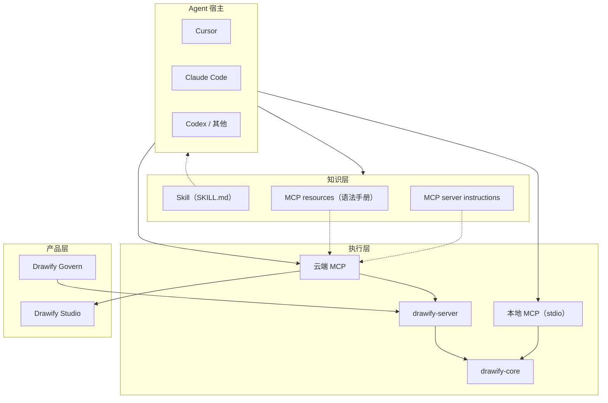

# Agent 生态集成策略：MCP、本地服务与 Skills

> 版本：0.1.0-draft | 状态：产品讨论沉淀
>
> 本文档汇总 Drawify 面向 Cursor 及其他 AI Agent 的集成方案讨论，涵盖 MCP 服务设计、本地/云端分层、Skills 分工、商业化、与 draw.io 的关系等。

相关文档：

- [success-roadmap.md](success-roadmap.md) — MCP Server 在路线图中的位置（P2）
- [vision.md](vision.md) — 「第一用户是 AI Agent」
- [competitive-strategy.md](competitive-strategy.md) — 语义微调护城河
- [../enterprise/international-market-opportunities.md](../enterprise/international-market-opportunities.md) — Govern / Compose / Embed 产品包
- [../architecture/drawify-server-api.md](../architecture/drawify-server-api.md) — 现有 HTTP API
- [../../crates/drawify-core/src/render/encode/drawio/README.md](../../crates/drawify-core/src/render/encode/drawio/README.md) — draw.io 导出实现

---

## 1. 核心结论

| 问题 | 结论 |
|------|------|
| MCP 还是 Skills？ | **不是二选一**。Skills 教「怎么写、怎么走工作流」；MCP 提供「可执行的 validate/render/diff/patch」。 |
| 本地要不要注册？ | **本地 MCP / CLI 不要**；**云端 MCP 要轻量注册**（GitHub OAuth 等）以便计量与图库。 |
| 服务端要不要 session？ | **第一版无状态**（每次带 `source`）；可选 `diagram_id` + 云端存图；第二版再加 session 缓存。 |
| 本地免费怎么限制？ | **不限制引擎能力**；角落 **attribution 品牌链接** + MCP 层 **`notices` 提示**；Pro 可关闭署名。 |
| 和 draw.io 关系？ | **竞争 + 互补**：Agent 迭代用 Drawify；定稿可 **export draw.io** 进熟悉编辑器。 |
| Govern 是什么？ | 企业级 **架构图治理**产品包（快照、语义 Diff、CI 门禁、合规归档），见 [§12](#12-drawify-govern)。 |

---

## 2. 总体架构



---

## 3. MCP 与 Skills 的分工

### 3.1 本质区别

| 维度 | **Skills** | **MCP** |
|------|------------|---------|
| 形态 | `SKILL.md` + 可选参考文档/脚本 | 标准协议：tools / resources / prompts |
| 解决什么 | Agent **该怎么想、怎么写** | Agent **能调用什么、得到什么结构化结果** |
| 跨客户端 | Cursor、Claude Code、Codex 等（路径不同，格式趋同） | 凡支持 MCP 的客户端 |
| 上下文成本 | 触发时加载 SKILL 全文 | 按需 tool 调用，更省 token |
| 执行 | 主要靠写文件；校验需 CLI/MCP | 原生 tool call + JSON 诊断 |

Skills 路径因产品而异（示例）：

| 产品 | 典型路径 |
|------|----------|
| Cursor | `.cursor/skills/` 或 `~/.cursor/skills/` |
| Claude Code | `.claude/skills/` |
| Codex | `.agents/skills/` |

### 3.2 推荐组合

发布时提供 **一份 Skill 源码** + **一个 MCP server** + 安装说明：

- **Skill**（约 50–80 行）：触发词、工作流（validate 闭环、优先 `apply_patch`）、指向 MCP resources。
- **MCP**：`validate` / `render` / `diff` / `apply_patch` / `layout_catalog` / `export_drawio` 等。
- **完整语法**：放在 MCP `resources` 或 `docs/specs/dsl/`，Skill 只链过去，避免双份维护。

### 3.3 DSL 知识如何传给 MCP 调用方

MCP 不自动教会 Agent 语法，需分层供给：

| 层级 | 机制 | 内容 |
|------|------|------|
| 连接时 | MCP `instructions` | 速查规则（~500 字）、可用 tool 列表 |
| 按需 | MCP `resources` | `writing-manual`、`language-spec`、示例 `.dfy` |
| 按需 | MCP `prompts` | `create-architecture` 等带骨架的模板 |
| 运行时 | `validate` 返回 | 结构化错误 + `suggestion`（教师角色） |
| 可选 | 项目 Skill | Cursor 侧触发与工作流强化 |

---

## 4. MCP 工具体系（与 Studio Agent 对齐）

与 [studio/src/agent/tools.ts](../../studio/src/agent/tools.ts) 同构，便于 Studio 与 MCP 共用能力面。

| Tool | 说明 | 本地 | 云端 |
|------|------|------|------|
| `validate` | 语法/语义校验 + 结构化诊断 | ✅ | ✅ |
| `render` | SVG / ASCII / JSON / PNG 等 | ✅ | ✅ |
| `parse` | DSL → AST JSON | ✅ | ✅ |
| `diff` | 两份 DSL 语义差异 | ✅ | ✅ |
| `apply_patch` | AST 级增量修改 | ✅ | ✅ |
| `layout_catalog` | 布局/边路由目录 | ✅ | ✅ |
| `export_drawio` | 导出 `.drawio`（见 [§11](#11-drawio-导出桥梁)） | ✅ | ✅ |
| `open_diagram` | 创建/打开云端图，返回 `diagram_id` | ❌ | ✅ |
| `diff_highlight` | Diff 高亮渲染图 | ❌ | Pro |
| `connector_*` | K8s / TF 等 | ❌ | Compose |

---

## 5. 本地 MCP 与云端 MCP

### 5.1 本地 MCP（stdio + drawify-core）

- **安装**：`npx -y @drawify/mcp`（规划包名），无需 API Key。
- **状态**：无服务端 session；图状态由 Agent 上下文 + 仓库 `.dfy` 文件承担（与 Studio `AgentContext` 同构）。
- **隐私**：DSL 与渲染不出机（除用户主动 export）。
- **成本**：不占云端算力；用 **attribution** 作品牌交换（见 [§8](#8-本地免费档-attribution-与提示)）。

### 5.2 云端 MCP（API Key + drawify-server）

- **注册**：GitHub / Google OAuth 或 magic link；同一账号用于 Studio 与 MCP Key。
- **鉴权**：`Authorization: Bearer dfy_live_xxx`。
- **能力**：在本地 tool 基础上增加图库同步、更高额度、Pro 功能（Diff 高亮等）。
- **可选推广**：匿名极低额度试用 → 引导注册（非必须）。

### 5.3 Session 策略

区分两种 session：

| 类型 | 说明 |
|------|------|
| **MCP 传输 session** | Cursor 与 MCP 进程的连接；由客户端管理 |
| **应用 session（一图一会话）** | 当前图的 DSL；需自行设计 |

**第一版推荐无状态**：每次 tool 传完整 `source`（与现有 `drawify-server` 一致）。

**第二版可选**：

```
open_diagram → diagram_id
apply_patch(diagram_id, patch)  // 服务端存 revision
export_session(diagram_id) → source
```

若做服务端存图，需：TTL、revision 乐观锁、与磁盘 `.dfy` 的「文件为真相」策略、免费档图数量上限。

---

## 6. 云端图库与 Studio 工作台

**并非「上了 MCP 就自动存图」**，需显式实现：

| 模式 | 服务器存图 | Studio 可见 |
|------|------------|-------------|
| 本地 MCP，无 Key | ❌ | ❌ |
| 云端 MCP，已登录 | ✅（可限额） | ✅ |
| Studio 内创作 | ✅ | ✅ |

建议数据模型：

```
User
 └── Diagram（diagram_id, title, type）
      └── Revision（source, created_at, channel: mcp | studio）
```

保存策略：`open_diagram` 建图后，每次成功 `apply_patch` 写新 revision；失败 validate 不更新「当前版」。

---

## 7. 在 Cursor 中配置 API Key

云端 MCP 通过 **`.cursor/mcp.json`** 注入环境变量，无单独「Drawify 设置页」。

**项目级**：`<repo>/.cursor/mcp.json`  
**全局**：`~/.cursor/mcp.json`

```json
{
  "mcpServers": {
    "drawify": {
      "command": "npx",
      "args": ["-y", "@drawify/mcp"],
      "env": {
        "DRAWIFY_API_KEY": "${env:DRAWIFY_API_KEY}"
      }
    }
  }
}
```

用户在 `~/.zshrc` 中：`export DRAWIFY_API_KEY=dfy_live_xxx`，重启 Cursor。

远程 HTTP MCP 示例：

```json
{
  "mcpServers": {
    "drawify": {
      "url": "https://api.drawify.io/mcp",
      "headers": {
        "Authorization": "Bearer ${env:DRAWIFY_API_KEY}"
      }
    }
  }
}
```

可提交仓库的是**模板**（含 `${env:...}`），勿提交真实 Key。远期可提供 OAuth「Add to Cursor」一键连接。

---

## 8. 本地免费档：attribution 与提示

### 8.1 Attribution（角落品牌链接）

- 实现：`RenderRequest.attribution`（见 [render/request.rs](../../crates/drawify-core/src/render/request.rs)），SVG 底部署名 + 可点击链接。
- 性质：**轻量 attribution**，非遮挡式水印。
- 策略：

| 档位 | attribution |
|------|-------------|
| 本地免费 MCP / CLI | 默认 **on** |
| Studio Pro / Enterprise | **off** |
| OEM 商业许可 | 合同约定 |

PNG/WebP 经 SVG 栅格化，署名一并进入位图；JSON/ASCII 不要求。

### 8.2 MCP 层 `notices`（产品提示）

商业/升级提示放在 **`@drawify/mcp` 包装层**，不塞进 DSL 的 `E/W` 错误码。

```json
{
  "success": true,
  "data": { "valid": true },
  "notices": [
    {
      "code": "N002",
      "level": "warn",
      "audience": "agent",
      "message": "实体数 128，超过本地推荐值 100…",
      "action": { "label": "了解 Studio Pro", "url": "https://drawify.io/pricing" }
    }
  ],
  "meta": { "tier": "local" }
}
```

| Code | 触发 | 阻断？ |
|------|------|--------|
| N001 | 首次本地 render | 否 |
| N002 | entity > 100 | 否 |
| N101 | 调用 Pro-only tool | 仅该 tool |

同 session 同 code 只提示一次；默认 `audience: agent`，避免每次 render 刷屏。

---

## 9. 商业化与档位

### 9.1 Open Core 原则

| 永远免费 | 收费 |
|----------|------|
| DSL 规范、drawify-core、CLI、WASM、本地 MCP | Govern、Compose Connector |
| 基础 validate/render/diff/patch | 托管高可用 API、SLA |
| 基础 draw.io 导出 | Diff 高亮、高级导出报告 |
| | Studio 协作、云端图库、去 attribution |

**免费 MCP 永久保留（有额度/署名边界）**；付费卖规模、协作、企业交付，而非「能不能用 MCP」。

### 9.2 产品线（草案）

| 产品包 | 内容 |
|--------|------|
| **Agent API / 云端 MCP** | validate、render、diff、patch；按调用量或订阅 |
| **Studio Pro** | 图库、版本、分享、高额度、去署名、Diff 高亮 |
| **Drawify Govern** | 快照、Compare、CI 门禁、审计（见 §12） |
| **Drawify Compose** | K8s / Terraform Connector |
| **Drawify Embed** | WASM/SDK OEM |

### 9.3 档位示意

| 档位 | 注册 | 云端 MCP | Studio 图库 | attribution |
|------|------|----------|-------------|-------------|
| 本地免费 | 否 | — | 否 | on |
| Cloud Free | 是 | 低额度 | 有限 | on |
| Pro | 是 | 高额度 | ✅ | off |
| Enterprise | 是 | 私有部署 | ✅ + Govern | 可定制 |

计费落在 **API 调用**（validate/render/diff/patch 权重），而非「MCP 连接数」。PNG 可用更高权重。

推广期可提高免费额度或 Pro 试用；**只调数字，不砍 tool 列表**。

---

## 10. 与 draw.io MCP 的对比（用户视角）

draw.io 已有官方 MCP（[@drawio/mcp](https://github.com/jgraph/drawio-mcp)、[mcp.draw.io](https://mcp.draw.io/mcp)）。

| 维度 | Drawify | draw.io MCP |
|------|---------|-------------|
| Agent 生成稳定性 | DSL 克制，预期更高 | mxGraph XML 复杂，易空文件/断引用 |
| 对话式改图 | AST `apply_patch` + 结构化 fix | 改 cell / 坐标，迭代成本高 |
| Cursor 内预览 | 可设计为 SVG 摘要/路径 | 官方文档：Cursor 不支持 MCP Apps，多跳浏览器 |
| Git / PR | `.dfy` 可读 diff | `.drawio` XML diff 差 |
| 人工精修 | 弱（Agent/Studio 向） | 强（完整编辑器） |
| 生态认知 | 新 | 极强 |
| 隐私（托管） | 可本地 | 托管 MCP 会上传至 draw.io |

**定位**：

- draw.io + MCP：「AI 帮我起稿，我在编辑器里定稿」
- Drawify + MCP：「图是代码资产，AI 在 IDE 里生成、校验、迭代」

---

## 11. draw.io 导出桥梁

Core **已实现** draw.io 导出（`RenderFormat::Drawio`）：

```bash
drawify render input.dfy -f drawio -o output.drawio
```

管线：`PreparedDiagram → layout → ExportScene → mxGraphModel XML`。详见 [drawio/README.md](../../crates/drawify-core/src/render/encode/drawio/README.md)。

### 11.1 战略意义

将 draw.io 从「对手」变为「下游交付渠道」：

```text
Cursor + Drawify MCP → .dfy（源码）→ export drawio → draw.io 精修 / Confluence
```

### 11.2 MCP 规划

```
export_drawio({ source, compressed? })
  → { drawio_xml, export_report, open_url? }
```

`open_url` 可选用 `app.diagrams.net#create` + URL fragment（浏览器不上传 fragment，隐私友好）。

### 11.3 边界

| 图表类型 | 导出 draw.io |
|----------|----------------|
| flowchart / architecture / state / mindmap | ✅ |
| sequence / er | ❌ 默认拒绝 |

存在 L1/L2 降级（贝塞尔近似、多边标签等）。**暂无 draw.io → Drawify 导入**；主路径为 `.dfy` 是 source of truth。

建议 **基础 export draw.io 免费**，促进采用；不与 draw.io 免费编辑器对立。

---

## 12. Drawify Govern

**Govern** 是规划中的**企业架构图治理**产品包（非当前已上线 SKU）。

| 能力 | 说明 |
|------|------|
| 快照与版本库 | 按时间点存档 DSL/AST，配合 PNG 归档 |
| 语义 Diff / Compare | 变更列表 + **Diff 高亮渲染** |
| CI / PR 门禁 | validate + diff，阻断或注释 PR |
| 审计与合规 | 变更证据链；国内审批留痕 / 国际 SOC2 等叙事 |

与 **Compose**（从 K8s/TF 自动出图）搭配：Compose 生成「当前态」，Govern 记录「变了什么」。

依赖：diff2、结构化 validate、drawify-server 多租户、Diff 高亮渲染（企业路线图 P0）。

---

## 13. 落地阶段

| 阶段 | 交付 | 依赖 |
|------|------|------|
| **P0** | 本地 `@drawify/mcp`（无状态 tool + instructions + resources） | drawify-core / WASM |
| **P0** | 项目 Skill 模板 + `docs/specs/dsl` 链引用 | — |
| **P1** | 云端 MCP + API Key + 计量 + 免费档 | drawify-server 鉴权 |
| **P1** | Studio 图库 API + `open_diagram` / `diagram_id` | 存储 |
| **P1** | `export_drawio` tool | 已有 DrawioRenderer |
| **P2** | Pro：去 attribution、Diff 高亮、高额度 | — |
| **P2** | Govern 最小集：PR diff + 快照 | diff 高亮 |
| **P3** | Compose Connector | 独立订阅 |

---

## 14. 架构预留（收费与运维）

即使首期不收费，建议在 server 预留：

- `tenant_id` + API Key
- 请求级 metering（operation、format、node_count）
- 配额与 402/429
- 审计日志（Enterprise）
- 功能开关：`govern_diff_highlight`、`compose_k8s` 等

本地 MCP / CLI **不走云端计量**。

---

## 15. 对外一句话

**Drawify 用开源 Core + 免费本地 MCP 占领 Agent 画图格式；用 Skills 教工作流、用 MCP 跑引擎；用云端 + Studio 存图协作；用 Govern 做企业治理；用 export draw.io 对接现有编辑器生态——而不是在 Cursor 里复制一个 draw.io。**
