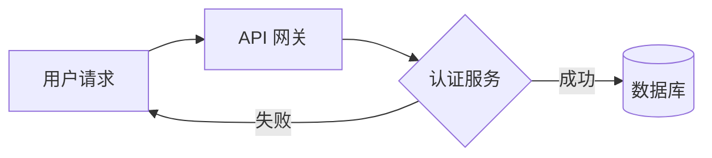
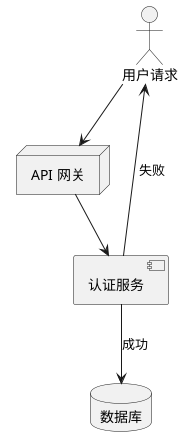
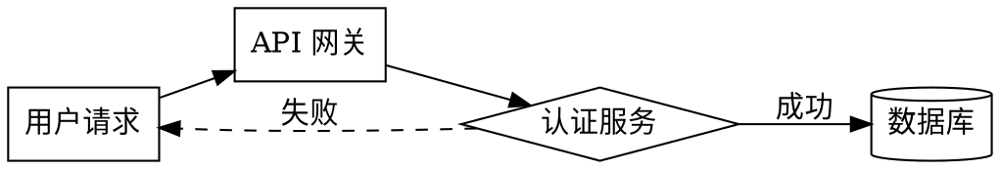

# Drawify 与竞品对比分析

## 对比对象

| 工具 | 定位 | 首次发布 | 语法类型 |
|------|------|----------|----------|
| **Mermaid** | 文本图表工具（最流行） | 2014 | 类 Markdown DSL |
| **PlantUML** | UML 图表工具 | 2009 | 自定义 DSL |
| **Graphviz DOT** | 图布局工具 | 1990s | 图描述语言 |
| **Excalidraw** | 手绘风格白板 | 2020 | 图形化（无文本语法） |
| **Drawify** | AI Agent 原生图表语言 | 2025 | 声明式 DSL |

---

## 核心维度对比

### 1. AI 生成友好度

这是 Drawify 最核心的差异化维度。

| 维度 | Mermaid | PlantUML | Graphviz DOT | Drawify |
|------|---------|----------|--------------|--------|
| LLM 生成正确率 | 70-80% | 60-70% | 50-60% | 目标 >95% |
| 语法变体数量 | 高（10+ 箭头类型） | 极高（20+ 元素） | 中（属性系统复杂） | 低（3 种箭头，固定结构） |
| 布局由谁决定 | Agent 需指定 | Agent 需指定 | Agent 需指定 | 引擎自动推断 |
| 错误反馈质量 | 文本错误 / 空白 | Java 异常堆栈 | 编译错误 | 结构化 JSON + 修复建议 |
| 重试修复效率 | 3-5 次 | 3-5 次 | 5+ 次 | 目标 1 次 |

**分析：**

Mermaid 正确率约 70-80% 的根本原因不是 LLM 不够聪明，而是 Mermaid 语法的设计假设是人类手写：

- 箭头类型太多（`-->`, `---`, `-.->`, `==>`, `--text-->`...），AI 需要"猜"该用哪个
- 子图（subgraph）语法复杂且嵌套规则不直观
- 同一含义多种写法（如时序图中的参与者声明方式）

Drawify 通过**限制语法空间**来提高 AI 正确率：
- 箭头只有 3 种，语义固定
- 实体、关系、属性结构统一
- 没有隐式规则，所有行为显式声明

### 2. 语法简洁度

**同一张图在不同工具中的表达：**

**场景：** 用户请求 → API 网关 → 认证服务 → 数据库

#### Mermaid

- 需要选择 `graph LR` 还是 `graph TD`
- 节点形状需要记忆（`[]` 矩形，`{}` 菱形，`()` 圆角，`[()]` 圆柱）
- 条件标签语法 `|text|` 容易出错

#### PlantUML

- 需要 `@startuml` / `@enduml` 包装
- 元素类型（actor, node, component, database）需要记忆
- `as` 别名语法增加认知负担

#### Graphviz DOT

- 需要声明 `rankdir` 布局方向
- 每个节点的形状需要显式指定
- 属性语法 `key=value` 但值的格式不统一（有引号无引号混用）

#### Drawify
```drawify
diagram flowchart {
    entity request "用户请求"
    entity gateway "API 网关" { type: gateway }
    entity auth "认证服务" { type: service }
    entity db "数据库" { type: database }

    request -> gateway
    gateway -> auth
    auth -> db "成功"
    auth -> request "失败"
}
```
- 不需要指定布局方向（引擎自动推断）
- 不需要记忆形状语法（`type` 自动映射）
- 统一的 `entity -> entity "label"` 关系语法

### 3. 错误处理

| 维度 | Mermaid | PlantUML | Graphviz DOT | Drawify |
|------|---------|----------|--------------|--------|
| 语法错误表现 | 渲染空白 / 通用错误文本 | Java 异常堆栈 | 编译错误（行号） | 结构化 JSON 错误 |
| 错误定位精度 | 低 | 中 | 中（有行号） | 高（行号 + 列号） |
| 错误可解析性 | 不可解析 | 不可解析 | 部分可解析 | 完全可解析 |
| 修复建议 | 无 | 无 | 无 | 有（结构化 fix payload） |
| 错误码 | 无 | 无 | 无 | 有（E001-E005） |

**Drawify 错误示例：**
```json
{
    "code": "E003",
    "severity": "error",
    "message": "关系引用了不存在的实体 'cache_svc'",
    "location": { "line": 15, "column": 5 },
    "context": {
        "referenced_entity": "cache_svc",
        "available_entities": ["auth_svc", "user_svc", "order_svc"]
    },
    "suggestion": "确认实体名拼写，或添加 entity cache_svc 定义"
}
```

这种结构化错误让 AI Agent 可以：
1. 精确定位错误位置
2. 理解错误原因
3. 获得修复建议
4. 直接应用修复（无需重新生成）

### 4. 结构化操作能力

| 维度 | Mermaid | PlantUML | Graphviz DOT | Drawify |
|------|---------|----------|--------------|--------|
| 文本 Diff 是否有意义 | 否 | 否 | 部分 | 否（但提供 AST Diff） |
| 语义 Diff | 不支持 | 不支持 | 不支持 | 支持 |
| 语义 Patch | 不支持 | 不支持 | 不支持 | 支持 |
| AST 序列化 | 不公开 | 不公开 | 不公开 | JSON（一等公民） |
| 程序化修改 | 只能文本替换 | 只能文本替换 | 只能文本替换 | AST Patch |

**这是 Drawify 的第二个核心差异化能力：**

现有工具的"修改"只能是文本级操作（增删行）。这导致：
- 两个版本的图表做 Diff，结果毫无意义（只是文本行的比较）
- Agent 修改图表只能重新生成整段文本（增加出错概率）

Drawify 的 AST 是一等公民：
- Diff 输出"添加了哪个实体，修改了哪个属性"
- Patch 可以精确修改某个节点的某个属性
- 修改是事务性的（Patch 失败不影响原图）

### 5. 渲染能力

| 维度 | Mermaid | PlantUML | Graphviz DOT | Drawify |
|------|---------|----------|--------------|--------|
| 输出格式 | SVG | SVG/PNG | SVG/PNG/PDF | SVG/JSON/PNG |
| 自动布局 | 有限 | 一般 | 优秀 | 优秀（目标） |
| 主题系统 | CSS | 有限 | 属性 | 预置主题 |
| 自定义样式 | CSS 覆盖 | 有限 | 属性 | 属性（有限但安全） |
| 交互性 | 有限（点击） | 无 | 无 | 无（MVP） |
| 运行环境 | 浏览器 | JVM | 本地 / 服务器 | CLI / Server / WASM |

### 6. 生态系统

| 维度 | Mermaid | PlantUML | Graphviz DOT | Drawify |
|------|---------|----------|--------------|--------|
| GitHub Stars | ~75k | ~10k | N/A | 新项目 |
| 工具集成 | 极广（GitHub, Notion, VSCode...） | 广（IDE, CI） | 广（系统级） | 无（目标：IDE, LLM 应用） |
| 社区活跃度 | 极高 | 高 | 中 | 待建立 |
| 学习资源 | 丰富 | 丰富 | 丰富 | 待创建 |

**Drawify 的生态策略：**

不试图替代 Mermaid 的生态地位，而是瞄准**AI Agent 工具链**这一新增量市场：
- LLM 应用框架（LangChain, AutoGen 等）
- AI 编程助手（Cursor, GitHub Copilot 等）
- AI 文档生成器

---

## 综合评分

| 维度 | Mermaid | PlantUML | Graphviz DOT | Drawify (目标) |
|------|---------|----------|--------------|---------------|
| AI 生成友好度 | ★★★ | ★★ | ★ | ★★★★★ |
| 语法简洁度 | ★★★ | ★★ | ★★ | ★★★★★ |
| 错误处理 | ★ | ★ | ★★ | ★★★★★ |
| 结构化操作 | ★ | ★ | ★ | ★★★★★ |
| 渲染质量 | ★★★★ | ★★★ | ★★★★ | ★★★★ (目标) |
| 生态成熟度 | ★★★★★ | ★★★★ | ★★★★ | ★ (初期) |
| 学习成本 | ★★★★ | ★★★ | ★★★ | ★★★★★ |

---

## 结论

### Drawify 不是 Mermaid 的竞品

Mermaid 解决的问题是"让人类能用文本画图"。它在这个定位上做得很好。

Drawify 解决的问题是"让 AI Agent 能可靠地生成图表"。这是一个**全新**的问题，现有工具从设计之初就没有考虑过。

### 核心差异化总结

| | Drawify 的独特价值 |
|---|---|
| **语法设计** | 为 LLM 优化，限制语法空间，减少幻觉 |
| **错误模型** | 结构化错误 + 修复建议，形成 AI 自我修正闭环 |
| **操作模型** | AST 是一等公民，支持语义 Diff/Patch |
| **布局策略** | 语义优先，布局由引擎智能推断 |
| **部署形态** | 原生 Rust，支持 CLI/Server/WASM 三种形态 |

### 不推荐迁移的场景

- 你的团队已经大量使用 Mermaid，且 LLM 生成正确率可接受
- 你需要极高的渲染自定义能力（复杂动画、交互）
- 你需要手绘风格（用 Excalidraw）

### 推荐使用 Drawify 的场景

- 你在构建 LLM 应用，需要可靠的图表生成能力
- 你受够了 Mermaid 的语法错误导致 Agent 反复重试
- 你需要程序化地修改图表（而不只是文本替换）
- 你需要在浏览器内（WASM）或服务器上渲染图表
