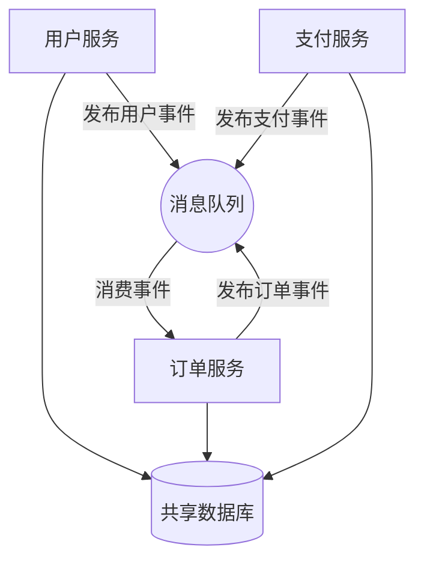

# Drawify 使用场景与案例

## 场景总览

Drawify 的核心使用场景围绕**AI 生成图表**展开。以下场景按优先级排列。

---

## 场景 1：AI Agent 在对话中生成架构图

### 用户故事

> 作为开发者，我在和 AI 助手对话时，想让它直接画出系统架构图，而不需要我手动打开画图工具。

### 流程

```
用户: "帮我画一下我们微服务系统的架构图，包含用户服务、订单服务、支付服务和消息队列"
  ↓
AI Agent: 生成 Drawify 文本
  ↓
渲染引擎: Drawify → SVG
  ↓
用户: 看到架构图，满意
```

### Drawify 输出示例

```drawify
diagram architecture {
    entity user_svc "用户服务" {
        type: service
    }
    entity order_svc "订单服务" {
        type: service
    }
    entity payment_svc "支付服务" {
        type: service
    }
    entity mq "消息队列" {
        type: queue
    }
    entity db "共享数据库" {
        type: database
    }

    user_svc -> mq "发布用户事件"
    order_svc -> mq "发布订单事件"
    payment_svc -> mq "发布支付事件"
    mq -> order_svc "消费事件"
    user_svc -> db
    order_svc -> db
    payment_svc -> db
}
```

### 对比 Mermaid

**Mermaid 写法（AI 容易出错）：**


**Mermaid 的痛点：**
- `graph TD` vs `graph LR` — Agent 需要决策布局方向
- `(( ))` vs `[( )]` vs `[[ ]]` — 形状语法需要记忆
- `|text|` 标注语法容易忘记或放错位置
- 节点 ID（A, B, C）和标签分离，Agent 容易混淆

**Drawify 的优势：**
- 语义化的 entity 定义，ID 和 label 清晰分离
- `type: queue` 自动渲染为队列形状，无需记忆形状语法
- 布局由引擎自动决定，Agent 不需要管

---

## 场景 2：AI Agent 根据代码变更生成流程图

### 用户故事

> 作为 Tech Lead，我希望 AI 在代码审查时，自动生成新功能的流程图，附加在 PR 描述中。

### 流程

```
PR 提交
  ↓
CI Hook: 调用 AI Agent 分析代码变更
  ↓
AI Agent: 理解变更内容，生成 Drawify
  ↓
渲染引擎: Drawify → SVG
  ↓
PR 描述: 自动附加流程图
```

### Drawify 输出示例

```drawify
diagram flowchart {
    entity request "HTTP 请求"
    entity auth "鉴权中间件"
    entity rate_limit "限流检查"
    entity handler "业务处理"
    entity cache "缓存查询"
    entity db "数据库查询"
    entity response "返回响应"

    request -> auth
    auth -> rate_limit "验证通过"
    auth -> response "401 未授权"
    rate_limit -> handler "未超限"
    rate_limit -> response "429 限流"
    handler -> cache "查缓存"
    cache -> response "命中"
    cache -> db "未命中"
    db -> response
}
```

### 关键点

- Agent 只需表达"请求经过哪些步骤"，不需要关心图的排列方向
- 条件分支通过关系标签自然表达
- 结构化错误让 CI 失败时 Agent 可以自动修正

---

## 场景 3：AI Agent 增量修改图表（Diff/Patch）

### 用户故事

> 作为产品经理，我让 AI 画了一个用户旅程图，然后想加一个"支付失败"的分支，不想让 AI 重新生成整张图。

### 流程

```
用户: "在订单确认之后，加一个支付失败回到购物车的分支"
  ↓
AI Agent: 生成 Patch（不是重新生成整张图）
  ↓
渲染引擎: 应用 Patch → 重新渲染
  ↓
用户: 看到更新后的图
```

### Patch 示例

```json
{
    "patches": [
        {
            "op": "add",
            "entity": {
                "id": "payment_fail",
                "label": "支付失败",
                "type": "error"
            }
        },
        {
            "op": "add",
            "relation": {
                "from": "order_confirm",
                "to": "payment_fail",
                "label": "支付异常"
            }
        },
        {
            "op": "add",
            "relation": {
                "from": "payment_fail",
                "to": "cart",
                "label": "返回购物车"
            }
        }
    ]
}
```

### 关键点

- Agent 不需要重新生成整张图，减少出错概率
- 用户可以清楚地看到"加了三样东西"，而不是两张图的文本 Diff
- Patch 失败时，原图不受影响（事务性）

---

## 场景 4：IDE 插件实时预览 .dfy 文件

### 用户故事

> 作为开发者，我在编辑器里写 .dfy 文件时，希望能实时看到渲染结果，语法错误时立刻高亮提示。

### 流程

```
开发者编辑 diagram.dfy
  ↓
IDE 插件 (WASM): 实时解析 + 渲染
  ↓
分屏预览: 左侧代码，右侧图表
  ↓
语法错误: 红色波浪线 + 错误信息 + 修复建议
```

### 关键点

- WASM 包在浏览器/IDE 内运行，无需网络请求
- 结构化错误直接映射为 IDE 的 Diagnostic 信息（行号、列号、错误码）
- 渲染性能要求 < 100ms（每次按键后重渲染）

---

## 场景 5：LLM 应用集成（API 模式）

### 用户故事

> 作为 AI 应用开发者，我想在我的 ChatBot 中支持图表输出，用户说"画个流程图"时，直接渲染展示。

### 集成方式

```javascript
// 1. Prompt 中要求 LLM 输出 Drawify
const systemPrompt = `
你是一个技术助手。当用户要求画图时，请用以下格式输出：
\`\`\`drawify
diagram flowchart { ... }
\`\`\`
`;

// 2. 解析 LLM 输出中的 Drawify 块
const drawifyBlock = extractDrawify(llmResponse);

// 3. 调用 Drawify API 渲染
const response = await fetch('/render', {
    method: 'POST',
    body: JSON.stringify({ source: drawifyBlock, format: 'svg' })
});

const { output, errors } = await response.json();

// 4. 渲染失败时，将错误反馈给 LLM 自动修正
if (errors.length > 0) {
    const retryPrompt = `渲染失败，错误如下：${JSON.stringify(errors)}，请修正。`;
    // LLM 重新生成...
}

// 5. 展示 SVG
displaySvg(output);
```

### 关键点

- 错误反馈机制形成闭环：LLM 生成 → 渲染验证 → 错误反馈 → LLM 修正
- 结构化错误让 LLM 能精确理解哪里出了问题
- 通常 1-2 次重试即可修正（对比 Mermaid 的 3-5 次）

---

## 场景 6：文档自动生成

### 用户故事

> 作为技术写作者，我希望根据代码仓库自动生成架构文档，包含最新的系统架构图。

### 流程

```
代码仓库
  ↓
分析工具: 扫描代码结构、依赖关系
  ↓
AI Agent: 将分析结果转化为 Drawify
  ↓
渲染引擎: Drawify → SVG/PNG
  ↓
文档系统: 嵌入图表，自动更新
```

### Drawify 输出示例

```drawify
diagram architecture {
    group services "微服务层" {
        entity auth "认证服务" { type: service; owner: "安全团队" }
        entity user "用户服务" { type: service; owner: "平台团队" }
        entity order "订单服务" { type: service; owner: "交易团队" }
    }

    group infra "基础设施" {
        entity gateway "API 网关" { type: gateway }
        entity redis "Redis" { type: cache }
        entity postgres "PostgreSQL" { type: database }
    }

    gateway -> auth
    gateway -> user
    gateway -> order
    auth -> redis
    user -> postgres
    order -> postgres
}
```

### 关键点

- `owner` 等元数据属性可以来自代码仓库的实际信息
- 图表可以随代码变更自动重新生成
- Drawify 的 Patch 能力使得增量更新（只改变更的部分）成为可能

---

## 场景优先级矩阵

| 场景 | 优先级 | 依赖功能 | 备注 |
|------|--------|----------|------|
| 场景 1: 对话生成架构图 | P0 - MVP | F1, F2, F3, F6, F10, F11 | 核心验证场景 |
| 场景 5: LLM 应用集成 | P0 - MVP | F6, F14 或 F15 | 商业化路径 |
| 场景 2: CI 生成流程图 | P1 | F1, F13 | 开发者工具集成 |
| 场景 3: 增量修改 | P1 | F8, F9 | 差异化体验 |
| 场景 4: IDE 插件 | P1 | F15 | 开发者体验 |
| 场景 6: 文档自动生成 | P2 | F1, F4, F8 | 企业场景 |
