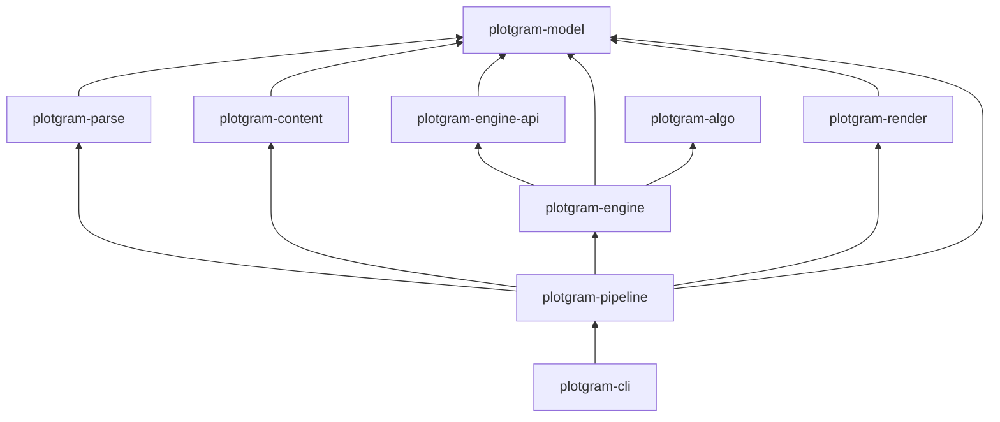

# Plotgram 文档中心

项目级文档索引。

## 目录结构

```
docs/
├── readme.md                 ← 本文件
├── design/                   架构设计（当前主战场）
│   ├── layout/               布局内核设计档（hierarchical / tree / …）
│   └── notes/                设计笔记（短纪要）
├── specs/                    语言规范、AST、样式系统、视觉语言
├── guides/                   使用指南（实操文档）
├── reference/                外部参考与调研（yFiles、Graphviz、Cytoscape）
└── archive/                  历史设计文档（只读参考，不再维护）
    └── atlas/                Atlas 三相架构 21–31 号文档
```

---

## Workspace crates（现行）

> 依赖与边界见 [ADR-006](design/adr/006-engine-io-and-crates.md)、[model-boundary](design/model-boundary.md)。  
> `v1/` 下旧实现只读，不在本表。

| Crate | 路径 | 职责 |
|-------|------|------|
| **plotgram-model** | `crates/plotgram-model` | 纯数据：Graph / Contract / Result / Port / Profile |
| **plotgram-content** | `crates/plotgram-content` | 框内瘦 MD：parse → measure → SVG 片段 |
| **plotgram-parse** | `crates/plotgram-parse` | `.pgm` → Graph + profile 展开（骨架） |
| **plotgram-pipeline** | `crates/plotgram-pipeline` | 编排：parse → measure → engine → render |
| **plotgram-engine-api** | `crates/plotgram-engine-api` | `LayoutAlgorithm` / `EdgeRouter` Trait（无算法） |
| **plotgram-algo** | `crates/plotgram-algo` | 共享 GD 零件（VPSC / FAS / …）；见 [PARTS.md](../crates/plotgram-algo/PARTS.md) |
| **plotgram-engine** | `crates/plotgram-engine` | `run` + 注册表；内含 layout/route **模块**（消费 algo） |
| **plotgram-render** | `crates/plotgram-render` | SVG / ASCII 出图 + theme |
| **plotgram-cli** | `crates/plotgram-cli` | 薄 CLI：参数与文件 I/O |

### `plotgram-engine` 内模块（可后拆 crate）

| 模块 | 将来可抽为 | 职责 |
|------|------------|------|
| `layout/hierarchical` | `plotgram-layout-hierarchical` | Hier + 内建正交 Ink |
| `route/core` | `plotgram-route-core` | 正交无策略原语 |
| `route/orthogonal` | `plotgram-route-orthogonal` | 独立 EdgeRouter |

### 依赖关系



文字版（箭头 = 「依赖于」）：

```text
cli            → pipeline
pipeline       → parse, content, engine, render, model
parse          → model
content        → model
engine         → engine-api, model, algo
engine-api     → model
algo           → （当前无 model；纯零件）
render         → model
```

管线方向（数据流，与上图依赖相反）：

```text
.pgm → parse → pipeline(measure/content) → engine::run → render → SVG
         ↑                                      ↑
       model                              engine-api Traits
```

---

## design/ — 架构设计

> 重新设计阶段的产出物。设计约束与方案文档放这里。

| 文档 | 内容 |
|------|------|
| [layout/](design/layout/README.md) | **布局内核设计档** — 按 hierarchical / tree / sequence / circular 立档 |
| [layout/write-authority.md](design/layout/write-authority.md) | 布局写权纪律 — 单写者、落笔零新决策、判断句 |
| [layout/hierarchical/from-yfiles-reference.md](design/layout/hierarchical/from-yfiles-reference.md) | yFiles 参考文库启发 — Hier 构造与 v1 Atlas 迁移 |
| [notes/](design/notes/README.md) | 设计笔记 — 短纪要（如 v1 求解器 vs VPSC） |
| [model-boundary.md](design/model-boundary.md) | plotgram-model 边界 — Graph / 端口 / 边组 / 时序边序 |
| [adr/001…](design/adr/001-diagram-type-not-in-engine.md) | profile / 图种不进引擎；DSL 用 `profile:` 属性 |
| [adr/002…](design/adr/002-no-config-block-freeform-options.md) | 废除 config 块 |
| [adr/003…](design/adr/003-edge-structural-fields.md) | Edge 结构一等字段与时序边序 |
| [adr/004…](design/adr/004-group-anchor-nodes.md) | 组间边经由 group_anchor 隐形节点 |
| [adr/005…](design/adr/005-content-measure-params.md) | 内容块、启发式度量与布局前 MeasureParams |
| [adr/006…](design/adr/006-engine-io-and-crates.md) | Engine 入口、边写者与 crate 拆分 |

---

## specs/ — 语言与技术规范

> 详细索引：[specs/README.md](specs/README.md)

| 文档 | 内容 |
|------|------|
| [language-spec.md](specs/dsl/language-spec.md) | 语言语法与语义 — BNF、标识符、entity/relation/group 约束 |
| [dsl-writing-manual.md](specs/dsl/dsl-writing-manual.md) | DSL 写作手册 — 场景化实践指南 |
| [ast-spec.md](specs/ast-spec.md) | AST 数据结构 — Rust 结构体、JSON 序列化、Diff/Patch |
| [export-scene-spec.md](specs/export-scene-spec.md) | Exporter Scene JSON — 对外导出契约与 schema |
| [error-model.md](specs/error-model.md) | 错误模型 — 错误码、Fix Action、LSP 映射 |
| [style-sheet-spec.md](specs/style-sheet-spec.md) | Theme / StyleSheet V2 — 扁平 kind_styles cascade |

### 视觉语言

> 详细索引：[specs/visual-language/README.md](specs/visual-language/README.md)

| 文档 | 内容 |
|------|------|
| [entity-types.md](specs/visual-language/entity-types.md) | 实体 type 标准 — 跨图表语义、别名、适用矩阵 |
| [flowchart.md](specs/visual-language/diagrams/flowchart.md) | 流程图 |
| [sequence.md](specs/visual-language/diagrams/sequence.md) | 时序图 |
| [architecture.md](specs/visual-language/diagrams/architecture.md) | 架构图 |
| [state.md](specs/visual-language/diagrams/state.md) | 状态图 |
| [er.md](specs/visual-language/diagrams/er.md) | ER 图 |
| [mindmap.md](specs/visual-language/diagrams/mindmap.md) | 思维导图 |

---

## guides/ — 使用指南

> 详细索引：[guides/README.md](guides/README.md)

| 文档 | 内容 |
|------|------|
| [layout-lint.md](guides/layout-lint.md) | LayoutLint — 布局静态质量检查 |
| [group-layout-and-frame.md](guides/group-layout-and-frame.md) | Group layout + Frame |
| [theme-and-style.md](guides/theme-and-style.md) | Theme 与 Graphic Style |
| [diff-and-patch.md](guides/diff-and-patch.md) | diff2 语义差异与 Agent 增量改图 |

---

## reference/ — 外部参考与调研

| 文档 | 内容 |
|------|------|
| [yFiles-layouts-and-routing.md](reference/yFiles-layouts-and-routing.md) | yFiles 布局算法与路由风格（[HTML 版](reference/yFiles-layouts-and-routing.html)） |
| **[yfiles/](reference/yfiles/00-索引与阅读指南.md)** | **算法级参考文库（22 篇）**：分层/正交/路由/力导向/树/标签/约束/分组/架构/行业/度量/论文书目/路线图/零件库/落笔层/性能/动画/超图/序列图/参数映射/[术语表](reference/yfiles/21-术语表.md) |
| [graphviz-algorithms-research.md](reference/graphviz-algorithms-research.md) | Graphviz 核心算法研究与 Rust 实现路线 |
| [cytoscape-js-research.md](reference/cytoscape-js-research.md) | Cytoscape.js 能力研究与 Plotgram 取舍 |

---

## archive/ — 历史设计（只读）

> Atlas 三相架构（组合→度量→Ink）的完整设计过程。不再驱动开发，仅供回溯。

| 文档 | 内容 |
|------|------|
| [archive/atlas/README.md](archive/atlas/README.md) | Atlas 文档索引与阶段记债 |
| 21–31 号文档 | 从立场、总纲、执行、channel、探针到收口的完整链路 |

---

## 其他文档位置

| 位置 | 范围 |
|------|------|
| [studio/docs/](../studio/docs/README.md) | Plotgram Studio 前端 |
| [showcase/README.md](../showcase/README.md) | 示例图集 |
| [playground/README.md](../playground/README.md) | Playground 编辑器 |

## 阅读建议

1. **写图表**：`specs/dsl/dsl-writing-manual.md` → `specs/visual-language/` → [showcase/](../showcase/)
2. **布局/路由设计**：`design/layout/`（含 [写权纪律](design/layout/write-authority.md)）→ `reference/yFiles-layouts-and-routing.md` / `reference/yfiles/`
3. **语言实现**：`specs/language-spec.md` → `specs/ast-spec.md` → `specs/error-model.md`
