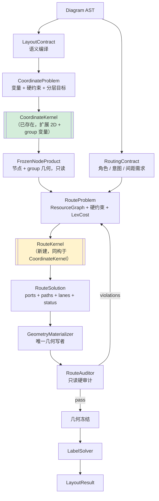

# 布局与路由第一性原理重构方案（2026-07）

> **前置文档**
> - [16-路由Recipe-Kernel与求解器架构改造方案](16-路由Recipe-Kernel与求解器架构改造方案-2026-07.md)（原始设计）
> - [20-路由Recipe-Kernel实施审查与后续收敛计划](20-路由Recipe-Kernel实施审查与后续收敛计划-2026-07.md)（Slice A–F 计划）
> - [22-路由Recipe-Kernel-SliceA-F实施代码审查报告](22-路由Recipe-Kernel-SliceA-F实施代码审查报告-2026-07.md)（实施审查，本文的问题来源）
>
> **本文性质**：不是「继续打补丁的计划」，而是**先确立规则、再按规则删代码**的重构方案。
>
> **门禁前提**：本轮适用 `AGENTS.md` §8 临时豁免 + §7 创新模式。**渲染质量允许阶段性退化**，
> 正确性红线（穿组、确定性）与卫生红线（无图名特判、`cargo run -p plotgram-cli` 验真、WASM 禁 `std::time`）**不豁免**。

---

## 0. 本文要解决的根本问题

前六个 Slice 建立了正确的**接口**（`PreparedRoutingInput` / `RouteSolution` / `RouteAuditor` /
`GeometryMaterializer` / `RoutingCoordinator`），但审查（文档 22）表明：**新接口大量地在包裹旧的
可变管线**，而不是在驱动新行为。结果是接口层与实现层同时存在，认知负担与运行开销都翻倍。

你的判断——「以前的补丁已经迁移到最新架构里，可能造成额外负担」——**代码证据完全支持**。
下面是四处**同一修复跑两遍**的实证（§1.3），这不是猜测。

因此本文的原则是：

> **不再新增任何"修复层"。每一个 Phase 的产出都必须是「净删除 > 净新增」，
> 或者新增的是「一次性把问题解对的求解器」而不是「事后纠正器」。**

---

## 1. 诊断：补丁债的定量地图

### 1.1 两句话病理

| 侧 | 病理 | 后果 |
|---|---|---|
| **路由** | **模板枚举 + 加权软惩罚排序 + 多轮几何后处理**。没有「可行域」这个概念——硬约束（穿节点、穿组）和审美偏好（弯折数）被塞进同一个 `f64` 加权和里。 | 权重互相打架，任何调参都是零和；新图形只能靠新罚项救 |
| **布局** | **求解器是真的，但只解了问题的四分之一**。`kernel/coordinate` 是货真价实的约束求解器（PAVA 投影 + 分层投影梯度），但它只解**横轴 1D**；纵轴、group 矩形、路由需求全在求解器**外面**靠后验 `enforce_*` / `expand_*` 修 | group 几何一次布局要重算 3–5 遍，扩缩 4–6 遍 |

### 1.2 规模基线（实测）

```
layout 总计         81,596 LOC
├─ routing          37,093   ← 其中 orthogonal ≈ 20,000
├─ recipes          13,137   ← 其中 architecture ≈ 8,870（占 67%）
├─ engines           8,006
├─ group             5,303
├─ quality           4,069
├─ demand            2,749
├─ refine            2,476
├─ snap              1,745
├─ kernel            1,922   ← 唯一「架构正确」的部分
└─ pipeline          1,062
```

**路由侧 164 个魔法常量**，其中 `scoring.rs` 一个文件 19 个。

### 1.3 ★ 关键证据：同一修复跑两遍（验证你的假设）

这是本次审查最重要的发现。Slice D 把「几何写权」收归 `RoutingCoordinator`，但**旧的
路由器内部修复没有删除**，于是同一个修复在 C 段（路由器内）和 D 段（coordinator）各跑一次：

| 修复动作 | C 段（路由器内部） | D 段（coordinator 后处理） | 差异 |
|---|---|---|---|
| 正交几何规范化 | `phases/finalize.rs:22`（`merge_overshoot=false`，保守） | `coordinator.rs:226`（`merge_overshoot=true`，激进） | 同函数，参数不同 |
| 正反向 dock 分离 | `phases/refine.rs:328` | `coordinator.rs:250` | **完全相同的调用** |
| 正反向最小间距 | （lane 阶段隐含） | `coordinator.rs:243` | — |
| stub 占用去冲突 | `phases/refine.rs:279`（仅 flowchart） | `coordinator.rs:264`（仅 architecture，`algo == "architecture"` 硬分支） | 同问题两个函数，**按图类型切**（违反无图名特判精神） |

同时，**布局侧求解器迁移完成后，旧启发式没删**——`cargo check` 给出 60 条 `never used`，
其中 architecture 坐标启发式约 300 LOC（`align_nodes_to_neighbors`、`center_group_hub_nodes`、
`align_client_nodes_to_hubs`、`should_align_neighbors`）全部是死代码，是 solver 上线后的遗骸。

**结论：你担心的「双重负担」不仅存在，而且是当前最容易拿到的收益。**

### 1.4 三种成因（第一性原理的入口）

所有补丁债都能归到这三类，**且每类都有唯一的正确解法**：

| 成因 | 现状证据 | 正确解法 |
|---|---|---|
| **A. 硬约束用罚项表达** | `NODE_CROSSING_PENALTY = 10_000`、`GROUP_TRANSIT_PENALTY = 8_000`、`PROTECTED_TRUNK_CROSS_PENALTY = 28_000` 与 `BEND_PENALTY = 28.0` 在同一个加权和里。10_000 是「禁止」还是「很贵」？语义不明 | 硬约束**从候选生成阶段就排除**（可行域由构造保证），罚项只在**同一可行域内**排序 |
| **B. 一个量被多个阶段决策** | 端口位置被 `port_solver` → `lane_assignment` → `stub_occupancy` → `coordinator` 四处修改；group 矩形被 `phase_d` 内 7 次 + runner 3 次改写 | **一个量一个决策点**。后续阶段只读 |
| **C. 几何是派生值而非求解变量** | group 矩形永远从节点位置反推（`recompute_group_bounds`），再 expand/shrink 修正 | group 边界成为**求解变量**，节点-容器关系成为**硬约束** |

### 1.5 ★ 已存在的正确样板：不需要发明新架构

**最重要的一点**：`crates/plotgram-core/src/layout/kernel/coordinate/` 已经是我们想要的架构，
而且它在生产中跑得通。路由侧不需要设计新范式，**照抄它**即可：

```16:37:crates/plotgram-core/src/layout/kernel/coordinate/optimizer.rs
pub fn solve(problem: &CoordinateProblem) -> SolverResult {
    let n = problem.var_count();
    // ...
    // 初值 = BK 坐标
    let mut coords = problem.initial.values.clone();

    // 初始 Dykstra 投影：确保所有硬约束满足
    project_hard_constraints(&mut coords, problem);
```

它做对了六件事，正好对应下一节的六条公理：

| `CoordinateKernel` 的做法 | 对应公理 |
|---|---|
| `HardConstraint` 与 `ObjectiveTerm` 是**不同的类型**，硬约束由 Dykstra/PAVA **投影**保证，不进 loss | A1 |
| `CoordinateProblem` 是求解器的**唯一输入**，语义在外部编译成 IR（`model.rs:1-5` 明确写「求解器不读 AST 或图类型语义」） | A5 |
| 目标按 `ObjectivePriority::{P1,P2,P3}` **分层依次优化**，P2 不得破坏 P1（`loss_p1_budget`） | A4 |
| 每个 `HardConstraint` 带 `ConstraintSource`（含 `kind` + `nodes` + `note`），可诊断可归因 | A6 |
| `SolverStatus::{Converged, Degraded, Infeasible}` 显式返回，未收敛时返回 best feasible snapshot | A6 |
| 已预留 `ConstraintSourceKind::RouteDemand`——路由压力反馈进布局的通道**已经存在** | A2 |

> **战略含义**：Phase 2 的 `RouteProblem` 不是从零设计，而是 `CoordinateProblem` 的同构映射。
> 这把「重写路由内核」的风险从「发明新架构」降到「移植已验证架构」。

---

## 2. 第一性原理：六条公理

每条给出：**规则** → **现状违反证据** → **可机械验证的判据**。
判据必须是能写进 CI 的，否则规则会退化成口号。

### A1 可行域由构造保证，不由罚项保证

> **规则**：几何合法性（不穿节点、不穿组内部、端点在边界、正交性）决定候选是否**存在**；
> 罚项只决定合法候选之间的**优先级**。禁止任何「大数罚项」承担禁止语义。

- **违反**：`scoring.rs` 中 `NODE_CROSSING_PENALTY=10_000`、`GROUP_TRANSIT_PENALTY=8_000`、
  `NODE_NEAR_MISS_PENALTY=2_500`、`GROUP_NEAR_MISS_PENALTY=4_500`、
  `PROTECTED_TRUNK_CROSS_PENALTY=28_000`、`OUTER_RING_PATH_BONUS=-9_000` 与 `BEND_PENALTY=28.0` 同和相加。
- **判据**：路由罚项常量的**数量级跨度 ≤ 100×**（当前 `28` vs `28_000` = 1000×）。
  任何 ≥ 1000 的常量必须在 code review 中说明「为什么它不是硬约束」，否则改为硬约束。

### A2 一个量只有一个决策点

> **规则**：端口位置、路径折点、lane 偏移、group 矩形——每个量在管线中**只允许被写一次**。
> 后续阶段只读。需要修正就回到决策点重解，不在下游打补丁。

- **违反**：§1.3 四处双写；端口经四个阶段修改；group 矩形一次布局改写 10 次。
- **判据**：用 typestate / newtype 让「已冻结的量」在类型上不可写（沿用 Slice D 的
  `FrozenNodeProduct` 思路，扩展到 ports / group frame）。CI 检查：`&mut EdgeLayout`
  的函数签名数量单调不增。

### A3 几何是求解变量，不是派生值

> **规则**：凡是需要「算出来再修正」的量，说明它本该是求解变量。
> group 边界、rank 轴位置、通道坐标都属于此类。

- **违反**：`recompute_group_bounds` → `expand_groups_to_contain_contents` ×3 →
  `shrink_groups_to_required_padding` → `resolve_all_sibling_overlaps`（`phase_d.rs:45-139` 一个函数内 7 次）。
- **判据**：一次 layout run 中 group 几何写入次数 **≤ 1**（可加计数器断言）。

### A4 目标用词典序分层，不用加权求和

> **规则**：不同性质的目标（正确性 > 可读性 > 美观 > 紧凑）按优先级**依次**优化，
> 低优先级不得破坏高优先级。禁止跨层级加权求和。

- **违反**：路由 `DefaultScorer::score` 是单一加权和；`ScoringWeights` 8 个倍率
  （`profile.rs:7-19`）按图类型微调——这是加权求和范式的必然结果。
- **判据**：路由 scorer 返回 `LexCost`（元组/数组），不是 `f64`。

### A5 语义只能从 contract 进入内核

> **规则**：内核（路径搜索、坐标求解、lane 分配）**不得**读取 `DiagramType`、算法名、
> 或图名。所有语义差异编译成 contract 字段（角色、意图、间距需求）后传入。

- **违反**：`OrthoRoutingProfile` 携带 `diagram_type: DiagramType` 进入内核；
  `coordinator.rs:262` 判 `algo == "architecture"`；`runner.rs:187-251` architecture 专用
  PRS 预览路由块；`draft.rs:90` `s4_monitor_corridor = semantic_merge && groups.is_empty()`
  （「无组的架构图」——这是一个变相图名特判）。
  与此对照，`kernel/coordinate/model.rs:1-5` 明确禁止读图类型，做到了。
- **判据**：CI grep——`routing/edge_routing_orthogonal/` 与 `kernel/` 下
  `DiagramType` 出现次数 = 0。

### A6 无解时显式降级，不静默兜底

> **规则**：求解失败必须返回结构化的失败原因（哪条硬约束、哪些边、什么资源冲突），
> 由上层决定降级策略。禁止「兜底几何」悄悄产出不合法结果。

- **违反**：`orthogonal_degraded_fallback` 的 `pad_tiers` 随 `prefer_outer_ring` /
  `corridor_boost` 变化，是一套「猜一个能用的形状」逻辑；`best_dirty` 池允许穿节点路径进入结果。
- **判据**：`RouteSolution` 携带 `SolverStatus`（对齐 `SolverStatus`）；
  benchmark 报告降级边计数，降级不再静默。

---

## 3. 目标终态架构

### 3.1 一条写权链，两个内核



绿色 = 已存在且架构正确；黄色 = 本方案新建，照抄绿色的形状。

**关键**：`RouteAuditor` 的违规**回流到 `RouteProblem`**（加硬约束重解），
而不是像现在一样交给下游几何修复器。这是消灭后处理层的机制。

### 3.2 `RouteProblem` IR（对标 `CoordinateProblem`）

```rust
// crates/plotgram-core/src/layout/kernel/route/model.rs（新建）

pub struct RouteProblem {
    /// 资源图：唯一的「边可以走哪里」模型，取代 corridor/channel/OVG 三套。
    pub graph: ResourceGraph,
    /// 每条边一个路由变量（源/汇端口候选集 + 路径变量）。
    pub edges: Vec<EdgeVariable>,
    /// P0 硬约束：定义可行域。违反 = 无解，不是「很贵」。
    pub hard: Vec<RouteHardConstraint>,
    /// 分层软目标。
    pub objectives: Vec<RouteObjective>,
    pub config: RouteSolverConfig,
}

pub enum RouteHardConstraint {
    /// 边不得穿过障碍（节点实体、非成员组内部）。
    ObstacleClearance { edge: EdgeId, obstacle: ObstacleId, min: f64, source: ConstraintSource },
    /// 端点必须落在节点边界上、且 stub 方向与端口法向一致。
    EndpointOnBoundary { edge: EdgeId, node: NodeId, port: PortId, source: ConstraintSource },
    /// 资源容量：同一通道/端口侧的并发占用上限。
    ResourceCapacity { resource: ResourceId, capacity: u32, source: ConstraintSource },
    /// 并行/反向边最小间距（取代 enforce_reverse_pair_* 后处理）。
    MinSeparation { a: EdgeId, b: EdgeId, distance: f64, source: ConstraintSource },
    /// 由 RouteAuditor 违规回流生成的禁行约束。
    ForbiddenResource { edge: EdgeId, resource: ResourceId, source: ConstraintSource },
}

/// 词典序代价：高位优先，低位不得破坏高位。
#[derive(PartialEq, PartialOrd)]
pub struct LexCost {
    pub q1_hard_residual: OrderedF64,  // 理想为 0；>0 表示降级解
    pub q2_crossings: u32,
    pub q3_bends: u32,
    pub q4_length: OrderedF64,
    pub q5_alignment: OrderedF64,      // 通道对齐 / 干线共享
    pub q6_symmetry: OrderedF64,
}
```

### 3.3 硬约束 H / 目标 Q 的完整定义

| 编号 | 硬约束（由构造保证，违反=无解） | 现状实现 | 终态实现 |
|---|---|---|---|
| H0 | 端点落在节点边界，stub 方向 = 端口法向 | `RouteAuditor::EndpointBoundary` 事后查 | `ResourceGraph` 端口节点只连出法向边 |
| H1 | 不穿节点实体 | `path_is_clean` 过滤 + 罚项 10_000 双轨 | 障碍格不入图，**罚项删除** |
| H2 | 不穿非成员 group 内部 | `path_avoids_group_interiors` + 罚项 8_000 双轨 | 同上，**罚项删除** |
| H3 | 正交族全段轴对齐 | `sanitize` 事后拆斜段 | 图只有轴向边，**结构上不可能产生斜段** |
| H4 | 端口/通道容量不超限 | `channel_load` 罚项 200 + stub 后处理 | `ResourceCapacity` 硬约束 |
| H5 | 并行/反向边最小间距 | `enforce_reverse_pair_*` 双写后处理 | `MinSeparation` 硬约束 |
| H6 | 确定性：同输入同输出 | 已满足（`det=true`） | 保持；`ResourceGraph` 用 `BTreeMap`/显式排序 |

| 编号 | 软目标（词典序，高位优先） | 现状 | 终态 |
|---|---|---|---|
| Q1 | 硬约束残差（降级解才 >0） | 无此概念 | `LexCost.q1` |
| Q2 | 边交叉数 | `CROSSING_PENALTY=70`，且首轮跳过 | 独立词典位，无「首轮跳过」时序补丁 |
| Q3 | 弯折数 | `BEND_PENALTY=28` + `FIRST_BEND_EXTRA_PENALTY=20` 补丁 | 单一 bend 计数，补丁删除 |
| Q4 | 路径长度 | `path_length` | 不变 |
| Q5 | 通道对齐 / 干线共享 | `CHANNEL_ALIGNMENT_BONUS=-80` + `corridor_misalignment` + `semantic_trunk_merge` 三处 | 统一为 Q5 |
| Q6 | 对称性 / 视觉平衡 | 无（靠 `prefer_trunk_fork` 等 profile 开关近似） | 显式目标 |

**被删除的整类罚项**（因为它们只是在补偿别处的缺陷）：
`away_penalty`、`stub_exit_penalty`、`NODE_NEAR_MISS_*`、`GROUP_NEAR_MISS_*`、
`PROTECTED_TRUNK_CROSS_PENALTY`、`OUTER_RING_PATH_BONUS`、`prefer_outer_ring` 的 ×2/×3 乘数、
`CORRIDOR_OVER_PENALTY`、`CHANNEL_LOAD_PENALTY`。

### 3.4 `ResourceGraph`：取代三套空间模型

当前有**三套互相冲突的「边可以走哪里」模型**：

| 模型 | LOC | 状态 | 问题 |
|---|---|---|---|
| `corridor_route.rs` | 1,689 | 生产启用 | 要求走 group 邻接链；失败则 `corridor_contract_failed` → boost 重试 |
| `channel_planner.rs` | 450 | **默认关闭** | 启用后与上者车道坐标不一致 |
| `visibility_graph.rs` | 899 | 条件启用（≤50 节点或 two-round） | 角点可见图；`NodeKind::{Endpoint, ChannelJunction}` **从未被构造**（cargo warning 证实）——即它连端口和通道交汇点都没建模 |

同一条边可能先走 corridor 失败、再退到 OVG、再退到模板兜底，三套的语义还不同。

**终态**：单一 `ResourceGraph`。
- **顶点**：端口锚点 + 通道交汇点 + group 门（gate）。（正是 OVG 里那两个「从未构造」的 variant 该做的事。）
- **边**：轴向可行段，带 `capacity` 与 `ResourceId`。
- **障碍**：不入图（H1/H2 由构造保证）。
- **group 走廊**：表达为「只有 gate 顶点可进出 group 边界」的**图结构**，而不是罚项或独立规划器。
- **通道容量**：`ResourceCapacity` 硬约束，取代 `channel_load` 罚项。

搜索：**词典序 A***（`LexCost` 为距离标签），配合 rip-up & reroute 处理容量冲突。

### 3.5 布局侧终态

| 变更 | 现状 | 终态 |
|---|---|---|
| 求解维度 | 仅横轴 1D（每 rank 内） | rank 轴位置成为变量；纵向 gap 成为 `MinSeparation`，删 `enforce_vertical_rank_gaps` |
| group 几何 | 派生 + 10 次修正 | group 边界为**求解变量**，「成员 ⊂ 容器 + padding」为硬约束 |
| Problem 构建器 | **4 个**（`engines/coordinate/builder.rs`、`arch_builder.rs`、`intra_builder.rs`、`mindmap.rs:813` 内联），约束/目标逻辑重复 | 1 个通用 builder + 每 recipe 只贡献 contract |
| 路由压力反馈 | `spacing_demand_probe` 预览路由 + 二次求解；architecture 另有 PRS 预览路由 + `shell_expand` | 一次求解。`ConstraintSourceKind::RouteDemand`（已存在）承载路由需求；PRS 删除 |
| architecture recipe | 8,870 LOC，含自有 rank/order/coordinate + two_phase 完整管线 | 收敛为「编译 group 约束 + 调 kernel」，对齐 flowchart/er 的薄 recipe 形态 |

**明确不动的部分**（这些是合理的语义分叉，不是补丁债）：
`recipes/mindmap`（径向树）、`recipes/sequence`（规则网格）、`recipes/circular`（BCC 分环）。
强行塞进统一 kernel 反而是过度抽象。

---

## 4. 分阶段计划

七个 Phase。**Phase 0/1 零退化**（纯删除 + 纯新增 IR），**Phase 2/4 是接受退化的窗口**，
Phase 3/5 收敛回来，Phase 6 固化。

| Phase | 主题 | 工期 | 净 LOC | 质量预期 |
|---|---|---|---|---|
| 0 | 清场：删死代码 + 消除双写 | 2–3 d | **−3.5k** | 持平（双写消除可能有微小变化） |
| 1 | `RouteProblem` IR + 可行性内核（不接线） | 3–4 d | +1.2k | 完全持平（未接线） |
| 2 | `ResourceGraph` + 词典序 A* 替换模板枚举 | 8–10 d | **−6k** | ⚠️ **显著退化** |
| 3 | 端口/lane/bundle 进联合求解，删后处理 | 6–8 d | **−4k** | 收敛，目标追平 Phase 0 |
| 4 | group 进求解器 + 4 builder 合一 | 8–10 d | **−5k** | ⚠️ **中度退化** |
| 5 | rank 轴进求解器，删 PRS / probe | 5–7 d | **−2.5k** | 收敛并超越 |
| 6 | 固化：反补丁机制 + 基线重采 | 3–4 d | +0.5k | 稳定 |

累计：**约 6–8 周**，净删除 **约 19k LOC**（layout 总量的 23%）。

---

### Phase 0 — 清场（2–3 天，零风险，**先做这个**）

**目标**：在动任何算法之前，把纯粹的负担删掉。这是唯一「零风险纯收益」的阶段，
也直接兑现你说的「补丁迁移造成的额外负担」。

#### 0.1 删除整模块死代码（已用 `cargo check` + 调用图双重确认）

| 文件 | LOC | 确认方式 |
|---|---|---|
| `edge_routing_orthogonal/crossing_reduction.rs` | **548** | 全仓仅 `mod.rs:55` 一行 `pub mod` 声明，零调用点 |
| `edge_routing_orthogonal/straighten.rs` | **455** | 全部 5 个函数 `never used`；唯一入口 `phases/refine.rs:12 phase_straighten_align` 本身也 `never used` |

#### 0.2 删除函数级死代码（`cargo check` 60 条 `never used` 全清）

| 位置 | 内容 | LOC≈ |
|---|---|---|
| `recipes/architecture/layout/coordinate.rs` | `should_align_neighbors`、`center_group_hub_nodes`、`align_client_nodes_to_hubs`、`align_nodes_to_neighbors`、`median_f64`——solver 迁移后的启发式遗骸 | 300 |
| `recipes/architecture/layout/postprocess.rs` | `remove_node_overlaps`、`clamp_groups_to_canvas`、`resolve_group_overlaps`（4 个函数中 3 个死，仅 `clamp_to_canvas` 存活） | 115 |
| `recipes/architecture/group_sizing.rs` | `GroupSizeBlock` trait、`apply_uniform_group_width`、`apply_equal_sibling_dimensions_per_rank`、3 个方法 | 180 |
| `engines/coordinate/builder.rs` | `build_coordinate_problem`（**通用 builder 已被 4 个专用 builder 取代**）、`extract_centers` | 95 |
| `edge_routing_orthogonal/visibility_graph.rs` | `build`、`shortest_path`、`vertex_count`、`build_ovg_from_nodes`、`NodeKind::{Endpoint, ChannelJunction}`、`Node.kind` | 80 |
| `edge_routing_orthogonal/lane_assignment.rs` | `separate_unrelated_trunk_overlaps_post_route`（已 export 但从未接线） | 80 |
| `edge_routing_orthogonal/sanitize.rs` | `sanitize_polyline`、`sanitize_polyline_ext`、`first_segment_is_reverse`、`has_non_orthogonal_segment` | 40 |
| `edge_routing_orthogonal/channel_planner.rs` | 3 个 `never used` 方法 + `capacity` 字段 | 40 |
| `refine/mod.rs` | `collect_lint_through_edge_indices`；`skip_push` 死分支（`refine/mod.rs:95,105,218`） | 60 |
| 零散 | `scoring.rs`：`AWAY_PENALTY_PER_PX`、`STUB_INSIDE_GROUP_PENALTY`、`path_has_perpendicular_edge_crossing`；各 router 的 `APPLICABLE_TYPES`（5 处）与 `config` 死字段（3 处）；`layer_order.rs:54`、`run.rs:715`、`layered/coordinate.rs` 三个 axis 辅助、`label_candidate.rs:22 REJECT_SCORE`、`simplify.rs:19 is_collinear`、`architecture/layout/constants.rs` 2 常量 | 250 |

#### 0.3 ★ 消除四处双写（§1.3）

**规则 A2 的第一次执行**。每处保留**一个**调用点，删另一个：

| 修复 | 保留 | 删除 | 理由 |
|---|---|---|---|
| `canonicalize_orthogonal_edges` | `coordinator.rs:226`（D 段，冻结前最后一步） | `phases/finalize.rs:22`（C 段） | 手册 §5：激进几何清理必须在管线末尾；C 段的保守版结果会被 D 段覆盖 |
| `enforce_reverse_pair_dock_separation` | `coordinator.rs:250` | `phases/refine.rs:328` | 同上；且 C 段结果被 D 段重算 |
| stub 占用去冲突 | `coordinator.rs:264`，**并移除 `algo == "architecture"` 判断**，改为对所有正交图统一执行 | `phases/refine.rs:279`（flowchart 专用分支） | 消除按图类型切分支（A5）；两个函数合一 |

> ⚠️ 这一步会改变 flowchart 的 stub 结果（从 C 段修变 D 段修），**是 Phase 0 唯一可能
> 产生质量变化的改动**。若变化不可接受，允许先保留 flowchart 路径、只记债到 Phase 3，
> 但**必须删掉 `algo == "architecture"` 字符串判断**，改为 contract 字段驱动。

#### 0.4 接线遗漏的配置

- `recipe/orthogonal.rs`：`config` 硬编码 `Default::default()` → 改为从 `PreparedRoutingInput` 取真实 `RoutingConfig`。
- `refine/mod.rs:77`：删 `PLOTGRAM_SKIP_REFINE` 环境变量残留（配置应走 `RoutingConfig`）。

#### 退出判据

- `cargo check -p plotgram-core` 的 `never used` / `never read` / `never constructed` 警告 **= 0**。
- `cargo test -p plotgram-core` 通过（既有失败先钉基线）。
- product-gate 严重度**持平**（0.3 的 stub 变化除外，若发生则记录并 tag 基线）。
- 净删除 ≥ 3,200 LOC。

---

### Phase 1 — `RouteProblem` IR 与可行性内核（3–4 天，零退化）

**目标**：把规则写成类型。此阶段**不接线到生产**，纯新增 + 单元验证，因此零退化。

#### 动作

1. 新建 `layout/kernel/route/`，**结构对齐 `layout/kernel/coordinate/`**：
   - `model.rs`：`RouteProblem` / `RouteHardConstraint` / `RouteObjective` / `LexCost` / `ConstraintSource`（§3.2）
   - `graph.rs`：`ResourceGraph` 构造（顶点 = 端口锚点 + 通道交汇 + group gate；边 = 轴向段 + capacity）
   - `feasibility.rs`：H0–H6 的**判定器**（不是罚项）
   - `auditor.rs`：复用现有 `routing/model/audit.rs` 的检查逻辑，改为对 `RouteProblem` 求值
2. 从现有代码**提取**（不重写）几何可行性判定：`path_is_clean`、`path_avoids_group_interiors`、
   `edge_crosses_group_interior` → `feasibility.rs`。这些是 KERNEL，是要保留的资产。
3. 写一个 `RouteProblem` 的**离线校验器**：对当前生产输出的每条边，
   反向构造 `RouteProblem` 并检查现有解是否满足 H0–H6。
   **产出一张「当前解违反了哪些硬约束」的清单**——这是 Phase 2 的基准，也证明 IR 建模正确。
4. `ResourceGraph` 全部用 `BTreeMap` / 显式排序键（`AGENTS.md` §2）。

#### 退出判据

- 生产渲染输出**字节级不变**（未接线）。
- 离线校验器跑通全部 38 个 benchmark 样本，产出硬约束违反清单并入档。
- `RouteProblem` 构造在同输入下哈希稳定（确定性单测）。

---

### Phase 2 — `ResourceGraph` + 词典序搜索替换模板枚举（8–10 天，⚠️ 接受显著退化）

**这是整个方案的核心，也是唯一的高风险阶段。**

#### 创新模式登记（`AGENTS.md` §7）

| 项 | 内容 |
|---|---|
| **目标维度** | ① 硬约束违反数（Phase 1 清单）→ 0；② `scoring.rs` 罚项常量从 19 → ≤ 6；③ 删除模板枚举层 |
| **可接受的临时退化** | product-gate 质量轨（弯折数、交叉数、总长）允许退化 **≤ 40%**；stress 集不设上限。**穿组与确定性不允许退化**（红线） |
| **退出判据** | 硬约束违反 = 0，且质量退化在 Phase 3 结束时收敛回 Phase 0 水平的 **±10%** 以内 |

#### 动作

1. **建 `ResourceGraph`**（§3.4）：三套空间模型合一。
   `visibility_graph.rs` 的几何内核（角点可见性、轴向段判定）是保留资产，
   把它**升级**为带 capacity 的资源图，并真正构造那两个「从未构造」的顶点类型。
2. **词典序 A***：`LexCost` 作为距离标签。H1/H2 障碍**不入图**，
   于是 `NODE_CROSSING_PENALTY` / `GROUP_TRANSIT_PENALTY` / `*_NEAR_MISS_*` 五个罚项**直接删除**。
3. **删除 `path.rs` 的模板枚举层**（当前 1,978 LOC，7 个模板生成器 + `MAX_CANDIDATES=48`）：
   `build_candidate_paths`、`compute_orthogonal_path_variants`、`build_obstacle_aware_z_folds`、
   `build_staircase_candidates`、`build_channel_detours(_on_axis)`、`build_outer_ring_candidates`
   全部删除。保留 `path.rs` ≈ 400 LOC：stub 生成 + 调用图搜索 + 显式降级。
4. **删除三池机制**（`best_strict` / `best_nodes_only` / `best_dirty`）：
   可行域由构造保证后，「脏路径池」在概念上不再存在。降级走 `SolverStatus::Degraded` 显式路径（A6）。
5. **删除 S4 monitor 特化**（`run.rs:262-454` 约 200 LOC + `port_solver.rs:135-142` +
   `draft.rs:90` + `phases/refine.rs:174-177` + `phases/build.rs:132`）。
   `s4_monitor_corridor = semantic_merge && groups.is_empty()` 是变相图名特判（A5），
   其意图（监控边走外环）改为 `RoutingContract` 的 `Intent::PreferPeriphery`，
   由 Q5 目标表达，而非 `OUTER_RING_PATH_BONUS=-9_000` 和 ×2/×3 乘数。
6. **删除 `corridor_route.rs` / `channel_planner.rs`**（2,139 LOC）：走廊语义变成 gate 顶点结构。
7. **删除 `conflict_reroute.rs` + `path_solver.rs` 的多轮 reroute**（560 LOC）：
   容量冲突由 `ResourceCapacity` 硬约束 + rip-up & reroute 在内核内解决。

#### 退化管理

- 每天跑 `./benchmarks/compare.sh` 记录轨迹，但**不作为回滚依据**（§8 豁免）。
- **唯一回滚触发**：穿组违规或 `det=false`。
- 允许 `PLOTGRAM_ROUTE_KERNEL=legacy` **临时**双轨（仅 Phase 2 内部，Phase 3 结束必须删除，
  不得成为长期兼容层——`AGENTS.md` §1）。

#### 退出判据

- 全部 38 样本硬约束违反 = 0；`det=true` 全绿；穿组 = 0。
- `scoring.rs` ≤ 300 LOC，罚项常量 ≤ 6，最大/最小常量比 ≤ 100（A1 判据）。
- `path.rs` ≤ 600 LOC。
- 净删除 ≥ 5,500 LOC。

---

### Phase 3 — 端口/lane/bundle 进联合求解（6–8 天，质量收敛回来）

**目标**：把 Phase 2 的质量退化补回来——**用联合求解，不用后处理**。

#### 动作

1. **端口分配进 `RouteProblem`**：`port_solver.rs` + `slot.rs` + `phases/port_slot.rs`（1,636 LOC）
   收敛为「端口候选集 = `EdgeVariable` 的决策域」，端口冲突 = `ResourceCapacity` 硬约束。
2. **lane 偏移成为求解变量**：`assign_lanes` 的 min_gap 目标是 KERNEL（保留语义），
   但实现从「事后分槽」改为 `MinSeparation` 硬约束（H5）。
3. **删除全部 stub / dock / trunk 后处理**（约 900 LOC）：
   `stub_occupancy.rs`（816）、`enforce_reverse_pair_dock_separation`、`enforce_reverse_pair_min_gap`、
   `separate_unrelated_trunk_overlaps`。这些全部是 H4/H5 的事后补偿，硬约束到位后无存在理由。
4. **`sanitize.rs` 从 783 → ≤ 120 LOC**：H3 由图结构保证后，斜段/反向 stub 在结构上不可能产生。
   保留一个**断言式**正交性检查（发现即 panic in debug / 报 violation in release），而不是修复器。
5. **`semantic_trunk_merge.rs`（692）降级为可选 bundle 后处理**：
   这是 architecture 的合法美学契约（SEMANTIC-CONTRACT，不是补丁），
   但必须（a）由 `RoutingContract` 的 `Intent::ShareTrunk` 驱动，不读 `DiagramType`；
   （b）在几何冻结**前**执行并通过 `RouteAuditor`。
6. **删除 `PROTECTED_TRUNK_CROSS_PENALTY`**：干线保护由 bundle 约束表达。

#### 退出判据

- product-gate 质量轨回到 Phase 0 基线的 **±10%** 以内（这是 Phase 2 创新模式的退出判据）。
- `edge_routing_orthogonal/` 总 LOC ≤ 8,000（当前约 20,000）。
- `&mut [EdgeLayout]` 的函数签名数量 ≤ 3（`GeometryMaterializer` + `LabelSolver` + auditor 修复回流）。
- 双轨开关 `PLOTGRAM_ROUTE_KERNEL` **删除**。

---

### Phase 4 — group 进求解器 + 4 builder 合一（8–10 天，⚠️ 接受中度退化）

#### 创新模式登记

| 项 | 内容 |
|---|---|
| **目标维度** | ① group 几何写入次数 10 → 1；② `CoordinateProblem` builder 4 → 1；③ 删除 `two_phase` 启发式 |
| **可接受的临时退化** | group 尺寸/位置变化不设上限（会导致大量视觉 diff）；节点坐标 diff 不要求持平（§8 已豁免）。**穿组 / 确定性红线不变** |
| **退出判据** | group 写入 = 1 次，builder = 1 个，且 product-gate 严重度不高于 Phase 3 |

#### 动作

1. **`GroupVariable` 进 `CoordinateProblem`**：group 的 4 条边界成为变量，
   「成员节点 + padding ⊆ 容器」成为 `MinSeparation` / `LowerBound` / `UpperBound` 硬约束，
   「同级 group 不重叠」成为 `MinSeparation`。
2. **删除 group 几何后处理链**：`expand_groups_to_contain_contents`、
   `shrink_groups_to_required_padding`、`resolve_all_sibling_overlaps`、`realign_group_rows`、
   `apply_group_frame` 的排列/等宽/量化逻辑改为**约束**而非后处理。
   `phase_d.rs:45-139` 的 7 次改写 → 1 次求解。
3. **4 个 builder 合一**：`engines/coordinate/builder.rs`（通用入口已死）、`arch_builder.rs`、
   `intra_builder.rs`、`mindmap.rs:813` 内联 → 单一 `CoordinateProblemBuilder`，
   每 recipe 只提供 `LayoutContract`（rank/order/间距需求/结构角色），不自建 IR。
4. **architecture two_phase 收敛**：删除 `resolve_x_overlaps`、`pull_toward_neighbors`、
   `enforce_horizontal_demand_gaps`、`align_intra_group_same_rank_y`、`rebalance_infrastructure_layers`、
   `center_single_group_rows`、基础设施层 anchor 居中安全网（`coordinate.rs:129-147`，
   代码注释本身就写着「待 objective 稳定后删」）。
   两阶段结构可以保留（组内/组间是合法的分解），但**每阶段都只调 kernel**。
5. **删除 `assign_coordinates_intra`** 遗留迭代算法（已标 `#[allow(dead_code)]`）。

#### 退出判据

- 一次 layout run 中 group 几何写入次数 = 1（加运行时断言）。
- `CoordinateProblem` 构造点 = 1。
- `recipes/architecture/` LOC ≤ 4,000（当前 8,870）。
- 净删除 ≥ 4,500 LOC。

---

### Phase 5 — rank 轴进求解器，删 PRS / probe（5–7 天，收敛并超越）

#### 动作

1. **rank 轴位置成为变量**：当前纵轴由 `layer_y_offsets` / `per_layer_gaps` 启发式决定。
   改为 `CoordinateProblem` 的第二组变量（或第二次求解，先不强求真 2D 联合）。
2. **删除 `enforce_vertical_rank_gaps`**（`route_feedback.rs:58`）：变成 `MinSeparation`。
3. **删除 architecture PRS 预览路由**（`runner.rs:187-251` + `post_route/shell_expand.rs`）：
   这是「为了知道路由需要多少空间，先跑一遍路由」——典型的成因 C。
   路由需求改为 `ConstraintSourceKind::RouteDemand` 硬约束**前馈**进求解器（该枚举已存在）。
   顺带消除 `runner.rs` 的 `algo == "architecture"` 硬分支（A5）。
4. **删除 `spacing_demand_probe` 二次求解**（`runner.rs:154-165`）：同上，一次解对。
5. **`demand/` 收敛**：`SpacingDemandStore` 成为**唯一**间距需求来源，
   全部编译为 `MinSeparation`。删除 `space_budget.rs` 的 `enforce_*` 残留与
   `space_budget_guard.rs`（当前已是「只写 hint 不推点」的空壳）。
6. **删除 `refine/` 的 push 路径**（已被 `skip_push` 禁用）：节点冻结后不推点，
   `refine` 只保留 spline fallback（若 Phase 3 后仍需要）。

#### 退出判据

- product-gate 质量轨**优于** Phase 0 基线（这是整个重构的价值兑现点）。
- 路由前无任何预览路由；`runner.rs` 中 `algo ==` 字符串比较 = 0。
- 一次 layout run 中坐标求解调用次数 = 1（当前 architecture 最多 3 次）。

---

### Phase 6 — 固化：让补丁无法再生（3–4 天）

**这一节比前面任何一个 Phase 都重要**。前面删掉的 19k LOC，如果没有机制约束，
两个月后会以新的形式长回来。机制必须是**编译器或 CI 强制的**，不能靠纪律。

| 机制 | 实现 | 拦截什么 |
|---|---|---|
| **写权 typestate** | 扩展 `FrozenNodeProduct` 模式到 ports / group frame / edge geometry：冻结后的量在类型上不可写 | 成因 B（多点写同一量） |
| **罚项注册表** | 所有路由罚项集中在一个 `objectives.rs`，每项带 `#[doc]` 说明「为什么不是硬约束」。新增罚项需在 PR 中回答此问题 | 成因 A（硬约束伪装成罚项） |
| **常量量级检查** | CI 断言：罚项常量最大/最小比 ≤ 100 | A1 |
| **语义隔离检查** | CI grep：`kernel/`、`edge_routing_orthogonal/` 下 `DiagramType` 出现 = 0；全仓 `algo ==` 字符串比较 = 0 | A5（图类型下渗 / 图名特判） |
| **死代码零容忍** | CI：`cargo check` 的 `never used` 警告 = 0（`#![deny]` 或 gate 脚本） | Phase 0 类债务再生 |
| **写入次数断言** | debug 构建下统计 group 几何 / 节点坐标写入次数，超 1 次 panic | A3 |
| **求解器状态可见** | benchmark 报告 `SolverStatus::Degraded` 的边数与节点数；降级不再静默 | A6 |

同时：
- `./benchmarks/snapshot.sh --tag first-principles-final` 重采基线，note 带角色。
- 更新 [`docs/总结经验/布局与路由核心手册-2026-07.md`](../总结经验/布局与路由核心手册-2026-07.md)：
  把六条公理写进手册第一节，作为后续所有改动的前置阅读。
- 删除 `AGENTS.md` §8 临时豁免条款（或标注「已失效」），恢复正常棘轮门禁。

---

## 5. 验证协议

### 5.1 永不豁免的红线（每个 Phase 每次提交）

| 红线 | 检查 | 来源 |
|---|---|---|
| 穿组 = 0 | `edge_crosses_group_interior` | `AGENTS.md` §8 |
| 确定性 | `det=true` 全样本 | §2 |
| 无图名特判 | CI grep | §5 |
| 用 `cargo run -p plotgram-cli` 验真 | 不信 `./target/release/plotgram` | §5 |
| WASM 禁 `std::time` | 走 `layout::perf::Instant` | §6 |
| 日常不默认 `--release` | `cargo check` / `cargo test` debug | §9 |

### 5.2 质量轨（按 Phase 分档）

| Phase | product-gate 质量 | stress 质量 |
|---|---|---|
| 0, 1 | 持平 | 持平 |
| 2 | 允许 ≤ 40% 退化 | 不设限 |
| 3 | 回到 Phase 0 ±10% | WARN |
| 4 | 不高于 Phase 3 严重度 | 不设限 |
| 5, 6 | **优于** Phase 0 | WARN |

每个 Phase 结束：`./benchmarks/snapshot.sh --tag phase<N>-first-principles`，
note 带角色（`raise product:` / `raise stress (expected):`）。

### 5.3 每个 Phase 的强制检查清单

```bash
cargo check -p plotgram-core 2>&1 | rg -c "never used|never read"   # Phase 0 后须为 0
cargo test -p plotgram-core
cargo run -p plotgram-cli -- render <样例> -o /tmp/out.svg           # 验真，勿信旧 binary
./benchmarks/compare.sh                                              # 记录轨迹（§8 期间不阻挡）
rg -c "DiagramType" crates/plotgram-core/src/layout/kernel/          # 须为 0
rg -c 'algo == "' crates/plotgram-core/src/layout/                   # 须为 0
```

---

## 6. 风险与应对

| 风险 | 概率 | 影响 | 应对 |
|---|---|---|---|
| Phase 2 词典序 A* 性能不达标（`ResourceGraph` 顶点数爆炸） | 中 | 高 | 顶点数按需生成（只在障碍边界 + 端口 + gate 处开点）；保留 `MAX_CANDIDATES` 式预算但作用于图搜索节点展开数；提前在 Phase 1 用最大样本测 `ResourceGraph` 规模 |
| Phase 2 质量退化超出 40% 且 Phase 3 收不回来 | 中 | 高 | Phase 3 的联合求解是主要收敛手段；若仍不足，`semantic_trunk_merge` 式的**契约化**后处理是允许的（它是语义契约不是补丁），但必须在冻结前 + 过审计 |
| Phase 4 group 变量导致求解器不可行（约束过紧） | 中 | 中 | `CoordinateProblem` 已有 `SolverStatus::Infeasible` + `ConstraintSource` 归因；不可行时按 `ConstraintSourceKind` 优先级松弛（`SpaceBudget` > `RouteDemand` 可松，`ContainerBound` 不可松） |
| 重构期间用户可见渲染质量下降 | 高 | 中 | 已获授权（§8 + 本文前提）。建议 Phase 2/4 期间不发布 |
| 六周工期超期 | 中 | 中 | Phase 0/1/3 是硬收益，Phase 5 可推迟。**最小可交付集 = Phase 0 + 1 + 2 + 3**（路由侧闭环），布局侧（4/5）可作为第二轮 |

### 建议的最小承诺

如果只能做一部分，按此优先级：

1. **Phase 0**（2–3 天）——纯收益，删 3.5k LOC，消除双写。**无论如何都该做。**
2. **Phase 1**（3–4 天）——零风险，产出「当前解违反了哪些硬约束」的事实清单。
   这份清单本身就有决策价值：它会告诉我们退化到底来自哪里。
3. **Phase 2 + 3**（14–18 天）——路由侧闭环，是本方案的主要价值。
4. Phase 4 + 5 + 6——布局侧，可作为第二轮。

---

## 7. 与既有文档的关系

| 文档 | 关系 |
|---|---|
| 16 号（原始方案） | 目标架构方向正确，本文继承其 `Recipe/Kernel/Solver` 分层与 H/Q 约束思想；本文补上「硬约束必须由构造保证」这一缺失的关键规则 |
| 20 号（Slice A–F 计划） | Slice A–F 建立了接口层。本文是「让实现层跟上接口层」，方式是**删除实现层**而不是继续包装 |
| 22 号（审查报告） | 本文的问题来源。22 号的 P0/P1/P2 问题列表逐项映射到本文 Phase 0–5 |
| `docs/总结经验/布局与路由核心手册` | Phase 6 将六条公理写入手册第一节 |

### 22 号问题清单 → Phase 映射

| 22 号问题 | 严重度 | Phase |
|---|---|---|
| `RecipeRouter::temp_result` 克隆 `LayoutResult` 包裹旧可变管线 | P0 | 2 |
| `OrthogonalRecipe` 的 `config` 硬编码 `Default::default()` | P0 | **0** |
| 同一修复在 C/D 段双写 | P0 | **0** |
| `coordinator.rs:262` `algo == "architecture"` 特判 | P0 | **0**（判断删除）/ 5（PRS 删除） |
| `RoutingContract` 只填了 3 个角色，intent 字段全空 | P1 | 1 → 2 |
| `RouteRepairIntent` 的 `forbidden_resources` / `required_clearance` 未被求解器消费 | P1 | 2（`ForbiddenResource` 硬约束回流） |
| `PathGeometry::Polyline` 承载 spline，非分段三次 | P1 | 3 |
| `EdgeLayout.geometry` / `polyline_points_mut()` 公开写权 | P1 | 3 → 6（typestate） |
| 死代码（60 条 `never used`） | P1 | **0** |
| 生产路径不用增量路由，`FrozenRoutingSolution::capture` 白开销 | P2 | 3 |
| `PLOTGRAM_SKIP_REFINE` 环境变量残留 | P2 | **0** |

---

## 8. 一页总结

**病理**：路由是「模板枚举 + 加权罚项 + 多轮后处理」，没有可行域概念；
布局有真求解器但只解了横轴，其余靠后验修补。新架构的接口层已建好，
但旧实现层没删，导致同一修复跑两遍。

**药方**：六条公理（可行域由构造保证 / 一个量一个决策点 / 几何是变量 / 词典序目标 /
语义只从 contract 进 / 显式降级）。**不需要发明新架构**——`kernel/coordinate` 已经是
正确样板，路由侧照抄。

**路径**：7 个 Phase，6–8 周，净删除约 19k LOC（占 layout 23%）。
Phase 0 纯收益先做；Phase 2/4 是接受退化的窗口；Phase 5 兑现超越；
Phase 6 用编译器和 CI 让补丁无法再生。

**判断标准**：每个 Phase 的产出必须是**净删除**，或者新增的是「一次把问题解对的求解器」，
而不是「事后纠正器」。任何一个 Phase 如果净新增了修复层，就说明走回了老路。
