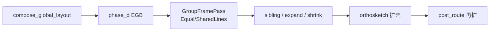
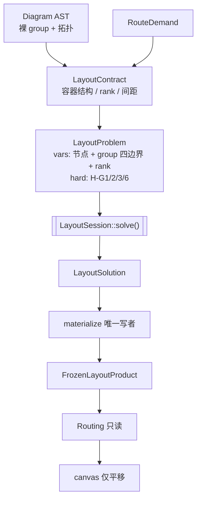
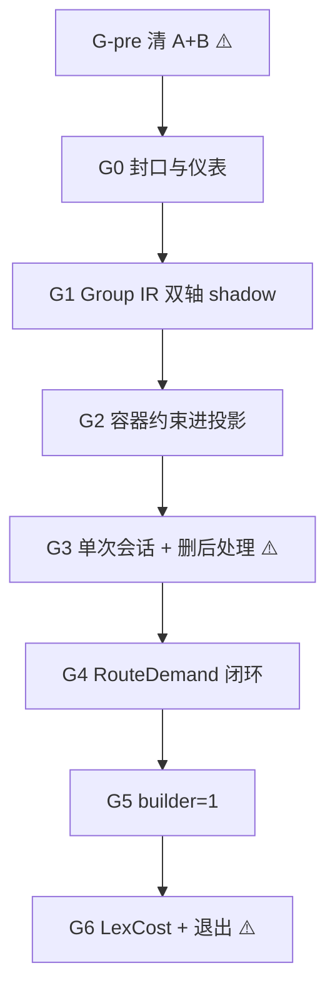

# Group 一等公民与终态收敛方案（2026-07）

> **定位**：[23-布局与路由第一性原理重构方案](23-布局与路由第一性原理重构方案-2026-07.md) 的续篇。
> 23 号完成了 Phase 0–6 的工程闭环与防再生机制（见 [30-Phase6-退出验证](30-Phase6-退出验证-2026-07.md)），
> 但**终态判据未兑现**：group 写权 ≠1、坐标求解 ≠1 次、builder ≠1、路由目标仍是加权和。
> 本文给出统一解法：**把 group 提升为一等公民**——它是与节点同级的**求解变量 / 结构容器**，
> 不是「节点摆完再套的边框」，也不是一组可调的几何遥控器。
>
> 对照基线：`benchmarks/baselines/2026-07-25-222401-first-principles-final`  
> 退出 tag：`group-first-class`

---

## 0. 前置决策（开工前门禁）

在动 IR / 求解器之前，**先清掉 group 的 hint 面与隐形美学**。这不是可选优化，而是本方案的前提。

### 0.1 决策 A — 删用户可写的 group 几何遥控器

删除（或停止消费）以下 DSL：

| 入口 | 例子 |
|---|---|
| diagram `group_frame:` | `stack { axis/track/cross/gap/border/snap }`、`matrix {…}`、短名 `strips/fit/lanes/stages/tiles` |
| group 排版动词 | `group { layout: horizontal \| vertical \| fan-out \| fan-in \| grid }` |

**已做（showcase）**：下列样例中的对应配置已删，结构只保留裸 `group` + 拓扑：

- `showcase/flowchart/product.swimlane-order-process.pgm`（`group_frame`）
- `showcase/architecture/product.data-pipeline.pgm`（`group_frame` + `layout:`）
- `showcase/architecture/demo.ai-agent-docops-pipeline.pgm`（同上）
- `showcase/architecture/demo.plotgram-core-mod-deps.pgm`（`layout:`）

### 0.2 决策 B — 删 recipe 默认美学（隐形 strips）

architecture **不再**默认 `TrackSizing::Equal` + `BorderAlign::SharedLines`；
flowchart **不再**靠 `group_frame` 默认堆叠策略伪装泳道。

过渡期 group 语义收缩为**诚实容器**：

- 框 = 成员包围 + padding
- 同级不重叠、父子嵌套、走廊间隙 = 硬约束 / RouteDemand
- **不做**等宽条带、边框共线、矩阵填格

> 产品观感会暂时变「朴素」。这是有意回退，G-pre / G3 窗口用 `raise product:` note 说明，
> **禁止**用后门把 Equal/SharedLines 加回 recipe 默认。

### 0.3 以后怎么补回「好看的版式」（本方案不做）

需要条带 / 表格 / 泳道时，**不**复活 `track/border/axis` 旋钮，而是扩展 **结构语义 DSL**
（例如将来的 `swimlane` / `table`）：声明「这是什么」，由 contract 编译成约束模板。

原则（现在只定边界，不实现）：

1. 它们是 **group 的特化角色 / 构造**，仍物化到同一套 `GroupVariable`，不另起写权。
2. **禁止**再暴露 `swimlane { track, gap, border }` 这类几何 hint。
3. 拓扑能稳定推断的继续推断；强美学必须显式结构声明，禁止 id 子串启发式。

本方案主路径 **不包含** `swimlane`/`table` 落地；记入 §9。

### 0.4 对执行计划的影响

| 旧口径（修订前） | 新口径 |
|---|---|
| G2 把 Equal/SharedLines **翻译**成 Equality 约束 | **不建** H-G4/H-G5；不实现 Equality 仅为 Frame |
| G3 保留 `GroupFrameSpec` 解析 + 约束编译 | **删除** `GroupFrameSpec` / `apply_group_frame` 生产路径 |
| architecture 默认 strips 美学保留 | **Fit / 朴素容器**；观感 diff 显式记账 |
| showcase 依赖 `group_frame` 需迁移语义 | showcase 配置已删；接受过渡观感 |

---

## 1. 问题陈述：group 今天是「后置边框 + 遥控器」

### 1.1 现状证据

`GroupLayout` 只是裸包围框（`types.rs:37-42`）：无父子、无角色、无 padding 变量。
父子在 AST；padding 在 `compute_group_bounds` 加进 w/h；存储为无序 `HashMap`。

写权链（architecture）：



`write_counter` 在 cloud-native 仍约 11；Phase 6 仅阈值 ≤3 WARN。
`GroupFrameSpec`（L1）+ `group.layout`（L2）+ recipe 默认美学叠加，使「最终框长什么样」依赖后处理组合，而不是一次求解。

### 1.2 违反的公理

| 公理 | 形态 |
|---|---|
| **A2** | 多 pass 写同一矩形 |
| **A3** | 框是派生值 → expand/shrink/realign 互修 |
| **A5** | `group_frame` / `algo == "architecture"` 默认分支把排版语义塞进内核周边 |
| **A4** | （并行债）路由仍 `f64` 加权和 |

### 1.3 为什么「再修 Frame」解决不了

Equal 与 sibling 消重叠互相拆台；SharedLines 与 EGB 扩壳抢左缘——每加约束就加纠正 pass。
在保留 hint/默认美学的前提下把它们「翻译成 Equality」只会把遥控器搬进 IR。
**正确顺序：先拆遥控器与隐形美学，再让容器进求解器。**

---

## 2. 目标终态：group = 容器变量

### 2.1 一句话

> **一次 layout run = 一次求解会话 = 一次几何物化。**  
> 节点中心、group 四边界、rank 轴是变量；容纳 / 嵌套 / 同级分离 / 走廊是硬约束；  
> `GroupTable` 仅由 materializer（+ canvas 平移令牌）写入。

### 2.2 IR 形态

```rust
pub struct GroupVariable {
    pub id: String,
    pub left: VarId,
    pub right: VarId,
    pub top: VarId,
    pub bottom: VarId,           // 双轴均必填
    pub parent: Option<GroupIx>,
    pub children: Vec<GroupIx>,
    pub members: Vec<String>,
    pub padding: GroupPadding,   // 约束参数，非事后加数
    pub role: GroupRole,         // 来自 LayoutContract；禁止 DiagramType
}
```

过渡期 `GroupRole` 以 `Container` 为主；将来 `Lane` / `TableCell` 等由**结构语义 DSL** 注入，
不由 hint 注入。

### 2.3 硬约束目录（本方案范围）

| ID | 含义 | 编码 |
|---|---|---|
| **H-G1** 容纳 | 成员 ⊆ 组框（含 padding） | `MinSeparation` / `LowerBound` |
| **H-G2** 嵌套 | 子组 ⊆ 父组 | 同 H-G1 |
| **H-G3** 同级分离 | sibling 不重叠，间隙 ≥ RouteDemand | `MinSeparation` |
| **H-G6** 画布 | 全体 ⊆ canvas | `UpperBound` |

**本方案不做：**

| 原编号 | 含义 | 处理 |
|---|---|---|
| ~~H-G4~~ 等宽/等高 | Equal track | 删除；将来由 `table`/`swimlane` 等结构模板引入时再开 |
| ~~H-G5~~ 共线 | SharedLines | 同上 |

量化：收敛后一次性 lattice rounding + 可行性复检；失败 → `SolverStatus::Degraded`（A6）。

### 2.4 目标分层（词典序，A4）

| 层 | 内容 |
|---|---|
| L0 | H-G1/2/3/6 |
| L1 | rank / 结构对齐（无等宽共线债） |
| L2 | 走廊与跨组边需求满足度 |
| L3 | 紧凑 |

### 2.5 写权封口

```rust
pub struct GroupTable(/* private */);
// 公开：get / iter_sorted；无 get_mut / insert
```

唯一写通道：`LayoutSolution::materialize()`；canvas finalize 仅平移令牌。
`write_counter` 为探针（阈值 3→1），主门是编译器。

---

## 3. 目标架构



| 今天 | 终态 |
|---|---|
| Frame 后处理整形 | 无 Frame；框由会话解出 |
| Equal/SharedLines 默认 | 朴素容器；结构美学留给未来语义 DSL |
| 路由后扩壳 | 溢出 → 会话内重解或 `Degraded` |
| 多处 `CoordinateProblem {` | 单一 builder |

---

## 4. 创新模式登记（`AGENTS.md` §7）

§8 已失效。本方案为架构级重写：

| 项 | 内容 |
|---|---|
| **目标维度** | ① 写权 →1；② builder →1；③ 删除 group hint/Frame 生产路径；④ 路由 → `LexCost` |
| **可接受临时退化** | **G-pre（清 A/B）**、**G3（会话切换）**、**G6（LexCost）**：product 质量 ≤25% 退化；`node_fp` 不要求持平；stress 不设限 |
| **红线** | 穿组=0；`det=true`；无图名特判；`cargo run -p plotgram-cli`；WASM 禁 `std::time` |
| **退出判据** | 相对 `first-principles-final`：**持平或更优**（朴素容器带来的美学 diff 须在 raise note 中与质量轨分开说明）；写权=1、builder=1 由 CI 保证 |
| **回滚触发** | 穿组>`0` / `det=false`，或窗口内退化 >25% 且下一阶段未收敛 |

每个窗口前后采基线（如 `--tag gfc-pre-open` / `gfc-pre-close`）。

---

## 5. 执行计划（G-pre → G0–G6）



---

### G-pre — 清 A + B（前置，⚠️ 观感窗口，约 2–3 天）

**目标**：生产路径不再消费 group 几何 hint，也不再施加 Equal/SharedLines 默认。

1. **DSL / 解析**
   - 停止消费 `group_frame`（解析可先变 no-op / 校验报「已移除」，再删类型）。
   - 停止消费 `group { layout: … }`；删除 `architecture_subnet_layout_hint` 等 id 启发式
     （`group_layout_hint.rs:84`）。
   - 组内排列只保留拓扑推断（`auto` 路径中的 fan-out/fan-in/链推断），无用户覆盖。
2. **Recipe 默认**
   - `resolve_group_frame_spec` / architecture 默认改为 **Fit + BorderAlign::None**
     （或直接绕过 `apply_equal_sizing` / `apply_border_align_for`）。
   - 删除 / 短路 `center_single_group_rows` 等依赖 Equal 观感的后处理（能删则删）。
3. **Showcase**：配置已删（§0.1）；确认无残留后采基线。
4. **文档**：`docs/guides/group-layout-and-frame.md` 标记失效或改为「容器-only」说明。

**退出判据**
- 生产路径 grep：`group_frame` 消费 =0；`TrackSizing::Equal` / `SharedLines` 生产调用 =0。
- 穿组=0 / `det=true`。
- `./benchmarks/snapshot.sh --tag gfc-pre-plain-container`，note 带  
  `raise product: remove group_frame hints + Equal/SharedLines defaults (plain container)`.
- 相对 `first-principles-final`：正确性 PASS；质量 diff 记入 raise，不假装持平。

---

### G0 — 封口与仪表补全（2–3 天）

1. `LayoutResult.groups` → `GroupTable` newtype；写者令牌化（附录 A）。
2. 补漏计：`compute_group_bounds`、canvas 平移、post_route 扩壳等。
3. `iter_sorted()` 唯一遍历入口。
4. CI：`check-group-writes.sh`（阈值自 G-pre 实测起，目标逐阶段 →1）。

**退出**：测试绿；写点可枚举；脚本进 CI。

---

### G1 — Group IR 完备：双轴 + 结构（3–4 天，shadow，零算法接线）

1. `GroupVariable` 四边界必填；`parent/children/members/padding/role`。
2. `attach_group_ir(problem, axis)`：Cross + Main 均挂 H-G1/H-G2。
3. 双轴 shadow 对拍 → `docs/优化重构/32-Group-IR-对拍清单-2026-07.md`
   （对拍对象已是**朴素容器**生产框，不再对拍 Equal 条带）。

**退出**：渲染字节相对 G-pre 不变（未接线）；清单覆盖 benchmark 集。

---

### G2 — 容器约束进投影（3–4 天，仍可不切生产写回）

**目标**：求解器能稳定投影 H-G1/2/3/6；**不**引入 Equality 为 Frame 服务。

1. 强化 / 接通 `project_group_constraints`（containment / sibling）。
2. RouteDemand → H-G3 的编译草稿（G4 完全闭环）。
3. 可选：`LatticeSnap` 作为收敛后一步（非 Frame 专属）。
4. **明确不做**：`apply_equal_sizing` / SharedLines → Equality 翻译层。

**退出**：shadow 路径下约束可行；确定性单测；生产写回仍可暂留旧 bounds 路径。

---

### G3 — 单次会话：切换写权 ⚠️（5–7 天）

1. `LayoutSession` / `LayoutSolution::materialize`（内部允许 Cross→Main 交替）。
2. **删除**生产后处理：
   - phase_d EGB（`merge_egb_groups` / `equalize_top_leaf_egb_deltas`）
   - `expand` / `shrink` / `resolve_all_sibling_overlaps` / `realign_group_rows`
   - **整段删除** `apply_group_frame` 与 `GroupFrameSpec` 生产路径（无「保留解析」）
3. `compose_global_layout` 只产出 contract 片段，不写最终框。
4. `GroupFramePass` 删除或缩成空壳后删。

**退出**
- 写权主计数 =1（`check-group-writes.sh`）。
- `group/frame/` 生产 LOC → **≤ 200**（或模块删除，仅留 padding/hierarchy 工具）。
- 穿组=0 / det；质量 ≤25% 窗口；`--tag gfc-g3-close`。

---

### G4 — RouteDemand 闭环（3–4 天）

1. 走廊/跨组需求 → H-G3；源头 `demand/corridor.rs`。
2. orthosketch **只出约束**，不写 groups。
3. 删 `post_route_shell_expand`；溢出 → `re_solve_with` 或 `Degraded`。
4. `FrozenLayoutProduct` 同时校验 groups 指纹。

**退出**：route 后 group 写点=0；相对 G3 质量不劣化。

---

### G5 — builder = 1（3–4 天）

1. 单一 `LayoutProblemBuilder`；flat / arch / intra / mindmap 只交 `LayoutContract`。
2. 删 mindmap 白名单。
3. CI：`check-builder-entry.sh`（构造点=1）。

**退出**：=1；四 recipe 相对 G4 持平。

---

### G6 — LexCost + 收口 ⚠️（5–6 天）

1. scorer → `LexCost`；罚项项数棘轮 ≤8。
2. LOC 收口：`recipes/architecture/` ≤5,000；ortho ≤9,000。
3. 退出命令：
   ```bash
   cargo check -p plotgram-core
   cargo test -p plotgram-core --lib
   ./benchmarks/scripts/check-penalty-ratio.sh
   ./benchmarks/scripts/check-semantic-isolation.sh
   ./benchmarks/scripts/check-group-writes.sh
   ./benchmarks/scripts/check-builder-entry.sh
   cargo run -p plotgram-cli -- render showcase/architecture/product.cloud-native.pgm -o /tmp/out.svg
   ./benchmarks/compare.sh benchmarks/baselines/2026-07-25-222401-first-principles-final.json <current>
   ./benchmarks/snapshot.sh --tag group-first-class
   ```
4. 写 `33-Group一等公民-退出验证`；手册补「group 是变量；无几何 hint」。

**终态判据**

| 判据 | 目标 |
|---|---|
| group 写入 | **1** |
| builder 构造点 | **1** |
| group 几何 hint 生产路径 | **0** |
| Equal/SharedLines 默认 | **0** |
| scorer | `LexCost` |
| product vs `first-principles-final` | 持平或更优（质量轨；美学另账） |
| 穿组 / det | 0 / true |

---

## 6. CI 门禁增量

| 脚本 | 断言 | 阶段 |
|---|---|---|
| （扩展）`check-semantic-isolation.sh` | 生产无 `group_frame` 消费；无 `SharedLines`/`TrackSizing::Equal` 调用 | G-pre |
| `check-group-writes.sh` | 主计数 ≤ 阈值 →1 | G0…G3 |
| `check-builder-entry.sh` | `LayoutProblem {` =1 | G5 |
| `check-penalty-ratio.sh` | 比≤100 且项数≤N | G6 |

---

## 7. 风险与默认决策

| 风险 | 决策 |
|---|---|
| G-pre 后 architecture「不好看」 | 接受；raise note；**禁止**加回默认 Equal |
| 泳道 showcase 失去水平条带 | 结构仍在；几何待未来 `swimlane` DSL；不临时加 hint |
| 容器约束过紧不可行 | 松弛 SpaceBudget/RouteDemand；H-G1/H-G2 不松；显式 Infeasible |
| G3 视觉 diff 大 | 窗口 ≤25%；按 recipe 切换 |
| 工期 | **最小交付 = G-pre + G0 + G1 + G2 + G3**；G4–G6 可第二轮 |

---

## 8. 与既有债的映射

| doc 23 / 30 债 | 落点 |
|---|---|
| 写权 =1 | G-pre 减过程链 + G0/G3 |
| 求解会话 =1 | G3 |
| builder =1 | G5 |
| A4 LexCost | G6 |
| Equal/SharedLines 过程链 | **G-pre 直接删除**（不再「翻译进 IR」） |

---

## 9. 明确不做 / 后续债

| 项 | 处理 |
|---|---|
| `swimlane` / `table` 等结构语义 DSL | **后续里程碑**；不进 G-pre…G6 |
| H-G4/H-G5 Equality | 仅随结构语义模板引入时再开 |
| 真 2D 联合矩阵 | 会话内 Cross/Main 交替；联合记债 |
| ortho ≤8k / arch ≤4k | 目标放宽见 G6；差额记债 |
| 全 crate `deny(dead_code)` | 关键路径脚本即可 |

---

## 附录 A — group 写点（G0 令牌化 / G3 删除）

| 位置 | 函数 | 处置 |
|---|---|---|
| `engines/common/group_bounds.rs` | `compute_group_bounds` | 令牌化；终态并入 materialize |
| `group/rect.rs` | `finalize_routing_groups` | 令牌化或删 |
| `macro_block.rs` | `compose_global_layout` | G3：改为 contract，不写最终框 |
| `phase_d.rs` | EGB merge/equalize | **G-pre/G3 删** |
| `group/frame/*` | expand/shrink/sibling/realign/`apply_group_frame` | **G-pre 停用 Equal/SharedLines；G3 删写路径** |
| `post_layout.rs` | `center_single_group_rows` | G-pre/G3 删 |
| `shell_expand.rs` | feedforward / post_route | G4：约束化 / 删除 |
| `canvas_finalize` / layered postprocess | 平移 | 保留平移令牌 |
