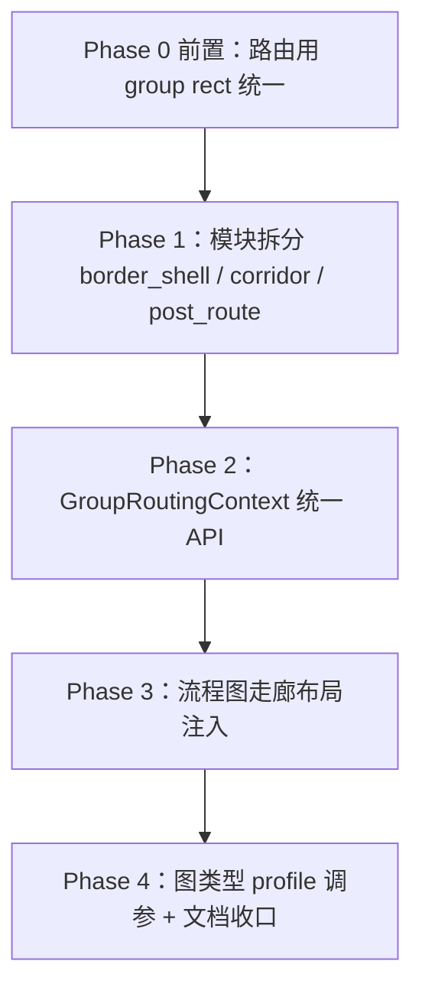

# 分组 Border Shell 共用与模块重构计划

> 版本：0.1 | 状态：**已实施**（Phase 0–4）
>
> 目标读者：布局 / 边路由开发者
>
> 关联文档：
> - [group-frame-spec.md](./group-frame-spec.md) — 组间**宏观几何**（等宽、共线、间距）统一层，与本计划互补
> - [orthogonal-routing-investment-plan.md](./orthogonal-routing-investment-plan.md) — P1-3 分组通道感知已落地；本计划在其之上做**抽象分层**与**跨图类型共用**
>
> 背景：架构图 `payment-clearing-platform` 验证表明 Border Shell（路径段 vs 分组边框关系分类 + 壳层约束）能有效抑制贴边平行。该模型与图类型无关，但代码仍集中在 `group_routing.rs`，且各布局路径产出的 `GroupLayout` 语义不一致，阻碍流程图等场景稳定共用。

---

## 1. 目标与非目标

### 1.1 目标

1. 将 Border Shell 提升为**独立、可测试的分组路由子系统**，供 orthogonal 评分、snap 投影、repulse 安全网统一消费。
2. 在共用前**统一「路由用的 group rect」来源**，使壳层约束对齐同一套视觉边框。
3. 让含 group 的**流程图**与**架构图**共享几何约束层；组间**排列策略**（堆叠 / 宏观分层）继续分场景。
4. 走廊（Corridor）支持**布局阶段注入** + **几何 fallback**，泳道图等场景不再仅靠事后反推。

### 1.2 非目标

- 不合并 `divide_and_conquer`（布局）与 Border Shell（路由）——阶段与职责不同。
- 不把流程图布局改成 `architecture_v2` 两阶段。
- 不实现 [group-frame-spec.md](./group-frame-spec.md) 中的 Group Frame 统一层（可并行，但不在本计划范围内）。
- 不做 S1「全路由器 ObstacleIndex 统一」（见 orthogonal 计划 v2.3）。

---

## 2. 现状摘要

### 2.1 Border Shell 已覆盖的能力

| 阶段 | 模块 | 说明 |
|------|------|------|
| 路由评分 / 硬过滤 | `edge_routing_orthogonal/scoring.rs` | `group_segment_violates_border_shell`、贴边平行、Interior/Crossing/Transit |
| 候选通道 | `edge_routing_orthogonal/path.rs` | `prefer_corridor_coord` |
| 路由后 snap | `grid_snap.rs` | `project_path_off_group_borders` |
| 路由后安全网 | `layout/mod.rs` | `repulse_edges_from_group_borders` |
| 走廊 hints | `edge_routing_orthogonal/mod.rs` | `GroupRoutingHints::from_groups` |

`should_snap` 白名单已含 `"flowchart"`，故流程图在**管线层**已间接使用 Phase B/D；orthogonal 路由对所有图类型共用同一 scorer。

### 2.2 主要问题

| 问题 | 影响 |
|------|------|
| **`GroupLayout` 多源产出** | 分治流程图、two_phase 架构图、Sugiyama `compute_group_bounds`、snap 后 `refresh_layout_bounds` 各自建框，padding / header 规则不完全一致 |
| **`group_routing.rs` 职责混杂** | 几何分类、走廊推导、snap 投影、repulse、常量定义同文件 ~700 行 |
| **常量别名重复** | `GROUP_BORDER_SHELL_PAD` vs `scoring::GROUP_OBSTACLE_PAD` |
| **走廊仅几何反推** | `build_corridors_from_groups` 对泳道「已知 group_gap」未利用布局阶段信息 |
| **`node_to_groups` 构建散落** | 仅在 `route_edges_orthogonal` 内构建，非共享上下文 |

### 2.3 group rect 来源对照（路由相关）

| 布局路径 | 产出位置 | 备注 |
|----------|----------|------|
| Sugiyama / flowchart 无 group | `group_bounds::compute_group_bounds` | 含 `GroupPadding`、嵌套、标题区 |
| flowchart 分治 | `group_divide.rs` 合并阶段手写 `GroupLayout` | `content_*` 与 padding 公式对齐，但**未调用** `compute_group_bounds`；`x/y` 为堆叠偏移 |
| architecture_v2 two_phase | `two_phase.rs` `compose_global_layout` | block 尺寸；后续 pipeline 可能再 `compute_group_bounds` |
| architecture_v2 pipeline | `pipeline.rs` / `group_sizing.rs` | uniform 等后处理 |
| snap / refine 之后 | `grid_snap::refresh_layout_bounds` | 节点位移后重算；架构图走 `refresh_groups_with_sizing` |

**风险**：Border Shell 的 `d=0` 参考线与 SVG 描边对齐依赖「路由读到的 rect」与「渲染读到的 rect」一致；多源产出会导致架构图修好、流程图仍贴边或反之。

---

## 3. 分阶段计划总览



| 阶段 | 主题 | 预估体量 | 可独立合并 |
|------|------|----------|------------|
| **Phase 0** | 路由用 group rect 统一 + 不变量测试 | 中 | ✅ 应先做 |
| **Phase 1** | `layout/group/` 模块拆分 | 中 | ✅ |
| **Phase 2** | `GroupRoutingContext` + 调用方收敛 | 小 | 依赖 Phase 1 |
| **Phase 3** | 流程图 / 泳道走廊注入 | 中 | 依赖 Phase 0 |
| **Phase 4** | Profile 常量、回归基线、文档 | 小 | 可渐进 |

---

## 4. Phase 0 — 前置：统一路由用 group rect

> **原则**：凡进入边路由、Border Shell、snap 投影、repulse 的 `LayoutResult.groups`，必须来自**单一规范函数**，且与渲染使用的 group 包围框一致。

### 4.1 定义「路由用 GroupRect」契约

在 `layout/node/common/group_bounds.rs`（或新建 `layout/group/rect.rs`）明确：

```text
RoutingGroupRect = f(diagram, nodes, layout_algo, padding_profile) -> HashMap<String, GroupLayout>
```

契约条款：

1. **输入**：全局节点坐标（已含组间偏移）、`Diagram` 分组树、算法对应的 `GroupPadding`。
2. **输出**：每个 group 的 `(x, y, width, height)` 与 `compute_group_bounds` 语义一致（含标题区、嵌套父组包住子组）。
3. **禁止**：路由阶段手写 `GroupLayout { x: offset, width: content_width }` 而不经过统一函数。
4. **snap 后**：仅通过 `refresh_layout_bounds` / 等价路径刷新，不保留过时 rect。

### 4.2 具体改造项

| # | 任务 | 文件 | 验收 |
|---|------|------|------|
| 0.1 | 抽取 `finalize_routing_groups(diagram, nodes, algo, padding) -> HashMap<String, GroupLayout>` | `group_bounds.rs` 或 `layout/group/rect.rs` | 与现有 `compute_group_bounds` 结果一致（架构 / Sugiyama 快照测试） |
| 0.2 | flowchart 分治合并后改为：先合并节点全局坐标，再调用 `finalize_routing_groups` | `flowchart/group_divide.rs` | 删除手写 `GroupLayout`；`refresh_layout_bounds` 后 gap 无系统性偏差（注释中已描述的 padding 偏差归零） |
| 0.3 | architecture `compose_global_layout` 产出 groups 后，在 pipeline 入口统一一次 `finalize_routing_groups`（若与 block 框等价则 assert 相等） | `architecture_v2/two_phase.rs`, `pipeline.rs` | 两路径 rect 差异 < EPS 或明确文档化唯一权威源 |
| 0.4 | 路由前断言（debug only）：`groups` 非空时每个 group 成员节点均在 rect 内（容差内） | `layout/mod.rs` 或 orthogonal 入口 | debug 构建下违规即 panic / log |
| 0.5 | **不变量测试** `routing_group_rect_matches_render` | 新测试模块 | 对 showcase 样例：layout → export scene group bbox 与 `LayoutResult.groups` 一致 |

### 4.3 Phase 0 回归样例

| 样例 | 路径 | 关注点 |
|------|------|--------|
| 支付清结算 | `showcase/architecture/c.payment-clearing-platform.dfy` | 贴边段计数（壳层 d&lt;12px）不劣化 |
| 泳道订单 | `showcase/flowchart/c.swimlane-order-process.dfy` | 组间缝与 `group_gap: 80` 一致 |
| 退款流程 | `showcase/flowchart/c.customer-refund-process.dfy` | 分治三阶段 group 框与节点不溢出 |
| CI 流水线 | `showcase/flowchart/c.ci-cd-security-pipeline.dfy` | 垂直堆叠 group 走廊 |

### 4.4 Phase 0 完成标准

- [ ] 代码库中**无**边路由热路径上手写 `GroupLayout`（测试 fixture 除外）。
- [ ] flowchart 分治与 `compute_group_bounds` 对同一合成图产出相同 rect（给定相同 padding）。
- [ ] `cargo test -p drawify-core --lib` 全绿，且新增 ≥2 个 rect 不变量测试。

---

## 5. Phase 1 — 模块拆分

将 `layout/group_routing.rs` 拆为 `layout/group/` 子模块，**行为不变**，仅移动与 re-export。

### 5.1 目标目录结构

```text
crates/drawify-core/src/layout/group/
  mod.rs              # GroupRoutingHints、对外 re-export、模块文档
  border_shell.rs     # 关系分类、贴边检测、stub 区、violates 判定
  corridor.rs         # GroupCorridor、build_corridors_from_groups、prefer、penalty
  post_route.rs       # project_path_off_group_borders、repulse_edges_from_group_borders
  constants.rs        # GROUP_BORDER_SHELL_PAD、PORT_STUB_CLEARANCE、EPS
```

原 `group_routing.rs` 改为 `pub mod group { ... }` 的薄封装，或删除并由 `layout/mod.rs` 直接 `pub mod group`，保留 `group_routing` 类型别名一个版本周期（本项目无向后兼容约束，可直接改调用方）。

### 5.2 模块边界

| 模块 | 依赖 | 不依赖 |
|------|------|--------|
| `border_shell` | `GroupLayout`、常量 | `EdgeLayout`、`Diagram`、HashMap 迭代（组列表由调用方排序传入） |
| `corridor` | `GroupLayout` | orthogonal 内部类型 |
| `post_route` | `border_shell`、`GroupLayout`、`EdgeLayout` | scoring |
| `mod` | 以上全部 | — |

### 5.3 常量收敛

- 删除 `scoring.rs` 中 `GROUP_OBSTACLE_PAD` 别名，统一引用 `group::constants::GROUP_BORDER_SHELL_PAD`。
- `PORT_STUB_CLEARANCE` 与 `edge_routing_orthogonal::PORT_CLEARANCE` 保留一处定义，另一处 `pub use` 或 `const` 断言相等。

### 5.4 Phase 1 完成标准

- [ ] `group_routing.rs` 删除或 &lt;50 行 re-export。
- [ ] `border_shell` 单元测试随文件迁移（含 stub 区 16px 用例）。
- [ ] 全量测试无行为变化（贴边计数基线不变）。

---

## 6. Phase 2 — GroupRoutingContext 统一 API

### 6.1 上下文结构

```rust
/// 边路由阶段的分组障碍上下文（构建一次，scorer / path / 后处理共用）
pub struct GroupRoutingContext {
    pub groups: HashMap<String, GroupLayout>,
    pub node_to_groups: HashMap<String, Vec<String>>,
    pub border_shell_pad: f64,
    pub stub_clearance: f64,
    pub corridors: Vec<GroupCorridor>,
}
```

构建入口：

```text
GroupRoutingContext::from_layout(diagram, result) -> Self
```

职责：

1. 从 `Diagram` 确定性构建 `node_to_groups`（现位于 `route_edges_orthogonal` 内，迁出）。
2. 走廊：`result.hints.group_routing` 若已有则采用，否则 `build_corridors_from_groups` fallback。
3. 暴露 `segment_violates(&self, path, segment_index, endpoint_groups)` 等薄包装。

### 6.2 调用方收敛

| 调用方 | 改动 |
|--------|------|
| `scoring.rs` | `obstacle_penalty` / `path_is_clean` 接收 `&GroupRoutingContext` |
| `path.rs` | `RoutingContext` 持 `group_ctx` 或 corridors 引用 |
| `grid_snap.rs` | `snap_edge_waypoints` 接收 `&GroupRoutingContext`（或 pad + groups） |
| `layout/mod.rs` | repulse 使用同一 pad / stub 来源 |

### 6.3 Phase 2 完成标准

- [ ] `node_to_groups` 仅在一处构建。
- [ ] orthogonal mod 内无直接 `group_segment_violates_border_shell` 的 5+ 参数调用。
- [ ] 新增 `GroupRoutingContext` 构建的确定性测试（成员顺序、走廊顺序）。

---

## 7. Phase 3 — 流程图走廊布局注入

### 7.1 动机

泳道图（`group_arrangement: horizontal`）在 `StackingArrangement` 中已知：

- 相邻 group 的排列轴（水平 / 垂直）
- `group_gap` 数值
- 每组 offset

比 `build_corridors_from_groups` 事后用包围框邻接反推更准。

### 7.2 改造项

| # | 任务 | 文件 |
|---|------|------|
| 3.1 | `StackingArrangement::arrange` 返回 `Vec<GroupCorridor>`（或写入 `LayoutHints`） | `flowchart/group_divide.rs` |
| 3.2 | `GroupRoutingHints` 支持 `corridors: Vec<GroupCorridor>` **合并**：布局注入优先，几何 fallback 补全未覆盖的邻接对 | `group/corridor.rs` |
| 3.3 | architecture two_phase 可选注入宏观 rank 间竖缝走廊（与 Phase C 现有逻辑对齐） | `architecture_v2/two_phase.rs`（可选） |

### 7.3 流程图专用配置（初版）

| 属性 | 建议 |
|------|------|
| `group_arrangement: horizontal` | 走廊轴 **Vertical**，coord = 邻组缝中线 |
| `group_arrangement: vertical`（默认） | 走廊轴 **Horizontal**，coord = 邻组缝中线 |
| `corridor_misalignment_penalty` | 流程图可略低于架构图（profile 级，Phase 4） |

### 7.4 Phase 3 回归

- 泳道图跨 lane 边应优先走组间缝，贴边段计数 ≤ 架构图基线。
- 分治垂直堆叠流程图：组间水平走廊与 `group_gap` 对齐。

### 7.5 Phase 3 完成标准

- [ ] `c.swimlane-order-process` 渲染后，跨 group 边的主干段 x 坐标落在 `[缝中线 ± 8px]`。
- [ ] `LayoutHints.group_routing` 在 flowchart 分治路径上**布局结束即非 None**（不只靠路由阶段补写）。

---

## 8. Phase 4 — Profile 调参与文档收口

### 8.1 图类型级默认（`LayoutProfile` 或 orthogonal config）

| 参数 | 架构图 | 流程图 | 说明 |
|------|--------|--------|------|
| `border_shell_pad` | 12 | 12 | 与 stroke 居中对齐 |
| `stub_clearance` | 16 | 16 | 对齐 `PORT_CLEARANCE` |
| `corridor_misalignment_penalty` | 120 | 80（待评） | 泳道更依赖走廊 |
| `repulse_max_rounds` | 2 | 2 | 可观测后再调 |

### 8.2 文档更新

- 更新 `layout/readme.md` 边路由章节：Border Shell 数据流图。
- 在 [group-frame-spec.md](./group-frame-spec.md) 增加交叉引用：Group Frame 管「框怎么摆」，Border Shell 管「边怎么绕框」。
- 更新 `orthogonal-routing-investment-plan.md` 附录：P1-3 后续演进指向本文。

### 8.3 可选观测

- `OrthoDebugStats` 增加 `border_shell_reject_count`、`hug_segment_count`（路由后统计），便于 benchmark 回归。

---

## 9. 测试策略

### 9.1 单元测试（随 Phase 迁移）

| 测试类 | 位置 |
|--------|------|
| Border Shell 关系分类 | `group/border_shell.rs` |
| stub 区 16px 豁免 | `border_shell` + `scoring` 各 1 |
| 走廊推导 / 合并 | `group/corridor.rs` |
| 投影 / repulse | `group/post_route.rs` |

### 9.2 集成 / 快照

| 测试 | 说明 |
|------|------|
| `routing_group_rect_invariant` | layout groups == render groups |
| `payment_clearing_hug_segments` | 壳层贴边段 ≤ 阈值（当前基线：0） |
| `swimlane_corridor_alignment` | 跨 lane 边坐标在缝附近 |

### 9.3 确定性（AGENTS.md §2）

- 所有 group 迭代：`group_id` 排序或 `IndexMap`。
- 走廊合并：注入走廊先于 fallback，同 coord 按 `(group_a, group_b)` 排序去重。

---

## 10. 风险与缓解

| 风险 | 缓解 |
|------|------|
| Phase 0 改变 flowchart group 框，节点视觉溢出 | 先跑 showcase 目视 + `detect_group_layout_warnings` |
| 模块拆分 PR 过大 | Phase 1 纯移动，零逻辑变更，单独 PR |
| 走廊注入与几何 fallback 冲突 | 明确优先级：注入 &gt; fallback；重复 coord 取 span 并集 |
| 与 Group Frame 规范重叠 | 本文管路由几何；Group Frame 管布局后处理，边界见 §1.2 |

---

## 11. 建议排期（仅供参考）

| 周次 | 内容 |
|------|------|
| W1 | Phase 0：`finalize_routing_groups` + flowchart 分治接入 + 不变量测试 |
| W2 | Phase 1：模块拆分 + 常量收敛 |
| W3 | Phase 2：`GroupRoutingContext` + 调用方收敛 |
| W4 | Phase 3：泳道走廊注入 + showcase 回归 |
| W5 | Phase 4：profile 调参 + 文档 + benchmark 基线 |

---

## 12. 检查清单（实施前必读）

- [ ] 已阅读 [group-frame-spec.md](./group-frame-spec.md)，确认本计划不重复实现 Group Frame 层
- [ ] Phase 0 未完成前，不宣传「流程图已完整共用 Border Shell」
- [ ] 任何新 group rect 来源必须经 `finalize_routing_groups`（或后续正式命名）
- [ ] 布局迭代顺序不依赖 `HashMap` 默认顺序
- [ ] 重构 PR 附带贴边段计数或目视截图对比

---

## 附录 A：Border Shell 数据流（目标态）

```text
Diagram + LayoutResult.nodes
        │
        ▼
 finalize_routing_groups()  ──► LayoutResult.groups（权威 rect）
        │
        ├─► LayoutHints.group_routing（走廊，布局可注入）
        │
        ▼
 GroupRoutingContext::from_layout()
        │
        ├─► orthogonal scorer / path_is_clean
        ├─► snap_edge_waypoints → project_path_off_group_borders
        └─► repulse_edges_from_group_borders
```

## 附录 B：与 `divide_and_conquer` 的分工

| 层 | 模块 | 阶段 |
|----|------|------|
| 组内 / 组间排列 | `divide_and_conquer`、`group_divide`、`two_phase` | 节点坐标 |
| 组框几何 | `group_bounds` / `finalize_routing_groups` | group rect |
| 边 vs 框 | `group/border_shell` | 路由 + 后处理 |

二者通过 **`LayoutResult.groups` + `LayoutHints.group_routing`** 交接，不合并代码模块。
