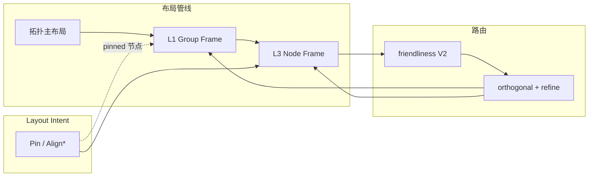

# Group Frame 统一规范（草案）

> 版本：0.3 | 状态：待评审（v0.3 完成 P2 收尾 + P3 Matrix 排列算法 + 嵌套 sub-frame 递归；v0.2 结合代码现状修订：补 V2 双路由管线、节点联动分级、PinSet 保护、Border Shell handoff 契约、命名碰撞修正）
>
> 目标读者：布局算法开发者、DSL 维护者、Agent 布局建议层
>
> 背景：回应「`uniform` / `stack` / `grid_snap` 等概念不统一、缺少顶层抽象」的问题。本文提出 **Group Frame** 作为组间宏观几何的统一概念，并厘清与组内排列、节点 snap、Layout Intent 的边界。
>
> 相关：[group-border-shell-refactoring-plan.md](./group-border-shell-refactoring-plan.md) — **Group Frame** 管「框怎么摆」；**Border Shell** 管「边怎么绕框」（handoff 契约见 §7.1）。

---

## 1. 问题陈述

### 1.1 用户诉求（单一心智模型）

架构图与含 group 的流程图，用户期望的视觉效果可以概括为：

> **Group 框整齐** — 宽度/高度一致或按规则分配、相邻边框共线、组间间距均匀、最终落在像素格上。

这一诉求在代码中被拆成多套互不从属的实现与 DSL 属性，缺少统一名词与单一管线阶段。

### 1.2 现状：三套语言描述同一件事

| 用户心智 | 现有 DSL / 代码 | 作用对象 | 主要位置 |
|----------|----------------|----------|----------|
| 组间横/竖排列 | `group_arrangement` + `StackingArrangement` | 流程图 group | `flowchart/group_divide.rs` |
| 组宽等宽 | `group_sizing: uniform` | 架构图顶层（+嵌套） | `architecture_v2/group_sizing.rs` |
| 组内网格排布 | `group layout: grid` | 架构图**组内节点** | `group_layout_hint.rs` |
| 节点层对齐 | `grid_snap` / `snap: true` | **节点** rank/layer 轴 | `grid_snap.rs` |
| 组框像素量化 | `snap_group_bounds` + `align_group_borders` | **group 边框** | `grid_snap.rs` |
| 顶层左缘对齐 | `align_top_groups_horizontally` | 架构图顶层 | `architecture_v2/pipeline.rs` |
| 用户指定节点对齐 | `align_vertical` / `align_horizontal` | 任意节点 | `intent/geometric.rs` |

### 1.3 命名过载

| 名称 | 实际含义（≥2 种） |
|------|-------------------|
| **grid** | ① 节点 8px snap（`grid_snap`）② 组内矩阵排布（`GroupLayoutHint::Grid`）③ 本文提议的 track 框格（尚未实现） |
| **uniform** | ① `group_sizing: uniform`（组间等宽）② `GroupPadding::uniform()`（内边距）③ `uniform_initial_positions()`（层内均分） |
| **align** | ① flowchart `group_align` ② architecture 多种 `align_*` ③ Intent `AlignVertical` ④ `align_group_borders` |

### 1.4 管线层缺失

```
┌─────────────────────────────────────────────────────────────┐
│ 拓扑布局（Sugiyama / two_phase / group_divide）              │  各算法各自为政
├─────────────────────────────────────────────────────────────┤
│ 【缺失】Group Frame — 组间宏观几何统一层                      │  ← 本文要补的概念
├─────────────────────────────────────────────────────────────┤
│ grid_snap（节点）+ snap_group_bounds（组框量化）              │  名字像一层，职责混杂
├─────────────────────────────────────────────────────────────┤
│ Intent geometric / friendliness V2 / refine                   │  会推节点，破坏上文成果
└─────────────────────────────────────────────────────────────┘
```

典型时序问题（架构图）：

1. `two_phase` 内 `apply_uniform_group_width`
2. `grid_snap` → `snap_group_bounds` → 可能破坏边框共线
3. V2 / `refine` 推节点，不更新 group
4. `refresh_groups_with_sizing` 补丁式恢复 uniform

流程图则缺少 `group_sizing`，仅靠 `StackingArrangement` 的 `max_width` 隐式实现类似效果，**语义不对等**。

---

## 2. 设计目标与非目标

### 2.1 目标

| 目标 | 说明 |
|------|------|
| **概念统一** | 组间「排列 + 尺寸 + 对齐 + 间距」归入 `GroupFrameSpec` |
| **管线单一** | 固定 `apply_group_frame()` 插入点，可重复执行（路由后恢复） |
| **图种一致** | architecture / flowchart 共享同一套 Frame 语义；算法差异只在「谁提供初始坐标」 |
| **确定性** | 排序键、tie-break 不依赖 `HashMap` 迭代序（见 `AGENTS.md` §2） |
| **节点联动（分级）** | 调整 group 框时节点联动按操作分级（见 §3.1 执行语义）：`track_sizing` 调整**必须**同步平移/居中组内节点；`border_align` / `quantize` 微调（≤1 `step`）**允许**只改 `GroupLayout` 不动节点（边框吸附，靠 width/height 补偿保持远端不变）。后者若强行平移节点会破坏 L3 snap 成果 |
| **PinSet 保护** | L1 Pass 必须尊重 `PinSet`：被 `Pin` / `Align*` 意图保护的节点，L1 不得平移（当前 `apply_uniform_to_layout_result` / `align_top_groups_horizontally` 均未读 PinSet，属 P1 新增功能） |

### 2.2 非目标

- ❌ 完整 CSS Grid 引擎（`auto-fill`、`minmax()`、dense、`subgrid` 全语法）
- ❌ 替代 Sugiyama / 拓扑宏观定位（组间**位置**仍由图结构驱动；Frame 只做**整形**）
- ❌ 替代 Layout Intent 的语义约束（Intent 管「用户要什么关系」；Frame 管「框看起来齐」）
- ❌ 替代 friendliness / refine（管路由质量，与 Frame 正交）

---

## 3. 三层 Frame 模型

将「整齐」拆成三个**正交层级**，避免再混用 `grid` 一词：

```
┌──────────────────────────────────────────────────────────┐
│  L1  Group Frame（组间）   — 顶层/同级 group 的 track 几何  │
├──────────────────────────────────────────────────────────┤
│  L2  Intra Frame（组内）   — 单 group 内节点的排列模式      │
├──────────────────────────────────────────────────────────┤
│  L3  Node Frame（节点）   — rank/layer 对齐 + 像素量化     │
└──────────────────────────────────────────────────────────┘
```

### 3.1 L1 — Group Frame（组间宏观几何）

**定义**：在同一「组间容器」（通常为 diagram 顶层，或同一 parent group 下的子 group 集合）上，对 **group 边框** 施加的排列与尺寸约束。

**核心结构**（Rust 示意）：

```rust
/// 组间 Frame 规格（从 DSL / 默认值解析）
#[derive(Debug, Clone)]
pub struct GroupFrameSpec {
    /// 主排列：一维 stack 或（二期）二维 matrix
    pub arrangement: GroupArrangement,
    /// 主方向 track 的尺寸策略（stack 的 cross 轴或 matrix 的 column/row）
    pub track_sizing: TrackSizing,
    /// 交叉轴对齐（stack 模式下：vertical stack → 水平对齐）
    ///
    /// **语义耦合**：仅在 `TrackSizing::Fit` 下有意义；`Equal` 时所有 track 等宽，
    /// cross 轴几何已由 sizing 决定，`cross_align` 退化为「组内内容在 track 内的对齐」。
    pub cross_align: CrossAlign,
    /// 组间净间距（gutter）
    pub gap: f64,
    /// 组内 padding：Frame 消费 `compute_group_bounds` 产出的 `GroupLayout.width`，
    /// 该 width 已含 padding。Frame 不直接读 padding，但 Equal 的 `max(content)`
    /// 隐含 padding 参与。此处保留字段供二期 `Fixed` sizing 与报告诊断使用。
    pub padding: GroupPadding,
    /// 边框共线策略
    pub border_align: BorderAlign,
    /// 像素量化（可与 L3 合并配置）
    pub quantize: QuantizeSpec,
}

#[derive(Debug, Clone)]
pub enum GroupArrangement {
    /// 一维堆叠（流程图阶段图 / 泳道 / 架构顶层条带）
    Stack { axis: Axis },
    /// 二期：显式行列（多行多列 group 矩阵）。
    ///
    /// 命名用 `Matrix` 而非 `Grid`，避免与 L2 `GroupLayoutHint::Grid`（组内矩阵）
    /// 及 L3 `grid_snap`（节点 8px snap）三层「grid」歧义（见 §1.3）。
    Matrix { rows: Option<u32>, cols: Option<u32> },
}

#[derive(Debug, Clone, Copy, PartialEq, Eq)]
pub enum TrackSizing {
    /// 每 track 贴合内容（默认）
    Fit,
    /// 同级 track 等宽/等高（现 `group_sizing: uniform`）
    Equal,
    /// 固定尺寸（二期）
    Fixed(f64),
}

#[derive(Debug, Clone, Copy, PartialEq, Eq)]
pub enum CrossAlign {
    Start,   // 现 flowchart group_align: left / architecture 左缘对齐
    Center,  // 现 group_align: center
    End,
    Stretch, // 二期：拉满 cross 轴
}

#[derive(Debug, Clone, Copy, PartialEq, Eq)]
pub enum BorderAlign {
    None,
    /// 同级 group 同侧边框共线（左/顶优先）
    SharedLines,
}

#[derive(Debug, Clone)]
pub struct QuantizeSpec {
    pub enabled: bool,
    pub step: f64,           // 默认 8.0
    pub quantize_groups: bool,
    pub quantize_nodes: bool, // L3 是否由同一配置驱动
}

/// 组内 padding（与 `node::common::group_bounds::GroupPadding` 对齐）。
///
/// 非对称：architecture 用 (x=28, y_top=48, x_delta=56, y_delta=76)；
/// flowchart/sugiyama 用 `uniform(group_padding, header_height)`。
/// Frame 不直接施加 padding，而是消费 `compute_group_bounds` 的结果。
#[derive(Debug, Clone, Copy)]
pub struct GroupPadding {
    pub x: f64,
    pub y_top: f64,
    pub x_delta: f64,
    pub y_delta: f64,
}
```

**执行语义**（`apply_group_frame`）：

1. 收集目标 group 集合（按 parent 分层，默认顶层）
2. 按 `arrangement` 确定主序（拓扑序 + 稳定 tie-break）
3. 按 `track_sizing` 计算各 track 尺寸（`Equal` → `max(content)`，content = `GroupLayout.width`，已含 padding）
4. 按 `cross_align` 放置 cross 轴偏移（仅 `Fit` 下生效；`Equal` 时 track 已等宽，`cross_align` 作用于组内内容居中）
5. 按 `gap` 累加主序偏移
6. **节点联动（分级）**：
   - `track_sizing` 调整（`Equal` 拉齐宽度）→ **必须**同步平移/居中组内节点（现 `apply_uniform_to_layout_result` 行为）
   - `border_align` / `quantize` 微调（≤1 `step`）→ **允许**只改 `GroupLayout`（x + width 联动保持远端不变），不动节点；需保证不溢出成员
   - **PinSet 保护**：被 `Pin` / `Align*` 保护的节点，上述平移一律跳过（P1 新增；当前实现未读 PinSet）
7. `border_align` + `quantize` 收尾
8. 必要时 `compute_group_bounds` 校验成员包含性

### 3.2 L2 — Intra Frame（组内排列）

**定义**：单个 group **内部**节点的布局模式。与 L1 无关，仅影响组内 Sugiyama / 网格 / fan-out 等。

| 现名 | 建议保留 DSL | 说明 |
|------|-------------|------|
| `GroupLayoutHint::Horizontal` | `layout: horizontal` | 单层横排 |
| `GroupLayoutHint::Vertical` | `layout: vertical` | 单层竖排 |
| `GroupLayoutHint::Grid` | `layout: matrix`（**更名建议**，避免与 L1/L3 混淆） | 组内同质节点矩阵 |
| `GroupLayoutHint::FanOut` / `FanIn` | 不变 | 拓扑特化 |

**原则**：L1 **整形 Pass**（`apply_group_frame`）在主布局算法**之后**消费；但主布局算法内部可产出 L1 初始近似（如 flowchart `StackingArrangement` 在 `divide_flowchart_with_groups` 内部已完成 stack offset + cross 对齐）。整形 Pass 负责将「主布局产出的近似」收敛到 `GroupFrameSpec` 的最终几何。禁止在 L2 模块内直接改 sibling group 的几何。

### 3.3 L3 — Node Frame（节点对齐与量化）

**定义**：对 **节点**（及边 waypoint）的 rank 轴对齐、layer 轴槽位、8px 量化。

对应现 `grid_snap.rs`：

| 现函数 | L3 职责 |
|--------|---------|
| `snap_layout_to_grid` | rank/layer 轴对齐 + 层内 overlap 消除 |
| `snap_group_bounds` | **应迁移至 L1** 的 quantize 步骤 |
| `align_group_borders` | **应迁移至 L1** 的 `border_align` |
| `snap_edge_waypoints` | 边通道轴量化（路由后） |

**命名建议**（实施期）：模块重命名为 `node_frame.rs` 或保留 `grid_snap` 但在文档中标注为 **L3 Node Frame**。

---

## 4. 现有能力映射表

### 4.1 DSL → GroupFrameSpec（一期可表达子集）

| 现有 DSL | 图种 | GroupFrameSpec 字段 |
|----------|------|---------------------|
| `group_arrangement: vertical` | flowchart | `Stack { axis: Vertical }` |
| `group_arrangement: horizontal` | flowchart | `Stack { axis: Horizontal }` |
| `group_gap: N` | flowchart | `gap: N` |
| `group_align: center \| left` | flowchart | `cross_align: Center \| Start` |
| `group_sizing: uniform` | architecture | `track_sizing: Equal` |
| `group_sizing: fit` | architecture | `track_sizing: Fit` |
| `snap: true \| false` | 全局 | `quantize.enabled` |
| （无） | flowchart | 缺 `track_sizing: Equal` → 一期应补齐 |

### 4.2 代码 → 迁移目标

| 现有实现 | 层级 | 迁移至 |
|----------|------|--------|
| `StackingArrangement` | L1 | `GroupFramePass` 内 stack 求解器 |
| `apply_uniform_group_width` | L1 | `TrackSizing::Equal` |
| `apply_uniform_to_layout_result` | L1 | 同上（LayoutResult 路径） |
| `align_top_groups_horizontally` | L1 | `CrossAlign::Start` + `BorderAlign::SharedLines` |
| `snap_group_bounds` | L1 quantize | `QuantizeSpec::quantize_groups` |
| `align_group_borders` | L1 | `BorderAlign::SharedLines` |
| `refresh_groups_with_sizing` | L1 恢复 | `apply_group_frame` 幂等重入 |
| `RoutingFriendlinessEvaluator` | — | 不迁入；路由友好性正交 |
| `AlignVertical` / `Pin` intent | L3 保护 | `PinSet` 传入 L3，L1 跳过 pinned 组内节点。**注意**：当前 `apply_uniform_to_layout_result` / `align_top_groups_horizontally` 均未读 PinSet，属 **P1 新增功能**（见 §9 A7） |

### 4.3 流程图 vs 架构图：统一后差异

| 维度 | flowchart | architecture |
|------|-----------|--------------|
| 初始坐标来源 | `group_divide` 分治 + stack offset | `two_phase` 宏观定位 |
| GroupFrame 输入 | stack 已近似部分 L1 语义 | two_phase 后需 Equal/左对齐 |
| 一期默认 Spec | `Stack(V) + Fit + Center + gap=60` | `Stack(H) + Fit + Start`；uniform 时 `Equal` |
| 嵌套 group | 分治递归 | two_phase 嵌套 rank 内 Equal |

**关键**：差异仅在「谁算第一版坐标」，**整形 Pass 共用同一实现**。

**architecture `Start` 对齐的现状**：当前 `align_top_groups_horizontally` 在 pipeline Phase 7 **无条件执行**（不依赖 `group_sizing`），即左缘对齐是硬编码行为。迁移后由 `cross_align: Start` 表达，需移除 pipeline 中的无条件调用，改由 `apply_group_frame` 统一施加。

---

## 5. 管线集成

### 5.1 目标管线（`compute_layout_with_plan`）

```text
parse LayoutPlan + diagram attrs
    ↓
resolve GroupFrameSpec（diagram 级 + 算法默认值）
    ↓
主布局算法（Sugiyama / two_phase / group_divide / …）
    ↓
apply_geometric_refinement（Intent Pin / Align*）→ PinSet
    ↓
apply_node_frame（L3：rank/layer snap，respect PinSet）
    ↓
recompute group bounds from nodes（L3→L1 数据流桥梁）
    ↓
apply_group_frame（L1：Equal / border / quantize groups）   ← 第 1 次（路由前）
    ↓
friendliness V1 评估
    ↓
┌─ V2 启用且改变布局 ─────────────────────────────┐
│  result_v2 = FriendlinessAdjuster.apply()       │
│  result_pre_v2 = baseline（V2 前）              │
│                                                  │
│  refresh_routing_groups_before_route（两条路径各一次）
│  route(result_v2) → refine → apply_group_frame  ← 第 2 次（V2 路径恢复）
│  route(result_pre_v2) → refine → apply_group_frame ← 第 3 次（baseline 路径恢复）
│  post_route_select(v2_routed, baseline_routed)  │
└──────────────────────────────────────────────────┘
┌─ V2 未启用或未改变布局 ─────────────────────────┐
│  refresh_routing_groups_before_route            │
│  route(result) → refine → apply_group_frame     ← 第 2 次（路由后恢复）
└──────────────────────────────────────────────────┘
    ↓
apply_group_frame（L1：select 后幂等恢复）        ← 最后 1 次
    ↓
apply_node_frame_waypoints（L3：边通道 snap）
    ↓
check_alignment_after_refine（Intent 完整性观测）
    ↓
finalize_canvas_bounds
```

**调用次数说明**：`apply_group_frame` 在 V2 启用路径下最多执行 4 次（路由前 1 + V2 路径 1 + baseline 路径 1 + select 后 1），均依赖幂等性保证结果一致。V2 未启用时为 2 次。

### 5.2 与现管线对照

| 步骤 | 现状 | 目标 |
|------|------|------|
| 路由前 group 整形 | 分散在 two_phase / stack / grid_snap | 统一 `apply_group_frame` |
| L3→L1 数据流桥梁 | `refresh_layout_bounds`（snap 后从节点重算 group bounds） | 显式步骤 `recompute group bounds from nodes`，再进 L1 |
| 路由后 group 恢复 | 仅 `refresh_groups_with_sizing`（architecture） | 所有含 group 图种调用同一 Pass；V2 双路径各恢复一次 |
| 节点 snap 时机 | 路由前全做；路由后只 snap waypoints | L3 拆成 node snap + waypoint snap |
| uniform 与 snap 顺序 | uniform → snap 可能错位 → 再 uniform | L1 内固定：sizing → border_align → quantize |

### 5.3 幂等与确定性

- `apply_group_frame` 必须**幂等**：同一 Spec 连续执行两次结果不变。
- group 迭代顺序：`parent_id` 分层，同层内按 `group.id` 字典序。
- track 尺寸 `Equal`：取 `max(width)` 时用稳定排序；tie-break 用 id。
- `BorderAlign::SharedLines`：聚类阈值 = `quantize.step`；簇内取中位数坐标（与现 `align_border_set` 一致）。
- **recompute bounds 稳定性**：L3→L1 之间的 `compute_group_bounds` 必须确定性——迭代 `diagram.groups`（Vec，声明序稳定）与 `entity_ids`（Vec），禁止依赖 `HashMap` 迭代序（见 `AGENTS.md` §2）。当前 `group_bounds::compute_group_bounds` 已满足。
- **幂等与 recompute 的交互**：`align_top_groups_horizontally` 在平移节点后会重算 `compute_group_bounds`；若平移改变了节点包围框，重算可能改变 width，破坏第二次执行的 `target_left`。幂等性要求：重算后 `target_left` 仍为最小 x（已对齐组不动），故第二次为 no-op。需单测覆盖「连续两次 `apply_group_frame` 结果 bitwise 一致」。

---

## 6. DSL 演进

### 6.1 一期：保留现有属性，内部映射到 Spec

不强制用户改 DSL。解析层集中：

```rust
pub fn resolve_group_frame_spec(diagram: &Diagram, algo: &str) -> GroupFrameSpec {
    // architecture: group_sizing + 默认 Stack(H)
    // flowchart: group_arrangement + group_gap + group_align
    // global: snap → quantize
}
```

### 6.2 二期：统一配置块（可选 sugar）

> **已实现（P2）**。复用现有 `Config { algo, options }` 解析路径（与 `layout: bezier { tension: 0.55 }` 一致），
> 无需 lexer 改动。`group_frame` 作为 diagram 级属性声明：

```dfy
group_frame: stack { axis: horizontal, gap: 48, track: equal, cross: start, border: shared, snap: 8 }
```

```dfy
group_frame: stack { axis: vertical, gap: 60, track: equal, cross: center }
```

**配置块选项**：

| 选项 | 值类型 | 对应 Spec 字段 | 说明 |
|------|--------|---------------|------|
| `axis` | `"horizontal"` \| `"vertical"` | `arrangement` (Stack) | stack 排列轴 |
| `gap` | number | `gap` | 组间间距 |
| `track` | `"fit"` \| `"equal"` \| `"uniform"` \| number | `track_sizing` | track 尺寸策略；number → `Fixed(n)` |
| `cross` | `"start"` \| `"center"` \| `"end"` \| `"stretch"` | `cross_align` | 交叉轴对齐 |
| `border` | `"none"` \| `"shared"` \| `"shared_lines"` | `border_align` | 边框共线策略 |
| `snap` | boolean \| number | `quantize` | boolean → 开关；number → 步长 |
| `rows` | number | `arrangement` (Matrix) | Matrix 行数 |
| `cols` | number | `arrangement` (Matrix) | Matrix 列数 |

**覆盖语义**：配置块以算法默认 Spec 为基底，逐字段覆盖；未声明的字段保留算法默认。
`group_frame: stack`（无选项块）仅指定 arrangement，其余用算法默认。

旧属性（`group_sizing` / `group_arrangement` / `group_gap` / `group_align` / `snap`）保留为 sugar，
在无 `group_frame` 配置块时生效。

### 6.3 组内布局：命名策略

**结论**：L2 `GroupLayoutHint::Grid` 与 DSL `group { layout: grid }` **保留原名**，不改为 `matrix`。

**理由**：原草案提议 L2 `grid` → `matrix` 以避免与 L1/L3 混淆。但 §3.1 已将 L1 组间二维排列命名为 `GroupArrangement::Matrix`，若 L2 也改名 `matrix`，会把碰撞从「L2 vs L3」搬到「L1 vs L2」。采用以下分工消除歧义：

| 层级 | 类型 | 命名 | 作用对象 |
|------|------|------|----------|
| L1 | `GroupArrangement::Matrix` | Matrix | **group 之间**的二维排列 |
| L2 | `GroupLayoutHint::Grid` | Grid | **组内节点**的矩阵排列 |
| L3 | `grid_snap` / Node Frame | grid_snap | **节点坐标**的像素量化 |

三层作用对象不同（group / 组内节点 / 坐标），且 L1 用 `Matrix`、L2 用 `Grid` 区分了组间与组内。L3 在文档中统一标注为 **Node Frame**，代码模块名 `grid_snap` 保留（见 §3.3）。

> 备选方案（若评审认为 `Grid` 仍易混淆）：L2 改为 `Tile`（瓦片排列），语义更贴近「同质节点平铺」。本草案默认保留 `Grid`，备选方案留待评审决议。

---

## 7. 与其他子系统的关系



| 子系统 | 关系 |
|--------|------|
| **Layout Intent** | 在 L3 之前；Pin/Align 保护节点不被 snap 破坏；L1 不覆盖 Intent 显式对齐；**L1 必须读 PinSet 跳过 pinned 节点**（P1 新增） |
| **friendliness** | 正交；V2 推节点后由 L1 恢复 group 框 |
| **refine** | 正交；推节点后 L1 重算 bounds + Equal |
| **orthogonal 路由** | 消费最终 group/node 几何；不读 GroupFrameSpec |
| **Agent 布局建议** | 可建议 `track(equal)`、`cross(start)` 等语义化动作，映射为 Intent 或 diagram 属性 |
| **Border Shell** | 见下方 handoff 契约 |

#### 7.1 Group Frame ↔ Border Shell handoff 契约

Group Frame（L1）与 Border Shell 的职责切分（与 [group-border-shell-refactoring-plan.md](./group-border-shell-refactoring-plan.md) 对齐）：

- **Group Frame 管「框怎么摆」**：输出 `GroupLayout`（x/y/width/height），即 group 边框的最终几何。
- **Border Shell 管「边怎么绕框」**：消费 `GroupLayout` 作为障碍物，计算边路径与边框壳层的关系（穿障检测、贴边检测、stub zone）。

**handoff 契约**：

1. **权威输入**：Group Frame 输出的 `GroupLayout` 是 Border Shell 的**唯一权威输入**。Border Shell 不得自行重算 group 几何。
2. **禁止旁路重算**：当前 `group::finalize_routing_groups`（[group/rect.rs](file:///Users/jimichan/zaprt-projects/flowml/crates/drawify-core/src/layout/group/rect.rs)）在路由前会从节点重算 `layout.groups`。迁移后，此重算必须走 `apply_group_frame` 入口（或其内部的 `compute_group_bounds` 步骤），禁止旁路直接赋值 `layout.groups`。
3. **路由前 handoff 点**：`refresh_routing_groups_before_route`（[mod.rs:1218](file:///Users/jimichan/zaprt-projects/flowml/crates/drawify-core/src/layout/mod.rs#L1218)）是 Group Frame → Border Shell 的显式 handoff。迁移后该函数应调用 `apply_group_frame` 而非各自为政。
4. **路由后不变**：Border Shell 阶段（路由 + refine）不得修改 `GroupLayout`；路由后若需恢复，必须回到 `apply_group_frame` 入口。
5. **幂等保障**：上述契约是 §5.3 幂等性的前提——若 Border Shell 旁路修改了 `GroupLayout`，后续 `apply_group_frame` 的幂等重入将失效。

---

## 8. 分阶段落地

### P0 — 文档与类型（1–3 天）

- [x] 本文档评审通过
- [x] 新增 `layout/group_frame/mod.rs`：`GroupFrameSpec` + `resolve_group_frame_spec()`（仅 parse，不调布局）
- [x] 在 `layout/mod.rs` 注释中标注 L1/L2/L3 管线图
- [x] 单元测试：DSL 属性 → Spec 映射表

### P1 — 收敛 L1 Pass（1–2 周）

- [x] 实现 `apply_group_frame(spec, diagram, layout, pinned) -> GroupFrameReport`
- [x] 吸收：`apply_uniform_to_layout_result`、`align_top_groups_horizontally`、stack 的 cross-axis 逻辑
- [x] flowchart 支持 `track_sizing: Equal`（与 architecture uniform 对齐）
- [x] `compute_layout_with_plan` 路由前/后各调用一次（V2 双路径各恢复一次，见 §5.1）
- [x] **L1 读 PinSet**：`track_sizing` 平移跳过 pinned 节点（当前 `apply_uniform_to_layout_result` / `align_top_groups_horizontally` 均未读 PinSet，属新增功能）
- [x] **删除旧入口**（遵循 `AGENTS.md` §1 无向后兼容约束）：直接删除 `apply_uniform_to_layout_result`、`align_top_groups_horizontally` 的旧调用点，不保留 thin wrapper
- [x] Border Shell handoff：`refresh_routing_groups_before_route` 改调 `apply_group_frame`（见 §7.1）
- [x] showcase 回归：architecture `n.data-pipeline.dfy`、flowchart 含 group 样例

### P2 — DSL 统一 + L3 更名（可选，1 周）

- [x] 文档化 `group_frame:` 配置块（复用 `Config { algo, options }` 解析路径，见 §6.2）
- [x] `grid_snap` 文档改称 Node Frame；`snap_group_bounds` 迁入 L1（删除 `grid_snap::snap_group_bounds` / `align_group_borders` / `align_border_set` 死代码，功能已由 L1 `apply_group_quantize` + `apply_border_align` 承接；模块文档标注为 L3 Node Frame）
- [x] L2 `GroupLayoutHint::Grid` 保留原名（见 §6.3 命名策略）

### P3 — 二维 Group Matrix（可选，2+ 周）

- [x] `GroupArrangement::Matrix { rows, cols }` — 类型与解析（P2）+ 排列算法（`apply_matrix_arrangement`：行优先网格、`track_sizing` 决定列宽/行高、`cross_align` 决定 cell 内对齐、`gap` 累加间距、节点联动 + PinSet 保护）
- [x] 自动推断行列（`infer_matrix_dims`：均未指定 → `cols = ceil(sqrt(n))`；单边指定 → 另一边 `ceil(n/x)`）
- [x] 嵌套 sub-frame（parent group 内子 group 再跑 L1）— `collect_sibling_sets` BFS 自顶向下收集所有 sibling set，`apply_group_frame` 逐层施加同一 `GroupFrameSpec`；`build_node_to_ancestor_in_set` / `build_group_to_ancestor_in_set` 沿 parent 链定位归属，`border_align` / `quantize` 已 scoped 到当前 sibling set 防跨层干扰；测试覆盖 equalizes / report_counts / idempotent / pinset_protection

---

## 9. 验收标准

| 编号 | 标准 |
|------|------|
| A1 | architecture + flowchart 共用 `apply_group_frame`，无图种专属 uniform/align 函数（除主布局） |
| A2 | `group_sizing: uniform` 与 flowchart `track(equal)` 视觉等价：同级 group 等宽、组内水平居中 |
| A3 | V2/refine 推节点后，group 不溢出成员；Equal 策略仍成立 |
| A4 | 同一输入多次渲染，group 边框坐标 bitwise 一致 |
| A5 | 现有单元测试 + showcase 无回归；新增 GroupFrame 专项测试 ≥ 10 |
| A6 | DSL 文档单页说明「整齐化」只查 Group Frame 章节 |
| A7 | **PinSet 保护**：被 `Pin` / `Align*` 意图保护的节点，在 `apply_group_frame` 后位置不变（坐标 bitwise 一致） |
| A8 | **Border Shell handoff**：路由前 `layout.groups` 由 `apply_group_frame` 统一产出，`finalize_routing_groups` 不再旁路重算 |

---

## 10. 附录

### A. 相关代码索引

| 模块 | 路径 |
|------|------|
| 布局调度 | `crates/drawify-core/src/layout/mod.rs` — `compute_layout_with_plan` |
| 现 grid snap | `crates/drawify-core/src/layout/grid_snap.rs` |
| uniform 策略 | `crates/drawify-core/src/layout/node/architecture_v2/group_sizing.rs` |
| 流程图 stack | `crates/drawify-core/src/layout/node/flowchart/group_divide.rs` |
| 架构对齐 Phase | `crates/drawify-core/src/layout/node/architecture_v2/pipeline.rs` |
| 组内 hint | `crates/drawify-core/src/layout/node/architecture_v2/group_layout_hint.rs` |
| Intent 几何 | `crates/drawify-core/src/layout/intent/geometric.rs` |
| DSL 属性 | `docs/specs/dsl/language-spec.md` — `group_sizing`、`group_arrangement` |

### B. 相关文档

- [layout-intent-optimized.md](../intent/layout-intent-optimized.md) — Intent 与 grid_snap 管线
- [group-subgraph-layout.md](./group-subgraph-layout.md) — flowchart 分治与 stack
- [layout-routing-friendliness-evaluation.md](./layout-routing-friendliness-evaluation.md) — 路由友好性（正交）
- [hint-vs-intent-research.html](./hint-vs-intent-research.html) — Hint vs Intent

### C. 术语表

| 术语 | 定义 |
|------|------|
| **Group Frame (L1)** | 同级 group 边框的排列、尺寸、对齐、间距、量化 |
| **Intra Frame (L2)** | 单 group 内节点排列模式 |
| **Node Frame (L3)** | 节点 rank/layer 对齐与像素 snap |
| **Track** | Stack/Matrix 中的一条尺寸分配单位（一列或一行 group） |
| **Gutter** | group 之间的净间距，对应 `gap` |
| **Quantize** | 坐标吸附到 `step` 整数倍（通常 8px） |

---

## 11. 开放问题

1. **flowchart 默认是否改为 `track(equal)`？** 阶段式流程图多数期望等宽；可能与「内容贴合」冲突，建议默认 `Fit`，文档推荐 explicit equal。
2. **L1 是否调整无 group 的纯节点图？** 否；无 group 时 Pass 为 no-op。
3. **嵌套 group 的 Frame 递归深度？** ~~一期仅顶层 + architecture two_phase 已做的 nested Equal；全递归 P3。~~ **已解决（v0.3）**：`collect_sibling_sets` BFS 自顶向下收集所有 sibling set，`apply_group_frame` 对每层施加同一 `GroupFrameSpec`，全递归已实现（见 §8 P3）。
4. **`align_group_borders` 节点联动问题**：历史版本曾「只改 width 不改 x」导致 group 偏移；L1 `apply_border_align_for`（[group_frame/mod.rs](file:///Users/jimichan/zaprt-projects/flowml/crates/drawify-core/src/layout/group_frame/mod.rs)）已承接，按 §2.1/§3.1 分级 invariant，border_align 微调（≤1 step）允许只改框不动节点——这不是 bug，而是设计选择。L1 Pass 需单测覆盖「border_align 后成员不溢出」。

---

*文档维护：布局组。评审通过后 P0 任务可并行开工。*
