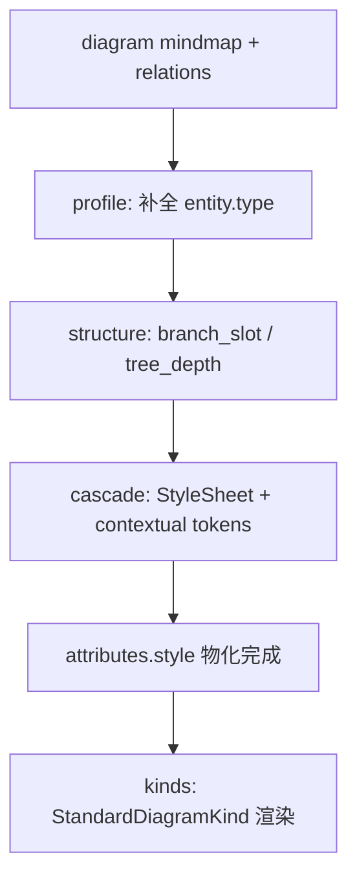

# Mindmap 统一主题方案

> 版本：0.1.0 | 状态：已实现
>
> 目标：消除 mindmap 在 prepare 阶段的**第二条主题物化路径**，使分支配色、边色与线宽全部纳入 StyleSheet cascade，与 flowchart 等图表共用同一套 `materialize_styles()` 管线。

---

## 1. 背景

### 1.1 现状

Mindmap 的视觉样式目前分两路处理：

| 路径 | 模块 | 职责 |
|------|------|------|
| 通用 cascade | `prepare/styles.rs` → `theme/cascade.rs` | 按 `entity.type`（`root` / `main` / `branch` / `leaf`）从 StyleSheet 物化 |
| **Mindmap 特例** | `prepare/styles.rs::materialize_mindmap_branch_styles` | 按 **relation 树结构** 分配 6 色分支 palette，覆盖节点 fill/stroke 与边 stroke/width |

分支 palette 硬编码于 `kinds/mindmap/mindmap_theme.rs` 的 `PALETTE` 常量；物化来源标记为 `StyleSource::BranchTheme`，与 `Palette` / `Token` 并列。

### 1.2 问题

1. **Theme 不可完整换肤**：切换 `inspired.nord` 等主题时，root 可能随 StyleSheet 变化，但各一级分支的彩虹色带仍为 Rust 硬编码。
2. **双管线**：`materialize_styles` 末尾单独调用 mindmap 分支逻辑，违反「prepare 单一物化入口」原则。
3. **职责错位**：`kinds/mindmap/mindmap_theme.rs` 混合了结构计算（branch index）与视觉 token（hex 颜色）；`kinds` 本应只管校验与渲染分派，不应持有 palette。
4. **StyleSheet 模型缺口**：第三层 cascade 键仅为 `entity.type`，无法表达「同一 `type: main` 的不同实例属于不同分支」。

### 1.3 根因（一句话）

Mindmap 的配色维度是 **`entity.type` × `branch_slot`（结构派生）**，而 StyleSheet v0.2 只支持 **`entity.type`** 一维查表。

本方案不否定「结构决定分支色」的产品语义，而是把结构索引与颜色数据**解耦**，纳入统一 cascade。

---

## 2. 设计目标与非目标

### 2.1 目标

| 目标 | 说明 |
|------|------|
| 单一物化路径 | 删除 `materialize_mindmap_branch_styles`；所有图仅走 `materialize_styles` |
| 主题可替换 | `branch_palettes` 写入各 StyleSheet JSON；换主题即换分支色带 |
| 职责清晰 | 结构计算 → `prepare/structure`；颜色数据 → StyleSheet；渲染 → `kinds` 标准路径 |
| 视觉等价 | 默认主题 `builtin.clean-light` 下与当前实现视觉一致（或仅接受 documented intentional diff） |
| 可溯源 | 物化后的 `style.*` 仍带 `StyleSource::Palette`（可扩展 `branch_slot` 字段），便于 Diff / 调试 |

### 2.2 非目标

- 不改变 mindmap **布局算法**（`layout/node/mindmap.rs`）
- 不改变 **GraphicStyle**（笔触皮肤与 Theme 正交）
- 不把 `branch_slot` 提升为 DSL 作者必写的一等语法（默认自动计算）
- 不在 Renderer 阶段遍历 relation 树算颜色

---

## 3. 方案总览

```
① prepare/structure     从 relation 树算出 branch_slot / tree_depth → 写入语义属性
② StyleSheet            branch_palettes + entity_types 内 {branch.*} contextual token
③ theme/cascade         物化时带 MaterializeContext，统一解析 token 与 depth 线宽
④ prepare/styles        唯一入口，无 diagram_type 特例分支
```



与 flowchart 的差异：**cascade 物化时多传入结构上下文**（`branch_slot`、`tree_depth`），而不是多一条 mindmap 专用刷 style 函数。

---

## 4. 结构展开层（prepare/structure）

### 4.1 模块布局

```
crates/drawify-core/src/prepare/
  structure/
    mod.rs          # StructureExpander trait + expand_structure 分派
    mindmap.rs      # 从 relation 树计算 branch_slot / tree_depth
```

```rust
pub trait StructureExpander {
    fn expand(diagram: &mut Diagram);
}

pub fn expand_structure(diagram: &mut Diagram) {
    match diagram.diagram_type {
        DiagramType::Mindmap => mindmap::expand(diagram),
        _ => {}
    }
}
```

### 4.2 派生语义属性

在 prepare 阶段写入 `attributes.standard`（**非** DSL 作者文档的一等语法；见 §4.4）：

| 属性 | 类型 | 含义 | root | 一级 main | 更深层 |
|------|------|------|------|-----------|--------|
| `branch_slot` | `usize` | root 的第几个直接子树（0-based） | 不写 | 0, 1, 2… | 继承最近祖先 |
| `tree_depth` | `usize` | 距 root 的深度 | 0 | 1 | 2+ |

**算法**（与现 `MindmapTheme::from_diagram` 等价，仅产出整数）：

1. 建 `children` map（relation `from → to`）
2. 找 `root_id`（`type: root` 或入度 0 回退）
3. 按 root 直接子节点**插入序**（relation 顺序）分配 `branch_slot`
4. DFS 向下继承同一 `branch_slot`，`tree_depth` 递增

> **确定性**：`branch_slot` 分配顺序必须稳定，不得依赖 `HashMap` 迭代序（见 `AGENTS.md`）。root 子节点列表应来自 relation 插入序或显式排序后的 id。

### 4.3 prepare 管线顺序

```
apply_profile_defaults
    ↓
expand_structure                    ← 新增
    ↓
materialize_styles                  ← 删除 mindmap 特例
    ↓
apply_style_decls
    ↓
style_decls.clear()
```

### 4.4 DSL 与校验

- **默认**：DSL 不写 `branch_slot` / `tree_depth`，由 prepare 自动填充。
- **Override（第一期支持）**：若 entity 已显式声明 `branch_slot`，跳过对该节点的自动分配（高级用户固定分支色）。mindmap profile 扩展允许 `branch_slot` / `tree_depth` 作为 standard 键。
- **校验**：mindmap 专属 profile 扩展允许键 `branch_slot`、`tree_depth`；其他 diagram type 校验时拒绝未知 standard 键（与现有 attr schema 策略一致）。
- **PreparedDiagram 不变量**：expand 之后、materialize 之前，mindmap 非 root 节点应有 `branch_slot`（孤立节点除外，见 §9）。

### 4.5 从 kinds 迁出的代码

| 现位置 | 迁移目标 | 保留/删除 |
|--------|----------|-----------|
| `MindmapTheme::from_diagram` 的 branch/depth 图遍历 | `prepare/structure/mindmap.rs` | 迁出 |
| `branch_style_overrides` | 删除 | 由 cascade + JSON 替代 |
| `PALETTE` 常量 | 删除 | 迁入各 StyleSheet `branch_palettes` |
| `edge_color` / `edge_stroke_width` | 删除 | 由 `{branch.*}` + `edge_depth_stroke_width` 替代 |
| `validate::validate`（root 唯一） | `kinds/mindmap/validate.rs` | **保留** |

迁移完成后 **`kinds/mindmap/mindmap_theme.rs` 整文件删除**（或仅留 re-export 过渡期，最终删除）。

---

## 5. StyleSheet 扩展

### 5.1 新增字段

在 `theme/schema.rs` 的 `DiagramStyles` 上扩展：

```rust
pub struct DiagramStyles {
    // ... 现有 node / edge / entity_types / edge_kinds ...

    /// Mindmap（及未来类似图）：按 branch_slot 索引的调色板条目。
    #[serde(default)]
    pub branch_palettes: Vec<BranchPaletteEntry>,

    /// 按 tree_depth 索引的边线宽（depth 0/1/2/…）；缺省则不分 depth。
    #[serde(default)]
    pub edge_depth_stroke_width: Vec<f64>,
}

pub struct BranchPaletteEntry {
    #[serde(default)]
    pub fill: Option<StyleValue>,
    #[serde(default)]
    pub stroke: Option<StyleValue>,
    #[serde(default)]
    pub edge_stroke: Option<StyleValue>,
}
```

仅 `diagrams.mindmap`（及将来若有同类图）需要填充；其他 diagram 为空数组即可。

#### `ResolvedDiagramStyles` 对应扩展

`resolve_style_sheet()` 产出 `ResolvedStyleSheet`，其中 `ResolvedDiagramStyles` 也需新增对应字段（token 引用已展开）：

```rust
pub struct ResolvedDiagramStyles {
    // ... 现有 node / edge / group / title / entity_types / edge_kinds ...

    /// 已展开 token 的 branch_palettes（palette 内的 {colors.*} 已解析）。
    pub branch_palettes: Vec<ResolvedBranchPaletteEntry>,

    /// 边 depth 线宽（数值，无 token）。
    pub edge_depth_stroke_width: Vec<f64>,
}

pub struct ResolvedBranchPaletteEntry {
    pub fill: Option<StyleValue>,
    pub stroke: Option<StyleValue>,
    pub edge_stroke: Option<StyleValue>,
}
```

**`resolve_token_refs` 扩展**：`theme/resolve.rs` 的 `resolve_token_refs` 需对 `branch_palettes` 逐条 resolve（palette 内的 `{colors.*}` 等 sheet 级 token 在此展开）。但 `{branch.*}` 不出现在 palette 内（palette 是数据源，不是引用方），所以 palette 的 resolve 是纯 sheet 级的。

### 5.2 JSON 示例（`builtin.clean-light`）

```json
{
  "diagrams": {
    "mindmap": {
      "node": {
        "radius": "{radius.lg}"
      },
      "edge": {
        "stroke_width": "{strokes.thin}"
      },

      "branch_palettes": [
        {
          "fill": "#EEF0FB",
          "stroke": "#5C6BC0",
          "edge_stroke": "#7986CB"
        },
        {
          "fill": "#E5F5F3",
          "stroke": "#26A69A",
          "edge_stroke": "#4DB6AC"
        },
        {
          "fill": "#FDECEC",
          "stroke": "#EF5350",
          "edge_stroke": "#E57373"
        },
        {
          "fill": "#FFF4E5",
          "stroke": "#FB8C00",
          "edge_stroke": "#FFB74D"
        },
        {
          "fill": "#F6EBFA",
          "stroke": "#AB47BC",
          "edge_stroke": "#BA68C8"
        },
        {
          "fill": "#EAF5EB",
          "stroke": "#43A047",
          "edge_stroke": "#66BB6A"
        }
      ],

      "edge_depth_stroke_width": [3.0, 2.25, 1.75],

      "entity_types": {
        "root": {
          "shape": "circle",
          "fill": "#6A1B9A",
          "stroke": "#4A148C",
          "text_fill": "#FFFFFF",
          "stroke_width": 3,
          "font_size": 18,
          "label_weight": "bold"
        },
        "main": {
          "shape": "rounded_rect",
          "fill": "{branch.fill}",
          "stroke": "{branch.stroke}",
          "stroke_width": 2.5,
          "radius": 14,
          "font_size": 14,
          "label_weight": "medium"
        },
        "branch": {
          "shape": "rounded_rect",
          "fill": "{branch.fill}",
          "stroke": "{branch.stroke}",
          "stroke_width": 2.0,
          "radius": 10,
          "font_size": 12
        },
        "leaf": {
          "shape": "rounded_rect",
          "fill": "#FFFFFF",
          "stroke": "{branch.stroke}",
          "stroke_width": 1.75,
          "radius": 8,
          "font_size": 11
        }
      }
    }
  }
}
```

**约定**：

- `root`：不使用 `{branch.*}`；颜色完全由 `entity_types.root` 定义。
- `main` / `branch`：形状与字号在 `entity_types`；**分支色**通过 `{branch.fill}` / `{branch.stroke}` 引用 palette。
- `leaf`：固定白底 `{entity_types.leaf.fill}`；描边跟分支 `{branch.stroke}`。
- `branch_palettes[i]` 可引用 tokens，例如 `"fill": "{colors.mindmap_branch_0_fill}"`。

### 5.3 主题生成脚本

更新 `scripts/generate_builtin_themes.py`：

- 为每个主题输出 6 条 `branch_palettes`（复用现有 per-theme mindmap 色值映射）。
- `entity_types.main/branch/leaf` 改为 `{branch.*}` 模板，不再写死 per-type 单色。

---

## 6. Contextual Token 与 Cascade

### 6.1 动机

若采用「第四层 cascade `branch_palettes[slot]` merge」，cascade 代码仍需 diagram-specific 分支。  
采用 **contextual token** 可在 resolve 阶段统一处理，theme 作者语义更清晰。

### 6.2 新增 token 命名空间 `{branch.*}`

在现有 `{colors.primary}`、`{strokes.normal}` 解析器上扩展 **物化上下文**：

| 引用 | 解析规则 |
|------|----------|
| `{branch.fill}` | `branch_palettes[slot % n].fill` |
| `{branch.stroke}` | `branch_palettes[slot % n].stroke` |
| `{branch.edge_stroke}` | `branch_palettes[slot % n].edge_stroke` |

`slot` 来自 entity 的 `branch_slot`；`n = branch_palettes.len()`；`n == 0` 时解析失败，保留上层已 merge 的值或 cascade 回退。

### 6.3 MaterializeContext

```rust
pub struct MaterializeContext {
    pub branch_slot: Option<usize>,
    pub tree_depth: Option<usize>,
}
```

- **节点**：每个 entity 构造 context（root 无 slot → `None`）。
- **边**：根据端点 id 查 entity 的 slot/depth：

| 条件 | 边 stroke 用的 slot | 边 stroke_width 用的 depth |
|------|---------------------|----------------------------|
| `from` 为 root | `to` 的 `branch_slot` | `to` 的 `tree_depth` |
| 其他 | `from` 的 `branch_slot`（回退 `to`） | `to` 的 `tree_depth`（回退 `from`） |

与现 `MindmapTheme::edge_color` / `edge_stroke_width` 行为对齐。

### 6.4 边线宽：depth 查表

物化 relation 时，若 `diagrams.mindmap.edge_depth_stroke_width` 非空：

```
width = edge_depth_stroke_width[min(depth, len - 1)]
```

覆盖 cascade merge 后的 `stroke_width`（除非用户内联 `style.stroke_width`）。

### 6.5 Cascade 优先级（相对 [style-sheet-spec.md](../specs/style-system/style-sheet-spec.md) §7 的补充）

**节点**（低 → 高）：

1. `defaults.node`
2. `diagrams.{type}.node`
3. `diagrams.{type}.entity_types[type]`
4. **Resolve `{branch.*}` / `{colors.*}` 等 token**（含 branch context）
5. DSL `node_style` 声明（跳过内联键）
6. 内联 `style.*`（全程最高，`or_insert` 不覆盖）

**边**（低 → 高）：

1. `defaults.edge`
2. `diagrams.{type}.edge`
3. `diagrams.{type}.edge_kinds[kind]`（mindmap 通常不用）
4. **Resolve `{branch.edge_stroke}` + depth 线宽**
5. DSL `edge_style` / 内联

> contextual resolve 发生在 token 展开阶段，**不**新增独立的 cascade 层号，避免 spec 层数膨胀。

### 6.6 StyleSource 溯源

删除 `StyleSource::BranchTheme`。

扩展 `StyleSource::Palette`：

```rust
Palette {
    style_sheet_id: String,
    entity_type: String,
    branch_slot: Option<usize>,  // 新增，便于调试与 export-scene
}
```

**序列化策略（破坏性变更）**：直接修改 `Palette` 变体字段，不加 `#[serde(default)]`。理由：

- `StyleSource` 主要用于内部溯源与 export-scene 调试输出，无外部消费者依赖其 JSON 格式稳定性。
- `branch_slot` 为 `Option<usize>`，非 mindmap 图的节点物化时写入 `None`，序列化输出 `"branch_slot": null`。
- 迁移时需同步更新所有 pattern-match `StyleSource::Palette { ... }` 的代码（补 `branch_slot` 字段或用 `..` 通配）。

### 6.7 两阶段 token 解析

`{branch.*}` 是 **contextual token**——其值取决于当前物化的 entity 属于哪个分支（`branch_slot`），而非全局唯一。因此无法在 `resolve_style_sheet()` 阶段（sheet 级、无 diagram 上下文）展开，必须分两阶段处理。

| 阶段 | 时机 | 输入 | 展开对象 | 不展开对象 |
|------|------|------|----------|-----------|
| **Sheet 级** | `resolve_style_sheet()`，prepare 之前 | 只有 StyleSheet | `{colors.*}` `{strokes.*}` `{radius.*}` 等 | `{branch.*}` 保留原字符串 |
| **Contextual 级** | `materialize_styles()` 内，per-entity | StyleSheet + entity 的 `branch_slot` | 残留的 `{branch.*}` | — |

#### 实现要点

**1. `StyleTokens` 识别 contextual 命名空间**

在 `theme/schema.rs` 的 `StyleTokens` impl 新增：

```rust
/// 判断是否为 contextual token（per-entity，resolve 阶段不展开）。
/// 目前只有 `branch` 命名空间属于此类。
pub fn is_contextual_ref(value: &str) -> bool {
    let trimmed = value.trim();
    if !trimmed.starts_with('{') || !trimmed.ends_with('}') {
        return false;
    }
    let inner = &trimmed[1..trimmed.len() - 1];
    matches!(inner.split_once('.'), Some(("branch", _)))
}
```

**2. `resolve_value` 跳过 contextual ref**

`theme/resolve.rs` 的 `resolve_value` 遇 `{branch.*}` 时直接保留原字符串，**不报 warning**（区别于真正无法解析的引用）：

```rust
fn resolve_value(tokens: &StyleTokens, value: &StyleValue) -> StyleValue {
    match value {
        StyleValue::String(s) => {
            if StyleTokens::is_token_ref(s) {
                // contextual token：保留原样，等 materialize 阶段展开
                if StyleTokens::is_contextual_ref(s) {
                    return StyleValue::String(s.clone());
                }
                // sheet 级 token：立即展开
                if let Some(resolved) = tokens.resolve_ref(s) {
                    // ... 现有逻辑 ...
                } else {
                    eprintln!("[warn] unresolved token reference: '{s}'");
                    StyleValue::String(s.clone())
                }
            } else {
                StyleValue::String(s.clone())
            }
        }
        // ... Number / Boolean / Array 不变 ...
    }
}
```

**3. `materialize_styles` 新增 per-entity contextual resolve**

在 `prepare/styles.rs` 的 entity 循环中，cascade 拿到 `CascadedStyle` 后、写入 `attributes.style` 前，对 block 中残留的 `{branch.*}` 按 `MaterializeContext` 展开：

```rust
/// 把 block 里残留的 {branch.*} 按 context 展开成具体值。
fn resolve_contextual_block(
    block: &StyleBlock,
    ctx: &MaterializeContext,
    palettes: &[ResolvedBranchPaletteEntry],
) -> StyleBlock {
    if palettes.is_empty() {
        return block.clone();
    }
    let mut out = StyleBlock::new();
    for (key, value) in block.iter() {
        let resolved = match value {
            StyleValue::String(s) if StyleTokens::is_contextual_ref(s) => {
                resolve_branch_ref(s, ctx, palettes)
            }
            _ => value.clone(),
        };
        out.insert(key.clone(), resolved);
    }
    out
}

/// "{branch.fill}" + slot=1 → palettes[1].fill
fn resolve_branch_ref(
    ref_str: &str,
    ctx: &MaterializeContext,
    palettes: &[ResolvedBranchPaletteEntry],
) -> StyleValue {
    let slot = ctx.branch_slot.unwrap_or(0);
    let entry = &palettes[slot % palettes.len()];
    let inner = &ref_str.trim()[1..ref_str.trim().len() - 1]; // "branch.fill"
    let (_, key) = inner.split_once('.').unwrap();
    match key {
        "fill" => entry.fill.clone().unwrap_or(StyleValue::String(ref_str.to_string())),
        "stroke" => entry.stroke.clone().unwrap_or(StyleValue::String(ref_str.to_string())),
        "edge_stroke" => entry.edge_stroke.clone().unwrap_or(StyleValue::String(ref_str.to_string())),
        _ => StyleValue::String(ref_str.to_string()), // 未知 key，保留原值
    }
}
```

entity 循环改为：

```rust
for entity in &mut diagram.entities {
    let entity_type = /* 现有逻辑 */;
    let cascaded = ctx.node_style(diagram_type_key, entity_type);

    // 构造 per-entity context
    let branch_slot = entity.attributes.standard
        .get("branch_slot")
        .and_then(|v| v.as_number().map(|n| n as usize));
    let palettes = ctx.diagram_styles(diagram_type_key)
        .map(|ds| &ds.branch_palettes)
        .unwrap_or(&[]);
    let mat_ctx = MaterializeContext { branch_slot, tree_depth: /* 同理 */ };

    // cascade 结果先过 contextual resolve
    let resolved_block = resolve_contextual_block(
        cascaded.as_block(), &mat_ctx, palettes,
    );

    merge_style_block_into_attrs(
        &mut entity.attributes.style, &resolved_block, palette_source,
    );
}
```

边的 contextual resolve 类似，`branch_slot` 按设计 §6.3 从端点查（from 为 root 用 to 的 slot，否则用 from 的）。

#### 数据流

```
StyleSheet JSON
  │
  │  resolve_style_sheet()  ← sheet 级，只看主题
  │   ├─ {colors.primary}   → "#1976D2"   (展开)
  │   ├─ {strokes.thin}     → 1.0          (展开)
  │   └─ {branch.fill}      → "{branch.fill}"  (保留原样，不报 warning)
  ▼
ResolvedStyleSheet  (带未展开的 {branch.*} 字面量 + branch_palettes 数组)
  │
  │  materialize_styles()  ← per-entity，知道 branch_slot
  │   ├─ cascade 拿到 CascadedStyle (可能含 {branch.fill})
  │   ├─ 用 entity 的 branch_slot 做 contextual resolve
  │   └─ {branch.fill} → branch_palettes[slot].fill  (展开)
  ▼
attributes.style  (全是具体值)
```

---

## 7. 模块职责（迁移后）

| 模块 | 职责 | Mindmap 相关 |
|------|------|--------------|
| `profile` | 默认 theme / layout / 允许的 `type` | 不变 |
| `prepare/profile` | 补全 `default_entity_type` | 不变 |
| **`prepare/structure`** | **结构派生 standard 属性** | **`mindmap.rs` 算 slot/depth** |
| `prepare/styles` | **唯一** cascade 物化 | **删除 mindmap if 分支** |
| `theme/schema` | StyleSheet 数据模型 | 增加 `branch_palettes` 等 |
| `theme/cascade` | 带 `MaterializeContext` 的查询 | 解析 `{branch.*}` |
| `kinds/mindmap` | 校验 + `StandardDiagramKind` | **删除 theme** |
| `render/*` | 只读 `attributes.style` | 不变 |

---

## 8. 删除清单

| 项 | 路径 / 符号 |
|----|-------------|
| 第二条物化路径 | `prepare/styles.rs::materialize_mindmap_branch_styles` |
| 分支主题模块 | `kinds/mindmap/mindmap_theme.rs` |
| 样式来源枚举值 | `ast::StyleSource::BranchTheme` |
| prepare 测试 | 迁移至 `prepare/structure` / cascade 测试 |
| `kinds/mindmap/mod.rs` | 移除 `mindmap_theme` 导出 |

---

## 9. 边界情况

| 场景 | 行为 |
|------|------|
| root 仅 1–2 个一级分支 | slot 0、1；palette 循环 `slot % n` |
| 一级分支 ≥ 7 | 第 7 条起循环 palette（与现 `% PALETTE.len()` 一致） |
| 孤立节点（不在树上） | 无 `branch_slot`；仅 `entity_types[type]` + defaults；边默认 stroke |
| 用户内联 `style.fill` | 最高优先级，不覆盖 |
| 用户显式 `branch_slot` | 跳过自动分配，cascade 用用户值 |
| 非 mindmap 图 | 不执行 structure expand；cascade 忽略 branch context |
| `branch_palettes` 为空 | `{branch.*}` 保留为字面量 + `[warn]` 日志；不回退（entity_types 本身可能就是 `{branch.*}`，无静态值可回退） |
| `Custom` diagram | 与 today 一致，不 expand |

---

## 10. 实施计划

### Phase 1 — 基础设施（行为不变）

1. 扩展 `theme/schema.rs`（`DiagramStyles` + `ResolvedDiagramStyles` + `BranchPaletteEntry`）+ `style-sheet-spec.md` §mindmap / contextual token。
2. 新增 `prepare/structure/mindmap.rs`，单元测试对齐现 `mindmap_theme` 测试。
3. 扩展 `theme/cascade`：`MaterializeContext` + `{branch.*}` resolver；`StyleTokens::is_contextual_ref` + `resolve_value` 跳过 contextual ref（见 §6.7）。

### Phase 2 — 数据迁移与切换（单次迁移）

4. 更新 `scripts/generate_builtin_themes.py`，重生成 `crates/drawify-core/src/theme/themes/` 下全部主题 JSON（输出 `branch_palettes` + `{branch.*}` 模板）。
5. `materialize_styles` 传入 context，启用 contextual resolve；删除 `materialize_mindmap_branch_styles` 调用。golden 对比验证视觉等价。

### Phase 3 — 清理

6. 删除 `materialize_mindmap_branch_styles` 及 `StyleSource::BranchTheme`。
7. 删除 `mindmap_theme.rs`。
8. 更新 `docs/specs/visual-language/diagrams/mindmap.md` 实现状态说明。

### 验收标准

- [ ] 全部内置 + inspired + accessible 主题 mindmap showcase 视觉回归通过。
- [ ] `PreparedDiagram` 物化后无 `StyleSource::BranchTheme`。
- [ ] 换 `theme: inspired.nord` 时分支色带随主题变化。
- [ ] `cargo test -p drawify-core` 通过；prepare 不变量 I1–I3 仍成立。

---

## 11. 备选方案（未采纳）

| 方案 | 描述 | 不采纳原因 |
|------|------|------------|
| DSL 手写 `branch: 0` | 用户标记分支 | 写作负担大，易错 |
| 扩展 type 为 `main_0`、`main_1` | 污染 type 枚举 | 破坏 profile 闭集语义 |
| 第四层 cascade merge | 代码里对 mindmap 多一层 | cascade 仍 diagram-specific，不如 contextual token 通用 |
| 保留 Rust `PALETTE`，仅把颜色迁到 JSON 读取 | 半迁移 | 仍需要在 prepare 特判 mindmap 读 palette |

---

## 12. 相关文档

- [StyleSheet 规范](../specs/style-system/style-sheet-spec.md)
- [Mindmap 视觉语言](../specs/visual-language/diagrams/mindmap.md)
- [实体 type 标准](../specs/visual-language/entity-types.md)
- [Export Scene 规范](../specs/export-scene-spec.md) — `StyleSource` 与 `theme_id` 实际生效值
- [AGENTS.md](../../AGENTS.md) — 布局/结构算法确定性要求

## 13. 相关代码（现状）

| 文件 | 说明 |
|------|------|
| `crates/drawify-core/src/kinds/mindmap/mindmap_theme.rs` | 待删除：结构 + 颜色混合 |
| `crates/drawify-core/src/prepare/styles.rs` | 待简化：删除 mindmap 分支调用 |
| `crates/drawify-core/src/theme/cascade.rs` | 待扩展：contextual resolve |
| `crates/drawify-core/src/theme/themes/builtin.clean-light.json` | 待更新：`branch_palettes` |

---

## 14. 与 `resolved_builtin_style_sheet` 进程缓存的兼容性

`theme/builtin.rs` 已实现进程级缓存 `RESOLVED_BUILTIN_CACHE`（`LazyLock<RwLock<HashMap<String, ResolvedStyleSheet>>>`），按 `theme_id` memoize 已 resolve 的 `ResolvedStyleSheet`，供 prepare 与 render 两侧复用。

本设计与该缓存**完全兼容**，无需调整缓存逻辑：

| 关注点 | 结论 |
|--------|------|
| 缓存 key | 仍为 `theme_id`，不变 |
| 缓存 value | `ResolvedStyleSheet` 内会多出 `branch_palettes` 字段 + 残留的 `{branch.*}` 字面量；同一 theme 的这些内容相同，缓存命中后 clone 即可 |
| `{branch.*}` 字面量 | resolve 阶段保留原样（见 §6.7），缓存中的 `ResolvedStyleSheet` 带 `{branch.fill}` 等字面量是合法状态 |
| contextual resolve 时机 | 发生在 `materialize_styles` 内（per-entity），在缓存查询之后，不影响缓存 |
| render 侧 | render 通过 `resolved_builtin_style_sheet` 拿到带 `{branch.*}` 字面量的 sheet；render 不做 contextual resolve（render 只读 `attributes.style`，此时已物化为具体值） |

**结论**：缓存是 sheet 级优化（避免重复 parse + resolve），本设计是 prepare 级优化（消除第二条物化路径），两者正交互补。
