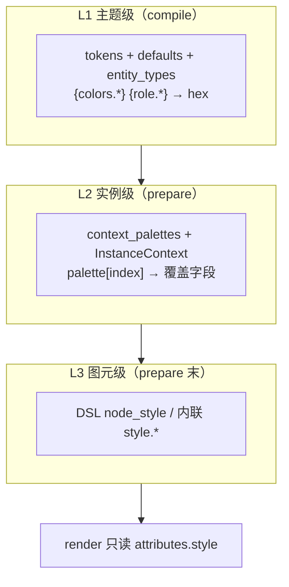
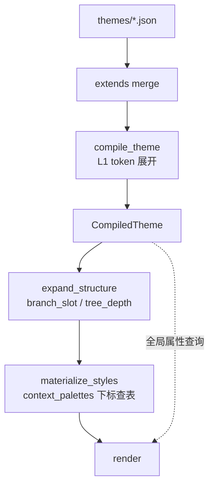
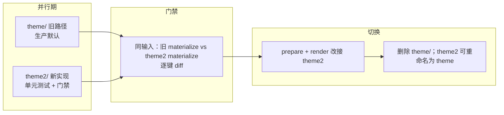

# 内置主题继承与精简方案

> 版本：0.6 | 状态：提案（待实施）
>
> 目标：将内置主题收敛为「少量基座 + 薄层子主题」，运行时单层 `extends` 合并；**类型级**配色走 `tokens.palette` + `{role.*}`（compile 展开）；**实例级**配色走 **`context_palettes` + `InstanceContext` 下标查表**（prepare 物化，无 `{branch.*}` 魔法字符串）；`context_palettes.entries` 支持 **compile 期 `lighten()` 函数表达式**（避免预计算 hex 导致的配色双轨）；加载结束时编译为 **`CompiledTheme`**（不保留运行时 cascade 热路径）。主题 JSON **直接维护于 `themes/`**，废弃 `scripts/generate_builtin_themes.py`。

---

## 1. 背景

### 1.1 现状

当前每个内置主题是一份完整的 StyleSheet v0.2 JSON（约 380 行），存放于 `crates/drawify-core/src/theme/themes/`，由引擎 `include_str!` 编译进二进制。

历史上这些 JSON 由 `scripts/generate_builtin_themes.py` 批量生成。**本方案实施后删除该脚本**，`themes/*.json` 为唯一真源。

当前问题：

| 现象 | 说明 |
|------|------|
| 结构重复 | 22 个 `common.*` 主题的 `defaults`、entity shape 逐份复制 |
| 配色双轨 | `tokens.colors` 与 `diagrams.entity_types.*` 的 hex 并行维护 |
| 运行时重复 merge | `node_style()` 在 prepare 对每个 entity 做三层 cascade |
| 实例级样式分裂 | mindmap 用 `{branch.*}` contextual token；group 嵌套色在 render 硬编码 `lighten()` |
| 文件臃肿 | `common.*` 主题 ~380 行（382–393）；`mindmap.*` 主题 ~170 行（165–175）；与「换色 + 少量覆盖」直觉不符 |

### 1.2 现架构数据流（迁移对照基准）

```text
① StyleSheet (JSON) ──parse──► StyleSheet (Rust struct)
② resolve_style_sheet() ──► ResolvedStyleSheet
   {colors.*}/{strokes.*} 等 sheet 级 token → 立即展开
   {branch.*} contextual token → 保留字面量
   branch_palettes 中的 sheet 级 token → 展开
③ ResolvedStyleContext::new(resolved)
④ prepare:
   expand_structure (mindmap.rs)
     → branch_slot / tree_depth 写入 attributes.standard
   materialize_styles (styles.rs):
     Entity: cascade 查表 → resolve_contextual_block({branch.*}) → or_insert 写入 attributes.style
     Edge:   cascade 查表 → resolve_contextual_block → edge_depth_stroke_width insert 覆盖 stroke_width → or_insert 写入
     Group:  仅 cascade 查表 → or_insert 写入（无 L2 物化）
     apply_style_decls: DSL 声明 insert 覆盖（跳过内联 key）
⑤ render:
   RenderRequest.resolve_context() → 独立重新解析 ResolvedStyleContext
   节点/边: 从 attributes.style 读取（prepare 已物化）
   画布/标题: 从 style_ctx 直接查表（canvas_style / title_style）
   Group: style_ctx 查出基色 → group_style_by_depth(lighten) 按 depth 派生
   其他 fallback: entity_label_font_size / entity_text_fill 先读 attributes.style，回退 style_ctx
```

**关键观察**：render 阶段**独立重新解析主题**（不依赖 prepare 的 `ResolvedStyleContext`），用于全局属性查询和 fallback。迁移后 render 仍需访问 `CompiledTheme`，但 group 样式应从 prepare 物化值读取。

### 1.3 根因（一句话）

**结构应在基座定义一次**；**类型级色**走 `{role.*}` 在 compile 烤死；**实例级色**（同 type 不同分支 / 不同嵌套深度）应走 **palette 数组 + 结构下标**，而不是为每种场景发明特殊 token 或 render 魔法；查询应走 **`CompiledTheme` 查表**。

### 1.4 架构决策（四项绑定）

#### 决策 A：`tokens.palette` + `{role.*}`（compile 期展开）

| 对比项 | 合并期物化（不采用） | **采用** |
|--------|-------------------|---------|
| entity 配色 | merge 时烤 hex 进 `entity_types` | 基座写 `{role.blue.fill}` |
| 色源 | 临时 `palette` 字段 | `tokens.palette` 正式命名空间 |
| 展开时机 | loader merge 时 | **compile**（与 `{colors.*}` 同批） |

适用：**同一 `entity.type` 在所有实例上配色一致**（flowchart `service`、mindmap `root` 等）。

#### 决策 B：激进单层 `CompiledTheme`

| 对比项 | 双层（不采用） | **采用** |
|--------|--------------|---------|
| 加载结果 | `ResolvedStyleSheet` + 可选物化表 | **仅 `CompiledTheme`** |
| 类型级查询 | `node_style()` 运行时 cascade | **`node_block(type)` 纯查表** |
| merge 实现 | 易漂移 | **只在 `compile` 实现一次** |

#### 决策 C：`context_palettes` + `InstanceContext`（prepare 期查表）

| 对比项 | `{branch.*}` contextual token（不采用） | **`context_palettes`（采用）** |
|--------|--------------------------------------|------------------------------|
| 数据形式 | 样式块内魔法字符串 `{branch.fill}` | 主题内 **palette 数组** + **绑定规则** |
| resolve 特殊路径 | `is_contextual_ref` 原样保留 | **无**；compile 只展开 sheet 级 token |
| 查询 | 字符串替换 `resolve_contextual_block` | **`palette_id` + `index` + `fields` 结构化 merge** |
| 扩展 | 每场景一种 token 命名空间 | **同一机制**覆盖 branch / group 嵌套 / edge depth 等 |

适用：**同一 type 的不同实例**因图结构而不同色（mindmap 分支、architecture group 嵌套层等）。

#### 决策 D：删除 render 侧 group 硬编码；`lighten()` / `darken()` 迁入 compile 期颜色函数

现 `render/paint/color_queries.rs::group_style_by_depth` 在 render 用 `lighten()` 算法向白色提亮派生嵌套色。**迁入** `context_palettes.group_nest`，由 prepare 物化到 group 的 `attributes.style`，render **只读已物化值**。

`lighten()` / `darken()` 算法本身**不删除**，而是从 render 私有函数**迁入 `theme2/compile.rs` 作为 compile 期内置颜色函数**，供 `context_palettes.entries` 通过函数表达式引用（见 §4.2.6）。浅色基座 `entries[1+]` 写 `"{lighten({colors.group_fill}, 0.35)}"`，深色基座写 `"{darken({colors.group_fill}, 0.15)}"`，子主题仅改 `tokens.colors.group_fill` 即可让所有 depth 档位自动重算——避免预计算 hex 导致的"改基色必须重写 entries"问题。

现 `lighten()` 算法（`color_queries.rs` 私有函数，迁入 compile 后语义不变）：

```rust
fn lighten(hex: &str, amount: f64) -> String {
    // new = old + (255 - old) * amount  （向白色线性混合）
}
```

新增 `darken()` 算法（`lighten` 的对称实现，向黑色线性混合）：

```rust
fn darken(hex: &str, amount: f64) -> String {
    // new = old * (1 - amount)  （向黑色线性混合）
}
```

现 `group_style_by_depth` 提亮参数（迁移后作为基座 `group_nest.entries` 的默认值，通过 `lighten()` 表达式表达）：

| depth | fill 提亮量 | stroke 提亮量 | stroke_width | 附加效果（scene.rs） |
|-------|-----------|-------------|-------------|-------------------|
| 0 | 0.0（基色） | 0.0（基色） | 2.0 | border_radius=8, has_shadow=true |
| 1 | 0.35 | 0.30 | 1.5 | border_radius=6, has_shadow=false |
| 2 | 0.55 | 0.50 | 1.5 | 同上 |
| ≥3 | 0.70 | 0.65 | 1.5 | 同上 |

> `label_color` 不随 depth 变化，直接透传基色——作为 L1 属性保留在 `group_default` 中。

### 1.5 维护方式

| 旧流程（废弃） | 新流程 |
|--------------|--------|
| 改 `generate_builtin_themes.py` | 直接编辑 `themes/*.json` |
| 跑生成脚本 | 不需要 |
| `{branch.*}` / `branch_palettes` 双轨 | `context_palettes` 统一（迁移期 compile 可从旧字段提升） |
| theme-editor 同步 | **不在本方案范围内** |
| 新主题 ID | `builtin.rs` 注册 + `include_str!` |

---

## 2. 设计目标与非目标

### 2.1 目标

| 目标 | 说明 |
|------|------|
| 单层 `extends` | 子主题只 extends 一个无 `extends` 的基座 |
| 薄层子主题 | 灵感/无障碍类 ~50 行：`extends` + `tokens` |
| 角色 token | 基座 `{role.*}`；子主题只改 `tokens.palette` |
| **Context Palette** | 实例级样式统一：数组 + 下标 + 绑定，覆盖 branch / group / depth |
| **CompiledTheme** | 类型级 O(1) 查表；context palette 在 compile 解析为结构化表 |
| 业务逻辑等价 | 迁移门禁：物化结果与现网 **逐键一致** |
| JSON 即真源 | 无 Python 生成层 |
| 进程缓存 | `CompiledTheme` 按 `theme_id` 缓存 |

### 2.2 非目标

- 任意深度 `extends`、合并期 `apply_palette()` 物化
- **双层** Resolved + Materialized 并存
- **运行时 cascade**（`node_style` 三层 merge 热路径）
- **`{branch.*}` / `is_contextual_ref` / `resolve_contextual_block`**（整类删除）
- render 侧 `group_style_by_depth` 算法派生色（迁入主题）
- layout 后才知的 rank（如 Sugiyama 层号）在本期纳入 prepare——见 §4.5 边界
- `scripts/generate_builtin_themes.py`、theme-editor、旧 ID 前缀兼容

---

## 3. 样式三层模型

所有视觉属性按 **何时能确定值** 分为三层，避免再为每个场景造 token 命名空间。



| 层 | 查表键 | 数据源 | 阶段 |
|----|--------|--------|------|
| **L1 类型级** | `(diagram, entity_type)` / `(diagram, edge_kind)` / `group` 默认 | `{role.*}`、`defaults`、`diagrams.*` | **compile** → `CompiledTheme` |
| **L2 实例级** | 上项 + **`InstanceContext` 下标** | `context_palettes` 数组 | **prepare** `materialize_styles` |
| **L3 覆盖级** | 单图元 | DSL / 内联 | prepare 最后 |

**与旧 `{branch.*}` 的本质区别**：L2 不把「待查表」编码进字符串；`entity_types` 只保留 shape / 字号等 **不随实例变的字段**（及 L1 的 `{role.*}`）；分支色、嵌套 group 色由 **绑定规则** 在物化时从 palette 数组写入。

**优先级体系**（与现实现一致，从高到低）：

| 优先级 | 来源 | 写入语义 | 说明 |
|--------|------|---------|------|
| 最高 | DSL `node_style` / `edge_style` | `insert`（强制覆盖） | 但手动跳过内联 key |
| ↑ | L2 context_palette overlay | `insert`（强制覆盖指定字段） | 仅覆盖 `fields` 列出的键 |
| ↑ | L1 类型级（cascade 查表） | `or_insert`（仅填空） | 不覆盖已有键 |
| 最低 | 内联 `style.*`（Parser 写入） | — | 见下方保护机制 |

**内联 `style.*` 保护机制**（解释为何内联在"最低"优先级却不会被覆盖）：

| 机制 | 作用阶段 | 说明 |
|------|---------|------|
| L1 `or_insert` | prepare 物化 | L1 cascade 仅填空，不覆盖内联已写入的键 |
| L2 `or_insert` | prepare 物化 | L2 overlay 写入 `attributes.style` 时同样用 `or_insert` |
| DSL 跳过内联 key | prepare `apply_style_decls` | DSL `insert` 时手动检查 key 是否来自内联，跳过 |

三重保护确保内联 `style.*` 全程不被 L1/L2/DSL 覆盖。

---

## 4. 数据模型

### 4.1 StyleSheet（磁盘 / merge 后）

#### 4.1.1 基座与子主题

**基座 ID** 与迁移映射见 **§10**。子主题：`extends` + 按模式覆盖 `tokens` / `diagrams` / `context_palettes`。

基座 `entity_types`（L1，类型级）示例：

```json
"service": {
  "shape": "rounded_rect",
  "fill": "{role.blue.fill}",
  "stroke": "{role.blue.stroke}"
}
```

mindmap `main` / `branch` / `leaf` **不再写** `{branch.fill}`；仅 shape / 字号 / 固定色（如 `leaf.fill` 白底）。分支色由 **§4.2** 绑定。

#### 4.1.2 `tokens.palette` 与 `{role.*}`

| 机制 | 管什么 | 示例 |
|------|--------|------|
| `tokens.colors` + `{colors.*}` | 画布、默认 node/edge/group | `{colors.canvas}` |
| `tokens.palette` + `{role.*}` | **按 entity type** 的语义配色 | `{role.blue.fill}` |

`{role.<角色>.<fill\|stroke\|text_fill\|edge_stroke>}` → compile 展开。语义角色表见 `entity_roles.json`。

**不再**在 `tokens.palette` 放 `branch_1`…`branch_6` 作为分支色带——分支色迁入 `context_palettes`。

#### 4.1.3 `extends` 与 merge

单层 `extends`；基座无 `extends`；禁止链式。对象 deep merge；**数组整段替换**；merge **不展开** token。`context_palettes` 按 palette `id` deep merge（`entries` 整段替换）。

> **子主题覆盖 `entries` 的约束**：由于数组整段替换，子主题若需修改某一档 entry 的**结构**（增减档位、改字段映射），必须重写整个 `entries` 数组。但对于 `group_nest`，基座 `entries` 使用颜色函数表达式（浅色基座用 `lighten()`，深色基座用 `darken()`，如 `"{lighten({colors.group_fill}, 0.35)}"` / `"{darken({colors.group_fill}, 0.15)}"`，见 §4.2.6），子主题**仅改 `tokens.colors.group_fill` / `group_stroke` 时无需覆盖 entries**——compile 会基于新基色自动重算各档。仅当子主题想改变提亮/加深曲线本身（如特定深色子主题需不同加深量）时，才需重写 `entries` 并指定新的函数参数或 hex 值。

---

### 4.2 `context_palettes`（L2 核心）

#### 4.2.1 结构

挂在 `diagrams.<diagram_type>` 下（与 `entity_types` 同级）：

```json
"context_palettes": {
  "branch": {
    "entries": [
      { "fill": "#E8DAEF", "stroke": "#8E44AD", "edge_stroke": "#8E44AD" },
      { "fill": "#D5F5E3", "stroke": "#27AE60", "edge_stroke": "#27AE60" }
    ],
    "index": { "from": "branch_slot", "wrap": true },
    "bindings": [
      {
        "target": "entity",
        "types": ["main", "branch"],
        "fields": { "fill": "fill", "stroke": "stroke" }
      },
      {
        "target": "entity",
        "types": ["leaf"],
        "fields": { "stroke": "stroke" }
      },
      {
        "target": "edge",
        "fields": { "stroke": "edge_stroke" }
      }
    ]
  },
  "group_nest": {
    "entries": [
      { "fill": "{colors.group_fill}", "stroke": "{colors.group_stroke}", "stroke_width": 2.0, "border_radius": 8.0 },
      { "fill": "{lighten({colors.group_fill}, 0.35)}", "stroke": "{lighten({colors.group_stroke}, 0.30)}", "stroke_width": 1.5, "border_radius": 6.0 },
      { "fill": "{lighten({colors.group_fill}, 0.55)}", "stroke": "{lighten({colors.group_stroke}, 0.50)}", "stroke_width": 1.5, "border_radius": 6.0 },
      { "fill": "{lighten({colors.group_fill}, 0.70)}", "stroke": "{lighten({colors.group_stroke}, 0.65)}", "stroke_width": 1.5, "border_radius": 6.0 }
    ],
    "index": { "from": "group_depth", "cap": 3 },
    "bindings": [
      {
        "target": "group",
        "fields": { "fill": "fill", "stroke": "stroke", "stroke_width": "stroke_width", "border_radius": "border_radius" }
      }
    ]
  },
  "edge_depth": {
    "entries": [
      { "stroke_width": 4.0 },
      { "stroke_width": 3.0 },
      { "stroke_width": 2.0 }
    ],
    "index": { "from": "tree_depth", "cap": 2 },
    "bindings": [
      {
        "target": "edge",
        "fields": { "stroke_width": "stroke_width" }
      }
    ]
  }
}
```

| 字段 | 说明 |
|------|------|
| `entries[]` | 调色板条目；值可含 sheet 级 token（`{colors.*}` / `{strokes.*}` / `{typography.*}` / `{role.*}`）及 compile 期颜色函数表达式（`{lighten(...)}` / `{darken(...)}`，见 §4.2.6），**compile 时展开为字面量** |
| `index.from` | 下标来源（见 §4.2.2） |
| `index.wrap` | `true` 时 `index % entries.len()`（分支并列区分） |
| `index.cap` | 上限值；`min(index, cap)`（嵌套递进）。**省略时默认 `entries.len() - 1`** |
| `bindings[]` | 该 palette 作用于哪类图元、覆盖哪些字段 |
| `fields` | 目标 StyleBlock 键 → entry 键的映射（支持 `edge_stroke` → `stroke`） |

**palette `id`**（`branch`、`group_nest`、`edge_depth`）为约定名，可扩展；validate 校验 `from` / `target` / `types` 枚举。

**`group_nest` 说明**：

- entry[0] 的 `fill` / `stroke` 写 `{colors.group_fill}` / `{colors.group_stroke}`，compile 时展开为基色（等价于 lighten/darken 0%）。浅色基座 entry[1+] 使用 `{lighten({colors.group_*}, amount)}` 表达式（向白色提亮），深色基座使用 `{darken({colors.group_*}, amount)}` 表达式（向黑色加深），compile 时基于基色自动计算——**子主题仅改 `tokens.colors.group_fill` / `group_stroke` 时无需覆盖 entries**，所有档位自动重算。仅当子主题想改变提亮/加深曲线（如特定深色子主题需不同加深量）时才需覆盖 entries。
- `border_radius` 纳入 entries（现 scene.rs 中 depth 0 → 8.0，其他 → 6.0），使 group 的全部 depth 相关视觉属性统一由主题数据驱动。
- **`has_shadow` / `z_index` 不纳入 entries 的准则**：entries 仅包含 **StyleBlock 已有键**（`fill` / `stroke` / `stroke_width` / `border_radius` / `text_fill` 等）。`has_shadow`（boolean）和 `z_index`（整数）当前**不是 StyleBlock 键**，而是 scene.rs 的渲染策略属性，按 `group.depth == 0` 判断。若未来将它们纳入 `StyleBlock` / `style_attr_keys`，可同步迁入 entries；在此之前保留在 scene.rs。
- `label_color` 不随 depth 变化，作为 L1 属性保留在 `group_default` 的 `text_fill` 中，不纳入 `group_nest`。

> **leaf binding 按主题现行为配置**：§4.2.1 示例中 `leaf` 仅绑 `stroke`（配合固定白底 `fill: "#FFFFFF"`）。但现网 `mindmap.vivid-branches` 的 `leaf.fill = {branch.fill}`（彩色底）。迁移时须按各主题现状配置 `leaf` 的 `fields`——若现行为 leaf 取分支色 fill，则 binding 需加 `"fill": "fill"`，并在 `entity_types.leaf` 中删除固定 `fill`。门禁逐键等价会强制此对齐。

#### 4.2.2 `InstanceContext` 与下标来源

```rust
pub struct InstanceContext {
    pub branch_slot: Option<usize>,
    pub tree_depth: Option<usize>,
    pub group_depth: Option<usize>,
}
```

| `index.from` | 写入时机 | 写入方 | 典型用途 |
|--------------|---------|--------|---------|
| `branch_slot` | prepare 早期 | `expand_structure`（mindmap.rs） | 分支并列色 |
| `tree_depth` | prepare 早期 | `expand_structure`（mindmap.rs） | 边线随深度变细 |
| `group_depth` | parse 即有 / prepare 可读 | `Group.depth`（AST） | 嵌套 group 背景递进 |

下标计算（统一）：

```text
raw = ctx.{from}.unwrap_or(0)
cap = index.cap.unwrap_or(entries.len() - 1)   // 省略 cap 时默认 entries.len()-1
index = if wrap { raw % entries.len() } else { min(raw, cap) }
entry = entries[index]
```

> **`cap` 省略默认值**：当 `index.wrap = false` 且未显式指定 `cap` 时，默认 `cap = entries.len() - 1`，与现实现 `depth.min(len - 1)` 语义一致。显式指定 `cap` 时以指定值为准。

#### 4.2.3 物化算法（替代 `resolve_contextual_block`）

**InstanceContext 派生流程**（prepare 侧，调用 `materialize_*` 之前）：

`InstanceContext` 由 prepare **逐图元派生**，`materialize_*` 接收已派生的 `ctx` 作为参数（纯函数，内部不再访问 `root_id` 或 endpoint 信息）。

| 图元 | 派生来源 | 说明 |
|------|---------|------|
| entity | `attributes.standard` 中的 `branch_slot` / `tree_depth` | 由 `expand_structure`（mindmap.rs）写入；DSL 可覆盖 |
| group | `Group.depth`（AST 字段，parse 即有） | `ctx.group_depth = Some(group.depth as usize)`；`branch_slot` / `tree_depth` 为 `None` |
| edge | endpoint entities 的 slot/depth + **`root_id`** | 见下表；`root_id` 由 `expand_structure` 写入 diagram 级元数据 |

> **`root_id` 的来源**：`expand_structure`（mindmap.rs）在 prepare 早期确定 root entity id，写入 diagram 级结构。prepare 的 `materialize_styles` 循环可读此 `root_id` 用于边的 `InstanceContext` 派生。`InstanceContext` 结构体本身**不含 `root_id`**——`root_id` 仅在派生阶段使用，派生完成后 `ctx` 只保留下标值。

**边的 `InstanceContext` 派生规则**（与现 `prepare/styles.rs` 逻辑严格等价）：

边的 `branch_slot` 和 `tree_depth` 派生规则**不同**，不可统一：

| 字段 | 情况 | 取值 |
|------|------|------|
| `branch_slot` | `from` 为 root | `to.slot`（回退 `from.slot`） |
| `branch_slot` | 其他 | `from.slot`（回退 `to.slot`） |
| `tree_depth` | **所有情况** | `to.depth`（回退 `from.depth`） |

> **与旧版方案的差异**：旧版方案将 `tree_depth` 也按 root 分支取值，但现实现中 `tree_depth` 始终取 `to` 端点的 depth（回退 `from`），不区分 root。本方案以现实现为准。

**物化算法**（`materialize_*` 内部，接收已派生的 `ctx`）：

```text
1. base = compiled 类型级块（node_block / edge_block / group_block）
2. for each context_palette on this diagram (按 palette id 字典序):
     for each binding matching (target, type):
       if binding applies to this instance:
         entry = palette.entries[index(ctx)]
         overlay = project(entry, binding.fields)
         base = merge_overlay(base, overlay)   // palette 强制覆盖指定字段
3. merge base → attributes.style（内联 style 不被覆盖）
```

**多 palette 叠加顺序**：同一 diagram 可有多个 palette（如 mindmap 同时有 `branch` + `edge_depth`），按 **palette id 字典序** 依次 overlay（`BTreeMap` 迭代序天然保证确定性）。若不同 palette 的 `fields` 覆盖同一键，后 overlay 的胜出。当前内置 palette 的 `fields` 无交集，此规则为未来扩展预留。

`merge_overlay`：对 `fields` 列出的键使用 **`insert`（强制覆盖）**语义——与现实现中 `edge_depth_stroke_width` 用 `insert` 覆盖 cascade 的 `stroke_width` 一致。未在 `fields` 中列出的 entry 键不影响 `base`（如 `leaf` 保留固定 `fill`）。

最终写入 `attributes.style` 时使用 **`or_insert`** 语义，保护内联 `style.*` 不被覆盖。

#### 4.2.4 内置 palette 约定

| palette id | diagram | 说明 |
|------------|---------|------|
| `branch` | `mindmap` | 并列分支色带；迁移自现 `branch_palettes` |
| `group_nest` | `architecture`（首期）；可扩至 `flowchart` | 替代 render `group_style_by_depth` |
| `edge_depth` | `mindmap` | 迁移自现 `edge_depth_stroke_width` |

common 基座 mindmap 节可带 **默认 6 色** `branch` palette；`mindmap.*` 子主题覆盖 `entries` 为 8 色等。

#### 4.2.5 迁移：旧字段提升

compile 时若检测到 legacy 字段，自动提升（仅迁移期，最终 JSON 只保留 `context_palettes`）：

| 旧字段 | 提升为 |
|--------|--------|
| `branch_palettes` | `context_palettes.branch.entries` + 默认 bindings |
| `edge_depth_stroke_width` | `context_palettes.edge_depth.entries` |
| `entity_types.*.{branch.*}` | 删除；由 bindings 接管 |
| render `lighten()` 函数 | **迁入 `theme2/compile.rs`** 作为 compile 期内置颜色函数（见 §4.2.6），不删除；`darken()` 为新增 compile 内置函数 |

#### 4.2.6 compile 期颜色函数

`context_palettes.entries` 的值除支持 sheet 级 token（`{colors.*}` 等）外，还支持 **compile 期颜色函数表达式**，在 compile 阶段求值为字面量。首期内置 `lighten` 与 `darken` 两个函数。

**语法**：

```
{lighten(<color_expr>, <amount>)}
{darken(<color_expr>, <amount>)}
```

- `<color_expr>`：hex 字面量（`#F1F2F6`）或 sheet 级 token（`{colors.group_fill}`），先展开为 hex
- `<amount>`：浮点数字面量（`0.35`），表示混合比例
- 整个 `{lighten(...)}` / `{darken(...)}` 在 compile 期求值，替换为结果 hex 字符串

**`lighten` 展开示例**：

```text
{lighten({colors.group_fill}, 0.35)}
  step 1: {colors.group_fill} → #F1F2F6
  step 2: lighten(#F1F2F6, 0.35) → #F8F9FB
  step 3: 整个表达式替换为 "#F8F9FB"
```

**`darken` 展开示例**：

```text
{darken({colors.group_fill}, 0.15)}
  step 1: {colors.group_fill} → #2D2D3A
  step 2: darken(#2D2D3A, 0.15) → #262631
  step 3: 整个表达式替换为 "#262631"
```

**算法**（与现 `render/paint/color_queries.rs::lighten` 完全一致；`darken` 为对称实现）：

```rust
/// 向白色混合（提亮），amount ∈ [0, 1]
/// amount=0 返回原色，amount=1 返回白色
fn lighten(hex: &str, amount: f64) -> String {
    // new = old + (255 - old) * amount  （向白色线性混合）
    // 对 R/G/B 三通道独立计算
}

/// 向黑色混合（加深），amount ∈ [0, 1]
/// amount=0 返回原色，amount=1 返回黑色
fn darken(hex: &str, amount: f64) -> String {
    // new = old * (1 - amount)  （向黑色线性混合）
    // 对 R/G/B 三通道独立计算
}
```

**设计意图**：

- 浅色主题的 `group_nest.entries[1+]` 使用 `lighten()` 表达式——向白色提亮，嵌套越深越浅。
- 深色主题的 `group_nest.entries[1+]` 使用 `darken()` 表达式——向黑色加深，嵌套越深越暗，保证深色背景下的视觉可辨性。
- 两种表达式均使子主题仅改 `tokens.colors.group_fill` 即可让所有 depth 档位自动重算，消除"改基色必须重写 entries"的维护负担，避免配色双轨。

**函数的生命周期**：`lighten` 从 `render/paint/color_queries.rs`（render 私有函数）**迁入** `theme2/compile.rs`（compile 内置函数）；`darken` 为新增 compile 内置函数，不存在于旧 render 代码中。Phase 5 删除 `theme/` 时**保留** `lighten` + `darken` 实现（迁入 compile），不随 `group_style_by_depth` 一起删除。

**未来扩展**（非本期）：可增加 `mix(color_a, color_b, ratio)` 等函数。新增函数须在 compile 期注册，不支持运行时求值。

---

### 4.3 `CompiledTheme`

#### 4.3.1 结构

```rust
pub struct CompiledTheme {
    pub id: String,
    pub name: String,
    pub canvas: StyleBlock,
    pub diagrams: BTreeMap<String, CompiledDiagram>,
}

pub struct CompiledDiagram {
    // ── L1 类型级（已展开 {colors.*} {role.*}，无魔法字符串）──
    pub node_default: StyleBlock,
    pub nodes: BTreeMap<String, StyleBlock>,
    pub edge_default: StyleBlock,
    pub edges: BTreeMap<String, StyleBlock>,
    pub group_default: StyleBlock,
    pub title: StyleBlock,

    // ── L2 实例级（entries 内 sheet token 已展开）──
    pub context_palettes: BTreeMap<String, CompiledContextPalette>,
}

pub struct CompiledContextPalette {
    pub entries: Vec<StyleBlock>,
    pub index: IndexRule,
    pub bindings: Vec<ContextBinding>,
}

pub enum IndexRule {
    BranchSlot { wrap: bool },
    TreeDepth { cap: usize },
    GroupDepth { cap: usize },
}
```

可选优化：对高频 palette **compile 期预展开** `branched_nodes: BTreeMap<(String, usize), StyleBlock>`（`type × slot`），物化时 O(1)；与运行时 merge 二选一，门禁等价即可。

#### 4.3.2 L1 查询 API（与现 cascade 等价）

```rust
fn node_block(&self, diagram: &str, entity_type: Option<&str>) -> &StyleBlock;
fn edge_block(&self, diagram: &str, edge_kind: Option<&str>) -> &StyleBlock;
fn group_block(&self, diagram: &str) -> &StyleBlock;
fn canvas_block(&self) -> &StyleBlock;
fn title_block(&self, diagram: &str) -> &StyleBlock;
```

`node_default` 构成：`diagrams[type].node` 优先，`defaults.node` 兜底（`or_insert` 语义）——与现 cascade 三层中第二层 > 第一层的优先级一致。未知 type 回退 `node_default`。

> **`node_default` 不是 `defaults.node`**：它是 `diagrams[type].node` 与 `defaults.node` 的合并结果，`diagrams[type].node` 优先。`nodes[type]` 则已包含完整三层预合并（`entity_types` > `diagrams.node` > `defaults.node`），查询时直接返回无需再 cascade。

#### 4.3.3 L2 查询 API

```rust
fn materialize_node(
    &self,
    diagram: &str,
    entity_type: Option<&str>,
    ctx: &InstanceContext,
) -> StyleBlock;

fn materialize_edge(&self, diagram: &str, edge_kind: Option<&str>, ctx: &InstanceContext) -> StyleBlock;

fn materialize_group(&self, diagram: &str, ctx: &InstanceContext) -> StyleBlock;
```

实现：`materialize_*` = L1 `*_block` + 对该 diagram 全部 matching `context_palettes` 做 §4.2.3 overlay。

#### 4.3.4 加载顺序

```text
1. load_overlay(theme_id)
2. if overlay.extends: sheet = merge(base, overlay) else sheet = overlay
3. sheet.id = overlay.id
4. validate_style_sheet(sheet)          // 含 context_palettes schema
5. compiled = compile_theme(sheet)      // L1 展开 + palette entries 展开 + 可选预展开
6. COMPILED_BUILTIN_CACHE.insert(id, compiled)
```

对外：`compiled_builtin_theme(id) -> Option<CompiledTheme>`。

---

### 4.4 端到端管线

```text
① 基座 JSON（无 extends）
   defaults + diagrams + entity_types{role.*} + context_palettes + tokens.palette

② 子主题 JSON（extends + tokens [+ diagrams / context_palettes 覆盖]）

③ merge_style_sheets

④ validate_style_sheet

⑤ compile_theme → CompiledTheme

⑥ COMPILED_BUILTIN_CACHE

⑦ prepare:
     expand_structure → InstanceContext 写入 standard / 读 group.depth
     materialize_styles → materialize_{node,edge,group}(compiled, ctx)
     apply_style_decls / 内联

⑧ render:
     从 CompiledTheme 查全局属性（canvas / title / fallback）
     节点/边/group: 只读 attributes.style（group 不再调 lighten 算法）
     has_shadow: 仍按 group.depth == 0 判断（非样式属性，保留在 scene.rs）
```



#### 4.4.1 `validate_style_sheet` 校验规则（汇总）

`validate_style_sheet` 在 merge 后、compile 前执行，校验以下规则。违反则拒绝加载。

| 类别 | 规则 | 错误示例 |
|------|------|---------|
| **extends** | 子主题 `extends` 的基座必须存在且**无 `extends`**（单层，禁止链式） | A extends B, B extends C |
| **extends** | 基座不得有 `extends` 字段 | 基座 JSON 含 `extends` |
| **context_palettes** | `entries` 非空 | `"entries": []` |
| **context_palettes** | `index.from` ∈ {`branch_slot`, `tree_depth`, `group_depth`} | `"from": "rank"` |
| **context_palettes** | `index.wrap` 仅在 `from == "branch_slot"` 时允许 | `"from": "tree_depth", "wrap": true` |
| **context_palettes** | `index.cap` 仅在 `from ∈ {"tree_depth", "group_depth"}` 时允许（`wrap: true` 时忽略 cap） | `"from": "branch_slot", "cap": 3` |
| **context_palettes** | `bindings[].target` ∈ {`entity`, `edge`, `group`} | `"target": "node"` |
| **context_palettes** | `bindings[].types`（若存在）中的每个 type 须在该 diagram 的 `entity_types` / `edge_kinds` 中有定义 | `types: ["nonexistent"]` |
| **context_palettes** | `bindings[].fields` 非空，且 entry 键须在 `entries` 中存在 | `fields: { "fill": "nonexistent_key" }` |
| **palette id** | 内置 id ∈ {`branch`, `group_nest`, `edge_depth`}；自定义 id 须匹配 `^[a-z][a-z0-9_]*$` | `"123bad"` |
| **token** | `{colors.*}` / `{strokes.*}` / `{typography.*}` / `{role.*}` 引用的键须在 `tokens` 中存在 | `{colors.nonexistent}` |
| **函数表达式** | `{lighten(...)}` / `{darken(...)}` 参数数量为 2，第一参数为 hex 或 color token，第二参数为 f64 字面量 | `{lighten({colors.x})}`（缺 amount） |

### 4.5 边界：prepare vs layout 后才知的下标

| 下标 | 何时可用 | 本期 |
|------|---------|------|
| `branch_slot` | prepare | ✅ |
| `tree_depth` | prepare | ✅ |
| `group_depth` | parse（`Group.depth`） | ✅ 纳入 `group_nest` |
| `sugiyama_rank` / macro rank | layout 后 | ❌ 不纳入；若未来需要，走 **layout 后二次物化** 或 render 查表，不复活 contextual token |

### 4.6 render 阶段对 CompiledTheme 的剩余依赖

迁移后 render 仍需访问 `CompiledTheme`，但范围大幅缩小：

| 查询 | 现来源 | 迁移后来源 | 说明 |
|------|--------|-----------|------|
| 画布背景 | `style_ctx.canvas_style()` | `compiled.canvas_block()` | L1 查表 |
| 标题颜色 | `style_ctx.title_style()` | `compiled.title_block()` | L1 查表 |
| group fill/stroke/stroke_width/border_radius/text_fill | `style_ctx.group_style()` + `group_style_by_depth` | `attributes.style`（prepare 已物化） | **不再查 theme** |
| entity font_size / text_fill fallback | `style_ctx.node_style()` | `compiled.node_block()` | 仅作 fallback |
| edge stroke / label_color | `style_ctx.edge_style()` | `compiled.edge_block()` | 仅作 fallback |

> **render 的 `RenderRequest`**：现实现中 render 独立调用 `resolve_style_sheet()` 创建 `ResolvedStyleContext`。迁移后改为从 `COMPILED_BUILTIN_CACHE` 获取 `CompiledTheme`，构建 `CompiledRenderContext`。

#### 4.6.1 `ThemeContext`（prepare 侧）

```rust
pub struct ThemeContext<'a> {
    pub compiled: &'a CompiledTheme,
    pub diagram_type: &'a str,
    pub root_id: Option<&'a Identifier>,
}
```

prepare 的 `materialize_styles` 通过 `ThemeContext` 获取 `CompiledTheme`、当前 diagram type、以及 `root_id`（用于边的 `InstanceContext` 派生，见 §4.2.3）。`materialize_node` / `materialize_edge` / `materialize_group` 接收 `ThemeContext` + 已派生的 `InstanceContext`。

#### 4.6.2 `CompiledRenderContext`（render 侧）

```rust
pub struct CompiledRenderContext<'a> {
    pub compiled: &'a CompiledTheme,
    pub graphic_style: GraphicStyle,
    pub icon_resolve: IconResolver<'a>,
}
```

render 的 `RenderRequest::resolve_context()` 迁移后构建 `CompiledRenderContext`，替代现 `ResolvedStyleContext`。render 通过 `compiled.canvas_block()` / `compiled.title_block()` 查全局属性，通过 `compiled.node_block()` / `compiled.edge_block()` 做 fallback；group 样式从 `attributes.style` 读取。

### 4.7 用户自定义主题的编译路径

上述 `COMPILED_BUILTIN_CACHE` 仅缓存内置主题（按 `theme_id` 索引）。用户通过 `.dfy` 的 `theme` 块或 API 传入的自定义主题 JSON 走以下路径：

```text
用户 JSON → parse_style_sheet_json → StyleSheet
         → merge_style_sheets（若 extends 内置基座）
         → validate_style_sheet
         → compile_theme → CompiledTheme（每次请求新建，无持久缓存）
```

| 来源 | 编译时机 | 缓存 |
|------|---------|------|
| 内置主题（`theme_id`） | 首次访问时编译 | `COMPILED_BUILTIN_CACHE`（进程级，按 `theme_id`） |
| 用户自定义 JSON | 每次请求编译 | 无持久缓存（请求级生命周期） |
| 内置基座 + 用户 overlay | merge 后编译 | 无持久缓存 |

`compile_theme(sheet: StyleSheet) -> CompiledTheme` 是公共 API，不区分来源。`CompiledTheme` 结构体对内置和用户主题统一。用户主题若 `extends` 内置基座，`merge_style_sheets` 从 `COMPILED_BUILTIN_CACHE` 获取基座 `StyleSheet`（或单独缓存基座 `StyleSheet`）。

> **性能**：用户主题每次请求编译的开销 = merge + L1 展开 + palette 展开。对于单次渲染请求可接受；若未来需优化，可按 JSON 内容哈希缓存 `CompiledTheme`。

---

## 5. 运行时模块改动

> **实施位置**：新代码落在 `theme2/`；`theme/` 切换前冻结。详见 **§7.0**。

| 模块 | 路径 | 职责 |
|------|------|------|
| `theme2/compile.rs` | 新建 | `compile_theme`、L1 merge、palette 展开、legacy 提升、**`lighten()` / `darken()` compile 内置颜色函数**（§4.2.6）、**`validate_style_sheet`**（§4.4.1） |
| `theme2/context_palette.rs` | 新建 | `InstanceContext`、`apply_context_palettes`、`materialize_*` |
| `theme2/merge.rs` | 新建 | `merge_style_sheets` |
| `theme2/schema.rs` | 新建 | `extends`、`ContextPalette`、`CompiledTheme`、`CompiledRenderContext` |
| `theme2/builtin.rs` | 新建 | 缓存、`compiled_builtin_theme`（共用 `themes/`） |
| `theme2/context.rs` | 新建 | `ThemeContext` |
| `theme2/select.rs` | 新建或搬 | `ThemeIdResolver` |
| `theme2/loader.rs` | 短期复用 | 可 `pub use crate::theme::loader::*` |
| `theme::schema` | 共享 | 过渡期复用 `StyleBlock` / `StyleValue` |
| `theme/` | 冻结 | 旧 cascade；门禁对照；Phase 5 删除 |
| `prepare/*`、`render/*` | Phase 4 改接 | 见 §7.2 |

---

## 6. `entity_roles.json`

`crates/drawify-core/src/theme2/entity_roles.json`：撰写基座时 **entity type → 角色名** 的人工对照表。

**角色与 compile 的关系**：compile 解析 `{role.X.Y}` 时**直接查 `tokens.palette.X.Y`**，不读 `entity_roles.json`。该文件是**文档 + 测试 oracle**：
- 文档：主题作者撰写基座 `entity_types` 时，按此表将 entity type 映射到角色名（如 `service` → `blue`），确保命名一致。
- 测试 oracle：集成测试校验基座 `entity_types.*` 中使用的 `{role.*}` 与 `entity_roles.json` 表一致（防止拼写漂移）。

> **路径说明**：此文件放在 `theme2/` 下（而非 `theme/`），因为 Phase 5 会删除 `theme/`。Phase 0 创建 `theme2/` 空壳时一并放入。

---

## 7. 迁移计划（`theme2` 并行开发）

### 7.0 实施策略

**不在 `theme/` 上原地大改**；新建 `theme2` 模块实现 v0.5 全链路，旧 `theme` 保持可运行作对照，门禁等价后一次性切换 prepare / render，再删除 `theme/`。



| 原则 | 说明 |
|------|------|
| 旧路径冻结 | 切换前 `theme::cascade` / `{branch.*}` **行为不变**；修 bug 仅阻塞性才动旧代码 |
| 单真源 JSON | `themes/*.json` 只有一份；`theme2::builtin` 独立 `include_str!`，切换后删旧注册 |
| 共享值类型 | `StyleBlock` / `StyleValue` 过渡期从 `theme::schema` re-export，避免 prepare 两套类型 |
| 门禁驱动 | 每个 Phase 有明确 diff 测试；**不**靠肉眼对齐 |
| 切换面最小化 | 生产切换只动 `resolve_style_context`、`materialize_styles`、`render/request`（及 group 相关） |
| 双轨限时 | 并行期控制在 Phase 1–3 内完成，Phase 4 立即切默认路径并删旧模块 |

`lib.rs` 注册：

```rust
mod theme;   // 旧，切换前保留
mod theme2;  // 新，并行开发
```

可选 `#[cfg(feature = "theme2")]` 在 prepare 里切换实现；**更推荐**门禁测试双跑，默认仍走旧路径，直到 **Phase 4** 翻转。

---

### Phase 0：设计与规格

- [x] 本方案 v0.6（Context Palette + CompiledTheme + compile 期 `lighten()` 函数表达式）
- [ ] 更新 `style-sheet-spec.md`（§context_palettes、删 `{branch.*}`）
- [ ] 提取 `entity_roles.json` 至 `theme2/`
- [ ] 在 `drawify-core` 添加 `theme2/mod.rs` 空壳 + `lib.rs` 注册（无行为变化）

---

### Phase 1：`theme2` 骨架与 L1 内核

**目标**：`theme2` 可独立编译、单测，**不接入** prepare / render 管线。

- [ ] `theme2/mod.rs` 模块树：`schema`、`merge`、`compile`、`builtin`、`context`、`select`
- [ ] 复用或 re-export `StyleBlock` / `StyleValue` / `loader`
- [ ] `merge_style_sheets`（单层 `extends`）
- [ ] `compile_theme` → `CompiledTheme`；L1 展开 `{colors.*}` `{role.*}` `{strokes.*}` 等
- [ ] `context_palettes` schema + legacy `branch_palettes` / `edge_depth_stroke_width` 提升
- [ ] `compiled_builtin_theme` + 进程缓存（读现网 `themes/*.json`）
- [ ] **门禁（仅 theme2 测试内调用旧 API）**：∀ builtin id, ∀ (diagram, entity_type)：
  `theme2::node_block` == `theme::resolve` + `theme::node_style`（**不含 L2**）

**产出**：`cargo test -p drawify-core theme2` 绿；主管线仍 100% 走 `theme/`。

---

### Phase 2：`theme2` L2 物化

**目标**：`theme2` 独立完成 prepare 语义等价的物化，仍不切换生产路径。

> **Phase 2 针对旧 JSON**：此阶段 `themes/*.json` 仍含 `{branch.*}` / `branch_palettes` 等旧字段。`theme2` 通过 §4.2.5 的 legacy 提升机制吃旧 JSON，门禁对比旧路径输出。**不需要等 Phase 3 改完 JSON 才做 Phase 2**。

- [ ] `context_palette.rs`：`InstanceContext`、`apply_context_palettes`、`materialize_{node,edge,group}`
- [ ] 边的 `InstanceContext` 派生：`branch_slot` 按 root 分支取值，`tree_depth` 始终取 `to.depth`（见 §4.2.3）
- [ ] `theme2::materialize_diagram_styles(diagram, &ThemeContext)` 入口（mirrors `materialize_styles` 职责）
- [ ] **门禁（双跑）**：`theme2/tests/gate_materialize.rs`（或 `integration_tests`）
  - 输入：代表性 `.dfy` + 全部 25 内置主题
  - 对比：`theme::materialize_styles` vs `theme2::materialize_diagram_styles`
  - 容差：逐 attribute 键完全一致
- [ ] **门禁（group 专项）**：`gate_group_nest`
  - 现路径 group 色在 render 才算（`group_style_by_depth`），prepare 不物化 group——旧 `materialize_styles` 无 group 输出可 diff
  - 对每个含 group 的 architecture 样例 + 每主题 + depth 0–3：
    `theme2::materialize_group(ctx)` 的 `fill` / `stroke` / `stroke_width` / `border_radius`
    == `group_style_by_depth(group_fill, group_stroke, label, depth)` 对应输出
  - `text_fill`（label_color）不随 depth 变化，单独验证 == `group_default.text_fill`

**产出**：L2 门禁绿；旧 `{branch.*}` / `group_style_by_depth` 行为被证明等价。

---

### Phase 3：JSON 基座与子主题薄层化

**目标**：`themes/*.json` 迁到新结构；`theme2` 编译新 JSON，门禁仍通过。

> **Phase 3 针对新 JSON**：Phase 2 门禁已基于旧 JSON + legacy 提升通过。本 Phase 改完 JSON 后，需再跑一遍 Phase 1 + Phase 2 全量门禁（§10.5 步骤 3h），确保新 JSON 无 legacy 提升也能等价。

按 **§10.5** 执行（3 基座 + 22 子主题）：

- [ ] 3a–3c：基座 `clean-light`、`clean-dark`、`mindmap.base`（无 `{branch.*}`，用 `context_palettes`）
- [ ] 3d–3g：子主题模式 A → B → C → D
- [ ] 3h：对新 JSON 再跑 Phase 1 + Phase 2 全量门禁

**说明**：此 Phase 只改 `themes/` 与 `theme2::builtin` 注册；`theme::builtin` 可暂保留旧 JSON 副本于 `themes-bak/` 直至 Phase 5，或门禁仅面向 `theme2`。

> **`themes-bak/` 现状**：仓库中 `crates/drawify-core/src/theme/themes-bak/` **已存在**（25 个主题的完整副本），疑似 Phase 3 预备或手动备份。Phase 3 启动前应先核实其内容与 `themes/` 当前版本是否一致；若一致可直接复用作为旧 JSON 对照副本，若陈旧则删除后重建。

**`group_nest` entries 编写**：浅色基座 `group_nest.entries` 使用 `lighten()` 函数表达式（见 §4.2.6），深色基座使用 `darken()` 函数表达式，**无需预计算 hex**。浅色基座 entry[0] 写 `{colors.group_fill}` / `{colors.group_stroke}`；entry[1+] 写 `{lighten({colors.group_fill}, amount)}` 等，amount 按 §1.4 决策 D 的提亮参数表（0.35/0.55/0.70 for fill，0.30/0.50/0.65 for stroke）。深色基座 entry[1+] 写 `{darken({colors.group_fill}, amount)}` 等，amount 需逐档验证深色背景下的视觉可辨性后确定默认值。子主题仅改 `tokens.colors.group_fill` 时无需覆盖 entries。

---

### Phase 4：切换 prepare / render

**目标**：生产路径改接 `theme2`；删除对旧 cascade 的运行时依赖。

- [ ] `prepare/style_resolve.rs` → `theme2::ThemeContext`、`theme2::compiled_builtin_theme`
- [ ] `prepare/styles.rs` → `theme2::materialize_*`；**新增 group 物化**（从 `context_palettes.group_nest` 读取，写入 group 的 `attributes.style`）
- [ ] `render/request.rs` → `CompiledTheme` 替代 `ResolvedStyleSheet`；构建 `CompiledRenderContext`
- [ ] `render/scene.rs` → group 样式从 `attributes.style` 读取（不再调 `group_style_by_depth`）；`has_shadow` / `z_index` 仍按 `group.depth` 判断
- [ ] `render/paint/color_queries.rs` → group 相关查询改为从 `attributes.style` 读取；删除 `group_style_by_depth`；**`lighten` 迁入 `theme2/compile.rs`**（保留为 compile 内置颜色函数，见 §4.2.6，不删除）；**`darken` 为 `theme2/compile.rs` 新增函数**；全局属性查询改用 `CompiledTheme`
- [ ] **`group_nest` 覆盖所有含 group 的 diagram**：基座 `clean-light` 的 `flowchart` 和 `architecture` 均需定义 `context_palettes.group_nest`（entries 引用 `{colors.group_*}` + `lighten()`）；`clean-dark` 同理但使用 `darken()` 表达式，确保 flowchart group 不因删除 `group_style_by_depth` 而丢失 depth 递进样式
- [ ] `theme/mod.rs` 导出改为 `pub use theme2 as ...` **或** 直接改 use 路径为 `theme2::`
- [ ] 全库 `cargo test -p drawify-core` 绿

**翻转检查点**：无代码路径再调用 `ResolvedStyleContext::node_style` / `resolve_contextual_block` / `group_style_by_depth`。`lighten` / `darken` 仅存在于 `theme2/compile.rs`，render 不再直接调用。

---

### Phase 5：删除 `theme/`，收尾

- [ ] 删除 `crates/drawify-core/src/theme/`（cascade、resolve、`{branch.*}` 等）
- [ ] **`theme2` 重命名为 `theme`**（强制，非可选；推荐删完 `theme/` 后一次性 rename，更新所有 `use` 路径）
- [ ] 删除 `generate_builtin_themes.py`
- [ ] 删除 JSON 中 legacy `branch_palettes` 字段（仅 `context_palettes`）
- [ ] 更新 `docs/specs/style-system/README.md`
- [ ] 删除 `themes-bak/` 等迁移临时目录
- [ ] 确认 `lighten` / `darken` 已迁入 `theme2/compile.rs`（即新 `theme/compile.rs`），`render/paint/color_queries.rs` 中无 `lighten` 残留

---

### 7.1 Phase 依赖关系

```text
Phase 0 ──► Phase 1（theme2 L1）
                │
                ▼
            Phase 2（theme2 L2 + 门禁双跑）
                │
                ▼
            Phase 3（JSON 薄层化，门禁再跑）
                │
                ▼
            Phase 4（prepare/render 切换）──► Phase 5（删 theme/）
```

| Phase | 旧 `theme/` 状态 | 新 `theme2/` 状态 | 生产默认路径 |
|-------|-----------------|-------------------|-------------|
| 0 | 不变 | 空壳 | `theme` |
| 1 | 不变 | L1 可测 | `theme` |
| 2 | 不变 | L1+L2 门禁绿 | `theme` |
| 3 | 不变（或只读旧 JSON） | 吃新 JSON | `theme` |
| 4 | 冻结 | 接管管线 | **`theme2`** |
| 5 | **删除** | 重命名 `theme` | `theme`（新实现） |

### 7.2 切换时改动的文件清单（Phase 4）

| 文件 | 改动 |
|------|------|
| `prepare/style_resolve.rs` | `ResolvedStyleContext` → `theme2::ThemeContext` |
| `prepare/styles.rs` | 调用 `theme2::materialize_*`；group 纳入物化循环 |
| `render/request.rs` | `ResolvedStyleSheet` → `CompiledTheme`；构建 `CompiledRenderContext` |
| `render/scene.rs` | group 样式从 `attributes.style` 读取（fill / stroke / stroke_width / text_fill → label_color / border_radius）；删 `group_style_by_depth` 调用；`has_shadow` / `z_index` 仍按 `group.depth` |
| `render/paint/color_queries.rs` | group 查询改读 `attributes.style`；全局属性改用 `CompiledTheme`；删 `group_style_by_depth`；**`lighten` 迁入 `theme2/compile.rs`**（见 §4.2.6，不删除）；**`darken` 为 `theme2/compile.rs` 新增** |
| `render/paint/style_mapping.rs` | 无改动（已从 `attributes.style` 读取） |
| `lib.rs` | `mod theme2`；Phase 5 后 `mod theme` 指向新实现 |

**不在此列表改动的**：`expand_structure`、`layout/*`、`dsl/*`（除 profile 若需 group standard 键扩展）。

---

## 8. 与旧方案差异摘要（v0.4 → v0.5 → v0.6）

| 项 | v0.4 | v0.5 | v0.6 |
|----|------|------|------|
| mindmap 分支色 | `{branch.*}` + `branch_palettes` | `context_palettes.branch` + `branch_slot` | 同 v0.5 |
| group 嵌套色 | render `lighten()` 硬编码 | `context_palettes.group_nest` + `group_depth`（预计算 hex） | `group_nest` entries 使用 **`lighten()` / `darken()` 颜色函数表达式**（compile 期展开，浅色主题向白提亮，深色主题向黑加深，子主题改基色自动重算） |
| group_nest 覆盖范围 | — | 仅 `architecture` | `architecture` + `flowchart`（避免 flowchart group 回归） |
| edge 深度线宽 | `edge_depth_stroke_width` 数组特例 | `context_palettes.edge_depth` + `tree_depth` | 同 v0.5 |
| resolve 特殊逻辑 | 保留 `{branch.*}` | **无** contextual 字符串 | 同 v0.5 |
| 扩展新实例维度 | 新 token 命名空间 | 新 `context_palettes.{id}` + `index.from` | 同 v0.5 |
| `lighten()` / `darken()` 函数 | render 私有 | 计划删除 | **迁入 compile** 作为内置颜色函数（§4.2.6）；`darken()` 为新增 |

---

## 9. 示例：mindmap 基座片段（无 `{branch.*}`）

```json
"diagrams": {
  "mindmap": {
    "edge": { "stroke_width": "{strokes.normal}" },
    "entity_types": {
      "root": {
        "shape": "circle",
        "fill": "{role.root.fill}",
        "stroke": "{role.root.stroke}",
        "text_fill": "{role.root.text_fill}"
      },
      "main": { "shape": "rounded_rect", "label_weight": "medium" },
      "branch": { "shape": "rounded_rect" },
      "leaf": {
        "shape": "rounded_rect",
        "fill": "#FFFFFF",
        "font_size": "{typography.small_size}"
      }
    },
    "context_palettes": {
      "branch": {
        "entries": [ "…6 色…" ],
        "index": { "from": "branch_slot", "wrap": true },
        "bindings": [ "…见 §4.2.1…" ]
      },
      "edge_depth": {
        "entries": [
          { "stroke_width": 3.0 },
          { "stroke_width": 2.25 },
          { "stroke_width": 1.75 }
        ],
        "index": { "from": "tree_depth" },
        "bindings": [{ "target": "edge", "fields": { "stroke_width": "stroke_width" } }]
      }
    }
  }
}
```

> `edge_depth` 的 `index` 省略 `cap`，默认 `entries.len() - 1 = 2`，与现 `depth.min(len-1)` 一致。此处 `stroke_width` 值 3.0 / 2.25 / 1.75 为 common 基座默认值；`mindmap.vivid-branches` 等子主题覆盖为 4.0 / 3.0 / 2.0（见 §4.2.1 示例）。

`vivid-branches` 子主题仅覆盖 `context_palettes.branch.entries`（8 色）及 `edge_depth` / `strokes` 等。

---

## 10. 主题分类与迁移策略

### 10.1 设计原则

| 原则 | 说明 |
|------|------|
| 基座唯一真源 | shape、L1 角色绑定、`context_palettes` 默认 bindings 只在基座定义 |
| 子主题薄层 | 源 JSON 目标 **< 80 行**（基座除外） |
| 明暗分流 | 浅色灵感/无障碍 extends `clean-light`；深色 extends `clean-dark` |
| ID 不变 | 用户可见 25 个 `theme_id` 不变（`mindmap.base` 为内部基座，不暴露给用户） |
| 视觉等价 | 物化后门禁与现网逐键一致 |

### 10.2 基座（3 个，无 `extends`）

#### `common.clean-light`

- 6 图完整结构；`entity_types` 全 `{role.*}`
- `diagrams.mindmap.context_palettes`：默认 `branch` + `edge_depth`
- `diagrams.architecture.context_palettes`：默认 `group_nest`（4 档 entries，使用 `lighten()` 表达式，见 §4.2.6）
- `diagrams.flowchart.context_palettes`：默认 `group_nest`（与 architecture 相同 entries，确保 flowchart group 也有 depth 递进）
- ~180 行

#### `common.clean-dark`

- 与 clean-light 结构对称；**不** extends light
- 同上 context palette 结构，色值不同
- `group_nest` entries 使用 `darken()` 表达式（向黑色加深），保证深色背景下嵌套 group 的视觉可辨性；子主题改 `tokens.colors.group_fill` 时各档自动重算，与浅色主题享受同等体验
- ~180 行

#### `mindmap.base`（新建，内部基座）

- 仅 `diagrams.mindmap` + 精简 `defaults`
- 完整 `branch` / `edge_depth` bindings + 默认 entries
- `mindmap.*` 子主题 extends 此基座，**不** extends common
- ~100 行
- **降级行为澄清**：此基座不含 `flowchart` / `architecture` 等 diagram 定义。若用户在 mindmap 主题下渲染其他图类型，将回退到 `defaults`。**这不是回归**——现网 `mindmap.*` 主题（如 `mindmap.vivid-branches`）同样仅含 `diagrams.mindmap`，非 mindmap 图类型已走 `defaults` 回退。迁移保持行为等价。
- **可见性决议**：`mindmap.base` 注册在 `theme2::builtin`（`include_str!` + 缓存），但**不**加入 `all_theme_ids()` / playground 选择器。对用户可见的主题仍为 25 个；`mindmap.base` 仅作 `extends` 内部基座。用户在 `.dfy` 中显式指定 `theme: mindmap.base` 应被 `ThemeIdResolver` 拒绝（非用户可见 ID）。

```
common.clean-light   ─┬─ 浅色 common 子主题（16）
common.clean-dark    ─┼─ 深色 common 子主题（6）
mindmap.base         ─┴─ mindmap 子主题（3）
```

### 10.3 子主题迁移模式

#### 模式 A：纯换色（`extends` + `tokens`）

12 个 inspired 主题。不改 `context_palettes`（继承基座默认分支/嵌套色带）。

> **group 基色变更无需覆盖 entries**：基座 `group_nest.entries` 使用颜色函数表达式（浅色基座用 `lighten()`，深色基座用 `darken()`，§4.2.6），模式 A 子主题仅改 `tokens.colors.group_fill` / `group_stroke` 时，所有 depth 档位自动重算。无需升级为模式 C。

#### 模式 B：换色 + 线宽（A + `tokens.strokes`）

4 个无障碍主题。

#### 模式 C：场景变体（A/B + typography/strokes/radius + `diagrams` 局部）

4 个：`blueprint`、`presentation`、`minimal-gray`、`brand-vivid`。可覆盖 `diagrams.architecture.context_palettes.group_nest.entries` 配合蓝灰体系（如改用不同提亮/加深曲线或 hex 字面量）。

#### 模式 D：mindmap palette 覆盖（`extends: mindmap.base`）

3 个：`vivid-branches`、`pastel-soft`、`ink-dark`。核心覆盖 `context_palettes.branch.entries`（及可选 `root` 的 L1 `{role.*}` / 固定色）。

### 10.4 全量映射表

| # | theme_id | 类型 | extends | 模式 |
|---|----------|------|---------|------|
| — | `common.clean-light` | 基座 | — | — |
| — | `common.clean-dark` | 基座 | — | — |
| — | `mindmap.base` | 基座 | — | — |
| 1–8 | `common.dracula` … `common.rose-pine` | 子主题 | `clean-dark` | A |
| 9–12 | `common.nord` … `common.solarized-light` | 子主题 | `clean-light` | A |
| 13–16 | `common.okabe-ito` … `common.ibm-carbon` | 子主题 | light/dark | B |
| 17–20 | `common.blueprint` … `common.brand-vivid` | 子主题 | `clean-light` | C |
| 21–23 | `mindmap.*` | 子主题 | `mindmap.base` | D |

### 10.5 迁移执行顺序

在 **§7 Phase 3** 中执行（JSON 薄层化；`theme2` 门禁绿后再切换管线）：

```text
3a  entity_roles.json + clean-light 基座（{role.*} + context_palettes）
    group_nest entries: 使用 lighten() 表达式（architecture + flowchart 均定义）
3b  clean-dark 对称基座
    group_nest entries: 使用 darken() 表达式（向黑色加深），保证深色背景视觉可辨性
3c  mindmap.base（从 vivid-branches 提炼，无 {branch.*}）
3d  模式 A 批量（12）
    验证：改 tokens.colors.group_fill 后，group_nest 各档通过 lighten()/darken() 自动重算，
    无需覆盖 entries；逐主题视觉确认 depth ≥ 1 颜色可接受
3e  模式 B（4）
3f  模式 C（4）；验证 architecture group_nest ≈ 旧 lighten（门禁逐键 diff）
3g  模式 D（3）
3h  对 new JSON 再跑 §7 Phase 1 + Phase 2 全量门禁
```

### 10.6 禁止事项

| 禁止 | 原因 |
|------|------|
| `{branch.*}` 或新 contextual 字符串 token | 统一走 context_palettes |
| 子主题写 L1 entity 逐 type hex（`root` 等特例除外） | `{role.*}` 单一真源 |
| render 算法派生 group 色 | 迁入 `group_nest` |
| 子主题 extends 子主题 | 单层 extends |
| dark extends light | 薄层失效 |

---

## 11. 风险与对策

| 风险 | 对策 |
|------|------|
| L1 compile 与旧 cascade 漂移 | 门禁 diff；merge 只在一处 |
| L2 与旧 `{branch.*}` / lighten 漂移 | 逐主题物化全键 diff |
| `group_nest` 颜色函数表达式展开错误 | compile 期 `lighten` 算法与旧 `render/paint/color_queries.rs::lighten` 完全一致；`darken` 为对称实现；门禁逐主题验证 group 物化结果与旧 `group_style_by_depth` 输出一致（浅色主题） |
| 深色主题 group 嵌套色可辨性 | `darken()` 向黑色加深，保证深色背景下的视觉可辨性；浅色主题用 `lighten()` 向白色提亮。若特定深色子主题需不同加深曲线，可覆盖 entries 调整 amount（不调整 `darken` 算法本身） |
| flowchart group 丢失 depth 递进样式 | Phase 4 基座 `clean-light` / `clean-dark` 的 `flowchart` 和 `architecture` 均定义 `group_nest`；门禁覆盖 flowchart + group 样例 |
| bindings 配置错误 | schema validate + 每 diagram 集成测试 |
| leaf binding 与现行为不一致 | 门禁逐键等价强制：现 `leaf.fill = {branch.fill}` 的主题，迁移时 binding 须含 `fill` 字段（见 §4.2.1 leaf binding 说明） |
| `node_default` 误写 | §4.3.2 明确 `diagrams.node` 优先于 `defaults.node`（`or_insert` 语义） |
| 基座变更波及子主题 | 全量视觉回归 |
| 双轨腐化 | 并行期仅 Phase 1–3；Phase 4 立即切默认路径并删旧模块 |
| 边 `tree_depth` 派生规则与旧方案不一致 | §4.2.3 已按现实现修正：`tree_depth` 始终取 `to.depth`，不按 root 分支 |
| `themes-bak/` 内容陈旧 | Phase 3 启动前核实与 `themes/` 是否一致（见 §7 Phase 3 说明） |

---

## 12. 验收标准

1. 内置主题 ID 不变（用户可见 25 个；`mindmap.base` 为内部基座，不在 `all_theme_ids()` 中）
2. 子主题源 JSON 平均 < 80 行（基座除外）
3. 基座 L1 `entity_types` 配色均为 `{role.*}`（mindmap `root` 等固定色除外）
4. **无** `{branch.*}`、**无** `is_contextual_ref`、**无** `resolve_contextual_block`
5. **无** render `group_style_by_depth`；`lighten` / `darken` **迁入** `theme2/compile.rs` 作为 compile 内置颜色函数（render无 `lighten` / `darken` 调用）
6. L1：`node_block` == 旧 `node_style`（无 L2 时）
7. L2：全主题全 diagram 物化结果 == 迁移前逐键等价。**注**：`mindmap.*` 主题 × 非 mindmap diagram 的组合，旧/新均走 `defaults` 回退（现网 `mindmap.*` 主题仅含 `diagrams.mindmap`），属等价范畴
8. `cargo test -p drawify-core` 全通过（含 `theme2` 门禁）
9. 单层 extends 违规被拒绝；`index.wrap` / `index.cap` 与 `from` 的组合校验通过（见 §4.4.1）
10. `generate_builtin_themes.py` 已删除
11. `theme/` 旧模块已删除；无代码再引用 `ResolvedStyleContext` / `{branch.*}` 路径
12. render 不再调用 `group_style_by_depth`；group 样式全部从 `attributes.style` 读取；`has_shadow` / `z_index` 仍按 `group.depth` 在 scene.rs 判断
13. 边的 `tree_depth` 派生规则与现实现一致（始终取 `to.depth`，不按 root 分支）
14. `group_nest` 覆盖所有含 group 的 diagram（`architecture` + `flowchart`），flowchart group 不因迁移丢失 depth 递进样式
15. `context_palettes.entries` 非空校验通过（`wrap: true` 时不除零）

---

## 13. 开放问题

| # | 问题 | 决议 / 倾向 |
|---|------|------------|
| 1 | `mindmap.base` 独立基座 | **是**（§10.2） |
| 2 | `group_nest` 扩到 flowchart group | **决议**：Phase 4 同步覆盖 `architecture` + `flowchart`，不延后（见 §7 Phase 4、§12 验收标准 14） |
| 3 | compile 预展开 `(type, slot)` 表 | 倾向性能优化项，门禁等价即可 |
| 4 | `CompiledTheme` 用 `Arc` 缓存 | Phase 4 切换后优化 |
| 5 | palette `id` 是否开放用户自定义 | 倾向内置 id 枚举 + validate |
| 6 | layout 后 rank 着色 | **本期不做**；未来新 palette + layout 后 pass |
| 7 | `has_shadow` / `z_index` 是否纳入 `group_nest` entries | **决议**：不纳入。准则：entries 仅含 StyleBlock 已有键；`has_shadow` / `z_index` 当前不是 StyleBlock 键，保留在 scene.rs（见 §4.2.1）。若未来纳入 StyleBlock 可同步迁入 |
| 8 | 模式 A 子主题改 group 基色后 entries 不匹配 | **已解决**：`group_nest.entries` 使用颜色函数表达式（浅色基座 `lighten()`，深色基座 `darken()`，§4.2.6），子主题改基色时各档自动重算，无需覆盖 entries |
| 9 | `mindmap.base` 是否对用户可见 | **决议**：仅作 extends 内部基座，注册在 `theme2::builtin` 但不加入 `all_theme_ids()` / playground 选择器；`ThemeIdResolver` 拒绝用户显式指定 |
| 10 | `themes-bak/` 已存在 | Phase 3 启动前核实内容；若陈旧则删除重建（见 §7 Phase 3） |
| 11 | leaf binding 是否含 `fill` | **决议**：按各主题现行为配置。现 `leaf.fill = {branch.fill}` 的主题须在 binding 中含 `fill`；门禁逐键等价强制对齐（见 §4.2.1） |

---

## 14. 参考

| 资源 | 路径 |
|------|------|
| 主题 JSON 真源 | `crates/drawify-core/src/theme/themes/` |
| 现 cascade（迁移对照） | `crates/drawify-core/src/theme/cascade.rs` |
| 现 group 硬编码（待删） | `crates/drawify-core/src/render/paint/color_queries.rs` |
| mindmap 结构下标 | `crates/drawify-core/src/prepare/structure/mindmap.rs` |
| prepare 物化 | `crates/drawify-core/src/prepare/styles.rs` |
| render 主题消费 | `crates/drawify-core/src/render/request.rs` |
| render group 样式 | `crates/drawify-core/src/render/scene.rs` |
| StyleSheet 规范 | `docs/specs/style-system/style-sheet-spec.md` |
| 旧 mindmap 主题设计（历史） | `docs/architecture/backup/mindmap-unified-theming-design.md` |
| 待删除脚本 | `scripts/generate_builtin_themes.py` |
