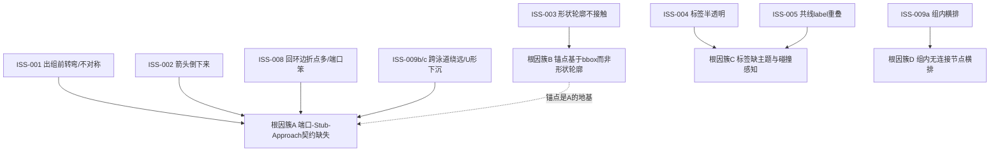

# 边路由与标签渲染问题通盘修复方案

> 日期：2026-07-22
> 问题来源：[`docs/问题整理/问题清单.md`](../问题整理/问题清单.md)（ISS-001 ~ ISS-009，其中 ISS-006/007 已随侧向反馈布局修复）
> 上游路线图：[`docs/优化重构/02-正交路由与布局优化方案.md`](../优化重构/02-正交路由与布局优化方案.md)（Phase A/B 已完成，本方案为其 Phase C 的具体落地 + 新发现的基础缺口）
> 约束：遵守 [`AGENTS.md`](../../AGENTS.md) §2（确定性）、§5（手册）、§8（门禁豁免期，正确性仍硬）；WASM 禁 `std::time`
> 定位：**先顶层设计、后分簇实施**。本文档只出方案，不直接改码；评审通过后再按 §5 顺序逐簇实施。
> **范围决策（2026-07-22 用户确认）：本轮只做核心簇 A**（ISS-001/002/008/009b/c 五项，端口写权重排改动面大，单独成轮重点验证）；簇 B/C/D 暂缓，待簇 A 收敛后另开轮次。

---

## 0. 一句话

剩余 7 个问题（ISS-001/002/003/004/005/008/009）**不是 7 个独立 bug**，而是 **4 个根因簇**的外在表现。其中最大的簇（5 个问题）共享同一根因：**端口-Stub-Approach 缺乏统一几何契约，端口决策被多级互相覆盖的启发式瓜分**。修复必须从"建立单一几何不变量"入手，而非逐症状打补丁。

---

## 1. 通盘根因分析

### 1.1 问题 → 根因簇映射



| 根因簇 | 覆盖问题 | 严重度 | 性质 |
|--------|---------|--------|------|
| **A** 端口-Stub-Approach 契约缺失 | ISS-001/002/008/009b/009c | 高（5 项，核心） | 路由架构 |
| **B** 锚点基于 bbox 而非形状轮廓 | ISS-003 | 中（地基） | 几何基础 |
| **C** 标签缺主题与碰撞感知 | ISS-004/005 | 中 | 渲染/布局 |
| **D** 组内无连接节点横排 | ISS-009a | 低 | 布局 |

### 1.2 根因簇 A：端口决策被多级启发式瓜分（核心）

**现状**（实测代码路径）：一条边的端口要经过四级互相覆盖的决策：

```
① choose_pair_sides_with_group   几何规则（dx/dy 符号 + bbox 重叠）
     ↓
② solve_port_assignment          局部搜索（B2 求解器，以①为初值）
     ↓
③ apply_feedback_side_overrides  feedback/长跨度边强制侧廊端口（覆盖①②）
     ↓
④ phase_port_correction (4b)     slot重排 + straighten + stub翻转（最终写者，可能再翻一次）
```

**问题**：四级各用各的判据，**没有任何一级对"最终几何是否自然"负责**：

- ③ 把所有回环/长跨度边打入侧廊（Left/Right 桶），**不检查"正对直连是否更干净"** → ISS-008（revise→submit 本可 Top→Left 一折直达，被强制绕行外廊）。
- ④ 的 stub_fix 按"反向 stub"检测翻转端口，但翻转目标是另一套启发式，可能翻到更差的方向 → ISS-002（flipped 1 edges 后箭头仍倒悬）、ISS-008（flipped 2 edges 落到底部入边）。
- 没有"首段必须沿端口方向出组"的硬约束 → ISS-001（组内提前转弯）。
- 没有"末段方向必须等于目标端口方向"的硬约束 → ISS-002（箭头方向与入边侧不符）。
- 评分未惩罚"远离目标"的段 → ISS-009c（confirm→pick 先下沉再爬升的 U 形）。
- 无对称锚点配对 + 路由顺序不确定 → ISS-001（Web/移动客户端两边不对称）。

**一句话**：缺一个贯穿全管线的**几何不变量**，让四级决策都服务于它，而不是互相拆台。

### 1.3 根因簇 B：锚点基于 bbox

[`slot.rs:slot_anchor()`](../../crates/plotgram-core/src/layout/edge/edge_routing_orthogonal/slot.rs#L364-L372) 与 [`spline_fallback.rs:port_anchor()`](../../crates/plotgram-core/src/layout/refine/spline_fallback.rs) 都按矩形 bbox 取锚点。菱形/六边形/圆柱等形状的真实轮廓内缩于 bbox，导致端点悬空或穿透（ISS-003）。

**关键依赖**：簇 A 的锚点全部落在 `slot_anchor` 上。**若 B 不修，A 修得再好，端点照样不贴菱形轮廓**。故 B 是 A 的地基，须先行（或至少同期）。

### 1.4 根因簇 C：标签缺主题与碰撞感知

- ISS-004：[`visual.rs:EdgeLabelStyle::default()`](../../crates/plotgram-core/src/render/visual.rs#L147-L163) 中 `bg_opacity: 0.85`（半透明透线）、`bg_color` 硬编码 `#ffffff`（不取画布背景）。
- ISS-005：label 位置仅按单边中点/固定比例计算，**不感知多条边共享同一段路径**，共线 label 堆叠无法区分归属。

两者共性：label 的**放置**与**渲染**都缺少"全局视角"——放置不看其他 label，渲染不看画布主题。

### 1.5 根因簇 D：组内无连接节点横排

[`group_divide.rs`](../../crates/plotgram-core/src/layout/node/flowchart/group_divide.rs) 对组内子图做独立 Sugiyama。客户泳道内「下单」「收货」**无组内边** → 同 rank → 层内水平展开（ISS-009a），与其余有链式边的泳道（纵向）不一致。

---

## 2. 顶层设计

### 2.1 簇 A：Port-Stub-Approach 三段几何契约（核心设计）

**设计原则**：每条正交边在语义上由三段构成，各段有一条**硬几何契约**；所有端口决策层都服务于这组契约，而非各自为政。

```
   ┌─ Stub（出段）─┐   ┌── Middle（中段）──┐   ┌─ Approach（入段）─┐
源锚点 ──沿源端口方向──→ 出源组外边界 ──自由正交 routing──→ 沿目标端口方向 ──→ 目标锚点
   契约①: 出组前不转弯        契约③: 单调趋近+最少弯折      契约②: 末段方向=目标端口方向
```

#### 契约①（Stub）：跨组边首段必须出组后才允许转弯

- 跨组边从源锚点出发，沿源端口方向延伸，**首段终点必须越过源 group 的外边界**，此后才允许第一个弯折。
- 落地：候选路径生成阶段（`path.rs`）把"源组外边界"作为首段终点约束；sanitize 增加校验项 `stub_exits_source_group`。

#### 契约②（Approach）：末段方向必须等于目标端口方向

- 进入目标锚点的最后一段，其方向向量必须与目标端口的出向一致（进 Top 则末段竖直向下指向节点，进 Left 则末段水平向右）。
- 箭头沿末段绘制 → 契约②直接消灭 ISS-002 的"箭头倒悬"。
- 落地：候选生成末段约束 + sanitize 校验 `approach_matches_port`。

#### 契约③（Middle）：单调趋近 + 最少弯折

- 评分新增**远离惩罚**：任何使得到目标曼哈顿距离**增加**的段，按增量加重惩罚 → 消灭 U 形下沉（ISS-009c）与 Z 形绕远（ISS-008）。
- 弯折惩罚已存在（`BEND_PENALTY`），与远离惩罚叠加即可，无需新搜索器。

#### 统一端口决策（单一语义源）

新增 `decide_port_pair(from_nl, to_nl, group_ctx, edge_role) -> (Port, Port)`，作为**唯一权威**：

1. **相对象限判定**：按 `(dx, dy)` 符号 + bbox 重叠选最优端口对（源左下、目标右上 → Top→Left）。
2. **回环/长跨度边的"近对齐快捷路径"**：先检查 x（或 y）投影是否重叠/间隙小于阈值——
   - 是 → 直接象限端口（Top→Left 等），**跳过侧廊**（修 ISS-008）；
   - 否 → 才落入侧廊（保留 feedback_side 的 lane 预留能力，但它从"强制改端口"降级为"为确需绕行的边预留车道"）。
3. **对称锚点配对**（修 ISS-001）：同 group、同 side、指向同一目标区域的多条边，按镜像分配锚点 frac；路由顺序按确定性键排序，杜绝"先路由者占优"。

#### 写权重排（遵守手册 ★1）

手册契约：4b 是 `from_side/to_side/endpoint_map` 的最终写者。本设计**不推翻**该契约，而是**改造 4b 的角色**：

- 4b 从"用另一套启发式重选端口"变为"**三段契约的执法者**"：仅当检测到契约①/②被违反（反向 stub、末段方向不符）时才翻转端口，且翻转目标由 `decide_port_pair` 给出，而非局部猜测。
- ①②③④ 四级由此从"互相覆盖"变为"初值 → 优化 → 执法"的单向流水线，写权清晰。

> **教训应用**：手册 ★1「先追写权与时序」、失败模式「新机制接入既有管线」。本设计先摸清四级端口写者，再重排为单向流水线，而非新增第五个互相打架的写者。

### 2.2 簇 B：`shape_boundary_point` 统一形状轮廓锚点（地基）

新增单一工具函数，按 `NodeShape` 计算真实轮廓上的锚点：

```rust
/// 给定节点、形状、出边侧、分数，返回真实轮廓上的锚点。
pub fn shape_boundary_point(nl: &NodeLayout, shape: &NodeShape, side: Port, frac: f64) -> Point
```

- **Diamond/Hexagon**：射线（从 bbox 边中点朝内）与轮廓多边形边的交点。顶点生成复用 [`common.rs:diamond_points()/hexagon_points()`](../../crates/plotgram-core/src/graphic_style/common.rs#L606-L617)。
- **Circle/Stadium**：射线与椭圆/圆弧交点（organic 路由 [`snap_to_side()`](../../crates/plotgram-core/src/layout/edge/edge_routing_organic.rs#L516-L553) 已有圆形处理，可迁移）。
- **Cylinder/Database（伪 3D）**：明确约定——顶面椭圆仅接"正上方来边"，侧面接水平来边，底面椭圆接下方来边（§6 待确认）。
- **替换点**：`slot_anchor`（slot.rs）、`port_anchor`（spline_fallback.rs），以及 approach 末段的边界 snap。
- **矩形保持原行为**：`shape_boundary_point` 对 Rect 退化为现 bbox 锚点，确保无回归。

### 2.3 簇 C：标签主题感知 + 碰撞感知

**ISS-004（渲染层，低风险）**：
- `bg_opacity: 0.85 → 1.0`（完全不透明）。
- `bg_color` 从主题/画布背景色读取，不硬编码白（验证 group 灰色背景区域）。
- padding 适度增大（建议垂直 ≥4px、水平 ≥8px）。
- 沿边旋转的 label，背景矩形同步旋转。

**ISS-005（放置层）**：
- 新增**共线段 label 去冲突**：检测多条边共享同一路径段（复用 edge bundling 的共线检测），将各边 label **沿路径方向错开**（首选，不占额外空间）；路径长度不足时退化为**垂直两侧偏移**。
- 与 ISS-004 的关系：004 解决"线穿字"，005 解决"字压字"；先 004（渲染一行改动）后 005（放置逻辑）。

### 2.4 簇 D：组内无连接节点纵向堆叠

- `group_divide.rs` 组内子图布局：当组内**无内部边**时，不按同 rank 横排，改为按**全局 rank（或声明序）纵向堆叠**（TB 布局 → 上下排列）。
- 仅作用于"组内无边"的退化情形，有链式边的组不受影响（客户泳道回归，其余泳道不变）。

---

## 3. 与现有路线图的对应

| 本方案簇 | 对应 02 方案 | 关系 |
|----------|-------------|------|
| A-统一端口决策 | Phase B2 端口求解器 | **补强**：B2 已"核心完成"但被③④覆盖而失效；本方案让它成为唯一初值源 |
| A-对称锚点 | Phase C1 对称约束 | **具体化**：C1 是节点对称，本方案是边锚点对称 |
| A-远离惩罚 | Phase B1 OVG 评分 | **补充评分维度** |
| B-形状锚点 | （原路线图未覆盖） | **新发现地基缺口** |
| C-标签 | （原路线图未覆盖） | **渲染层，独立** |
| D-组内堆叠 | （原路线图未覆盖） | **布局层，独立** |

---

## 4. 红线与卫生（AGENTS.md / 手册）

- ★ **确定性**（§2）：对称锚点配对、路由顺序一律按显式排序键（id / 层号），禁 HashMap 迭代序。
- ★ **禁图名特判**（§5）：象限端口、快捷路径、远离惩罚均为**通用几何规则**；refund/microservices/swimlane 只作回归样例，不进分支条件。
- ★ **验真**（§5）：`cargo run -p plotgram-cli` 逐图核坐标，勿信陈旧 binary。
- ★ **正确性硬**（§8）：穿组（`edge_crosses_group_interior`）与确定性全角色不豁免；门禁豁免期内质量轨不挡，但每簇完成后重采基线。
- ○ **写权契约**：4b 最终写者地位不变，角色改为契约执法者（§2.1）。
- ○ **WASM**：核心 crate 内禁裸 `std::time`。

---

## 5. 实施顺序与依赖（本轮 = 簇 A）

> 范围决策：本轮只做簇 A；簇 B/C/D 暂缓（见 §0 范围决策）。簇 A 内部按**风险从低到高**排为六步，每步独立验证、独立采基线。

```
A-0 诊断只读：契约违反计数器（零几何改动，量化现状）      ─→ 采基线
A-1 ② 回环近对齐快捷路径（ISS-008 直接修复，改动局部）   ─→ 验证
A-2 ③ 远离惩罚评分（ISS-009c U形 / ISS-008 Z形绕远）       ─→ 验证
A-3 ⑥ Stub/Approach 契约 + sanitize 校验（ISS-001 提前转/ISS-002 箭头）─→ 验证
A-4 ④ 对称锚点配对（ISS-001 不对称）                        ─→ 验证
A-5 ① decide_port_pair 单一语义源 + ⑤ 4b 改造为契约执法者   ─→ 终采基线
     （架构收敛：四级启发式→单向流水线，改动面最大，故殿后）
```

**排序理由**：
- **A-0 先行**：只加只读统计（stub 未出组 / 末段方向不符 / 远离段计数），不改任何几何，先拿到违反频度作为后续改善的量化依据（手册 ★4「退化要可量化」）。
- **A-1/A-2 快速见效**：直接修最刺眼的 ISS-008/009c，改动局限于候选生成与评分，不碰端口写权。
- **A-3 引入硬契约**：stub 出组、approach 方向成为几何不变量，sanitize 增加校验项。
- **A-4 对称**：依赖确定性路由顺序，须在写权收敛前验证。
- **A-5 殿后**：把四级启发式收敛为「初值→优化→执法」单向流水线是最大改动，放在前面步骤已积累足够证据之后，风险可控、可归因。

### 回归样例（product 角色，本轮）

| 步骤 | 回归图 | 验收 |
|------|--------|------|
| A-1 | `flowchart/product.refund-process.pgm` | revise→submit 为 Top→Right 单折 L 形（竖直上行再左转入边），不再 Z 形横向挪移 |
| A-2 | `flowchart/product.swimlane-order-process.pgm` | confirm→pick 不再先下沉再爬升（无 U 形） |
| A-3 | `architecture/product.microservices.pgm` | 跨组边先出组再转弯；订单→PG 箭头朝下不倒悬 |
| A-4 | `architecture/product.microservices.pgm` | Web/移动客户端两边镜像对称 |
| A-5 | 上述三图 + product-gate 全量 | 端口写权收敛后整体不劣化（豁免期内正确性仍硬） |

### A-0 基线（2026-07-22 实测，只读诊断）

计数器挂载于 [`run.rs`](../../crates/plotgram-core/src/layout/edge/edge_routing_orthogonal/run.rs) 末尾（几何已经 routing+sanitize 冻结），实现于 [`contract.rs`](../../crates/plotgram-core/src/layout/edge/edge_routing_orthogonal/contract.rs)，经 `OrthoDebugStats.contract_*` 导出至 bench 基线（[`collinear.rs`](../../crates/plotgram-core/src/layout/metrics/collinear.rs)）。四个信号：

| 信号 | 含义 | 对应问题 |
|------|------|---------|
| `stub` | 跨组边首个转弯点仍在源组内（未出组先转） | ISS-001 |
| `approach` | 末段方向 ≠ 目标端口方向（sanitize 已强制，**恒为 0**，仅监控回归） | — |
| `unnatural_to_port` | 目标端口非相对位置下的自然入边侧（箭头倒悬，方向感知：TB 竖直优先） | ISS-002 |
| `away_segs`/`away_edges` | 使到目标曼哈顿距离增大的段数/边数（绕远） | ISS-008/009c |

| 回归图 | stub | approach | unnatural_to_port | away_segs | away_edges |
|--------|------|----------|-------------------|-----------|------------|
| `flowchart/product.refund-process.pgm` | 0 | 0 | 4 | 2 | 2 |
| `flowchart/product.swimlane-order-process.pgm` | 2 | 0 | 1 | 3 | 2 |
| `architecture/product.microservices.pgm` | 3 | 0 | 1 | 0 | 0 |

**逐边核对（信号准确性）**：
- microservices `unnatural=1` = `order_svc→db`（ISS-002）：目标在左下近对角，实际 Right 入边（箭头朝左），自然侧 Top（箭头朝下）。`stub=3` = web/mobile→gateway（组内转弯，ISS-001）+ order_svc→db。
- swimlane `unnatural=1` = `confirm_order→pick_goods`（ISS-009c）：目标在右上显著偏侧，自然侧 Left（与用户期望 Right→Left 一致），实际 Bottom。`stub=2` 为跨泳道组内转弯边。
- refund `unnatural=4`：`revise→submit`（ISS-008，Z 形绕远——**注：原「x 投影重叠、预期竖直直达」基于旧布局已失效**，task-bb3 后 revise 移至 submit 右下，x 重叠仅 8px 且竖直走廊被 check_amount/auto_approve 阻挡，竖直直达不可能；实际根因与修复见下方「A-1 实施记录」）、`auto_approve→refund`（先左离目标再折返，真实绕远）、`review_result→end_fail`（冲过头再回退，轻度）、`check_amount→manual_review`（近对角 L 形，边界可接受，软度量容留）。

**关键结论**：
1. `approach` 恒为 0 证实 sanitize 已强制契约②（末段贴合端口）——ISS-002 的根因不在末段几何，而在**端口选错方向**，故以 `unnatural_to_port` 作为 ISS-002 的量化信号。
2. `stub` 准确抓住 ISS-001（组内提前转弯）；`away_segs` 抓住 ISS-008/009c 绕远。
3. 后续 A-1~A-5 每步完成后重跑本诊断，对比计数变化作为改善证据。

### A-1 实施记录（2026-07-22，修 ISS-008）

**布局前提变化**：侧向反馈同层布局（task-bb3）使 revise 从 submit 左下移至**右下**（revise bbox (310,492)-(422,542)、submit (206,158)-(318,208)），x 重叠仅 8px，且竖直直达走廊被 check_amount(194-330)/auto_approve(206-318) 阻挡——原验收「Top→Left 单折 / 竖直直达」（基于旧布局）失效，竖直直达不可能，最优为单折 L 形。

**实际根因**（非端口选择，而对齐）：`straighten_preferred_alignments` 在对齐正对端口边前**不检查目标切线是否被障碍阻挡**，把 edge[8]（revise→submit）的 from 锚点从干净走廊 x=366（revise 中心）挪到被挡的 x=324，迫使路由从被挡切线出发绕行，产生 Z 形横向挪移（324→358）。

**修复**（[`straighten.rs`](../../crates/plotgram-core/src/layout/edge/edge_routing_orthogonal/straighten.rs)）：
- 新增 `straight_path_blocked`：判断沿给定切线的直连段是否被其他节点阻挡。
- 新增 `should_skip_blocked_alignment`：**仅当目标切线被挡且被移动端原切线干净时才跳过对齐**（留在干净原切线优于挪到被挡目标）；若被移动端原切线同样被挡，则对齐（两端锚点取齐使绕行更紧凑）不劣于不对齐，不跳过。
- 四个对齐分支（(true,true)/(true,false)/(false,true)/(false,false)）均插入该检查。

**判据为何取「被移动端原切线干净」**：
- refund edge[8]（true,true）：目标 x=324 被挡，from 原切线 x=366 干净 → 跳过 → 锚点留在干净走廊 → Top→Right 单折 L 形。
- password-reset 回环边 show_error→input_email（true,false）：目标 y=165（to 锚点）被 start 节点阻挡，但 from 原切线 y=138 **同样被挡** → 不跳过 → 对齐使垂直段缩短 27px，避免共线重叠（exact_sev 维持 11；若一刀切跳过则升至 38，首版实现曾因此回归，已修正）。

**效果**（隔离基线 before-a1 vs a1-refined，排除 task-bb3 干扰）：
- refund：revise→submit Z 形（3 折、324→358 挪移）→ **Top→Right 单折 L 形**（x=366 竖直上行再左转），`away_segs` 2→1、`away_edges` 2→1。
- password-reset / swimlane / microservices / leave-approval 等：与 before-a1 持平（无变化）。
- 正确性轨：无穿组；性能无退化（ecommerce 复测 37.6ms ≤ 基线 38.7ms）。

**遗留与说明**：
- refund `'驳回可改'` 标签压 review_result 菱形、password-reset `'存在'` 标签压 email_gate（各 1 个 lint error）：均为 **task-bb3 布局变化效应**（与 A-1 修复前渲染逐字节一致，非 A-1 引入），归标签碰撞簇（C）解决。
- **预存非确定性（需单独排查）**：`stress.layout-stress-flat-mesh.pgm` 约 15-20% 概率渲染结果不同（某水平段 y 差 16px=ORTHO_PARALLEL_GAP，疑似 lane/stub 分配竞争）。已验证该非确定性**在 A-1 修复前即存在**（无 straighten 改动时同样复现，两种输出哈希与修复后完全相同），非 A-1 引入，但违反 §2 确定性红线，须单独立项修复。

---

## 6. 开放问题（需用户决策）

> 实施范围已确认（只做簇 A，见 §0）。以下 1/2 随簇 B/C 暂缓；**3 属本轮簇 A，需在 A-4 实施前确认**。

1. ~~**ISS-005 错开方向偏好**~~（随簇 C 暂缓）：沿路径错开 vs 垂直偏移，默认"沿路径优先、空间不足退化垂直"。
2. ~~**ISS-003 伪 3D 形状接边面**~~（随簇 B 暂缓）：默认"正上方来边接顶面、水平来边接侧面"。
3. **对称的边界（簇 A / A-4 待决）**：ISS-001 要求镜像对称，但当两边目标端口容量不足时，允许"近似对称"还是"强制对称+扩容"？默认"对称优先、容量不足时降级为近似对称且不制造碰撞"。
4. ~~实施范围~~：已确认只做簇 A（§0）。

---

## 7. 风险与缓解

| 风险 | 缓解 |
|------|------|
| 4b 角色改造牵动既有 stub_fix 行为，引入回归 | 改造前后逐图 diff 端口分配；先加契约校验（只读告警）再切换写权 |
| 快捷路径误判"近对齐"，实际直连穿障 | 快捷路径仅生成**候选**，仍过 scorer 与穿组硬检；不干净则回落侧廊 |
| 远离惩罚过强，避障路径被拉直穿模 | 惩罚为软项，穿组为硬过滤；以 product-gate 穿组指标为准 |
| 形状锚点替换影响全量矩形图 | Rect 退化等价于现行为；替换前后矩形图坐标须字节级不变 |
| 簇 A 改动面大，难以归因 | 按 §5 六小步逐项落地，每步独立采基线、独立 diff |

---

## 更新日志

- 2026-07-22：初版。通盘分析 ISS-001~009（006/007 已修），归纳 4 根因簇，提出 Port-Stub-Approach 三段契约顶层设计。
- 2026-07-22：用户确认本轮只做核心簇 A；§5 重构为簇 A 六步风险排序（A-0 诊断→A-5 写权收敛），簇 B/C/D 暂缓。
- 2026-07-22：A-0 完成。只读契约诊断（[`contract.rs`](../../crates/plotgram-core/src/layout/edge/edge_routing_orthogonal/contract.rs)）落地并采基线；发现 approach 恒为 0（sanitize 已强制），改用方向感知的 `unnatural_to_port` 作为 ISS-002 量化信号；三图逐边核对信号准确。
- 2026-07-22：A-1 完成。根因为 straighten 对齐到被挡切线（非端口选择）；修复以「目标切线被挡且被移动端原切线干净才跳过对齐」。refund revise→submit Z 形→Top→Right 单折 L 形（away_segs 2→1）；首版一刀切跳过曾致 password-reset 共线回归（exact 11→38），以「原切线同样被挡则不跳过」修正。隔离基线确认其余样例无变化。另发现 flat-mesh 预存非确定性（A-1 前即存在，非本次引入），待单独立项。
